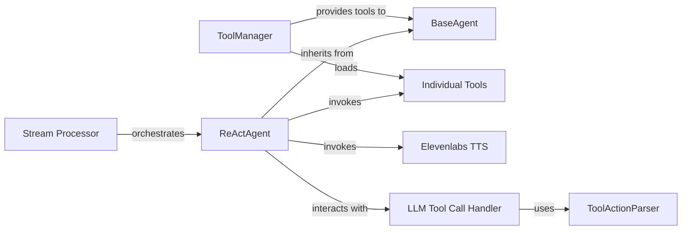

## Details

The Agentic Subsystem in DocsGPT is designed to enable intelligent, multi-step interactions by leveraging Large Language Models (LLMs) and external tools. At its core, the `Stream Processor` orchestrates the execution flow, initiating the `ReActAgent`. The `ReActAgent`, inheriting from `BaseAgent`, implements the ReAct pattern to reason, decide on actions, and execute them. It interacts with the `LLM Tool Call Handler` to process LLM outputs, which in turn utilizes the `ToolActionParser` to interpret tool calls. The `ToolManager` is responsible for loading and providing `Individual Tools` (such as `Elevenlabs TTS`) that the `ReActAgent` can invoke to perform specific actions, thereby extending the LLM's capabilities. This modular design ensures a clear separation of concerns, facilitating robust and extensible agentic behavior.

### BaseAgent
Defines the abstract interface and common functionalities for all agents. It establishes the blueprint for how agents should process queries, interact with tools, and generate responses. It's fundamental as the base contract for any agent.

**Related Classes/Methods**:

- <a href="https://github.com/arc53/DocsGPT/blob/main/application/agents/base.py#L19-L326" target="_blank" rel="noopener noreferrer">`application.agents.base.BaseAgent`:19-326</a>

### ReActAgent
Implements the ReAct (Reasoning and Acting) pattern, enabling the LLM to perform complex, multi-step tasks. It orchestrates the iterative process of generating thoughts, deciding on actions (tool calls), executing them, and formulating a final answer. This is the core of the agentic reasoning.

**Related Classes/Methods**:

- <a href="https://github.com/arc53/DocsGPT/blob/main/application/agents/react_agent.py#L26-L229" target="_blank" rel="noopener noreferrer">`application.agents.react_agent.ReActAgent`:26-229</a>

### ToolManager
Manages the lifecycle and availability of external tools. It's responsible for discovering, loading, and providing access to the various tools that agents can utilize. Essential for agents to access their capabilities.

**Related Classes/Methods**:

- <a href="https://github.com/arc53/DocsGPT/blob/main/application/agents/tools/tool_manager.py#L9-L42" target="_blank" rel="noopener noreferrer">`application.agents.tools.tool_manager.ToolManager`:9-42</a>

### ToolActionParser
Interprets the raw output from the LLM to identify and parse tool calls, extracting the tool name and its arguments. This component is critical for translating the LLM's textual output into executable actions.

**Related Classes/Methods**:

- <a href="https://github.com/arc53/DocsGPT/blob/main/application/agents/tools/tool_action_parser.py#L7-L37" target="_blank" rel="noopener noreferrer">`application.agents.tools.tool_action_parser.ToolActionParser`:7-37</a>

### Individual Tools
Represents the collection of specific external tools, each encapsulating the logic for interacting with an external service or performing a distinct action (e.g., web search, TTS). These are the actual capabilities the agent leverages.

**Related Classes/Methods**:

- <a href="https://github.com/arc53/DocsGPT/blob/main/application/agents/tools" target="_blank" rel="noopener noreferrer">`application.agents.tools`</a>

### Elevenlabs TTS
Provides Text-to-Speech functionality, allowing agents to generate spoken responses. This is a concrete example of an external tool, highlighting the subsystem's ability to integrate diverse external services.

**Related Classes/Methods**:

- <a href="https://github.com/arc53/DocsGPT/blob/main/application/tts/elevenlabs.py#L9-L66" target="_blank" rel="noopener noreferrer">`application.tts.elevenlabs.ElevenlabsTTS`:9-66</a>

### LLM Tool Call Handler
Acts as the bridge between the raw LLM output and the agent's tool execution logic, specifically handling tool calls. It's crucial for the agent to correctly interpret and act upon the LLM's instructions for tool usage.

**Related Classes/Methods**:

- <a href="https://github.com/arc53/DocsGPT/blob/main/application/llm/handlers/base.py" target="_blank" rel="noopener noreferrer">`application.llm.handlers.LLMToolCallHandler`</a>

### Stream Processor
Initiates and orchestrates the agent's execution flow within the main application, particularly for streaming responses. It serves as the entry point for triggering the agent's reasoning and tool-use cycle.

**Related Classes/Methods**:

- <a href="https://github.com/arc53/DocsGPT/blob/main/application/api/answer/services/stream_processor.py#L56-L260" target="_blank" rel="noopener noreferrer">`application.api.answer.services.stream_processor.StreamProcessor`:56-260</a>

### [FAQ](https://github.com/CodeBoarding/GeneratedOnBoardings/tree/main?tab=readme-ov-file#faq)