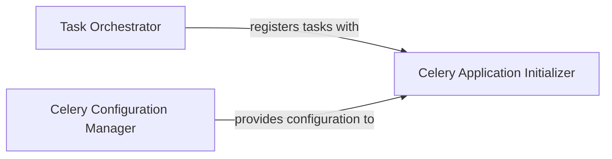

## Details

This subsystem is responsible for managing and executing long-running or computationally intensive tasks asynchronously, such as document ingestion, remote data synchronization, and agent webhooks. It prevents the main API from blocking, ensuring responsiveness and scalability for the RAG system.

### Task Orchestrator
Defines and encapsulates the actual long-running, computationally intensive tasks essential for the RAG system's operation. These tasks offload heavy processing from the main application thread, ensuring responsiveness.

**Related Classes/Methods**:

- <a href="https://github.com/arc53/DocsGPT/blob/main/application/worker.py#L1-L9999" target="_blank" rel="noopener noreferrer">`application.worker`:1-9999</a>

### Celery Application Initializer
Responsible for bootstrapping and initializing the Celery application instance. It establishes the connection to the message broker and result backend, effectively setting up the runtime environment for asynchronous tasks.

**Related Classes/Methods**:

- <a href="https://github.com/arc53/DocsGPT/blob/main/application/celery_init.py#L1-L9999" target="_blank" rel="noopener noreferrer">`application.celery_init`:1-9999</a>

### Celery Configuration Manager
Centralizes and provides all necessary configuration parameters for the Celery application. It ensures that the asynchronous system operates correctly by defining settings such as broker URLs, backend URLs, and task queues.

**Related Classes/Methods**:

- <a href="https://github.com/arc53/DocsGPT/blob/main/application/celeryconfig.py#L1-L9999" target="_blank" rel="noopener noreferrer">`application.celeryconfig`:1-9999</a>

### [FAQ](https://github.com/CodeBoarding/GeneratedOnBoardings/tree/main?tab=readme-ov-file#faq)