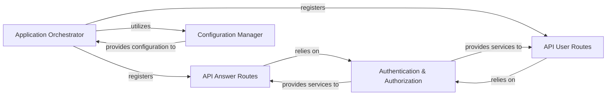

## Details

The Backend Core acts as the central entry point and orchestrator for the DocsGPT application, handling request routing, core application logic, authentication, and configuration.

### Application Orchestrator
The main Flask application instance, serving as the primary orchestrator and central entry point for all incoming HTTP requests. It initializes the application and registers all API routes.

**Related Classes/Methods**:

- <a href="https://github.com/arc53/DocsGPT/blob/main/application/app.py" target="_blank" rel="noopener noreferrer">`application.app`</a>

### API Answer Routes
Defines and handles API endpoints specifically for processing user queries and initiating the AI-powered answer generation process, delegating to the RAG services.

**Related Classes/Methods**:

- <a href="https://github.com/arc53/DocsGPT/blob/main/application/api/answer/routes" target="_blank" rel="noopener noreferrer">`application.api.answer.routes`</a>

### API User Routes
Defines and handles API endpoints for user-specific functionalities, including document management, API key operations, and usage tracking.

**Related Classes/Methods**:

- <a href="https://github.com/arc53/DocsGPT/blob/main/application/api/user/routes.py" target="_blank" rel="noopener noreferrer">`application.api.user.routes`</a>

### Authentication & Authorization
Manages user authentication and authorization, ensuring secure access to application functionalities and data.

**Related Classes/Methods**:

- <a href="https://github.com/arc53/DocsGPT/blob/main/application/auth.py" target="_blank" rel="noopener noreferrer">`application.auth`</a>

### Configuration Manager
Centralized configuration management for application-wide parameters, environment variables, and secrets.

**Related Classes/Methods**:

- <a href="https://github.com/arc53/DocsGPT/blob/main/application/core/settings.py" target="_blank" rel="noopener noreferrer">`application.core.settings`</a>

### [FAQ](https://github.com/CodeBoarding/GeneratedOnBoardings/tree/main?tab=readme-ov-file#faq)