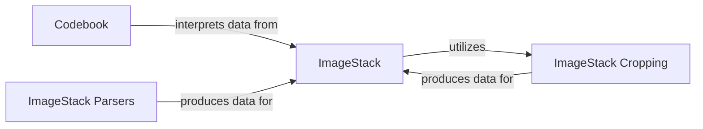

## Details

The `starfish` core image processing pipeline is centered around the `ImageStack` component, which serves as the primary in-memory representation for multi-dimensional image data. Data ingestion into the `ImageStack` is handled by `ImageStack Parsers`, which are responsible for converting various external data formats into the standardized `ImageStack` structure. Once loaded, the `ImageStack` can be manipulated by components like `ImageStack Cropping` for spatial transformations. The `Codebook` component plays a crucial role in interpreting the raw intensity data within the `ImageStack`, mapping observed fluorescent signals to biological targets, thereby providing biological meaning to the image data. This architecture ensures a clear separation of concerns, with dedicated components for data representation, ingestion, transformation, and biological interpretation, facilitating a modular and extensible image processing workflow.

### ImageStack
Serves as the fundamental in-memory representation for multi-dimensional image data within the Starfish pipeline. It provides a unified interface for accessing, manipulating, and transforming image data, managing associated metadata and coordinates. This component is central to any image processing library.

**Related Classes/Methods**:

- <a href="https://github.com/spacetx/starfish/blob/master/starfish/core/imagestack/imagestack.py" target="_blank" rel="noopener noreferrer">`starfish/core/imagestack/imagestack.py`</a>

### Codebook
Defines the crucial mapping between observed fluorescent signals (channels, imaging rounds) and specific biological targets (e.g., genes). It is essential for interpreting raw intensity data into meaningful biological information, supporting loading, validation, and decoding operations. This is a core data structure for biological interpretation.

**Related Classes/Methods**:

- <a href="https://github.com/spacetx/starfish/blob/master/starfish/core/codebook/codebook.py" target="_blank" rel="noopener noreferrer">`starfish/core/codebook/codebook.py`</a>

### ImageStack Parsers
These components are responsible for reading and parsing various external data formats (e.g., tilesets, raw NumPy arrays) into the internal `ImageStack` representation. They handle the specifics of data layout, metadata extraction, and efficient data loading, acting as the data ingestion layer for `ImageStack`.

**Related Classes/Methods**:

- <a href="https://github.com/spacetx/starfish/blob/master/starfish/core/imagestack/parser/tileset/_parser.py" target="_blank" rel="noopener noreferrer">`starfish/core/imagestack/parser/tileset/_parser.py`</a>
- <a href="https://github.com/spacetx/starfish/blob/master/starfish/core/imagestack/parser/tilefetcher/_parser.py" target="_blank" rel="noopener noreferrer">`starfish/core/imagestack/parser/tilefetcher/_parser.py`</a>
- <a href="https://github.com/spacetx/starfish/blob/master/starfish/core/imagestack/parser/numpy/__init__.py" target="_blank" rel="noopener noreferrer">`starfish/core/imagestack/parser/numpy/__init__.py`</a>

### ImageStack Cropping
Manages the process of cropping `ImageStack` data. This includes determining the appropriate crop regions, applying the cropping operation to the image data, and adjusting associated metadata and coordinates. It represents a fundamental data transformation utility directly operating on the core `ImageStack` data.

**Related Classes/Methods**:

- <a href="https://github.com/spacetx/starfish/blob/master/starfish/core/imagestack/parser/crop.py" target="_blank" rel="noopener noreferrer">`starfish/core/imagestack/parser/crop.py`</a>

### [FAQ](https://github.com/CodeBoarding/GeneratedOnBoardings/tree/main?tab=readme-ov-file#faq)