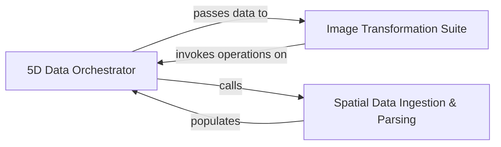

## Details

Manages the 5D ImageStack and provides the API for image-to-image operations like registration, deconvolution, and filtering.

### 5D Data Orchestrator
The central hub of the engine that manages the ImageStack lifecycle. It provides the high-level API for data manipulation, coordinate tracking, and the execution of parallelized operations across the 5D tensor.

**Related Classes/Methods**:

- `starfish.core.imagestack.imagestack.ImageStack`:68-1274
- `starfish.core.imagestack.imagestack.ImageStack.apply`:771-870
- `starfish.core.imagestack.imagestack.ImageStack.reduce`:1229-1248
- `starfish.core.imagestack.imagestack.ImageStack.sel`:443-480

**Source Files:**

- [`starfish/core/errors.py`](https://github.com/CodeBoarding/starfish/blob/master/.codeboardingstarfish/core/errors.py)
  - `starfish.core.errors.DeprecatedAPIError` ([L1-L5](https://github.com/CodeBoarding/starfish/blob/master/.codeboardingstarfish/core/errors.py#L1-L5)) - Class
  - `starfish.core.errors.DataFormatWarning` ([L8-L12](https://github.com/CodeBoarding/starfish/blob/master/.codeboardingstarfish/core/errors.py#L8-L12)) - Class
- [`starfish/core/experiment/experiment.py`](https://github.com/CodeBoarding/starfish/blob/master/.codeboardingstarfish/core/experiment/experiment.py)
  - `starfish.core.experiment.experiment.AlignedImageStackIterator.__init__` ([L199-L202](https://github.com/CodeBoarding/starfish/blob/master/.codeboardingstarfish/core/experiment/experiment.py#L199-L202)) - Method
  - `starfish.core.experiment.experiment.AlignedImageStackIterator.__len__` ([L204-L205](https://github.com/CodeBoarding/starfish/blob/master/.codeboardingstarfish/core/experiment/experiment.py#L204-L205)) - Method
  - `starfish.core.experiment.experiment.AlignedImageStackIterator.__next__` ([L207-L210](https://github.com/CodeBoarding/starfish/blob/master/.codeboardingstarfish/core/experiment/experiment.py#L207-L210)) - Method
- [`starfish/core/image/Filter/call_bases.py`](https://github.com/CodeBoarding/starfish/blob/master/.codeboardingstarfish/core/image/Filter/call_bases.py)
  - `starfish.core.image.Filter.call_bases.CallBases` ([L12-L159](https://github.com/CodeBoarding/starfish/blob/master/.codeboardingstarfish/core/image/Filter/call_bases.py#L12-L159)) - Class
  - `starfish.core.image.Filter.call_bases.CallBases.__init__` ([L31-L36](https://github.com/CodeBoarding/starfish/blob/master/.codeboardingstarfish/core/image/Filter/call_bases.py#L31-L36)) - Method
  - `starfish.core.image.Filter.call_bases.CallBases._vector_norm` ([L40-L67](https://github.com/CodeBoarding/starfish/blob/master/.codeboardingstarfish/core/image/Filter/call_bases.py#L40-L67)) - Method
  - `starfish.core.image.Filter.call_bases.CallBases._call_bases` ([L69-L118](https://github.com/CodeBoarding/starfish/blob/master/.codeboardingstarfish/core/image/Filter/call_bases.py#L69-L118)) - Method
  - `starfish.core.image.Filter.call_bases.CallBases.run` ([L120-L159](https://github.com/CodeBoarding/starfish/blob/master/.codeboardingstarfish/core/image/Filter/call_bases.py#L120-L159)) - Method
- [`starfish/core/image/Filter/element_wise_mult.py`](https://github.com/CodeBoarding/starfish/blob/master/.codeboardingstarfish/core/image/Filter/element_wise_mult.py)
  - `starfish.core.image.Filter.element_wise_mult.ElementWiseMultiply` ([L13-L98](https://github.com/CodeBoarding/starfish/blob/master/.codeboardingstarfish/core/image/Filter/element_wise_mult.py#L13-L98)) - Class
  - `starfish.core.image.Filter.element_wise_mult.ElementWiseMultiply.__init__` ([L33-L42](https://github.com/CodeBoarding/starfish/blob/master/.codeboardingstarfish/core/image/Filter/element_wise_mult.py#L33-L42)) - Method
  - `starfish.core.image.Filter.element_wise_mult.ElementWiseMultiply.run` ([L51-L98](https://github.com/CodeBoarding/starfish/blob/master/.codeboardingstarfish/core/image/Filter/element_wise_mult.py#L51-L98)) - Method
- [`starfish/core/image/Filter/ilastik_pre_trained_probability.py`](https://github.com/CodeBoarding/starfish/blob/master/.codeboardingstarfish/core/image/Filter/ilastik_pre_trained_probability.py)
  - `starfish.core.image.Filter.ilastik_pre_trained_probability.IlastikPretrainedProbability` ([L14-L124](https://github.com/CodeBoarding/starfish/blob/master/.codeboardingstarfish/core/image/Filter/ilastik_pre_trained_probability.py#L14-L124)) - Class
  - `starfish.core.image.Filter.ilastik_pre_trained_probability.IlastikPretrainedProbability.__init__` ([L32-L39](https://github.com/CodeBoarding/starfish/blob/master/.codeboardingstarfish/core/image/Filter/ilastik_pre_trained_probability.py#L32-L39)) - Method
  - `starfish.core.image.Filter.ilastik_pre_trained_probability.IlastikPretrainedProbability.run` ([L41-L95](https://github.com/CodeBoarding/starfish/blob/master/.codeboardingstarfish/core/image/Filter/ilastik_pre_trained_probability.py#L41-L95)) - Method
  - `starfish.core.image.Filter.ilastik_pre_trained_probability.IlastikPretrainedProbability.import_ilastik_probabilities` ([L98-L124](https://github.com/CodeBoarding/starfish/blob/master/.codeboardingstarfish/core/image/Filter/ilastik_pre_trained_probability.py#L98-L124)) - Method
- [`starfish/core/image/Filter/linear_unmixing.py`](https://github.com/CodeBoarding/starfish/blob/master/.codeboardingstarfish/core/image/Filter/linear_unmixing.py)
  - `starfish.core.image.Filter.linear_unmixing.LinearUnmixing` ([L12-L141](https://github.com/CodeBoarding/starfish/blob/master/.codeboardingstarfish/core/image/Filter/linear_unmixing.py#L12-L141)) - Class
  - `starfish.core.image.Filter.linear_unmixing.LinearUnmixing.__init__` ([L58-L64](https://github.com/CodeBoarding/starfish/blob/master/.codeboardingstarfish/core/image/Filter/linear_unmixing.py#L58-L64)) - Method
  - `starfish.core.image.Filter.linear_unmixing.LinearUnmixing._unmix` ([L69-L103](https://github.com/CodeBoarding/starfish/blob/master/.codeboardingstarfish/core/image/Filter/linear_unmixing.py#L69-L103)) - Method
  - `starfish.core.image.Filter.linear_unmixing.LinearUnmixing.run` ([L105-L141](https://github.com/CodeBoarding/starfish/blob/master/.codeboardingstarfish/core/image/Filter/linear_unmixing.py#L105-L141)) - Method
- [`starfish/core/image/Filter/map.py`](https://github.com/CodeBoarding/starfish/blob/master/.codeboardingstarfish/core/image/Filter/map.py)
  - `starfish.core.image.Filter.map.Map` ([L13-L138](https://github.com/CodeBoarding/starfish/blob/master/.codeboardingstarfish/core/image/Filter/map.py#L13-L138)) - Class
- [`starfish/core/imagestack/imagestack.py`](https://github.com/CodeBoarding/starfish/blob/master/.codeboardingstarfish/core/imagestack/imagestack.py)
  - `starfish.core.imagestack.imagestack.ImageStack` ([L68-L1274](https://github.com/CodeBoarding/starfish/blob/master/.codeboardingstarfish/core/imagestack/imagestack.py#L68-L1274)) - Class
  - `starfish.core.imagestack.imagestack.ImageStack.__init__` ([L96-L100](https://github.com/CodeBoarding/starfish/blob/master/.codeboardingstarfish/core/imagestack/imagestack.py#L96-L100)) - Method
  - `starfish.core.imagestack.imagestack.ImageStack.from_tile_collection_data` ([L103-L177](https://github.com/CodeBoarding/starfish/blob/master/.codeboardingstarfish/core/imagestack/imagestack.py#L103-L177)) - Method
  - `starfish.core.imagestack.imagestack.ImageStack._validate_data_dtype_and_range` ([L180-L191](https://github.com/CodeBoarding/starfish/blob/master/.codeboardingstarfish/core/imagestack/imagestack.py#L180-L191)) - Method
  - `starfish.core.imagestack.imagestack.ImageStack._ensure_data_loaded` ([L193-L243](https://github.com/CodeBoarding/starfish/blob/master/.codeboardingstarfish/core/imagestack/imagestack.py#L193-L243)) - Method
  - `starfish.core.imagestack.imagestack.ImageStack.__repr__` ([L245-L247](https://github.com/CodeBoarding/starfish/blob/master/.codeboardingstarfish/core/imagestack/imagestack.py#L245-L247)) - Method
  - `starfish.core.imagestack.imagestack.ImageStack.from_tileset` ([L250-L273](https://github.com/CodeBoarding/starfish/blob/master/.codeboardingstarfish/core/imagestack/imagestack.py#L250-L273)) - Method
  - `starfish.core.imagestack.imagestack.ImageStack.from_tilefetcher` ([L276-L323](https://github.com/CodeBoarding/starfish/blob/master/.codeboardingstarfish/core/imagestack/imagestack.py#L276-L323)) - Method
  - `starfish.core.imagestack.imagestack.ImageStack.from_url` ([L326-L357](https://github.com/CodeBoarding/starfish/blob/master/.codeboardingstarfish/core/imagestack/imagestack.py#L326-L357)) - Method
  - `starfish.core.imagestack.imagestack.ImageStack.from_path_or_url` ([L360-L380](https://github.com/CodeBoarding/starfish/blob/master/.codeboardingstarfish/core/imagestack/imagestack.py#L360-L380)) - Method
  - `starfish.core.imagestack.imagestack.ImageStack.from_numpy` ([L383-L435](https://github.com/CodeBoarding/starfish/blob/master/.codeboardingstarfish/core/imagestack/imagestack.py#L383-L435)) - Method
  - `starfish.core.imagestack.imagestack.ImageStack.xarray` ([L438-L441](https://github.com/CodeBoarding/starfish/blob/master/.codeboardingstarfish/core/imagestack/imagestack.py#L438-L441)) - Method
  - `starfish.core.imagestack.imagestack.ImageStack.sel` ([L443-L480](https://github.com/CodeBoarding/starfish/blob/master/.codeboardingstarfish/core/imagestack/imagestack.py#L443-L480)) - Method
  - `starfish.core.imagestack.imagestack.ImageStack.isel` ([L482-L517](https://github.com/CodeBoarding/starfish/blob/master/.codeboardingstarfish/core/imagestack/imagestack.py#L482-L517)) - Method
  - `starfish.core.imagestack.imagestack.ImageStack.sel_by_physical_coords` ([L519-L537](https://github.com/CodeBoarding/starfish/blob/master/.codeboardingstarfish/core/imagestack/imagestack.py#L519-L537)) - Method
  - `starfish.core.imagestack.imagestack.ImageStack.get_slice` ([L539-L608](https://github.com/CodeBoarding/starfish/blob/master/.codeboardingstarfish/core/imagestack/imagestack.py#L539-L608)) - Method
  - `starfish.core.imagestack.imagestack.ImageStack.set_slice` ([L610-L722](https://github.com/CodeBoarding/starfish/blob/master/.codeboardingstarfish/core/imagestack/imagestack.py#L610-L722)) - Method
  - `starfish.core.imagestack.imagestack.ImageStack._build_slice_list` ([L725-L747](https://github.com/CodeBoarding/starfish/blob/master/.codeboardingstarfish/core/imagestack/imagestack.py#L725-L747)) - Method
  - `starfish.core.imagestack.imagestack.ImageStack._iter_axes` ([L749-L769](https://github.com/CodeBoarding/starfish/blob/master/.codeboardingstarfish/core/imagestack/imagestack.py#L749-L769)) - Method
  - `starfish.core.imagestack.imagestack.ImageStack.apply` ([L771-L870](https://github.com/CodeBoarding/starfish/blob/master/.codeboardingstarfish/core/imagestack/imagestack.py#L771-L870)) - Method
  - `starfish.core.imagestack.imagestack.ImageStack._in_place_apply` ([L873-L888](https://github.com/CodeBoarding/starfish/blob/master/.codeboardingstarfish/core/imagestack/imagestack.py#L873-L888)) - Method
  - `starfish.core.imagestack.imagestack.ImageStack.transform` ([L890-L949](https://github.com/CodeBoarding/starfish/blob/master/.codeboardingstarfish/core/imagestack/imagestack.py#L890-L949)) - Method
  - `starfish.core.imagestack.imagestack.ImageStack._processing_workflow` ([L952-L964](https://github.com/CodeBoarding/starfish/blob/master/.codeboardingstarfish/core/imagestack/imagestack.py#L952-L964)) - Method
  - `starfish.core.imagestack.imagestack.ImageStack.tile_metadata` ([L967-L1018](https://github.com/CodeBoarding/starfish/blob/master/.codeboardingstarfish/core/imagestack/imagestack.py#L967-L1018)) - Method
  - `starfish.core.imagestack.imagestack.ImageStack.log` ([L1021-L1034](https://github.com/CodeBoarding/starfish/blob/master/.codeboardingstarfish/core/imagestack/imagestack.py#L1021-L1034)) - Method
  - `starfish.core.imagestack.imagestack.ImageStack.raw_shape` ([L1037-L1046](https://github.com/CodeBoarding/starfish/blob/master/.codeboardingstarfish/core/imagestack/imagestack.py#L1037-L1046)) - Method
  - `starfish.core.imagestack.imagestack.ImageStack.shape` ([L1049-L1069](https://github.com/CodeBoarding/starfish/blob/master/.codeboardingstarfish/core/imagestack/imagestack.py#L1049-L1069)) - Method
  - `starfish.core.imagestack.imagestack.ImageStack.num_rounds` ([L1072-L1074](https://github.com/CodeBoarding/starfish/blob/master/.codeboardingstarfish/core/imagestack/imagestack.py#L1072-L1074)) - Method
  - `starfish.core.imagestack.imagestack.ImageStack.num_chs` ([L1077-L1079](https://github.com/CodeBoarding/starfish/blob/master/.codeboardingstarfish/core/imagestack/imagestack.py#L1077-L1079)) - Method
  - `starfish.core.imagestack.imagestack.ImageStack.num_zplanes` ([L1082-L1084](https://github.com/CodeBoarding/starfish/blob/master/.codeboardingstarfish/core/imagestack/imagestack.py#L1082-L1084)) - Method
  - `starfish.core.imagestack.imagestack.ImageStack.axis_labels` ([L1086-L1091](https://github.com/CodeBoarding/starfish/blob/master/.codeboardingstarfish/core/imagestack/imagestack.py#L1086-L1091)) - Method
  - `starfish.core.imagestack.imagestack.ImageStack.tile_shape` ([L1094-L1097](https://github.com/CodeBoarding/starfish/blob/master/.codeboardingstarfish/core/imagestack/imagestack.py#L1094-L1097)) - Method
  - `starfish.core.imagestack.imagestack.ImageStack.to_multipage_tiff` ([L1099-L1124](https://github.com/CodeBoarding/starfish/blob/master/.codeboardingstarfish/core/imagestack/imagestack.py#L1099-L1124)) - Method
  - `starfish.core.imagestack.imagestack.ImageStack.export` ([L1126-L1215](https://github.com/CodeBoarding/starfish/blob/master/.codeboardingstarfish/core/imagestack/imagestack.py#L1126-L1215)) - Method
  - `starfish.core.imagestack.imagestack.ImageStack.export.tile_opener` ([L1191-L1206](https://github.com/CodeBoarding/starfish/blob/master/.codeboardingstarfish/core/imagestack/imagestack.py#L1191-L1206)) - Function
  - `starfish.core.imagestack.imagestack.ImageStack.max_proj` ([L1217-L1223](https://github.com/CodeBoarding/starfish/blob/master/.codeboardingstarfish/core/imagestack/imagestack.py#L1217-L1223)) - Method
  - `starfish.core.imagestack.imagestack.ImageStack._squeezed_numpy` ([L1225-L1227](https://github.com/CodeBoarding/starfish/blob/master/.codeboardingstarfish/core/imagestack/imagestack.py#L1225-L1227)) - Method
  - `starfish.core.imagestack.imagestack.ImageStack.reduce` ([L1229-L1248](https://github.com/CodeBoarding/starfish/blob/master/.codeboardingstarfish/core/imagestack/imagestack.py#L1229-L1248)) - Method
  - `starfish.core.imagestack.imagestack.ImageStack.map` ([L1250-L1274](https://github.com/CodeBoarding/starfish/blob/master/.codeboardingstarfish/core/imagestack/imagestack.py#L1250-L1274)) - Method
- [`starfish/core/util/levels.py`](https://github.com/CodeBoarding/starfish/blob/master/.codeboardingstarfish/core/util/levels.py)
  - `starfish.core.util.levels.preserve_float_range` ([L11-L43](https://github.com/CodeBoarding/starfish/blob/master/.codeboardingstarfish/core/util/levels.py#L11-L43)) - Function
  - `starfish.core.util.levels.levels` ([L46-L120](https://github.com/CodeBoarding/starfish/blob/master/.codeboardingstarfish/core/util/levels.py#L46-L120)) - Function
  - `starfish.core.util.levels._adjust_image_levels_in_place` ([L123-L151](https://github.com/CodeBoarding/starfish/blob/master/.codeboardingstarfish/core/util/levels.py#L123-L151)) - Function

### Spatial Data Ingestion & Parsing
Handles the translation of heterogeneous data sources (Numpy, SlicedImage, SpaceTx) into the internal 5D structure. It manages spatial cropping, tile-key mapping, and ensures that physical coordinates are preserved during ingestion.

**Related Classes/Methods**:

- `starfish.core.imagestack.parser.crop.CropParameters`:11-241
- `starfish.core.imagestack.parser._key.TileKey`:6-50
- `starfish.core.imagestack.parser.numpy.__init__.NumpyData`:62-150
- `starfish.core.imagestack.parser._tiledata.TileCollectionData`:37-69

**Source Files:**

- [`starfish/core/imagestack/imagestack.py`](https://github.com/CodeBoarding/starfish/blob/master/.codeboardingstarfish/core/imagestack/imagestack.py)
  - `starfish.core.imagestack.imagestack.ImageStack._ensure_data_loaded.load_by_selector` ([L204-L217](https://github.com/CodeBoarding/starfish/blob/master/.codeboardingstarfish/core/imagestack/imagestack.py#L204-L217)) - Function
- [`starfish/core/imagestack/parser/_key.py`](https://github.com/CodeBoarding/starfish/blob/master/.codeboardingstarfish/core/imagestack/parser/_key.py)
  - `starfish.core.imagestack.parser._key.TileKey` ([L6-L50](https://github.com/CodeBoarding/starfish/blob/master/.codeboardingstarfish/core/imagestack/parser/_key.py#L6-L50)) - Class
  - `starfish.core.imagestack.parser._key.TileKey.__init__` ([L10-L13](https://github.com/CodeBoarding/starfish/blob/master/.codeboardingstarfish/core/imagestack/parser/_key.py#L10-L13)) - Method
  - `starfish.core.imagestack.parser._key.TileKey.round` ([L16-L17](https://github.com/CodeBoarding/starfish/blob/master/.codeboardingstarfish/core/imagestack/parser/_key.py#L16-L17)) - Method
  - `starfish.core.imagestack.parser._key.TileKey.ch` ([L20-L21](https://github.com/CodeBoarding/starfish/blob/master/.codeboardingstarfish/core/imagestack/parser/_key.py#L20-L21)) - Method
  - `starfish.core.imagestack.parser._key.TileKey.z` ([L24-L25](https://github.com/CodeBoarding/starfish/blob/master/.codeboardingstarfish/core/imagestack/parser/_key.py#L24-L25)) - Method
  - `starfish.core.imagestack.parser._key.TileKey.__getitem__` ([L33-L38](https://github.com/CodeBoarding/starfish/blob/master/.codeboardingstarfish/core/imagestack/parser/_key.py#L33-L38)) - Method
  - `starfish.core.imagestack.parser._key.TileKey.__eq__` ([L40-L44](https://github.com/CodeBoarding/starfish/blob/master/.codeboardingstarfish/core/imagestack/parser/_key.py#L40-L44)) - Method
  - `starfish.core.imagestack.parser._key.TileKey.__hash__` ([L46-L47](https://github.com/CodeBoarding/starfish/blob/master/.codeboardingstarfish/core/imagestack/parser/_key.py#L46-L47)) - Method
  - `starfish.core.imagestack.parser._key.TileKey.__repr__` ([L49-L50](https://github.com/CodeBoarding/starfish/blob/master/.codeboardingstarfish/core/imagestack/parser/_key.py#L49-L50)) - Method
- [`starfish/core/imagestack/parser/_tiledata.py`](https://github.com/CodeBoarding/starfish/blob/master/.codeboardingstarfish/core/imagestack/parser/_tiledata.py)
  - `starfish.core.imagestack.parser._tiledata.TileData` ([L9-L34](https://github.com/CodeBoarding/starfish/blob/master/.codeboardingstarfish/core/imagestack/parser/_tiledata.py#L9-L34)) - Class
  - `starfish.core.imagestack.parser._tiledata.TileData.tile_shape` ([L14-L15](https://github.com/CodeBoarding/starfish/blob/master/.codeboardingstarfish/core/imagestack/parser/_tiledata.py#L14-L15)) - Method
  - `starfish.core.imagestack.parser._tiledata.TileData.numpy_array` ([L18-L26](https://github.com/CodeBoarding/starfish/blob/master/.codeboardingstarfish/core/imagestack/parser/_tiledata.py#L18-L26)) - Method
  - `starfish.core.imagestack.parser._tiledata.TileData.coordinates` ([L29-L30](https://github.com/CodeBoarding/starfish/blob/master/.codeboardingstarfish/core/imagestack/parser/_tiledata.py#L29-L30)) - Method
  - `starfish.core.imagestack.parser._tiledata.TileData.selector` ([L33-L34](https://github.com/CodeBoarding/starfish/blob/master/.codeboardingstarfish/core/imagestack/parser/_tiledata.py#L33-L34)) - Method
  - `starfish.core.imagestack.parser._tiledata.TileCollectionData` ([L37-L69](https://github.com/CodeBoarding/starfish/blob/master/.codeboardingstarfish/core/imagestack/parser/_tiledata.py#L37-L69)) - Class
  - `starfish.core.imagestack.parser._tiledata.TileCollectionData.__getitem__` ([L42-L44](https://github.com/CodeBoarding/starfish/blob/master/.codeboardingstarfish/core/imagestack/parser/_tiledata.py#L42-L44)) - Method
  - `starfish.core.imagestack.parser._tiledata.TileCollectionData.keys` ([L46-L48](https://github.com/CodeBoarding/starfish/blob/master/.codeboardingstarfish/core/imagestack/parser/_tiledata.py#L46-L48)) - Method
  - `starfish.core.imagestack.parser._tiledata.TileCollectionData.tile_shape` ([L51-L53](https://github.com/CodeBoarding/starfish/blob/master/.codeboardingstarfish/core/imagestack/parser/_tiledata.py#L51-L53)) - Method
  - `starfish.core.imagestack.parser._tiledata.TileCollectionData.group_by` ([L56-L58](https://github.com/CodeBoarding/starfish/blob/master/.codeboardingstarfish/core/imagestack/parser/_tiledata.py#L56-L58)) - Method
  - `starfish.core.imagestack.parser._tiledata.TileCollectionData.extras` ([L61-L63](https://github.com/CodeBoarding/starfish/blob/master/.codeboardingstarfish/core/imagestack/parser/_tiledata.py#L61-L63)) - Method
  - `starfish.core.imagestack.parser._tiledata.TileCollectionData.get_tile_by_key` ([L65-L66](https://github.com/CodeBoarding/starfish/blob/master/.codeboardingstarfish/core/imagestack/parser/_tiledata.py#L65-L66)) - Method
  - `starfish.core.imagestack.parser._tiledata.TileCollectionData.get_tile` ([L68-L69](https://github.com/CodeBoarding/starfish/blob/master/.codeboardingstarfish/core/imagestack/parser/_tiledata.py#L68-L69)) - Method
- [`starfish/core/imagestack/parser/crop.py`](https://github.com/CodeBoarding/starfish/blob/master/.codeboardingstarfish/core/imagestack/parser/crop.py)
  - `starfish.core.imagestack.parser.crop.CropParameters` ([L11-L241](https://github.com/CodeBoarding/starfish/blob/master/.codeboardingstarfish/core/imagestack/parser/crop.py#L11-L241)) - Class
  - `starfish.core.imagestack.parser.crop.CropParameters.__init__` ([L13-L45](https://github.com/CodeBoarding/starfish/blob/master/.codeboardingstarfish/core/imagestack/parser/crop.py#L13-L45)) - Method
  - `starfish.core.imagestack.parser.crop.CropParameters._add_permitted_axes` ([L47-L56](https://github.com/CodeBoarding/starfish/blob/master/.codeboardingstarfish/core/imagestack/parser/crop.py#L47-L56)) - Method
  - `starfish.core.imagestack.parser.crop.CropParameters.filter_tilekeys` ([L58-L73](https://github.com/CodeBoarding/starfish/blob/master/.codeboardingstarfish/core/imagestack/parser/crop.py#L58-L73)) - Method
  - `starfish.core.imagestack.parser.crop.CropParameters._crop_axis` ([L76-L105](https://github.com/CodeBoarding/starfish/blob/master/.codeboardingstarfish/core/imagestack/parser/crop.py#L76-L105)) - Method
  - `starfish.core.imagestack.parser.crop.CropParameters.parse_aligned_groups` ([L108-L169](https://github.com/CodeBoarding/starfish/blob/master/.codeboardingstarfish/core/imagestack/parser/crop.py#L108-L169)) - Method
  - `starfish.core.imagestack.parser.crop.CropParameters.tile_in_selected_axes` ([L172-L201](https://github.com/CodeBoarding/starfish/blob/master/.codeboardingstarfish/core/imagestack/parser/crop.py#L172-L201)) - Method
  - `starfish.core.imagestack.parser.crop.CropParameters.crop_shape` ([L203-L212](https://github.com/CodeBoarding/starfish/blob/master/.codeboardingstarfish/core/imagestack/parser/crop.py#L203-L212)) - Method
  - `starfish.core.imagestack.parser.crop.CropParameters.crop_image` ([L214-L221](https://github.com/CodeBoarding/starfish/blob/master/.codeboardingstarfish/core/imagestack/parser/crop.py#L214-L221)) - Method
  - `starfish.core.imagestack.parser.crop.CropParameters.crop_coordinates` ([L223-L241](https://github.com/CodeBoarding/starfish/blob/master/.codeboardingstarfish/core/imagestack/parser/crop.py#L223-L241)) - Method
  - `starfish.core.imagestack.parser.crop.CroppedTileData` ([L244-L264](https://github.com/CodeBoarding/starfish/blob/master/.codeboardingstarfish/core/imagestack/parser/crop.py#L244-L264)) - Class
  - `starfish.core.imagestack.parser.crop.CroppedTileData.__init__` ([L246-L248](https://github.com/CodeBoarding/starfish/blob/master/.codeboardingstarfish/core/imagestack/parser/crop.py#L246-L248)) - Method
  - `starfish.core.imagestack.parser.crop.CroppedTileData.tile_shape` ([L251-L252](https://github.com/CodeBoarding/starfish/blob/master/.codeboardingstarfish/core/imagestack/parser/crop.py#L251-L252)) - Method
  - `starfish.core.imagestack.parser.crop.CroppedTileData.numpy_array` ([L255-L256](https://github.com/CodeBoarding/starfish/blob/master/.codeboardingstarfish/core/imagestack/parser/crop.py#L255-L256)) - Method
  - `starfish.core.imagestack.parser.crop.CroppedTileData.coordinates` ([L259-L260](https://github.com/CodeBoarding/starfish/blob/master/.codeboardingstarfish/core/imagestack/parser/crop.py#L259-L260)) - Method
  - `starfish.core.imagestack.parser.crop.CroppedTileData.selector` ([L263-L264](https://github.com/CodeBoarding/starfish/blob/master/.codeboardingstarfish/core/imagestack/parser/crop.py#L263-L264)) - Method
  - `starfish.core.imagestack.parser.crop.CroppedTileCollectionData` ([L267-L306](https://github.com/CodeBoarding/starfish/blob/master/.codeboardingstarfish/core/imagestack/parser/crop.py#L267-L306)) - Class
  - `starfish.core.imagestack.parser.crop.CroppedTileCollectionData.__init__` ([L269-L275](https://github.com/CodeBoarding/starfish/blob/master/.codeboardingstarfish/core/imagestack/parser/crop.py#L269-L275)) - Method
  - `starfish.core.imagestack.parser.crop.CroppedTileCollectionData.__getitem__` ([L277-L278](https://github.com/CodeBoarding/starfish/blob/master/.codeboardingstarfish/core/imagestack/parser/crop.py#L277-L278)) - Method
  - `starfish.core.imagestack.parser.crop.CroppedTileCollectionData.keys` ([L280-L281](https://github.com/CodeBoarding/starfish/blob/master/.codeboardingstarfish/core/imagestack/parser/crop.py#L280-L281)) - Method
  - `starfish.core.imagestack.parser.crop.CroppedTileCollectionData.group_by` ([L284-L286](https://github.com/CodeBoarding/starfish/blob/master/.codeboardingstarfish/core/imagestack/parser/crop.py#L284-L286)) - Method
  - `starfish.core.imagestack.parser.crop.CroppedTileCollectionData.tile_shape` ([L289-L290](https://github.com/CodeBoarding/starfish/blob/master/.codeboardingstarfish/core/imagestack/parser/crop.py#L289-L290)) - Method
  - `starfish.core.imagestack.parser.crop.CroppedTileCollectionData.extras` ([L293-L294](https://github.com/CodeBoarding/starfish/blob/master/.codeboardingstarfish/core/imagestack/parser/crop.py#L293-L294)) - Method
  - `starfish.core.imagestack.parser.crop.CroppedTileCollectionData.get_tile_by_key` ([L296-L300](https://github.com/CodeBoarding/starfish/blob/master/.codeboardingstarfish/core/imagestack/parser/crop.py#L296-L300)) - Method
  - `starfish.core.imagestack.parser.crop.CroppedTileCollectionData.get_tile` ([L302-L306](https://github.com/CodeBoarding/starfish/blob/master/.codeboardingstarfish/core/imagestack/parser/crop.py#L302-L306)) - Method
- [`starfish/core/imagestack/parser/numpy/__init__.py`](https://github.com/CodeBoarding/starfish/blob/master/.codeboardingstarfish/core/imagestack/parser/numpy/__init__.py)
  - `starfish.core.imagestack.parser.numpy.__init__.NumpyImageTile` ([L27-L59](https://github.com/CodeBoarding/starfish/blob/master/.codeboardingstarfish/core/imagestack/parser/numpy/__init__.py#L27-L59)) - Class
  - `starfish.core.imagestack.parser.numpy.__init__.NumpyImageTile.__init__` ([L32-L40](https://github.com/CodeBoarding/starfish/blob/master/.codeboardingstarfish/core/imagestack/parser/numpy/__init__.py#L32-L40)) - Method
  - `starfish.core.imagestack.parser.numpy.__init__.NumpyImageTile.tile_shape` ([L43-L47](https://github.com/CodeBoarding/starfish/blob/master/.codeboardingstarfish/core/imagestack/parser/numpy/__init__.py#L43-L47)) - Method
  - `starfish.core.imagestack.parser.numpy.__init__.NumpyImageTile.numpy_array` ([L50-L51](https://github.com/CodeBoarding/starfish/blob/master/.codeboardingstarfish/core/imagestack/parser/numpy/__init__.py#L50-L51)) - Method
  - `starfish.core.imagestack.parser.numpy.__init__.NumpyImageTile.coordinates` ([L54-L55](https://github.com/CodeBoarding/starfish/blob/master/.codeboardingstarfish/core/imagestack/parser/numpy/__init__.py#L54-L55)) - Method
  - `starfish.core.imagestack.parser.numpy.__init__.NumpyImageTile.selector` ([L58-L59](https://github.com/CodeBoarding/starfish/blob/master/.codeboardingstarfish/core/imagestack/parser/numpy/__init__.py#L58-L59)) - Method
  - `starfish.core.imagestack.parser.numpy.__init__.NumpyData` ([L62-L150](https://github.com/CodeBoarding/starfish/blob/master/.codeboardingstarfish/core/imagestack/parser/numpy/__init__.py#L62-L150)) - Class
  - `starfish.core.imagestack.parser.numpy.__init__.NumpyData.__init__` ([L67-L75](https://github.com/CodeBoarding/starfish/blob/master/.codeboardingstarfish/core/imagestack/parser/numpy/__init__.py#L67-L75)) - Method
  - `starfish.core.imagestack.parser.numpy.__init__.NumpyData.__getitem__` ([L77-L79](https://github.com/CodeBoarding/starfish/blob/master/.codeboardingstarfish/core/imagestack/parser/numpy/__init__.py#L77-L79)) - Method
  - `starfish.core.imagestack.parser.numpy.__init__.NumpyData.keys` ([L81-L103](https://github.com/CodeBoarding/starfish/blob/master/.codeboardingstarfish/core/imagestack/parser/numpy/__init__.py#L81-L103)) - Method
  - `starfish.core.imagestack.parser.numpy.__init__.NumpyData.group_by` ([L106-L108](https://github.com/CodeBoarding/starfish/blob/master/.codeboardingstarfish/core/imagestack/parser/numpy/__init__.py#L106-L108)) - Method
  - `starfish.core.imagestack.parser.numpy.__init__.NumpyData.tile_shape` ([L111-L112](https://github.com/CodeBoarding/starfish/blob/master/.codeboardingstarfish/core/imagestack/parser/numpy/__init__.py#L111-L112)) - Method
  - `starfish.core.imagestack.parser.numpy.__init__.NumpyData.extras` ([L115-L117](https://github.com/CodeBoarding/starfish/blob/master/.codeboardingstarfish/core/imagestack/parser/numpy/__init__.py#L115-L117)) - Method
  - `starfish.core.imagestack.parser.numpy.__init__.NumpyData.get_tile_by_key` ([L119-L120](https://github.com/CodeBoarding/starfish/blob/master/.codeboardingstarfish/core/imagestack/parser/numpy/__init__.py#L119-L120)) - Method
  - `starfish.core.imagestack.parser.numpy.__init__.NumpyData.get_tile` ([L122-L150](https://github.com/CodeBoarding/starfish/blob/master/.codeboardingstarfish/core/imagestack/parser/numpy/__init__.py#L122-L150)) - Method
- [`starfish/core/imagestack/parser/tilefetcher/_parser.py`](https://github.com/CodeBoarding/starfish/blob/master/.codeboardingstarfish/core/imagestack/parser/tilefetcher/_parser.py)
  - `starfish.core.imagestack.parser.tilefetcher._parser.TileFetcherImageTile` ([L14-L64](https://github.com/CodeBoarding/starfish/blob/master/.codeboardingstarfish/core/imagestack/parser/tilefetcher/_parser.py#L14-L64)) - Class
  - `starfish.core.imagestack.parser.tilefetcher._parser.TileFetcherData` ([L67-L131](https://github.com/CodeBoarding/starfish/blob/master/.codeboardingstarfish/core/imagestack/parser/tilefetcher/_parser.py#L67-L131)) - Class
  - `starfish.core.imagestack.parser.tilefetcher._parser.TileFetcherData.__init__` ([L72-L88](https://github.com/CodeBoarding/starfish/blob/master/.codeboardingstarfish/core/imagestack/parser/tilefetcher/_parser.py#L72-L88)) - Method
  - `starfish.core.imagestack.parser.tilefetcher._parser.TileFetcherData.__getitem__` ([L90-L92](https://github.com/CodeBoarding/starfish/blob/master/.codeboardingstarfish/core/imagestack/parser/tilefetcher/_parser.py#L90-L92)) - Method
  - `starfish.core.imagestack.parser.tilefetcher._parser.TileFetcherData.keys` ([L94-L101](https://github.com/CodeBoarding/starfish/blob/master/.codeboardingstarfish/core/imagestack/parser/tilefetcher/_parser.py#L94-L101)) - Method
  - `starfish.core.imagestack.parser.tilefetcher._parser.TileFetcherData.group_by` ([L104-L106](https://github.com/CodeBoarding/starfish/blob/master/.codeboardingstarfish/core/imagestack/parser/tilefetcher/_parser.py#L104-L106)) - Method
  - `starfish.core.imagestack.parser.tilefetcher._parser.TileFetcherData.tile_shape` ([L109-L110](https://github.com/CodeBoarding/starfish/blob/master/.codeboardingstarfish/core/imagestack/parser/tilefetcher/_parser.py#L109-L110)) - Method
  - `starfish.core.imagestack.parser.tilefetcher._parser.TileFetcherData.extras` ([L113-L115](https://github.com/CodeBoarding/starfish/blob/master/.codeboardingstarfish/core/imagestack/parser/tilefetcher/_parser.py#L113-L115)) - Method
  - `starfish.core.imagestack.parser.tilefetcher._parser.TileFetcherData.get_tile_by_key` ([L117-L123](https://github.com/CodeBoarding/starfish/blob/master/.codeboardingstarfish/core/imagestack/parser/tilefetcher/_parser.py#L117-L123)) - Method
  - `starfish.core.imagestack.parser.tilefetcher._parser.TileFetcherData.get_tile` ([L125-L131](https://github.com/CodeBoarding/starfish/blob/master/.codeboardingstarfish/core/imagestack/parser/tilefetcher/_parser.py#L125-L131)) - Method
- [`starfish/core/imagestack/parser/tileset/_parser.py`](https://github.com/CodeBoarding/starfish/blob/master/.codeboardingstarfish/core/imagestack/parser/tileset/_parser.py)
  - `starfish.core.imagestack.parser.tileset._parser.SlicedImageTile` ([L15-L76](https://github.com/CodeBoarding/starfish/blob/master/.codeboardingstarfish/core/imagestack/parser/tileset/_parser.py#L15-L76)) - Class
  - `starfish.core.imagestack.parser.tileset._parser.TileSetData` ([L79-L132](https://github.com/CodeBoarding/starfish/blob/master/.codeboardingstarfish/core/imagestack/parser/tileset/_parser.py#L79-L132)) - Class
  - `starfish.core.imagestack.parser.tileset._parser.TileSetData.__init__` ([L83-L98](https://github.com/CodeBoarding/starfish/blob/master/.codeboardingstarfish/core/imagestack/parser/tileset/_parser.py#L83-L98)) - Method
  - `starfish.core.imagestack.parser.tileset._parser.TileSetData.__getitem__` ([L100-L102](https://github.com/CodeBoarding/starfish/blob/master/.codeboardingstarfish/core/imagestack/parser/tileset/_parser.py#L100-L102)) - Method
  - `starfish.core.imagestack.parser.tileset._parser.TileSetData.keys` ([L104-L106](https://github.com/CodeBoarding/starfish/blob/master/.codeboardingstarfish/core/imagestack/parser/tileset/_parser.py#L104-L106)) - Method
  - `starfish.core.imagestack.parser.tileset._parser.TileSetData.group_by` ([L109-L111](https://github.com/CodeBoarding/starfish/blob/master/.codeboardingstarfish/core/imagestack/parser/tileset/_parser.py#L109-L111)) - Method
  - `starfish.core.imagestack.parser.tileset._parser.TileSetData.tile_shape` ([L114-L115](https://github.com/CodeBoarding/starfish/blob/master/.codeboardingstarfish/core/imagestack/parser/tileset/_parser.py#L114-L115)) - Method
  - `starfish.core.imagestack.parser.tileset._parser.TileSetData.extras` ([L118-L120](https://github.com/CodeBoarding/starfish/blob/master/.codeboardingstarfish/core/imagestack/parser/tileset/_parser.py#L118-L120)) - Method
  - `starfish.core.imagestack.parser.tileset._parser.TileSetData.get_tile_by_key` ([L122-L126](https://github.com/CodeBoarding/starfish/blob/master/.codeboardingstarfish/core/imagestack/parser/tileset/_parser.py#L122-L126)) - Method
  - `starfish.core.imagestack.parser.tileset._parser.TileSetData.get_tile` ([L128-L132](https://github.com/CodeBoarding/starfish/blob/master/.codeboardingstarfish/core/imagestack/parser/tileset/_parser.py#L128-L132)) - Method
  - `starfish.core.imagestack.parser.tileset._parser.parse_tileset` ([L135-L169](https://github.com/CodeBoarding/starfish/blob/master/.codeboardingstarfish/core/imagestack/parser/tileset/_parser.py#L135-L169)) - Function
  - `starfish.core.imagestack.parser.tileset._parser._get_dimension_size` ([L172-L176](https://github.com/CodeBoarding/starfish/blob/master/.codeboardingstarfish/core/imagestack/parser/tileset/_parser.py#L172-L176)) - Function

### Image Transformation Suite
A collection of modular image processing algorithms (filters, deconvolution, registration) that implement a uniform Strategy pattern. These components encapsulate the mathematical logic for enhancing or normalizing image data.

**Related Classes/Methods**:

- `starfish.core.image.Filter.bandpass.Bandpass`:13-148
- `starfish.core.image.Filter.richardson_lucy_deconvolution.DeconvolvePSF`:17-212
- `starfish.core.image.Filter.white_tophat.WhiteTophat`:12-116
- `starfish.core.image.Filter.match_histograms.MatchHistograms`:14-116

**Source Files:**

- [`starfish/core/image/Filter/bandpass.py`](https://github.com/CodeBoarding/starfish/blob/master/.codeboardingstarfish/core/image/Filter/bandpass.py)
  - `starfish.core.image.Filter.bandpass.Bandpass` ([L13-L148](https://github.com/CodeBoarding/starfish/blob/master/.codeboardingstarfish/core/image/Filter/bandpass.py#L13-L148)) - Class
  - `starfish.core.image.Filter.bandpass.Bandpass.__init__` ([L50-L68](https://github.com/CodeBoarding/starfish/blob/master/.codeboardingstarfish/core/image/Filter/bandpass.py#L50-L68)) - Method
  - `starfish.core.image.Filter.bandpass.Bandpass._bandpass` ([L73-L102](https://github.com/CodeBoarding/starfish/blob/master/.codeboardingstarfish/core/image/Filter/bandpass.py#L73-L102)) - Method
  - `starfish.core.image.Filter.bandpass.Bandpass.run` ([L104-L148](https://github.com/CodeBoarding/starfish/blob/master/.codeboardingstarfish/core/image/Filter/bandpass.py#L104-L148)) - Method
- [`starfish/core/image/Filter/clip.py`](https://github.com/CodeBoarding/starfish/blob/master/.codeboardingstarfish/core/image/Filter/clip.py)
  - `starfish.core.image.Filter.clip.Clip` ([L14-L134](https://github.com/CodeBoarding/starfish/blob/master/.codeboardingstarfish/core/image/Filter/clip.py#L14-L134)) - Class
  - `starfish.core.image.Filter.clip.Clip.__init__` ([L57-L80](https://github.com/CodeBoarding/starfish/blob/master/.codeboardingstarfish/core/image/Filter/clip.py#L57-L80)) - Method
  - `starfish.core.image.Filter.clip.Clip._clip` ([L85-L93](https://github.com/CodeBoarding/starfish/blob/master/.codeboardingstarfish/core/image/Filter/clip.py#L85-L93)) - Method
  - `starfish.core.image.Filter.clip.Clip.run` ([L95-L134](https://github.com/CodeBoarding/starfish/blob/master/.codeboardingstarfish/core/image/Filter/clip.py#L95-L134)) - Method
- [`starfish/core/image/Filter/clip_percentile_to_zero.py`](https://github.com/CodeBoarding/starfish/blob/master/.codeboardingstarfish/core/image/Filter/clip_percentile_to_zero.py)
  - `starfish.core.image.Filter.clip_percentile_to_zero.ClipPercentileToZero` ([L13-L124](https://github.com/CodeBoarding/starfish/blob/master/.codeboardingstarfish/core/image/Filter/clip_percentile_to_zero.py#L13-L124)) - Class
  - `starfish.core.image.Filter.clip_percentile_to_zero.ClipPercentileToZero.__init__` ([L54-L69](https://github.com/CodeBoarding/starfish/blob/master/.codeboardingstarfish/core/image/Filter/clip_percentile_to_zero.py#L54-L69)) - Method
  - `starfish.core.image.Filter.clip_percentile_to_zero.ClipPercentileToZero._clip_percentile_to_zero` ([L75-L84](https://github.com/CodeBoarding/starfish/blob/master/.codeboardingstarfish/core/image/Filter/clip_percentile_to_zero.py#L75-L84)) - Method
  - `starfish.core.image.Filter.clip_percentile_to_zero.ClipPercentileToZero.run` ([L86-L124](https://github.com/CodeBoarding/starfish/blob/master/.codeboardingstarfish/core/image/Filter/clip_percentile_to_zero.py#L86-L124)) - Method
- [`starfish/core/image/Filter/clip_value_to_zero.py`](https://github.com/CodeBoarding/starfish/blob/master/.codeboardingstarfish/core/image/Filter/clip_value_to_zero.py)
  - `starfish.core.image.Filter.clip_value_to_zero.ClipValueToZero` ([L13-L111](https://github.com/CodeBoarding/starfish/blob/master/.codeboardingstarfish/core/image/Filter/clip_value_to_zero.py#L13-L111)) - Class
  - `starfish.core.image.Filter.clip_value_to_zero.ClipValueToZero.__init__` ([L50-L60](https://github.com/CodeBoarding/starfish/blob/master/.codeboardingstarfish/core/image/Filter/clip_value_to_zero.py#L50-L60)) - Method
  - `starfish.core.image.Filter.clip_value_to_zero.ClipValueToZero._clip_value_to_zero` ([L65-L69](https://github.com/CodeBoarding/starfish/blob/master/.codeboardingstarfish/core/image/Filter/clip_value_to_zero.py#L65-L69)) - Method
  - `starfish.core.image.Filter.clip_value_to_zero.ClipValueToZero.run` ([L71-L111](https://github.com/CodeBoarding/starfish/blob/master/.codeboardingstarfish/core/image/Filter/clip_value_to_zero.py#L71-L111)) - Method
- [`starfish/core/image/Filter/gaussian_high_pass.py`](https://github.com/CodeBoarding/starfish/blob/master/.codeboardingstarfish/core/image/Filter/gaussian_high_pass.py)
  - `starfish.core.image.Filter.gaussian_high_pass.GaussianHighPass.__init__` ([L49-L58](https://github.com/CodeBoarding/starfish/blob/master/.codeboardingstarfish/core/image/Filter/gaussian_high_pass.py#L49-L58)) - Method
  - `starfish.core.image.Filter.gaussian_high_pass.GaussianHighPass._high_pass` ([L63-L89](https://github.com/CodeBoarding/starfish/blob/master/.codeboardingstarfish/core/image/Filter/gaussian_high_pass.py#L63-L89)) - Method
  - `starfish.core.image.Filter.gaussian_high_pass.GaussianHighPass.run` ([L91-L127](https://github.com/CodeBoarding/starfish/blob/master/.codeboardingstarfish/core/image/Filter/gaussian_high_pass.py#L91-L127)) - Method
- [`starfish/core/image/Filter/gaussian_low_pass.py`](https://github.com/CodeBoarding/starfish/blob/master/.codeboardingstarfish/core/image/Filter/gaussian_low_pass.py)
  - `starfish.core.image.Filter.gaussian_low_pass.GaussianLowPass.__init__` ([L47-L56](https://github.com/CodeBoarding/starfish/blob/master/.codeboardingstarfish/core/image/Filter/gaussian_low_pass.py#L47-L56)) - Method
  - `starfish.core.image.Filter.gaussian_low_pass.GaussianLowPass._low_pass` ([L61-L90](https://github.com/CodeBoarding/starfish/blob/master/.codeboardingstarfish/core/image/Filter/gaussian_low_pass.py#L61-L90)) - Method
  - `starfish.core.image.Filter.gaussian_low_pass.GaussianLowPass.run` ([L92-L128](https://github.com/CodeBoarding/starfish/blob/master/.codeboardingstarfish/core/image/Filter/gaussian_low_pass.py#L92-L128)) - Method
- [`starfish/core/image/Filter/laplace.py`](https://github.com/CodeBoarding/starfish/blob/master/.codeboardingstarfish/core/image/Filter/laplace.py)
  - `starfish.core.image.Filter.laplace.Laplace` ([L17-L134](https://github.com/CodeBoarding/starfish/blob/master/.codeboardingstarfish/core/image/Filter/laplace.py#L17-L134)) - Class
  - `starfish.core.image.Filter.laplace.Laplace.__init__` ([L70-L83](https://github.com/CodeBoarding/starfish/blob/master/.codeboardingstarfish/core/image/Filter/laplace.py#L70-L83)) - Method
  - `starfish.core.image.Filter.laplace.Laplace._gaussian_laplace` ([L88-L97](https://github.com/CodeBoarding/starfish/blob/master/.codeboardingstarfish/core/image/Filter/laplace.py#L88-L97)) - Method
  - `starfish.core.image.Filter.laplace.Laplace.run` ([L99-L134](https://github.com/CodeBoarding/starfish/blob/master/.codeboardingstarfish/core/image/Filter/laplace.py#L99-L134)) - Method
- [`starfish/core/image/Filter/match_histograms.py`](https://github.com/CodeBoarding/starfish/blob/master/.codeboardingstarfish/core/image/Filter/match_histograms.py)
  - `starfish.core.image.Filter.match_histograms.MatchHistograms` ([L14-L116](https://github.com/CodeBoarding/starfish/blob/master/.codeboardingstarfish/core/image/Filter/match_histograms.py#L14-L116)) - Class
  - `starfish.core.image.Filter.match_histograms.MatchHistograms.__init__` ([L36-L40](https://github.com/CodeBoarding/starfish/blob/master/.codeboardingstarfish/core/image/Filter/match_histograms.py#L36-L40)) - Method
  - `starfish.core.image.Filter.match_histograms.MatchHistograms._compute_reference_distribution` ([L44-L56](https://github.com/CodeBoarding/starfish/blob/master/.codeboardingstarfish/core/image/Filter/match_histograms.py#L44-L56)) - Method
  - `starfish.core.image.Filter.match_histograms.MatchHistograms._match_histograms` ([L59-L77](https://github.com/CodeBoarding/starfish/blob/master/.codeboardingstarfish/core/image/Filter/match_histograms.py#L59-L77)) - Method
  - `starfish.core.image.Filter.match_histograms.MatchHistograms.run` ([L79-L116](https://github.com/CodeBoarding/starfish/blob/master/.codeboardingstarfish/core/image/Filter/match_histograms.py#L79-L116)) - Method
- [`starfish/core/image/Filter/mean_high_pass.py`](https://github.com/CodeBoarding/starfish/blob/master/.codeboardingstarfish/core/image/Filter/mean_high_pass.py)
  - `starfish.core.image.Filter.mean_high_pass.MeanHighPass` ([L16-L127](https://github.com/CodeBoarding/starfish/blob/master/.codeboardingstarfish/core/image/Filter/mean_high_pass.py#L16-L127)) - Class
  - `starfish.core.image.Filter.mean_high_pass.MeanHighPass.__init__` ([L50-L59](https://github.com/CodeBoarding/starfish/blob/master/.codeboardingstarfish/core/image/Filter/mean_high_pass.py#L50-L59)) - Method
  - `starfish.core.image.Filter.mean_high_pass.MeanHighPass._high_pass` ([L64-L89](https://github.com/CodeBoarding/starfish/blob/master/.codeboardingstarfish/core/image/Filter/mean_high_pass.py#L64-L89)) - Method
  - `starfish.core.image.Filter.mean_high_pass.MeanHighPass.run` ([L91-L127](https://github.com/CodeBoarding/starfish/blob/master/.codeboardingstarfish/core/image/Filter/mean_high_pass.py#L91-L127)) - Method
- [`starfish/core/image/Filter/richardson_lucy_deconvolution.py`](https://github.com/CodeBoarding/starfish/blob/master/.codeboardingstarfish/core/image/Filter/richardson_lucy_deconvolution.py)
  - `starfish.core.image.Filter.richardson_lucy_deconvolution.DeconvolvePSF.__init__` ([L91-L107](https://github.com/CodeBoarding/starfish/blob/master/.codeboardingstarfish/core/image/Filter/richardson_lucy_deconvolution.py#L91-L107)) - Method
  - `starfish.core.image.Filter.richardson_lucy_deconvolution.DeconvolvePSF._richardson_lucy_deconv` ([L114-L168](https://github.com/CodeBoarding/starfish/blob/master/.codeboardingstarfish/core/image/Filter/richardson_lucy_deconvolution.py#L114-L168)) - Method
  - `starfish.core.image.Filter.richardson_lucy_deconvolution.DeconvolvePSF.run` ([L170-L212](https://github.com/CodeBoarding/starfish/blob/master/.codeboardingstarfish/core/image/Filter/richardson_lucy_deconvolution.py#L170-L212)) - Method
- [`starfish/core/image/Filter/util.py`](https://github.com/CodeBoarding/starfish/blob/master/.codeboardingstarfish/core/image/Filter/util.py)
  - `starfish.core.image.Filter.util.gaussian_kernel` ([L8-L32](https://github.com/CodeBoarding/starfish/blob/master/.codeboardingstarfish/core/image/Filter/util.py#L8-L32)) - Function
  - `starfish.core.image.Filter.util.validate_and_broadcast_kernel_size` ([L35-L68](https://github.com/CodeBoarding/starfish/blob/master/.codeboardingstarfish/core/image/Filter/util.py#L35-L68)) - Function
  - `starfish.core.image.Filter.util.determine_axes_to_group_by` ([L71-L76](https://github.com/CodeBoarding/starfish/blob/master/.codeboardingstarfish/core/image/Filter/util.py#L71-L76)) - Function
- [`starfish/core/image/Filter/white_tophat.py`](https://github.com/CodeBoarding/starfish/blob/master/.codeboardingstarfish/core/image/Filter/white_tophat.py)
  - `starfish.core.image.Filter.white_tophat.WhiteTophat.__init__` ([L62-L70](https://github.com/CodeBoarding/starfish/blob/master/.codeboardingstarfish/core/image/Filter/white_tophat.py#L62-L70)) - Method
  - `starfish.core.image.Filter.white_tophat.WhiteTophat._white_tophat` ([L74-L79](https://github.com/CodeBoarding/starfish/blob/master/.codeboardingstarfish/core/image/Filter/white_tophat.py#L74-L79)) - Method
  - `starfish.core.image.Filter.white_tophat.WhiteTophat.run` ([L81-L116](https://github.com/CodeBoarding/starfish/blob/master/.codeboardingstarfish/core/image/Filter/white_tophat.py#L81-L116)) - Method
- [`starfish/core/util/enum.py`](https://github.com/CodeBoarding/starfish/blob/master/.codeboardingstarfish/core/util/enum.py)
  - `starfish.core.util.enum.harmonize` ([L5-L6](https://github.com/CodeBoarding/starfish/blob/master/.codeboardingstarfish/core/util/enum.py#L5-L6)) - Function

### [FAQ](https://github.com/CodeBoarding/GeneratedOnBoardings/tree/main?tab=readme-ov-file#faq)