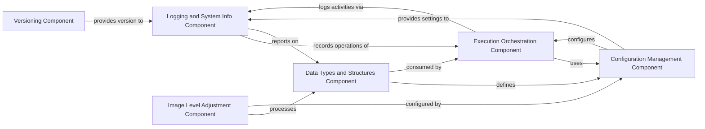

## Details

This section provides an overview of the `Core Infrastructure` components within the `starfish` project. These components are fundamental because they address the essential, cross-cutting concerns of the library, providing foundational services, defining core data representations, and offering basic utilities that higher-level modules depend on. They are not specific image processing algorithms but rather the underlying framework that enables the entire system to function robustly and consistently.

### Versioning Component

This component is responsible for programmatically determining and managing the version of the `starfish` software. It interacts with version control systems (like Git) to extract version information and format it according to standard conventions (e.g., PEP 440). This ensures that the software version can be consistently identified and reported.

**Related Classes/Methods**:

- <a href="https://github.com/spacetx/starfish/starfish/core/_version.py#L0-L0" target="_blank" rel="noopener noreferrer">`starfish.core._version` (0:0)</a>

### Data Types and Structures Component

This component defines the fundamental data models, structures (e.g., `DecodedSpots`, `SpotAttributes`, `ValidatedTable`), and enumerations (e.g., `Axes`, `Levels`, `Coordinates`) used throughout the `starfish` library. It ensures consistent data representation and interoperability across different modules and algorithms.

**Related Classes/Methods**:

- <a href="https://github.com/spacetx/starfish/starfish/core/starfish.py#L0-L0" target="_blank" rel="noopener noreferrer">`starfish.core.types` (0:0)</a>

### Configuration Management Component

This component handles the loading, parsing, and centralized management of application-wide configurations. It provides a flexible and centralized way to define and access parameters that control the behavior of various `starfish` algorithms and processes, supporting nested configuration structures.

**Related Classes/Methods**:

- <a href="https://github.com/spacetx/starfish/starfish/core/starfish.py#L0-L0" target="_blank" rel="noopener noreferrer">`starfish.core.config` (0:0)</a>

- <a href="https://github.com/spacetx/starfish/starfish/core/util/config.py#L0-L0" target="_blank" rel="noopener noreferrer">`starfish.core.util.config` (0:0)</a>

### Logging and System Info Component

This component provides comprehensive logging capabilities for the `starfish` application, enabling detailed tracking of execution flow, warnings, and errors. It also gathers system and dependency information, which is vital for diagnostics, error reporting, and understanding the execution environment.

**Related Classes/Methods**:

- <a href="https://github.com/spacetx/starfish/starfish/core/util/logging.py#L0-L0" target="_blank" rel="noopener noreferrer">`starfish.core.util.logging` (0:0)</a>

### Execution Orchestration Component

This component is responsible for orchestrating the execution flow of different processing stages within the `starfish` pipeline. It manages the sequence of operations, ensuring proper order and dependencies, and can integrate utilities like timing for performance monitoring and optimization.

**Related Classes/Methods**:

- <a href="https://github.com/spacetx/starfish/starfish/core/util/exec.py#L0-L0" target="_blank" rel="noopener noreferrer">`starfish.core.util.exec` (0:0)</a>

### Image Level Adjustment Component

This component offers a set of utility functions specifically designed for adjusting the intensity levels of images. This is a common and fundamental preprocessing step in image analysis pipelines, used to enhance contrast, normalize data, or prepare images for subsequent processing.

**Related Classes/Methods**:

- <a href="https://github.com/spacetx/starfish/starfish/core/util/levels.py#L45-L119" target="_blank" rel="noopener noreferrer">`starfish.core.util.levels` (45:119)</a>

### [FAQ](https://github.com/CodeBoarding/GeneratedOnBoardings/tree/main?tab=readme-ov-file#faq)