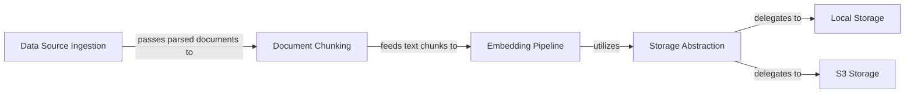

## Details

The DocsGPT system is designed around a modular data processing pipeline. It begins with the `Data Source Ingestion` component, responsible for acquiring raw data from diverse origins. This data then proceeds to `Document Chunking`, where it is segmented into optimized units. The `Embedding Pipeline` subsequently transforms these chunks into vector embeddings, which are crucial for knowledge representation. For persistent storage of these embeddings, the `Embedding Pipeline` interacts exclusively with the `Storage Abstraction` layer. This abstraction layer intelligently delegates storage operations to specific backends, such as `Local Storage` for local persistence or `S3 Storage` for scalable cloud-based storage, thereby ensuring a flexible and decoupled storage mechanism.

### Data Source Ingestion
This logical component encompasses the initial ingestion of raw data. `application.parser.file` handles local file system inputs, while `application.parser.remote` manages data from external sources like GitHub or sitemaps. They are the entry points for all data into the system.

**Related Classes/Methods**:

- <a href="https://github.com/arc53/DocsGPT/blob/main/application/parser/file" target="_blank" rel="noopener noreferrer">`application.parser.file`</a>
- <a href="https://github.com/arc53/DocsGPT/blob/main/application/parser/remote" target="_blank" rel="noopener noreferrer">`application.parser.remote`</a>

### Document Chunking
Responsible for breaking down large documents received from ingestion components into smaller, manageable chunks. This is critical for optimizing the data for embedding models and fitting within LLM context windows.

**Related Classes/Methods**:

- <a href="https://github.com/arc53/DocsGPT/blob/main/application/parser/chunking.py" target="_blank" rel="noopener noreferrer">`application.parser.chunking`</a>

### Embedding Pipeline
Orchestrates the conversion of text chunks into vector embeddings. This component is central to the data preparation process, bridging the gap between raw text and vector-based knowledge representation. It interacts with the `Storage Abstraction` for persistence.

**Related Classes/Methods**:

- <a href="https://github.com/arc53/DocsGPT/blob/main/application/parser/embedding_pipeline.py" target="_blank" rel="noopener noreferrer">`application.parser.embedding_pipeline`</a>

### Storage Abstraction
Acts as a factory or manager for abstracting different storage backends. It provides a unified interface for the rest of the system to interact with persistent storage, whether it's local or cloud-based. This promotes flexibility and extensibility in storage solutions by delegating to concrete implementations.

**Related Classes/Methods**:

- <a href="https://github.com/arc53/DocsGPT/blob/main/application/storage/storage_creator.py" target="_blank" rel="noopener noreferrer">`application.storage.storage_creator`</a>

### Local Storage
Implements the concrete logic for persistent storage and retrieval of files and data on the local file system. It's one of the specific storage backends supported by the system, managed by the `Storage Abstraction`.

**Related Classes/Methods**:

- <a href="https://github.com/arc53/DocsGPT/blob/main/application/storage/local.py" target="_blank" rel="noopener noreferrer">`application.storage.local`</a>

### S3 Storage
Implements the concrete logic for persistent storage and retrieval using S3-compatible object storage services. This provides cloud-based, scalable storage capabilities, managed by the `Storage Abstraction`.

**Related Classes/Methods**:

- <a href="https://github.com/arc53/DocsGPT/blob/main/application/storage/s3.py" target="_blank" rel="noopener noreferrer">`application.storage.s3`</a>

### [FAQ](https://github.com/CodeBoarding/GeneratedOnBoardings/tree/main?tab=readme-ov-file#faq)