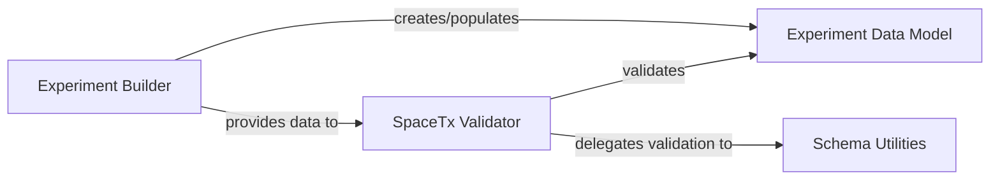

## Details

This subsystem is the initial entry point for all data processing pipelines within starfish, responsible for loading raw experimental data and metadata and ensuring its conformity to the SpaceTx format. It embodies the "Extract" and initial "Validate" stages of an ETL pipeline, crucial for maintaining data integrity throughout the scientific analysis workflow.

### Experiment Data Model
Represents the in-memory, structured form of the experimental data and metadata after loading. It serves as the canonical data structure that all subsequent processing components operate on.

**Related Classes/Methods**:

- <a href="https://github.com/spacetx/starfish/blob/master/starfish/core/experiment/experiment.py" target="_blank" rel="noopener noreferrer">`starfish.core.experiment.experiment:Experiment`</a>

### Experiment Builder
Responsible for parsing raw experimental data (e.g., image files, JSON metadata) from various sources and constructing the Experiment Data Model (Experiment object) in memory. It acts as the primary "Data Loader/Reader."

**Related Classes/Methods**:

- <a href="https://github.com/spacetx/starfish/blob/master/starfish/core/experiment/builder/builder.py" target="_blank" rel="noopener noreferrer">`starfish.core.experiment.builder.builder`</a>

### SpaceTx Validator
Provides the main entry point for validating an Experiment Data Model or its constituent parts against the SpaceTx schema. It ensures data integrity and adherence to the defined format, acting as a "Validation Tool" and a gatekeeper for data quality.

**Related Classes/Methods**:

- <a href="https://github.com/spacetx/starfish/blob/master/starfish/core/spacetx_format/validate_sptx.py" target="_blank" rel="noopener noreferrer">`starfish.core.spacetx_format.validate_sptx`</a>

### Schema Utilities
Encapsulates the core logic for SpaceTx schema validation, including loading the SpaceTx JSON schemas, performing structural and data type validation, and enforcing constraints. It supports the SpaceTx Validator.

**Related Classes/Methods**:

- <a href="https://github.com/spacetx/starfish/blob/master/starfish/core/spacetx_format/util.py" target="_blank" rel="noopener noreferrer">`starfish.core.spacetx_format.util`</a>

### [FAQ](https://github.com/CodeBoarding/GeneratedOnBoardings/tree/main?tab=readme-ov-file#faq)