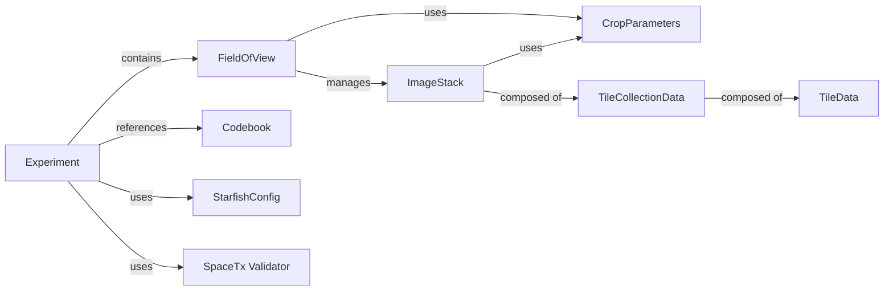

## Details

The `Experiment Data Core` subsystem in Starfish is designed to encapsulate and manage all data associated with a spatial transcriptomics experiment. It provides a structured, hierarchical representation of experimental data, from the top-level experiment down to individual image tiles, along with essential metadata and validation mechanisms. The chosen components are fundamental because they directly represent the data, define its structure, enable its interpretation, and ensure its integrity.

### Experiment

The top-level container representing an entire spatial transcriptomics experiment. It orchestrates access to all associated data, including multiple fields of view (FOVs) and the experiment's codebook. It provides methods for loading experiment data from standardized formats (e.g., JSON) and offers iterable access to its constituent FOVs.

**Related Classes/Methods**:

- <a href="https://github.com/spacetx/starfish/starfish/core/experiment/experiment.py#L212-L453" target="_blank" rel="noopener noreferrer">`Experiment` (212:453)</a>

### FieldOfView

Represents a single field of view within an experiment, corresponding to a specific spatial region imaged. It acts as a direct interface to the raw imaging data for that region, providing methods to retrieve individual images or entire image stacks.

**Related Classes/Methods**:

- `FieldOfView` (1:1)

### ImageStack

A multi-dimensional array-like structure that holds the actual image data (raw or processed fluorescent images). It provides functionalities for accessing, manipulating, and iterating over image data across various dimensions (e.g., channels, imaging rounds, Z-planes). It's a core component for any image-based processing.

**Related Classes/Methods**:

- `ImageStack` (1:1)

### Codebook

Stores the mapping between fluorescent probes (or imaging channels) and the specific gene targets they represent. This information is critical for decoding the spatial transcriptomics data, translating raw intensity measurements into gene expression profiles. It can be loaded from a JSON format.

**Related Classes/Methods**:

- <a href="https://github.com/spacetx/starfish/starfish/core/codebook/codebook.py#L28-L804" target="_blank" rel="noopener noreferrer">`Codebook` (28:804)</a>

### StarfishConfig

A centralized configuration management component for the Starfish application. It provides a structured way to store and retrieve various settings that influence the behavior of different parts of the software, including data loading, processing, and analysis.

**Related Classes/Methods**:

- `StarfishConfig` (1:1)

### SpaceTx Validator

A utility component responsible for validating the structure and content of experiment data against the SpaceTx format specification. This ensures that the input data adheres to predefined standards, promoting interoperability and data quality.

**Related Classes/Methods**:

- `SpaceTx Validator` (1:1)

### CropParameters

A data structure that defines the parameters for cropping image data. It specifies the region of interest to be extracted from a larger image stack, enabling focused analysis on specific parts of the field of view.

**Related Classes/Methods**:

- `CropParameters` (1:1)

### TileCollectionData

An internal class that manages the underlying data storage and access for collections of individual image tiles. It serves as a foundational layer for `ImageStack`, handling the organization and retrieval of image data chunks.

**Related Classes/Methods**:

- `TileCollectionData` (1:1)

### TileData

An internal class that manages the underlying data storage and access for individual image tiles. It represents a single chunk of image data and is a building block for `TileCollectionData`.

**Related Classes/Methods**:

- `TileData` (1:1)

### [FAQ](https://github.com/CodeBoarding/GeneratedOnBoardings/tree/main?tab=readme-ov-file#faq)