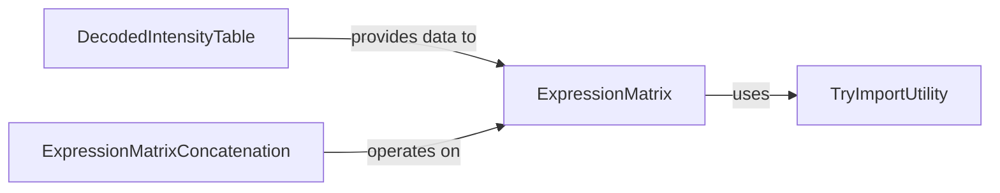

## Details

This subsystem is responsible for the creation, management, and output of expression matrices, which quantify gene expression levels. These matrices serve as the final, standardized data output for subsequent biological analysis within the `starfish` framework.

### ExpressionMatrix

This is the central data structure for storing and manipulating quantitative gene expression data. It encapsulates the gene expression levels, along with associated metadata, and provides core functionalities for loading data from various sources and saving it into standardized formats (e.g., Loom, AnnData). It represents the final, processed output of the gene expression quantification pipeline.

**Related Classes/Methods**:

- <a href="https://github.com/spacetx/starfish/starfish/core/expression_matrix/expression_matrix.py#L6-L93" target="_blank" rel="noopener noreferrer">`starfish.core.expression_matrix.expression_matrix:ExpressionMatrix` (6:93)</a>

### DecodedIntensityTable

This component represents the gene expression intensities after the decoding process. It serves as a crucial intermediate data structure, holding the quantitative measurements of gene expression for identified spots or cells, which are then used to construct the final `ExpressionMatrix`.

**Related Classes/Methods**:

- <a href="https://github.com/spacetx/starfish/starfish/core/intensity_table/decoded_intensity_table.py#L15-L190" target="_blank" rel="noopener noreferrer">`starfish.core.intensity_table.decoded_intensity_table:DecodedIntensityTable` (15:190)</a>

### ExpressionMatrixConcatenation

This component provides the functionality to combine multiple `ExpressionMatrix` objects into a single, larger, unified expression matrix. This is essential for integrating gene expression data from different fields of view, experimental replicates, or samples, enabling a comprehensive analysis across a larger dataset.

**Related Classes/Methods**:

- <a href="https://github.com/spacetx/starfish/starfish/core/expression_matrix/concatenate.py#L1-L1" target="_blank" rel="noopener noreferrer">`starfish.core.expression_matrix.concatenate:ExpressionMatrixConcatenation` (1:1)</a>

### TryImportUtility

This is a utility module designed to safely attempt the import of Python modules. In the context of `ExpressionMatrix`, its primary role is to manage optional dependencies required for specific functionalities, such as saving the expression matrix to external file formats like Loom or AnnData. It ensures that these features can be used if the necessary libraries are installed, without causing errors if they are not.

**Related Classes/Methods**:

- <a href="https://github.com/spacetx/starfish/starfish/core/util/try_import.py#L1-L1" target="_blank" rel="noopener noreferrer">`starfish.core.util.try_import:TryImportUtility` (1:1)</a>

### [FAQ](https://github.com/CodeBoarding/GeneratedOnBoardings/tree/main?tab=readme-ov-file#faq)