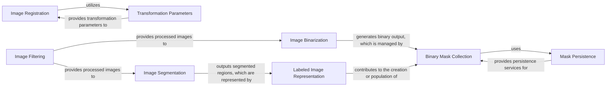

## Details

The `Image Processing Engine` subsystem is primarily defined by the `starfish.core.image` and `starfish.core.morphology` packages, specifically focusing on `Filter`, `_registration`, `Segment`, `Binarize`, and `label_image` modules. It operates as a pipeline, where raw or pre-processed images are fed into various transformation and analysis steps. This modular and pipeline-driven structure aligns with the project's "Data Pipeline / ETL" and "Modular Design" architectural patterns, allowing for flexible construction of image analysis workflows.

### Image Filtering
Responsible for applying various image enhancement and noise reduction algorithms to raw or pre-processed image data.

**Related Classes/Methods**:

- <a href="https://github.com/spacetx/starfish/blob/master/starfish/core/image/Filter/__init__.py" target="_blank" rel="noopener noreferrer">`starfish.core.image.Filter`</a>

### Image Registration
Manages the application of geometric transformations to align and register images, correcting for spatial distortions between different acquisitions or time points.

**Related Classes/Methods**:

- <a href="https://github.com/spacetx/starfish/blob/master/starfish/core/image/_registration/ApplyTransform" target="_blank" rel="noopener noreferrer">`starfish.core.image._registration.ApplyTransform`</a>

### Transformation Parameters
Provides a standardized mechanism for defining, serializing, and deserializing parameters required for various image transformations.

**Related Classes/Methods**:

- <a href="https://github.com/spacetx/starfish/blob/master/starfish/core/image/_registration/transforms_list.py" target="_blank" rel="noopener noreferrer">`starfish.core.image._registration.transforms_list`</a>

### Image Segmentation
Implements the watershed algorithm to segment images into distinct regions, typically used for separating touching objects or identifying individual structures.

**Related Classes/Methods**:

- <a href="https://github.com/spacetx/starfish/blob/master/starfish/core/image/Segment/watershed.py" target="_blank" rel="noopener noreferrer">`starfish.core.image.Segment.watershed`</a>

### Image Binarization
Performs image binarization by applying a threshold, converting grayscale images into binary (black and white) masks based on pixel intensity.

**Related Classes/Methods**:

- <a href="https://github.com/spacetx/starfish/blob/master/starfish/core/morphology/Binarize/threshold.py" target="_blank" rel="noopener noreferrer">`starfish.core.morphology.Binarize.threshold`</a>

### Labeled Image Representation
Encapsulates and manages image data where pixels are assigned integer labels corresponding to distinct regions or objects identified through segmentation.

**Related Classes/Methods**:

- <a href="https://github.com/spacetx/starfish/blob/master/starfish/core/morphology/label_image/label_image.py" target="_blank" rel="noopener noreferrer">`starfish.core.morphology.label_image.label_image`</a>

### Binary Mask Collection
Manages collections of binary masks, providing an organized structure for handling multiple mask datasets, often derived from binarization or segmentation.

**Related Classes/Methods**:

- <a href="https://github.com/spacetx/starfish/blob/master/starfish/core/morphology/binary_mask/binary_mask.py" target="_blank" rel="noopener noreferrer">`starfish.core.morphology.binary_mask.binary_mask`</a>

### Mask Persistence
Handles the reading and writing of binary mask data to and from persistent storage, ensuring data integrity and reusability.

**Related Classes/Methods**:

- <a href="https://github.com/spacetx/starfish/blob/master/starfish/core/morphology/binary_mask/_io.py" target="_blank" rel="noopener noreferrer">`starfish.core.morphology.binary_mask._io`</a>

### [FAQ](https://github.com/CodeBoarding/GeneratedOnBoardings/tree/main?tab=readme-ov-file#faq)