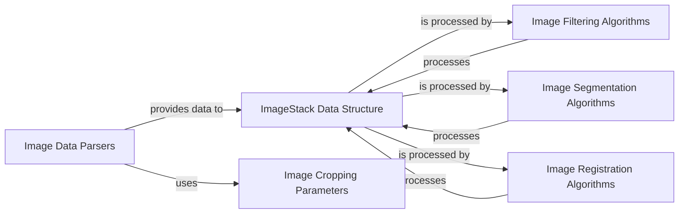

## Details

This subsystem is responsible for the core handling, manipulation, and processing of multi-dimensional image data within the `starfish` project. It provides the foundational data structures and algorithms necessary for various image analysis tasks, from loading raw data to applying advanced transformations.

### ImageStack Data Structure

The fundamental data structure representing a multi-dimensional image. It provides methods for accessing, slicing, and basic manipulation of image data, serving as the primary input and output for image processing operations. It is designed to hold raw or processed fluorescent images for an experiment or a FieldOfView.

**Related Classes/Methods**:

- <a href="https://github.com/spacetx/starfish/starfish/core/imagestack/imagestack.py#L67-L1273" target="_blank" rel="noopener noreferrer">`starfish.core.imagestack.imagestack.ImageStack` (67:1273)</a>

### Image Data Parsers

A collection of modules and classes responsible for reading and converting raw image data from various external sources (e.g., numpy arrays, tile fetchers, tilesets) into the internal `TileData` and `TileCollectionData` structures. These intermediate structures are then used to construct `ImageStack` objects.

**Related Classes/Methods**:

- <a href="https://github.com/spacetx/starfish/starfish/core/imagestack/parser/_tiledata.py#L1-L1" target="_blank" rel="noopener noreferrer">`starfish.core.imagestack.parser._tiledata` (1:1)</a>

- <a href="https://github.com/spacetx/starfish/starfish/core/imagestack/parser/crop.py#L1-L1" target="_blank" rel="noopener noreferrer">`starfish.core.imagestack.parser.crop` (1:1)</a>

- `starfish.core.imagestack.parser.numpy` (1:1)

- <a href="https://github.com/spacetx/starfish/starfish/core/imagestack/parser/tilefetcher/_parser.py#L1-L1" target="_blank" rel="noopener noreferrer">`starfish.core.imagestack.parser.tilefetcher._parser` (1:1)</a>

- <a href="https://github.com/spacetx/starfish/starfish/core/imagestack/parser/tileset/_parser.py#L1-L1" target="_blank" rel="noopener noreferrer">`starfish.core.imagestack.parser.tileset._parser` (1:1)</a>

### Image Cropping Parameters

Defines the parameters and logic for cropping or slicing image data. This component is utilized by the `Image Parsers` to extract specific regions of interest from larger image stacks, optimizing memory usage and processing time by only loading and processing necessary data.

**Related Classes/Methods**:

- <a href="https://github.com/spacetx/starfish/starfish/core/imagestack/parser/crop.py#L10-L240" target="_blank" rel="noopener noreferrer">`starfish.core.imagestack.parser.crop.CropParameters` (10:240)</a>

### Image Filtering Algorithms

A collection of algorithms that apply various filtering techniques (e.g., bandpass, Gaussian, Laplace, deconvolution) to `ImageStack` objects to enhance or modify image data. These algorithms typically take an `ImageStack` as input and produce a new, filtered `ImageStack`.

**Related Classes/Methods**:

- <a href="https://github.com/spacetx/starfish/starfish/core/image/Filter/_base.py#L7-L12" target="_blank" rel="noopener noreferrer">`starfish.core.image.Filter._base.FilterAlgorithm` (7:12)</a>

- <a href="https://github.com/spacetx/starfish/starfish/core/image/Filter/bandpass.py#L1-L1" target="_blank" rel="noopener noreferrer">`starfish.core.image.Filter.bandpass` (1:1)</a>

- <a href="https://github.com/spacetx/starfish/starfish/core/image/Filter/gaussian_low_pass.py#L1-L1" target="_blank" rel="noopener noreferrer">`starfish.core.image.Filter.gaussian_low_pass` (1:1)</a>

- <a href="https://github.com/spacetx/starfish/starfish/core/image/Filter/richardson_lucy_deconvolution.py#L1-L1" target="_blank" rel="noopener noreferrer">`starfish.core.image.Filter.richardson_lucy_deconvolution` (1:1)</a>

### Image Segmentation Algorithms

Provides algorithms for identifying and delineating distinct objects or regions within an image. A prominent example is the Watershed algorithm, which is used to separate touching objects. These algorithms typically take an `ImageStack` as input and produce a segmented output, often in the form of a mask or labeled image.

**Related Classes/Methods**:

- <a href="https://github.com/spacetx/starfish/starfish/core/image/Segment/_base.py#L7-L17" target="_blank" rel="noopener noreferrer">`starfish.core.image.Segment._base.SegmentAlgorithm` (7:17)</a>

- <a href="https://github.com/spacetx/starfish/starfish/core/image/Segment/watershed.py#L1-L1" target="_blank" rel="noopener noreferrer">`starfish.core.image.Segment.watershed` (1:1)</a>

### Image Registration Algorithms

Contains algorithms for aligning multiple images or image stacks to correct for spatial distortions, shifts, or rotations. This is crucial for integrating data from different acquisition rounds or fields of view. It includes algorithms for learning transformations (e.g., Translation) and applying them (e.g., Warp).

**Related Classes/Methods**:

- `starfish.core.image._registration._base` (1:1)

- `starfish.core.image._registration.ApplyTransform` (1:1)

- `starfish.core.image._registration.LearnTransform` (1:1)

### [FAQ](https://github.com/CodeBoarding/GeneratedOnBoardings/tree/main?tab=readme-ov-file#faq)