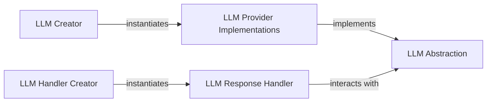

## Details

The LLM subsystem is designed around a core LLM Abstraction that provides a consistent interface for interacting with various LLM Provider Implementations. The LLM Creator is responsible for dynamically instantiating the appropriate LLM Provider Implementation based on configuration. Once an LLM interaction occurs, the LLM Response Handler orchestrates the subsequent message processing, including parsing responses and managing tool calls. The LLM Handler Creator facilitates the selection and instantiation of the correct LLM Response Handler. This architecture ensures modularity, extensibility, and LLM agnosticism by centralizing interactions through the LLM Abstraction and separating response processing logic.

### LLM Abstraction
Serves as the central contract for all LLM interactions, abstracting away the specifics of different LLM Provider Implementations.

**Related Classes/Methods**: _None_

### LLM Creator
Acts as a factory, providing instances of concrete LLM Provider Implementations.

**Related Classes/Methods**: _None_

### LLM Provider Implementations
Concrete implementations that adhere to the LLM Abstraction.

**Related Classes/Methods**: _None_

### LLM Response Handler
Manages the entire post-response flow, including parsing, tool call execution, and message preparation.

**Related Classes/Methods**: _None_

### LLM Handler Creator
Dynamically provides the appropriate LLM Response Handler instance.

**Related Classes/Methods**: _None_

### [FAQ](https://github.com/CodeBoarding/GeneratedOnBoardings/tree/main?tab=readme-ov-file#faq)