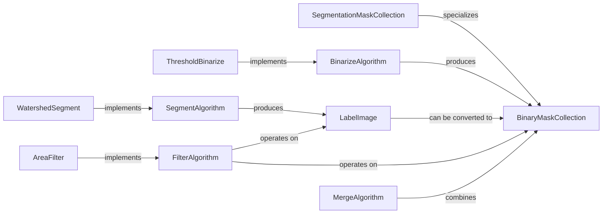

## Details

The `Mask & Label Management` subsystem in `starfish` is responsible for the creation, manipulation, and processing of binary masks, labeled images, and segmentation masks. It provides a robust framework for various morphological operations, ensuring data consistency and extensibility through well-defined interfaces and specialized data structures.

### BinaryMaskCollection

This is the foundational data structure for storing and manipulating collections of binary masks. It allows for the creation of masks from various sources (arrays, label images, external files) and provides methods for accessing, cropping, and reducing individual masks. It also manages the normalization of pixel and physical coordinate systems, ensuring spatial consistency.

**Related Classes/Methods**:

- `BinaryMaskCollection` (0:0)

### LabelImage

Represents an image where each distinct object or region is assigned a unique integer label. It supports creation from arrays and coordinate ticks and can be converted into a `BinaryMaskCollection`. This component is crucial for representing segmented regions before they are converted into binary masks.

**Related Classes/Methods**:

- <a href="https://github.com/spacetx/starfish/starfish/core/morphology/label_image/label_image.py#L28-L167" target="_blank" rel="noopener noreferrer">`LabelImage` (28:167)</a>

### SegmentationMaskCollection

A specialized subclass of `BinaryMaskCollection` tailored specifically for handling segmentation masks. It inherits all functionalities from its parent and adds specific methods relevant to segmentation, such as loading from compressed archives, making it the primary data structure for segmentation results.

**Related Classes/Methods**:

- `SegmentationMaskCollection` (0:0)

### BinarizeAlgorithm

Defines the abstract interface for all binarization algorithms. These algorithms convert an input image into a binary mask, typically by applying a threshold. This abstraction allows for different binarization methods to be implemented and used interchangeably.

**Related Classes/Methods**:

- `BinarizeAlgorithm` (0:0)

### ThresholdBinarize

A concrete implementation of `BinarizeAlgorithm` that performs binarization by applying a threshold to an input image, resulting in a `BinaryMaskCollection`. This is a common and essential binarization technique.

**Related Classes/Methods**:

- `ThresholdBinarize` (0:0)

### SegmentAlgorithm

Defines the abstract interface for segmentation algorithms, which are responsible for identifying and delineating distinct objects or regions within an image. This provides a common contract for various segmentation approaches.

**Related Classes/Methods**:

- `SegmentAlgorithm` (0:0)

### WatershedSegment

A concrete implementation of `SegmentAlgorithm` that uses the watershed algorithm for image segmentation. It takes an image and produces a `LabelImage`, which can then be converted to a `BinaryMaskCollection`. This algorithm is a powerful tool for separating touching objects.

**Related Classes/Methods**:

- `WatershedSegment` (0:0)

### FilterAlgorithm

Defines the abstract interface for filtering algorithms that operate on `BinaryMaskCollection` or `LabelImage` objects to refine, select, or modify regions based on certain criteria (e.g., size, shape). This allows for post-processing of masks and labels.

**Related Classes/Methods**:

- `FilterAlgorithm` (0:0)

### AreaFilter

A concrete implementation of `FilterAlgorithm` that filters `BinaryMaskCollection` objects based on the area of the individual masks. This is a practical example of how filtering can be applied to refine segmentation results.

**Related Classes/Methods**:

- `AreaFilter` (0:0)

### MergeAlgorithm

Defines the abstract interface for algorithms that combine multiple `BinaryMaskCollection` objects into a single, unified collection. This is essential for integrating masks from different sources or processing steps.

**Related Classes/Methods**:

- `MergeAlgorithm` (0:0)

### [FAQ](https://github.com/CodeBoarding/GeneratedOnBoardings/tree/main?tab=readme-ov-file#faq)