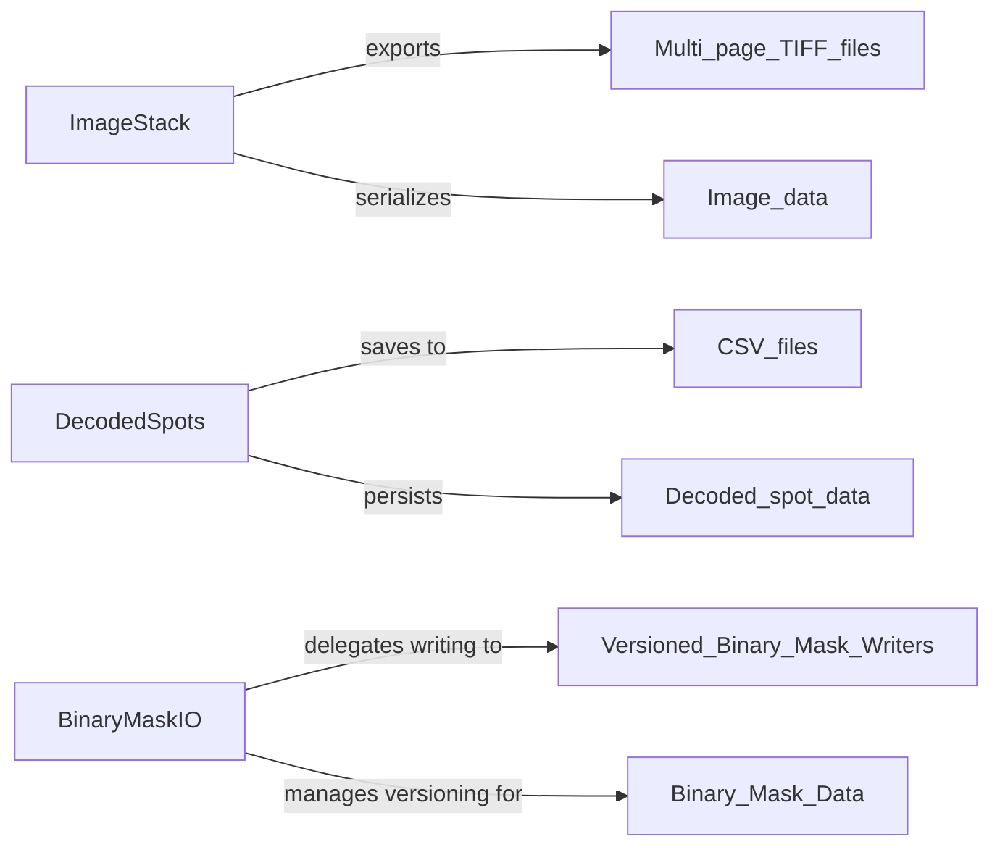

## Details

The `starfish` core data persistence layer is responsible for serializing and exporting processed biological data, ensuring data integrity and accessibility for downstream analysis. Key components include `ImageStack` for managing and exporting multi-dimensional image data into formats like multi-page TIFF, `DecodedSpots` for persisting decoded biological spot information into tabular formats such as CSV, and `BinaryMaskIO` which handles the specialized, versioned storage of binary mask data. These components primarily interact by taking processed in-memory data structures and writing them to disk in standardized formats, facilitating data sharing and reproducibility in scientific workflows.

### ImageStack
This component represents and manages multi-dimensional image data. Its primary responsibility within this layer is to provide methods for serializing and exporting processed image stacks into standard persistent formats, specifically multi-page TIFF files, which are crucial for scientific image data.

**Related Classes/Methods**:

- <a href="https://github.com/spacetx/starfish/blob/master/starfish/core/imagestack/imagestack.py" target="_blank" rel="noopener noreferrer">`ImageStack:to_multipage_tiff`</a>
- <a href="https://github.com/spacetx/starfish/blob/master/starfish/core/imagestack/imagestack.py" target="_blank" rel="noopener noreferrer">`ImageStack:export`</a>

### DecodedSpots
This component encapsulates the results of the decoding process, holding information about identified biological spots (e.g., coordinates, intensities, gene assignments). Its core responsibility in this layer is to facilitate the persistence of this structured data, typically by saving it into tabular formats like CSV, enabling easy access and analysis.

**Related Classes/Methods**:

- <a href="https://github.com/spacetx/starfish/blob/master/starfish/core/types/_decoded_spots.py" target="_blank" rel="noopener noreferrer">`DecodedSpots:save_csv`</a>

### BinaryMaskIO
This component is responsible for the specialized handling and persistence of binary mask data. It provides both low-level writing capabilities and a higher-level interface that ensures proper versioning of mask files, aligning with data integrity and reproducibility requirements in scientific workflows. This component abstracts the direct file writing operations for masks by delegating to specific versioned implementations.

**Related Classes/Methods**:

- <a href="https://github.com/spacetx/starfish/blob/master/starfish/core/morphology/binary_mask/_io.py#L136-L162" target="_blank" rel="noopener noreferrer">`write_binary_mask`:136-162</a>
- <a href="https://github.com/spacetx/starfish/blob/master/starfish/core/morphology/binary_mask/_io.py#L58-L74" target="_blank" rel="noopener noreferrer">`write_versioned_binary_mask`:58-74</a>

### [FAQ](https://github.com/CodeBoarding/GeneratedOnBoardings/tree/main?tab=readme-ov-file#faq)