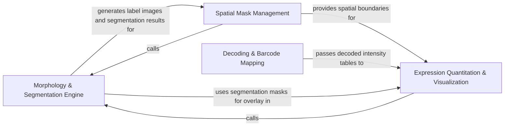

## Details

Translates raw intensities into biological insights by mapping signals to genetic barcodes and cell regions.

### Morphology & Segmentation Engine
Responsible for the algorithmic identification of biological entities (cells, nuclei) from image data using segmentation strategies like watershed.

**Related Classes/Methods**:

- `starfish.core.image.Segment.watershed.Watershed`:19-93
- `starfish.core.morphology.Segment.watershed.WatershedSegment`:13-82
- `starfish.core.spots.AssignTargets.label.Label`:11-96

**Source Files:**

- [`starfish/core/image/Segment/watershed.py`](https://github.com/CodeBoarding/starfish/blob/master/.codeboardingstarfish/core/image/Segment/watershed.py)
  - `starfish.core.image.Segment.watershed.Watershed` ([L19-L93](https://github.com/CodeBoarding/starfish/blob/master/.codeboardingstarfish/core/image/Segment/watershed.py#L19-L93)) - Class
  - `starfish.core.image.Segment.watershed.Watershed.__init__` ([L44-L54](https://github.com/CodeBoarding/starfish/blob/master/.codeboardingstarfish/core/image/Segment/watershed.py#L44-L54)) - Method
  - `starfish.core.image.Segment.watershed.Watershed.run` ([L56-L87](https://github.com/CodeBoarding/starfish/blob/master/.codeboardingstarfish/core/image/Segment/watershed.py#L56-L87)) - Method
  - `starfish.core.image.Segment.watershed.Watershed.show` ([L89-L93](https://github.com/CodeBoarding/starfish/blob/master/.codeboardingstarfish/core/image/Segment/watershed.py#L89-L93)) - Method
  - `starfish.core.image.Segment.watershed._WatershedSegmenter` ([L96-L320](https://github.com/CodeBoarding/starfish/blob/master/.codeboardingstarfish/core/image/Segment/watershed.py#L96-L320)) - Class
  - `starfish.core.image.Segment.watershed._WatershedSegmenter.__init__` ([L97-L126](https://github.com/CodeBoarding/starfish/blob/master/.codeboardingstarfish/core/image/Segment/watershed.py#L97-L126)) - Method
  - `starfish.core.image.Segment.watershed._WatershedSegmenter.segment` ([L128-L172](https://github.com/CodeBoarding/starfish/blob/master/.codeboardingstarfish/core/image/Segment/watershed.py#L128-L172)) - Method
  - `starfish.core.image.Segment.watershed._WatershedSegmenter.filter_nuclei` ([L174-L201](https://github.com/CodeBoarding/starfish/blob/master/.codeboardingstarfish/core/image/Segment/watershed.py#L174-L201)) - Method
  - `starfish.core.image.Segment.watershed._WatershedSegmenter.watershed_mask` ([L203-L240](https://github.com/CodeBoarding/starfish/blob/master/.codeboardingstarfish/core/image/Segment/watershed.py#L203-L240)) - Method
  - `starfish.core.image.Segment.watershed._WatershedSegmenter.watershed` ([L242-L269](https://github.com/CodeBoarding/starfish/blob/master/.codeboardingstarfish/core/image/Segment/watershed.py#L242-L269)) - Method
  - `starfish.core.image.Segment.watershed._WatershedSegmenter.show` ([L271-L320](https://github.com/CodeBoarding/starfish/blob/master/.codeboardingstarfish/core/image/Segment/watershed.py#L271-L320)) - Method
- [`starfish/core/morphology/Binarize/threshold.py`](https://github.com/CodeBoarding/starfish/blob/master/.codeboardingstarfish/core/morphology/Binarize/threshold.py)
  - `starfish.core.morphology.Binarize.threshold.ThresholdBinarize` ([L13-L60](https://github.com/CodeBoarding/starfish/blob/master/.codeboardingstarfish/core/morphology/Binarize/threshold.py#L13-L60)) - Class
  - `starfish.core.morphology.Binarize.threshold.ThresholdBinarize.__init__` ([L19-L20](https://github.com/CodeBoarding/starfish/blob/master/.codeboardingstarfish/core/morphology/Binarize/threshold.py#L19-L20)) - Method
- [`starfish/core/morphology/Filter/areafilter.py`](https://github.com/CodeBoarding/starfish/blob/master/.codeboardingstarfish/core/morphology/Filter/areafilter.py)
  - `starfish.core.morphology.Filter.areafilter.AreaFilter` ([L8-L79](https://github.com/CodeBoarding/starfish/blob/master/.codeboardingstarfish/core/morphology/Filter/areafilter.py#L8-L79)) - Class
  - `starfish.core.morphology.Filter.areafilter.AreaFilter.__init__` ([L23-L58](https://github.com/CodeBoarding/starfish/blob/master/.codeboardingstarfish/core/morphology/Filter/areafilter.py#L23-L58)) - Method
- [`starfish/core/morphology/Filter/map.py`](https://github.com/CodeBoarding/starfish/blob/master/.codeboardingstarfish/core/morphology/Filter/map.py)
  - `starfish.core.morphology.Filter.map.Map` ([L9-L99](https://github.com/CodeBoarding/starfish/blob/master/.codeboardingstarfish/core/morphology/Filter/map.py#L9-L99)) - Class
  - `starfish.core.morphology.Filter.map.Map.__init__` ([L46-L70](https://github.com/CodeBoarding/starfish/blob/master/.codeboardingstarfish/core/morphology/Filter/map.py#L46-L70)) - Method
- [`starfish/core/morphology/Filter/min_distance_label.py`](https://github.com/CodeBoarding/starfish/blob/master/.codeboardingstarfish/core/morphology/Filter/min_distance_label.py)
  - `starfish.core.morphology.Filter.min_distance_label.MinDistanceLabel` ([L10-L83](https://github.com/CodeBoarding/starfish/blob/master/.codeboardingstarfish/core/morphology/Filter/min_distance_label.py#L10-L83)) - Class
  - `starfish.core.morphology.Filter.min_distance_label.MinDistanceLabel.__init__` ([L29-L37](https://github.com/CodeBoarding/starfish/blob/master/.codeboardingstarfish/core/morphology/Filter/min_distance_label.py#L29-L37)) - Method
  - `starfish.core.morphology.Filter.min_distance_label.MinDistanceLabel.run` ([L39-L83](https://github.com/CodeBoarding/starfish/blob/master/.codeboardingstarfish/core/morphology/Filter/min_distance_label.py#L39-L83)) - Method
- [`starfish/core/morphology/Filter/reduce.py`](https://github.com/CodeBoarding/starfish/blob/master/.codeboardingstarfish/core/morphology/Filter/reduce.py)
  - `starfish.core.morphology.Filter.reduce.Reduce` ([L10-L94](https://github.com/CodeBoarding/starfish/blob/master/.codeboardingstarfish/core/morphology/Filter/reduce.py#L10-L94)) - Class
  - `starfish.core.morphology.Filter.reduce.Reduce.__init__` ([L51-L64](https://github.com/CodeBoarding/starfish/blob/master/.codeboardingstarfish/core/morphology/Filter/reduce.py#L51-L64)) - Method
- [`starfish/core/morphology/Filter/structural_label.py`](https://github.com/CodeBoarding/starfish/blob/master/.codeboardingstarfish/core/morphology/Filter/structural_label.py)
  - `starfish.core.morphology.Filter.structural_label.StructuralLabel` ([L10-L39](https://github.com/CodeBoarding/starfish/blob/master/.codeboardingstarfish/core/morphology/Filter/structural_label.py#L10-L39)) - Class
  - `starfish.core.morphology.Filter.structural_label.StructuralLabel.__init__` ([L22-L23](https://github.com/CodeBoarding/starfish/blob/master/.codeboardingstarfish/core/morphology/Filter/structural_label.py#L22-L23)) - Method
  - `starfish.core.morphology.Filter.structural_label.StructuralLabel.run` ([L25-L39](https://github.com/CodeBoarding/starfish/blob/master/.codeboardingstarfish/core/morphology/Filter/structural_label.py#L25-L39)) - Method
- [`starfish/core/morphology/Merge/simple.py`](https://github.com/CodeBoarding/starfish/blob/master/.codeboardingstarfish/core/morphology/Merge/simple.py)
  - `starfish.core.morphology.Merge.simple.SimpleMerge` ([L11-L60](https://github.com/CodeBoarding/starfish/blob/master/.codeboardingstarfish/core/morphology/Merge/simple.py#L11-L60)) - Class
- [`starfish/core/morphology/Segment/watershed.py`](https://github.com/CodeBoarding/starfish/blob/master/.codeboardingstarfish/core/morphology/Segment/watershed.py)
  - `starfish.core.morphology.Segment.watershed.WatershedSegment` ([L13-L82](https://github.com/CodeBoarding/starfish/blob/master/.codeboardingstarfish/core/morphology/Segment/watershed.py#L13-L82)) - Class
  - `starfish.core.morphology.Segment.watershed.WatershedSegment.__init__` ([L26-L27](https://github.com/CodeBoarding/starfish/blob/master/.codeboardingstarfish/core/morphology/Segment/watershed.py#L26-L27)) - Method
  - `starfish.core.morphology.Segment.watershed.WatershedSegment.run` ([L29-L82](https://github.com/CodeBoarding/starfish/blob/master/.codeboardingstarfish/core/morphology/Segment/watershed.py#L29-L82)) - Method
- [`starfish/core/morphology/binary_mask/binary_mask.py`](https://github.com/CodeBoarding/starfish/blob/master/.codeboardingstarfish/core/morphology/binary_mask/binary_mask.py)
  - `starfish.core.morphology.binary_mask.binary_mask.BinaryMaskCollection.__getitem__` ([L103-L104](https://github.com/CodeBoarding/starfish/blob/master/.codeboardingstarfish/core/morphology/binary_mask/binary_mask.py#L103-L104)) - Method
  - `starfish.core.morphology.binary_mask.binary_mask.BinaryMaskCollection.__iter__` ([L106-L108](https://github.com/CodeBoarding/starfish/blob/master/.codeboardingstarfish/core/morphology/binary_mask/binary_mask.py#L106-L108)) - Method
  - `starfish.core.morphology.binary_mask.binary_mask.BinaryMaskCollection.__len__` ([L110-L111](https://github.com/CodeBoarding/starfish/blob/master/.codeboardingstarfish/core/morphology/binary_mask/binary_mask.py#L110-L111)) - Method
  - `starfish.core.morphology.binary_mask.binary_mask.BinaryMaskCollection._format_mask_as_xarray` ([L113-L134](https://github.com/CodeBoarding/starfish/blob/master/.codeboardingstarfish/core/morphology/binary_mask/binary_mask.py#L113-L134)) - Method
  - `starfish.core.morphology.binary_mask.binary_mask.BinaryMaskCollection.uncropped_mask` ([L136-L178](https://github.com/CodeBoarding/starfish/blob/master/.codeboardingstarfish/core/morphology/binary_mask/binary_mask.py#L136-L178)) - Method
  - `starfish.core.morphology.binary_mask.binary_mask.BinaryMaskCollection.masks` ([L180-L182](https://github.com/CodeBoarding/starfish/blob/master/.codeboardingstarfish/core/morphology/binary_mask/binary_mask.py#L180-L182)) - Method
  - `starfish.core.morphology.binary_mask.binary_mask.BinaryMaskCollection.mask_regionprops` ([L184-L217](https://github.com/CodeBoarding/starfish/blob/master/.codeboardingstarfish/core/morphology/binary_mask/binary_mask.py#L184-L217)) - Method
  - `starfish.core.morphology.binary_mask.binary_mask.BinaryMaskCollection.max_shape` ([L220-L224](https://github.com/CodeBoarding/starfish/blob/master/.codeboardingstarfish/core/morphology/binary_mask/binary_mask.py#L220-L224)) - Method
  - `starfish.core.morphology.binary_mask.binary_mask.BinaryMaskCollection.log` ([L227-L228](https://github.com/CodeBoarding/starfish/blob/master/.codeboardingstarfish/core/morphology/binary_mask/binary_mask.py#L227-L228)) - Method
  - `starfish.core.morphology.binary_mask.binary_mask.BinaryMaskCollection.from_label_array_and_ticks` ([L518-L591](https://github.com/CodeBoarding/starfish/blob/master/.codeboardingstarfish/core/morphology/binary_mask/binary_mask.py#L518-L591)) - Method
  - `starfish.core.morphology.binary_mask.binary_mask.BinaryMaskCollection.to_label_image` ([L593-L613](https://github.com/CodeBoarding/starfish/blob/master/.codeboardingstarfish/core/morphology/binary_mask/binary_mask.py#L593-L613)) - Method
  - `starfish.core.morphology.binary_mask.binary_mask.BinaryMaskCollection._reduce` ([L708-L761](https://github.com/CodeBoarding/starfish/blob/master/.codeboardingstarfish/core/morphology/binary_mask/binary_mask.py#L708-L761)) - Method
- [`starfish/core/morphology/binary_mask/expand.py`](https://github.com/CodeBoarding/starfish/blob/master/.codeboardingstarfish/core/morphology/binary_mask/expand.py)
  - `starfish.core.morphology.binary_mask.expand.fill_from_mask` ([L6-L53](https://github.com/CodeBoarding/starfish/blob/master/.codeboardingstarfish/core/morphology/binary_mask/expand.py#L6-L53)) - Function
- [`starfish/core/morphology/label_image/label_image.py`](https://github.com/CodeBoarding/starfish/blob/master/.codeboardingstarfish/core/morphology/label_image/label_image.py)
  - `starfish.core.morphology.label_image.label_image.AttrKeys` ([L17-L20](https://github.com/CodeBoarding/starfish/blob/master/.codeboardingstarfish/core/morphology/label_image/label_image.py#L17-L20)) - Class
  - `starfish.core.morphology.label_image.label_image.LabelImage.xarray` ([L119-L121](https://github.com/CodeBoarding/starfish/blob/master/.codeboardingstarfish/core/morphology/label_image/label_image.py#L119-L121)) - Method
  - `starfish.core.morphology.label_image.label_image.LabelImage.open_netcdf` ([L130-L158](https://github.com/CodeBoarding/starfish/blob/master/.codeboardingstarfish/core/morphology/label_image/label_image.py#L130-L158)) - Method
  - `starfish.core.morphology.label_image.label_image.LabelImage.to_netcdf` ([L160-L168](https://github.com/CodeBoarding/starfish/blob/master/.codeboardingstarfish/core/morphology/label_image/label_image.py#L160-L168)) - Method
- [`starfish/core/morphology/util.py`](https://github.com/CodeBoarding/starfish/blob/master/.codeboardingstarfish/core/morphology/util.py)
  - `starfish.core.morphology.util._get_axes_names` ([L9-L34](https://github.com/CodeBoarding/starfish/blob/master/.codeboardingstarfish/core/morphology/util.py#L9-L34)) - Function
- [`starfish/core/spots/AssignTargets/label.py`](https://github.com/CodeBoarding/starfish/blob/master/.codeboardingstarfish/core/spots/AssignTargets/label.py)
  - `starfish.core.spots.AssignTargets.label.Label` ([L11-L96](https://github.com/CodeBoarding/starfish/blob/master/.codeboardingstarfish/core/spots/AssignTargets/label.py#L11-L96)) - Class
  - `starfish.core.spots.AssignTargets.label.Label.__init__` ([L16-L17](https://github.com/CodeBoarding/starfish/blob/master/.codeboardingstarfish/core/spots/AssignTargets/label.py#L16-L17)) - Method
  - `starfish.core.spots.AssignTargets.label.Label._add_arguments` ([L20-L21](https://github.com/CodeBoarding/starfish/blob/master/.codeboardingstarfish/core/spots/AssignTargets/label.py#L20-L21)) - Method
  - `starfish.core.spots.AssignTargets.label.Label._assign` ([L24-L67](https://github.com/CodeBoarding/starfish/blob/master/.codeboardingstarfish/core/spots/AssignTargets/label.py#L24-L67)) - Method
  - `starfish.core.spots.AssignTargets.label.Label.run` ([L69-L96](https://github.com/CodeBoarding/starfish/blob/master/.codeboardingstarfish/core/spots/AssignTargets/label.py#L69-L96)) - Method

### Spatial Mask Management
Manages data structures and I/O operations for spatial regions, converting between pixel-based label images and coordinate-aware binary masks.

**Related Classes/Methods**:

- `starfish.core.morphology.binary_mask.binary_mask.BinaryMaskCollection`:49-761
- `starfish.core.morphology.label_image.label_image.LabelImage`:29-168
- `starfish.core.morphology.binary_mask._io.BinaryMaskIO`:26-80

**Source Files:**

- [`starfish/core/image/Filter/map.py`](https://github.com/CodeBoarding/starfish/blob/master/.codeboardingstarfish/core/image/Filter/map.py)
  - `starfish.core.image.Filter.map.Map.__init__` ([L75-L107](https://github.com/CodeBoarding/starfish/blob/master/.codeboardingstarfish/core/image/Filter/map.py#L75-L107)) - Method
  - `starfish.core.image.Filter.map.Map.run` ([L111-L138](https://github.com/CodeBoarding/starfish/blob/master/.codeboardingstarfish/core/image/Filter/map.py#L111-L138)) - Method
- [`starfish/core/image/Filter/reduce.py`](https://github.com/CodeBoarding/starfish/blob/master/.codeboardingstarfish/core/image/Filter/reduce.py)
  - `starfish.core.image.Filter.reduce.Reduce.__init__` ([L114-L140](https://github.com/CodeBoarding/starfish/blob/master/.codeboardingstarfish/core/image/Filter/reduce.py#L114-L140)) - Method
  - `starfish.core.image.Filter.reduce.Reduce.run` ([L144-L193](https://github.com/CodeBoarding/starfish/blob/master/.codeboardingstarfish/core/image/Filter/reduce.py#L144-L193)) - Method
- [`starfish/core/morphology/Binarize/threshold.py`](https://github.com/CodeBoarding/starfish/blob/master/.codeboardingstarfish/core/morphology/Binarize/threshold.py)
  - `starfish.core.morphology.Binarize.threshold.ThresholdBinarize._binarize` ([L22-L23](https://github.com/CodeBoarding/starfish/blob/master/.codeboardingstarfish/core/morphology/Binarize/threshold.py#L22-L23)) - Method
  - `starfish.core.morphology.Binarize.threshold.ThresholdBinarize.run` ([L25-L60](https://github.com/CodeBoarding/starfish/blob/master/.codeboardingstarfish/core/morphology/Binarize/threshold.py#L25-L60)) - Method
- [`starfish/core/morphology/Filter/areafilter.py`](https://github.com/CodeBoarding/starfish/blob/master/.codeboardingstarfish/core/morphology/Filter/areafilter.py)
  - `starfish.core.morphology.Filter.areafilter.AreaFilter.run` ([L60-L79](https://github.com/CodeBoarding/starfish/blob/master/.codeboardingstarfish/core/morphology/Filter/areafilter.py#L60-L79)) - Method
- [`starfish/core/morphology/Filter/map.py`](https://github.com/CodeBoarding/starfish/blob/master/.codeboardingstarfish/core/morphology/Filter/map.py)
  - `starfish.core.morphology.Filter.map.Map.run` ([L72-L99](https://github.com/CodeBoarding/starfish/blob/master/.codeboardingstarfish/core/morphology/Filter/map.py#L72-L99)) - Method
- [`starfish/core/morphology/Filter/reduce.py`](https://github.com/CodeBoarding/starfish/blob/master/.codeboardingstarfish/core/morphology/Filter/reduce.py)
  - `starfish.core.morphology.Filter.reduce.Reduce.run` ([L66-L94](https://github.com/CodeBoarding/starfish/blob/master/.codeboardingstarfish/core/morphology/Filter/reduce.py#L66-L94)) - Method
- [`starfish/core/morphology/Merge/simple.py`](https://github.com/CodeBoarding/starfish/blob/master/.codeboardingstarfish/core/morphology/Merge/simple.py)
  - `starfish.core.morphology.Merge.simple.SimpleMerge.run` ([L15-L60](https://github.com/CodeBoarding/starfish/blob/master/.codeboardingstarfish/core/morphology/Merge/simple.py#L15-L60)) - Method
- [`starfish/core/morphology/binary_mask/_io.py`](https://github.com/CodeBoarding/starfish/blob/master/.codeboardingstarfish/core/morphology/binary_mask/_io.py)
  - `starfish.core.morphology.binary_mask._io.AttrKeys` ([L18-L20](https://github.com/CodeBoarding/starfish/blob/master/.codeboardingstarfish/core/morphology/binary_mask/_io.py#L18-L20)) - Class
  - `starfish.core.morphology.binary_mask._io.BinaryMaskIO` ([L26-L80](https://github.com/CodeBoarding/starfish/blob/master/.codeboardingstarfish/core/morphology/binary_mask/_io.py#L26-L80)) - Class
  - `starfish.core.morphology.binary_mask._io.BinaryMaskIO.__init_subclass__` ([L30-L34](https://github.com/CodeBoarding/starfish/blob/master/.codeboardingstarfish/core/morphology/binary_mask/_io.py#L30-L34)) - Method
  - `starfish.core.morphology.binary_mask._io.BinaryMaskIO.read_versioned_binary_mask` ([L37-L56](https://github.com/CodeBoarding/starfish/blob/master/.codeboardingstarfish/core/morphology/binary_mask/_io.py#L37-L56)) - Method
  - `starfish.core.morphology.binary_mask._io.BinaryMaskIO.write_versioned_binary_mask` ([L59-L74](https://github.com/CodeBoarding/starfish/blob/master/.codeboardingstarfish/core/morphology/binary_mask/_io.py#L59-L74)) - Method
  - `starfish.core.morphology.binary_mask._io.BinaryMaskIO.read_binary_mask` ([L76-L77](https://github.com/CodeBoarding/starfish/blob/master/.codeboardingstarfish/core/morphology/binary_mask/_io.py#L76-L77)) - Method
  - `starfish.core.morphology.binary_mask._io.BinaryMaskIO.write_binary_mask` ([L79-L80](https://github.com/CodeBoarding/starfish/blob/master/.codeboardingstarfish/core/morphology/binary_mask/_io.py#L79-L80)) - Method
  - `starfish.core.morphology.binary_mask._io.v0_0` ([L83-L162](https://github.com/CodeBoarding/starfish/blob/master/.codeboardingstarfish/core/morphology/binary_mask/_io.py#L83-L162)) - Class
  - `starfish.core.morphology.binary_mask._io.v0_0.MaskOnDisk` ([L90-L92](https://github.com/CodeBoarding/starfish/blob/master/.codeboardingstarfish/core/morphology/binary_mask/_io.py#L90-L92)) - Class
  - `starfish.core.morphology.binary_mask._io.v0_0.read_binary_mask` ([L94-L134](https://github.com/CodeBoarding/starfish/blob/master/.codeboardingstarfish/core/morphology/binary_mask/_io.py#L94-L134)) - Method
  - `starfish.core.morphology.binary_mask._io.v0_0.write_binary_mask` ([L136-L162](https://github.com/CodeBoarding/starfish/blob/master/.codeboardingstarfish/core/morphology/binary_mask/_io.py#L136-L162)) - Method
  - `starfish.core.morphology.binary_mask._io.write_to_tarfile` ([L165-L168](https://github.com/CodeBoarding/starfish/blob/master/.codeboardingstarfish/core/morphology/binary_mask/_io.py#L165-L168)) - Function
- [`starfish/core/morphology/binary_mask/binary_mask.py`](https://github.com/CodeBoarding/starfish/blob/master/.codeboardingstarfish/core/morphology/binary_mask/binary_mask.py)
  - `starfish.core.morphology.binary_mask.binary_mask.MaskData` ([L43-L46](https://github.com/CodeBoarding/starfish/blob/master/.codeboardingstarfish/core/morphology/binary_mask/binary_mask.py#L43-L46)) - Class
  - `starfish.core.morphology.binary_mask.binary_mask.BinaryMaskCollection` ([L49-L761](https://github.com/CodeBoarding/starfish/blob/master/.codeboardingstarfish/core/morphology/binary_mask/binary_mask.py#L49-L761)) - Class
  - `starfish.core.morphology.binary_mask.binary_mask.BinaryMaskCollection.__init__` ([L68-L101](https://github.com/CodeBoarding/starfish/blob/master/.codeboardingstarfish/core/morphology/binary_mask/binary_mask.py#L68-L101)) - Method
  - `starfish.core.morphology.binary_mask.binary_mask.BinaryMaskCollection.from_label_image` ([L231-L270](https://github.com/CodeBoarding/starfish/blob/master/.codeboardingstarfish/core/morphology/binary_mask/binary_mask.py#L231-L270)) - Method
  - `starfish.core.morphology.binary_mask.binary_mask.BinaryMaskCollection.from_fiji_roi_set` ([L273-L335](https://github.com/CodeBoarding/starfish/blob/master/.codeboardingstarfish/core/morphology/binary_mask/binary_mask.py#L273-L335)) - Method
  - `starfish.core.morphology.binary_mask.binary_mask.BinaryMaskCollection.from_external_labeled_image` ([L338-L389](https://github.com/CodeBoarding/starfish/blob/master/.codeboardingstarfish/core/morphology/binary_mask/binary_mask.py#L338-L389)) - Method
  - `starfish.core.morphology.binary_mask.binary_mask.BinaryMaskCollection.from_binary_arrays_and_ticks` ([L392-L495](https://github.com/CodeBoarding/starfish/blob/master/.codeboardingstarfish/core/morphology/binary_mask/binary_mask.py#L392-L495)) - Method
  - `starfish.core.morphology.binary_mask.binary_mask.BinaryMaskCollection._crop_mask` ([L498-L515](https://github.com/CodeBoarding/starfish/blob/master/.codeboardingstarfish/core/morphology/binary_mask/binary_mask.py#L498-L515)) - Method
  - `starfish.core.morphology.binary_mask.binary_mask.BinaryMaskCollection.open_targz` ([L616-L630](https://github.com/CodeBoarding/starfish/blob/master/.codeboardingstarfish/core/morphology/binary_mask/binary_mask.py#L616-L630)) - Method
  - `starfish.core.morphology.binary_mask.binary_mask.BinaryMaskCollection.to_targz` ([L632-L641](https://github.com/CodeBoarding/starfish/blob/master/.codeboardingstarfish/core/morphology/binary_mask/binary_mask.py#L632-L641)) - Method
  - `starfish.core.morphology.binary_mask.binary_mask.BinaryMaskCollection._apply` ([L643-L682](https://github.com/CodeBoarding/starfish/blob/master/.codeboardingstarfish/core/morphology/binary_mask/binary_mask.py#L643-L682)) - Method
  - `starfish.core.morphology.binary_mask.binary_mask.BinaryMaskCollection._apply_single_mask` ([L685-L706](https://github.com/CodeBoarding/starfish/blob/master/.codeboardingstarfish/core/morphology/binary_mask/binary_mask.py#L685-L706)) - Method
- [`starfish/core/morphology/label_image/label_image.py`](https://github.com/CodeBoarding/starfish/blob/master/.codeboardingstarfish/core/morphology/label_image/label_image.py)
  - `starfish.core.morphology.label_image.label_image.LabelImage` ([L29-L168](https://github.com/CodeBoarding/starfish/blob/master/.codeboardingstarfish/core/morphology/label_image/label_image.py#L29-L168)) - Class
  - `starfish.core.morphology.label_image.label_image.LabelImage.__init__` ([L33-L53](https://github.com/CodeBoarding/starfish/blob/master/.codeboardingstarfish/core/morphology/label_image/label_image.py#L33-L53)) - Method
  - `starfish.core.morphology.label_image.label_image.LabelImage.from_label_array_and_ticks` ([L56-L116](https://github.com/CodeBoarding/starfish/blob/master/.codeboardingstarfish/core/morphology/label_image/label_image.py#L56-L116)) - Method
  - `starfish.core.morphology.label_image.label_image.LabelImage.log` ([L124-L127](https://github.com/CodeBoarding/starfish/blob/master/.codeboardingstarfish/core/morphology/label_image/label_image.py#L124-L127)) - Method
- [`starfish/core/morphology/util.py`](https://github.com/CodeBoarding/starfish/blob/master/.codeboardingstarfish/core/morphology/util.py)
  - `starfish.core.morphology.util._normalize_pixel_ticks` ([L37-L54](https://github.com/CodeBoarding/starfish/blob/master/.codeboardingstarfish/core/morphology/util.py#L37-L54)) - Function
  - `starfish.core.morphology.util._normalize_physical_ticks` ([L57-L73](https://github.com/CodeBoarding/starfish/blob/master/.codeboardingstarfish/core/morphology/util.py#L57-L73)) - Function
  - `starfish.core.morphology.util._ticks_equal` ([L76-L89](https://github.com/CodeBoarding/starfish/blob/master/.codeboardingstarfish/core/morphology/util.py#L76-L89)) - Function
- [`starfish/core/segmentation_mask/segmentation_mask.py`](https://github.com/CodeBoarding/starfish/blob/master/.codeboardingstarfish/core/segmentation_mask/segmentation_mask.py)
  - `starfish.core.segmentation_mask.segmentation_mask.SegmentationMaskCollection` ([L16-L49](https://github.com/CodeBoarding/starfish/blob/master/.codeboardingstarfish/core/segmentation_mask/segmentation_mask.py#L16-L49)) - Class
  - `starfish.core.segmentation_mask.segmentation_mask.SegmentationMaskCollection.__init__` ([L18-L31](https://github.com/CodeBoarding/starfish/blob/master/.codeboardingstarfish/core/segmentation_mask/segmentation_mask.py#L18-L31)) - Method
  - `starfish.core.segmentation_mask.segmentation_mask.SegmentationMaskCollection.from_label_image` ([L34-L40](https://github.com/CodeBoarding/starfish/blob/master/.codeboardingstarfish/core/segmentation_mask/segmentation_mask.py#L34-L40)) - Method
  - `starfish.core.segmentation_mask.segmentation_mask.SegmentationMaskCollection.open_targz` ([L43-L49](https://github.com/CodeBoarding/starfish/blob/master/.codeboardingstarfish/core/segmentation_mask/segmentation_mask.py#L43-L49)) - Method
- [`starfish/core/types/_constants.py`](https://github.com/CodeBoarding/starfish/blob/master/.codeboardingstarfish/core/types/_constants.py)
  - `starfish.core.types._constants.AugmentedEnum` ([L4-L14](https://github.com/CodeBoarding/starfish/blob/master/.codeboardingstarfish/core/types/_constants.py#L4-L14)) - Class
  - `starfish.core.types._constants.Coordinates` ([L17-L20](https://github.com/CodeBoarding/starfish/blob/master/.codeboardingstarfish/core/types/_constants.py#L17-L20)) - Class
  - `starfish.core.types._constants.PhysicalCoordinateTypes` ([L42-L51](https://github.com/CodeBoarding/starfish/blob/master/.codeboardingstarfish/core/types/_constants.py#L42-L51)) - Class
  - `starfish.core.types._constants.Axes` ([L54-L59](https://github.com/CodeBoarding/starfish/blob/master/.codeboardingstarfish/core/types/_constants.py#L54-L59)) - Class
  - `starfish.core.types._constants.Features` ([L62-L80](https://github.com/CodeBoarding/starfish/blob/master/.codeboardingstarfish/core/types/_constants.py#L62-L80)) - Class
  - `starfish.core.types._constants.OverlapStrategy` ([L83-L88](https://github.com/CodeBoarding/starfish/blob/master/.codeboardingstarfish/core/types/_constants.py#L83-L88)) - Class
  - `starfish.core.types._constants.Clip` ([L91-L98](https://github.com/CodeBoarding/starfish/blob/master/.codeboardingstarfish/core/types/_constants.py#L91-L98)) - Class
  - `starfish.core.types._constants.Levels` ([L101-L123](https://github.com/CodeBoarding/starfish/blob/master/.codeboardingstarfish/core/types/_constants.py#L101-L123)) - Class
  - `starfish.core.types._constants.TransformType` ([L126-L130](https://github.com/CodeBoarding/starfish/blob/master/.codeboardingstarfish/core/types/_constants.py#L126-L130)) - Class
  - `starfish.core.types._constants.TraceBuildingStrategies` ([L133-L139](https://github.com/CodeBoarding/starfish/blob/master/.codeboardingstarfish/core/types/_constants.py#L133-L139)) - Class
- [`starfish/core/types/_functionsource.py`](https://github.com/CodeBoarding/starfish/blob/master/.codeboardingstarfish/core/types/_functionsource.py)
  - `starfish.core.types._functionsource.FunctionSourceBundle.resolve` ([L19-L51](https://github.com/CodeBoarding/starfish/blob/master/.codeboardingstarfish/core/types/_functionsource.py#L19-L51)) - Method
- [`starfish/core/util/logging.py`](https://github.com/CodeBoarding/starfish/blob/master/.codeboardingstarfish/core/util/logging.py)
  - `starfish.core.util.logging.Log` ([L13-L50](https://github.com/CodeBoarding/starfish/blob/master/.codeboardingstarfish/core/util/logging.py#L13-L50)) - Class
  - `starfish.core.util.logging.Log.encode` ([L38-L39](https://github.com/CodeBoarding/starfish/blob/master/.codeboardingstarfish/core/util/logging.py#L38-L39)) - Method
  - `starfish.core.util.logging.Log.decode` ([L42-L46](https://github.com/CodeBoarding/starfish/blob/master/.codeboardingstarfish/core/util/logging.py#L42-L46)) - Method
  - `starfish.core.util.logging.LogEncoder` ([L80-L90](https://github.com/CodeBoarding/starfish/blob/master/.codeboardingstarfish/core/util/logging.py#L80-L90)) - Class

### Decoding & Barcode Mapping
Translates observed multi-channel spot intensities into specific gene targets using a predefined codebook and distance metrics.

**Related Classes/Methods**:

- `starfish.core.codebook.codebook.Codebook`:29-805
- `starfish.core.spots.DecodeSpots.metric_decoder.MetricDistance`:10-98
- `starfish.core.spots.DecodeSpots.per_round_max_channel_decoder.PerRoundMaxChannel`:12-66

**Source Files:**

- [`starfish/core/codebook/codebook.py`](https://github.com/CodeBoarding/starfish/blob/master/.codeboardingstarfish/core/codebook/codebook.py)
  - `starfish.core.codebook.codebook.Codebook` ([L29-L805](https://github.com/CodeBoarding/starfish/blob/master/.codeboardingstarfish/core/codebook/codebook.py#L29-L805)) - Class
  - `starfish.core.codebook.codebook.Codebook.code_length` ([L72-L74](https://github.com/CodeBoarding/starfish/blob/master/.codeboardingstarfish/core/codebook/codebook.py#L72-L74)) - Method
  - `starfish.core.codebook.codebook.Codebook.zeros` ([L77-L114](https://github.com/CodeBoarding/starfish/blob/master/.codeboardingstarfish/core/codebook/codebook.py#L77-L114)) - Method
  - `starfish.core.codebook.codebook.Codebook.from_numpy` ([L117-L176](https://github.com/CodeBoarding/starfish/blob/master/.codeboardingstarfish/core/codebook/codebook.py#L117-L176)) - Method
  - `starfish.core.codebook.codebook.Codebook._verify_version` ([L179-L185](https://github.com/CodeBoarding/starfish/blob/master/.codeboardingstarfish/core/codebook/codebook.py#L179-L185)) - Method
  - `starfish.core.codebook.codebook.Codebook.from_code_array` ([L188-L304](https://github.com/CodeBoarding/starfish/blob/master/.codeboardingstarfish/core/codebook/codebook.py#L188-L304)) - Method
  - `starfish.core.codebook.codebook.Codebook.open_json` ([L307-L394](https://github.com/CodeBoarding/starfish/blob/master/.codeboardingstarfish/core/codebook/codebook.py#L307-L394)) - Method
  - `starfish.core.codebook.codebook.Codebook.get_partial` ([L396-L408](https://github.com/CodeBoarding/starfish/blob/master/.codeboardingstarfish/core/codebook/codebook.py#L396-L408)) - Method
  - `starfish.core.codebook.codebook.Codebook.to_json` ([L410-L445](https://github.com/CodeBoarding/starfish/blob/master/.codeboardingstarfish/core/codebook/codebook.py#L410-L445)) - Method
  - `starfish.core.codebook.codebook.Codebook._normalize_features` ([L448-L483](https://github.com/CodeBoarding/starfish/blob/master/.codeboardingstarfish/core/codebook/codebook.py#L448-L483)) - Method
  - `starfish.core.codebook.codebook.Codebook._approximate_nearest_code` ([L486-L521](https://github.com/CodeBoarding/starfish/blob/master/.codeboardingstarfish/core/codebook/codebook.py#L486-L521)) - Method
  - `starfish.core.codebook.codebook.Codebook._validate_decode_intensity_input_matches_codebook_shape` ([L523-L535](https://github.com/CodeBoarding/starfish/blob/master/.codeboardingstarfish/core/codebook/codebook.py#L523-L535)) - Method
  - `starfish.core.codebook.codebook.Codebook.decode_metric` ([L537-L616](https://github.com/CodeBoarding/starfish/blob/master/.codeboardingstarfish/core/codebook/codebook.py#L537-L616)) - Method
  - `starfish.core.codebook.codebook.Codebook.decode_per_round_max` ([L618-L731](https://github.com/CodeBoarding/starfish/blob/master/.codeboardingstarfish/core/codebook/codebook.py#L618-L731)) - Method
  - `starfish.core.codebook.codebook.Codebook.decode_per_round_max._view_row_as_element` ([L652-L679](https://github.com/CodeBoarding/starfish/blob/master/.codeboardingstarfish/core/codebook/codebook.py#L652-L679)) - Function
  - `starfish.core.codebook.codebook.Codebook.synthetic_one_hot_codebook` ([L734-L805](https://github.com/CodeBoarding/starfish/blob/master/.codeboardingstarfish/core/codebook/codebook.py#L734-L805)) - Method
- [`starfish/core/imagestack/indexing_utils.py`](https://github.com/CodeBoarding/starfish/blob/master/.codeboardingstarfish/core/imagestack/indexing_utils.py)
  - `starfish.core.imagestack.indexing_utils.convert_to_selector` ([L10-L30](https://github.com/CodeBoarding/starfish/blob/master/.codeboardingstarfish/core/imagestack/indexing_utils.py#L10-L30)) - Function
  - `starfish.core.imagestack.indexing_utils.index_keep_dimensions` ([L67-L99](https://github.com/CodeBoarding/starfish/blob/master/.codeboardingstarfish/core/imagestack/indexing_utils.py#L67-L99)) - Function
- [`starfish/core/intensity_table/concatenate.py`](https://github.com/CodeBoarding/starfish/blob/master/.codeboardingstarfish/core/intensity_table/concatenate.py)
  - `starfish.core.intensity_table.concatenate.concatenate` ([L9-L35](https://github.com/CodeBoarding/starfish/blob/master/.codeboardingstarfish/core/intensity_table/concatenate.py#L9-L35)) - Function
- [`starfish/core/intensity_table/decoded_intensity_table.py`](https://github.com/CodeBoarding/starfish/blob/master/.codeboardingstarfish/core/intensity_table/decoded_intensity_table.py)
  - `starfish.core.intensity_table.decoded_intensity_table.DecodedIntensityTable.from_intensity_table` ([L62-L101](https://github.com/CodeBoarding/starfish/blob/master/.codeboardingstarfish/core/intensity_table/decoded_intensity_table.py#L62-L101)) - Method
  - `starfish.core.intensity_table.decoded_intensity_table.DecodedIntensityTable.to_mermaid` ([L113-L142](https://github.com/CodeBoarding/starfish/blob/master/.codeboardingstarfish/core/intensity_table/decoded_intensity_table.py#L113-L142)) - Method
- [`starfish/core/intensity_table/intensity_table.py`](https://github.com/CodeBoarding/starfish/blob/master/.codeboardingstarfish/core/intensity_table/intensity_table.py)
  - `starfish.core.intensity_table.intensity_table.IntensityTable` ([L27-L456](https://github.com/CodeBoarding/starfish/blob/master/.codeboardingstarfish/core/intensity_table/intensity_table.py#L27-L456)) - Class
- [`starfish/core/intensity_table/intensity_table_coordinates.py`](https://github.com/CodeBoarding/starfish/blob/master/.codeboardingstarfish/core/intensity_table/intensity_table_coordinates.py)
  - `starfish.core.intensity_table.intensity_table_coordinates.transfer_physical_coords_to_intensity_table` ([L11-L67](https://github.com/CodeBoarding/starfish/blob/master/.codeboardingstarfish/core/intensity_table/intensity_table_coordinates.py#L11-L67)) - Function
- [`starfish/core/spots/DecodeSpots/check_all_decoder.py`](https://github.com/CodeBoarding/starfish/blob/master/.codeboardingstarfish/core/spots/DecodeSpots/check_all_decoder.py)
  - `starfish.core.spots.DecodeSpots.check_all_decoder.CheckAll` ([L21-L459](https://github.com/CodeBoarding/starfish/blob/master/.codeboardingstarfish/core/spots/DecodeSpots/check_all_decoder.py#L21-L459)) - Class
  - `starfish.core.spots.DecodeSpots.check_all_decoder.CheckAll.__init__` ([L98-L124](https://github.com/CodeBoarding/starfish/blob/master/.codeboardingstarfish/core/spots/DecodeSpots/check_all_decoder.py#L98-L124)) - Method
  - `starfish.core.spots.DecodeSpots.check_all_decoder.CheckAll.run` ([L126-L459](https://github.com/CodeBoarding/starfish/blob/master/.codeboardingstarfish/core/spots/DecodeSpots/check_all_decoder.py#L126-L459)) - Method
- [`starfish/core/spots/DecodeSpots/check_all_funcs.py`](https://github.com/CodeBoarding/starfish/blob/master/.codeboardingstarfish/core/spots/DecodeSpots/check_all_funcs.py)
  - `starfish.core.spots.DecodeSpots.check_all_funcs.findNeighbors` ([L16-L46](https://github.com/CodeBoarding/starfish/blob/master/.codeboardingstarfish/core/spots/DecodeSpots/check_all_funcs.py#L16-L46)) - Function
  - `starfish.core.spots.DecodeSpots.check_all_funcs.createNeighborDict` ([L49-L97](https://github.com/CodeBoarding/starfish/blob/master/.codeboardingstarfish/core/spots/DecodeSpots/check_all_funcs.py#L49-L97)) - Function
  - `starfish.core.spots.DecodeSpots.check_all_funcs.createRefDicts` ([L100-L139](https://github.com/CodeBoarding/starfish/blob/master/.codeboardingstarfish/core/spots/DecodeSpots/check_all_funcs.py#L100-L139)) - Function
  - `starfish.core.spots.DecodeSpots.check_all_funcs.encodeSpots` ([L142-L161](https://github.com/CodeBoarding/starfish/blob/master/.codeboardingstarfish/core/spots/DecodeSpots/check_all_funcs.py#L142-L161)) - Function
  - `starfish.core.spots.DecodeSpots.check_all_funcs.decodeSpots` ([L164-L188](https://github.com/CodeBoarding/starfish/blob/master/.codeboardingstarfish/core/spots/DecodeSpots/check_all_funcs.py#L164-L188)) - Function
  - `starfish.core.spots.DecodeSpots.check_all_funcs.spotQuality` ([L191-L241](https://github.com/CodeBoarding/starfish/blob/master/.codeboardingstarfish/core/spots/DecodeSpots/check_all_funcs.py#L191-L241)) - Function
  - `starfish.core.spots.DecodeSpots.check_all_funcs.barcodeBuildFunc` ([L244-L287](https://github.com/CodeBoarding/starfish/blob/master/.codeboardingstarfish/core/spots/DecodeSpots/check_all_funcs.py#L244-L287)) - Function
  - `starfish.core.spots.DecodeSpots.check_all_funcs.buildBarcodes` ([L290-L365](https://github.com/CodeBoarding/starfish/blob/master/.codeboardingstarfish/core/spots/DecodeSpots/check_all_funcs.py#L290-L365)) - Function
  - `starfish.core.spots.DecodeSpots.check_all_funcs.generateRoundPermutations` ([L368-L389](https://github.com/CodeBoarding/starfish/blob/master/.codeboardingstarfish/core/spots/DecodeSpots/check_all_funcs.py#L368-L389)) - Function
  - `starfish.core.spots.DecodeSpots.check_all_funcs.decodeFunc` ([L392-L427](https://github.com/CodeBoarding/starfish/blob/master/.codeboardingstarfish/core/spots/DecodeSpots/check_all_funcs.py#L392-L427)) - Function
  - `starfish.core.spots.DecodeSpots.check_all_funcs.setGlobalDecoder` ([L430-L432](https://github.com/CodeBoarding/starfish/blob/master/.codeboardingstarfish/core/spots/DecodeSpots/check_all_funcs.py#L430-L432)) - Function
  - `starfish.core.spots.DecodeSpots.check_all_funcs.decoder` ([L435-L527](https://github.com/CodeBoarding/starfish/blob/master/.codeboardingstarfish/core/spots/DecodeSpots/check_all_funcs.py#L435-L527)) - Function
  - `starfish.core.spots.DecodeSpots.check_all_funcs.distanceFunc` ([L530-L577](https://github.com/CodeBoarding/starfish/blob/master/.codeboardingstarfish/core/spots/DecodeSpots/check_all_funcs.py#L530-L577)) - Function
  - `starfish.core.spots.DecodeSpots.check_all_funcs.setGlobalDistance` ([L580-L584](https://github.com/CodeBoarding/starfish/blob/master/.codeboardingstarfish/core/spots/DecodeSpots/check_all_funcs.py#L580-L584)) - Function
  - `starfish.core.spots.DecodeSpots.check_all_funcs.distanceFilter` ([L587-L670](https://github.com/CodeBoarding/starfish/blob/master/.codeboardingstarfish/core/spots/DecodeSpots/check_all_funcs.py#L587-L670)) - Function
  - `starfish.core.spots.DecodeSpots.check_all_funcs.cleanup` ([L673-L839](https://github.com/CodeBoarding/starfish/blob/master/.codeboardingstarfish/core/spots/DecodeSpots/check_all_funcs.py#L673-L839)) - Function
  - `starfish.core.spots.DecodeSpots.check_all_funcs.removeUsedSpots` ([L842-L869](https://github.com/CodeBoarding/starfish/blob/master/.codeboardingstarfish/core/spots/DecodeSpots/check_all_funcs.py#L842-L869)) - Function
- [`starfish/core/spots/DecodeSpots/metric_decoder.py`](https://github.com/CodeBoarding/starfish/blob/master/.codeboardingstarfish/core/spots/DecodeSpots/metric_decoder.py)
  - `starfish.core.spots.DecodeSpots.metric_decoder.MetricDistance` ([L10-L98](https://github.com/CodeBoarding/starfish/blob/master/.codeboardingstarfish/core/spots/DecodeSpots/metric_decoder.py#L10-L98)) - Class
  - `starfish.core.spots.DecodeSpots.metric_decoder.MetricDistance.__init__` ([L46-L66](https://github.com/CodeBoarding/starfish/blob/master/.codeboardingstarfish/core/spots/DecodeSpots/metric_decoder.py#L46-L66)) - Method
  - `starfish.core.spots.DecodeSpots.metric_decoder.MetricDistance.run` ([L68-L98](https://github.com/CodeBoarding/starfish/blob/master/.codeboardingstarfish/core/spots/DecodeSpots/metric_decoder.py#L68-L98)) - Method
- [`starfish/core/spots/DecodeSpots/per_round_max_channel_decoder.py`](https://github.com/CodeBoarding/starfish/blob/master/.codeboardingstarfish/core/spots/DecodeSpots/per_round_max_channel_decoder.py)
  - `starfish.core.spots.DecodeSpots.per_round_max_channel_decoder.PerRoundMaxChannel.__init__` ([L37-L46](https://github.com/CodeBoarding/starfish/blob/master/.codeboardingstarfish/core/spots/DecodeSpots/per_round_max_channel_decoder.py#L37-L46)) - Method
  - `starfish.core.spots.DecodeSpots.per_round_max_channel_decoder.PerRoundMaxChannel.run` ([L48-L66](https://github.com/CodeBoarding/starfish/blob/master/.codeboardingstarfish/core/spots/DecodeSpots/per_round_max_channel_decoder.py#L48-L66)) - Method

### Expression Quantitation & Visualization
Aggregates decoded spots and cellular assignments into the final ExpressionMatrix and provides tools for data export and visual inspection.

**Related Classes/Methods**:

- `starfish.core.expression_matrix.expression_matrix.ExpressionMatrix`:7-94
- `starfish.core.intensity_table.decoded_intensity_table.DecodedIntensityTable.to_expression_matrix`:144-191
- `starfish.core._display.display`:121-296

**Source Files:**

- [`starfish/core/_display.py`](https://github.com/CodeBoarding/starfish/blob/master/.codeboardingstarfish/core/_display.py)
  - `starfish.core._display._normalize_axes` ([L25-L36](https://github.com/CodeBoarding/starfish/blob/master/.codeboardingstarfish/core/_display.py#L25-L36)) - Function
  - `starfish.core._display._normalize_axes._normalize` ([L28-L34](https://github.com/CodeBoarding/starfish/blob/master/.codeboardingstarfish/core/_display.py#L28-L34)) - Function
  - `starfish.core._display._max_intensity_table_maintain_dims` ([L39-L67](https://github.com/CodeBoarding/starfish/blob/master/.codeboardingstarfish/core/_display.py#L39-L67)) - Function
  - `starfish.core._display._mask_low_intensity_spots` ([L70-L83](https://github.com/CodeBoarding/starfish/blob/master/.codeboardingstarfish/core/_display.py#L70-L83)) - Function
  - `starfish.core._display._spots_to_markers` ([L86-L118](https://github.com/CodeBoarding/starfish/blob/master/.codeboardingstarfish/core/_display.py#L86-L118)) - Function
  - `starfish.core._display.display` ([L121-L296](https://github.com/CodeBoarding/starfish/blob/master/.codeboardingstarfish/core/_display.py#L121-L296)) - Function
- [`starfish/core/expression_matrix/concatenate.py`](https://github.com/CodeBoarding/starfish/blob/master/.codeboardingstarfish/core/expression_matrix/concatenate.py)
  - `starfish.core.expression_matrix.concatenate.concatenate` ([L9-L32](https://github.com/CodeBoarding/starfish/blob/master/.codeboardingstarfish/core/expression_matrix/concatenate.py#L9-L32)) - Function
- [`starfish/core/expression_matrix/expression_matrix.py`](https://github.com/CodeBoarding/starfish/blob/master/.codeboardingstarfish/core/expression_matrix/expression_matrix.py)
  - `starfish.core.expression_matrix.expression_matrix.ExpressionMatrix` ([L7-L94](https://github.com/CodeBoarding/starfish/blob/master/.codeboardingstarfish/core/expression_matrix/expression_matrix.py#L7-L94)) - Class
  - `starfish.core.expression_matrix.expression_matrix.ExpressionMatrix.save` ([L32-L40](https://github.com/CodeBoarding/starfish/blob/master/.codeboardingstarfish/core/expression_matrix/expression_matrix.py#L32-L40)) - Method
  - `starfish.core.expression_matrix.expression_matrix.ExpressionMatrix.save_loom` ([L43-L56](https://github.com/CodeBoarding/starfish/blob/master/.codeboardingstarfish/core/expression_matrix/expression_matrix.py#L43-L56)) - Method
  - `starfish.core.expression_matrix.expression_matrix.ExpressionMatrix.save_anndata` ([L59-L72](https://github.com/CodeBoarding/starfish/blob/master/.codeboardingstarfish/core/expression_matrix/expression_matrix.py#L59-L72)) - Method
  - `starfish.core.expression_matrix.expression_matrix.ExpressionMatrix.load` ([L75-L94](https://github.com/CodeBoarding/starfish/blob/master/.codeboardingstarfish/core/expression_matrix/expression_matrix.py#L75-L94)) - Method
- [`starfish/core/imagestack/indexing_utils.py`](https://github.com/CodeBoarding/starfish/blob/master/.codeboardingstarfish/core/imagestack/indexing_utils.py)
  - `starfish.core.imagestack.indexing_utils.convert_coords_to_indices` ([L33-L64](https://github.com/CodeBoarding/starfish/blob/master/.codeboardingstarfish/core/imagestack/indexing_utils.py#L33-L64)) - Function
  - `starfish.core.imagestack.indexing_utils.find_nearest` ([L102-L128](https://github.com/CodeBoarding/starfish/blob/master/.codeboardingstarfish/core/imagestack/indexing_utils.py#L102-L128)) - Function
- [`starfish/core/intensity_table/decoded_intensity_table.py`](https://github.com/CodeBoarding/starfish/blob/master/.codeboardingstarfish/core/intensity_table/decoded_intensity_table.py)
  - `starfish.core.intensity_table.decoded_intensity_table.DecodedIntensityTable.to_decoded_dataframe` ([L103-L111](https://github.com/CodeBoarding/starfish/blob/master/.codeboardingstarfish/core/intensity_table/decoded_intensity_table.py#L103-L111)) - Method
  - `starfish.core.intensity_table.decoded_intensity_table.DecodedIntensityTable.to_expression_matrix` ([L144-L191](https://github.com/CodeBoarding/starfish/blob/master/.codeboardingstarfish/core/intensity_table/decoded_intensity_table.py#L144-L191)) - Method
- [`starfish/core/types/_decoded_spots.py`](https://github.com/CodeBoarding/starfish/blob/master/.codeboardingstarfish/core/types/_decoded_spots.py)
  - `starfish.core.types._decoded_spots.DecodedSpots` ([L7-L30](https://github.com/CodeBoarding/starfish/blob/master/.codeboardingstarfish/core/types/_decoded_spots.py#L7-L30)) - Class
- [`starfish/core/util/logging.py`](https://github.com/CodeBoarding/starfish/blob/master/.codeboardingstarfish/core/util/logging.py)
  - `starfish.core.util.logging.Log.__init__` ([L14-L19](https://github.com/CodeBoarding/starfish/blob/master/.codeboardingstarfish/core/util/logging.py#L14-L19)) - Method
  - `starfish.core.util.logging.Log.update_log` ([L21-L36](https://github.com/CodeBoarding/starfish/blob/master/.codeboardingstarfish/core/util/logging.py#L21-L36)) - Method
  - `starfish.core.util.logging.Log.data` ([L49-L50](https://github.com/CodeBoarding/starfish/blob/master/.codeboardingstarfish/core/util/logging.py#L49-L50)) - Method
  - `starfish.core.util.logging.get_core_dependency_info` ([L54-L59](https://github.com/CodeBoarding/starfish/blob/master/.codeboardingstarfish/core/util/logging.py#L54-L59)) - Function
  - `starfish.core.util.logging.get_dependency_version` ([L62-L63](https://github.com/CodeBoarding/starfish/blob/master/.codeboardingstarfish/core/util/logging.py#L62-L63)) - Function
  - `starfish.core.util.logging.get_release_tag` ([L67-L70](https://github.com/CodeBoarding/starfish/blob/master/.codeboardingstarfish/core/util/logging.py#L67-L70)) - Function
  - `starfish.core.util.logging.get_os_info` ([L74-L77](https://github.com/CodeBoarding/starfish/blob/master/.codeboardingstarfish/core/util/logging.py#L74-L77)) - Function
  - `starfish.core.util.logging.LogEncoder.default` ([L86-L90](https://github.com/CodeBoarding/starfish/blob/master/.codeboardingstarfish/core/util/logging.py#L86-L90)) - Method
- [`starfish/core/util/try_import.py`](https://github.com/CodeBoarding/starfish/blob/master/.codeboardingstarfish/core/util/try_import.py)
  - `starfish.core.util.try_import.try_import` ([L5-L31](https://github.com/CodeBoarding/starfish/blob/master/.codeboardingstarfish/core/util/try_import.py#L5-L31)) - Function
  - `starfish.core.util.try_import.try_import._try_import_decorator` ([L13-L29](https://github.com/CodeBoarding/starfish/blob/master/.codeboardingstarfish/core/util/try_import.py#L13-L29)) - Function
  - `starfish.core.util.try_import.try_import._try_import_decorator.wrapper` ([L15-L27](https://github.com/CodeBoarding/starfish/blob/master/.codeboardingstarfish/core/util/try_import.py#L15-L27)) - Function

### [FAQ](https://github.com/CodeBoarding/GeneratedOnBoardings/tree/main?tab=readme-ov-file#faq)