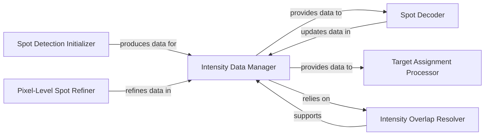

## Details

The `Spot Analysis Engine` subsystem is dedicated to identifying, quantifying, and decoding biological spots within processed image data. It encompasses the entire pipeline from initial spot detection and intensity measurement to genetic decoding and target assignment.

### Spot Detection Initializer
Initiates the spot analysis by detecting preliminary spot candidates from raw image data. This component represents the "Extract" phase for initial spot identification, preparing the raw image for further processing.

**Related Classes/Methods**:

- <a href="https://github.com/spacetx/starfish/blob/master/starfish/core/spots/FindSpots/" target="_blank" rel="noopener noreferrer">`starfish.core.spots.FindSpots`</a>

### Pixel-Level Spot Refiner
Refines spot detection at a pixel level, grouping adjacent features and contributing to the detailed attributes of spots. It's part of the "Transform" phase, enhancing raw detection data for greater accuracy.

**Related Classes/Methods**:

- <a href="https://github.com/spacetx/starfish/blob/master/starfish/core/spots/DetectPixels/" target="_blank" rel="noopener noreferrer">`starfish.core.spots.DetectPixels`</a>

### Intensity Data Manager
This is the central data structure of the subsystem. It manages and stores all quantitative intensity data for detected spots across various imaging rounds and channels. It serves as the primary data hub, embodying the "Data-Centric Architecture" principle.

**Related Classes/Methods**:

- <a href="https://github.com/spacetx/starfish/blob/master/starfish/core/intensity_table/intensity_table.py" target="_blank" rel="noopener noreferrer">`starfish.core.intensity_table.intensity_table`</a>

### Intensity Overlap Resolver
A supporting component for the `Intensity Data Manager`, responsible for resolving spatial overlaps between intensity regions, ensuring accurate quantification and preventing data redundancy or misinterpretation.

**Related Classes/Methods**:

- <a href="https://github.com/spacetx/starfish/blob/master/starfish/core/intensity_table/overlap.py" target="_blank" rel="noopener noreferrer">`starfish.core.intensity_table.overlap`</a>

### Spot Decoder
This component is responsible for the genetic decoding process, assigning genetic identities to spots based on their intensity profiles. This is a crucial "Transform" stage, converting raw intensity data into meaningful biological information.

**Related Classes/Methods**:

- <a href="https://github.com/spacetx/starfish/blob/master/starfish/core/spots/DecodeSpots/" target="_blank" rel="noopener noreferrer">`starfish.core.spots.DecodeSpots`</a>

### Target Assignment Processor
This component assigns detected and decoded spots to specific biological targets (e.g., cells, nuclei), providing biological context and completing the analysis by associating spots with higher-level entities. This can be seen as the "Load" or contextualization phase.

**Related Classes/Methods**:

- <a href="https://github.com/spacetx/starfish/blob/master/starfish/core/spots/AssignTargets/label.py" target="_blank" rel="noopener noreferrer">`starfish.core.spots.AssignTargets.label`</a>

### [FAQ](https://github.com/CodeBoarding/GeneratedOnBoardings/tree/main?tab=readme-ov-file#faq)