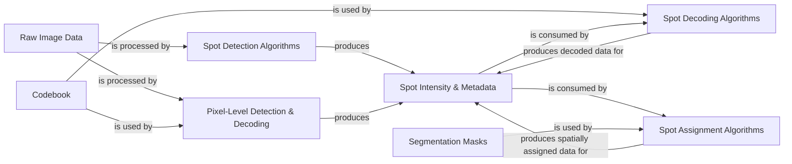

## Details

This subsystem is responsible for the core computational steps of identifying, quantifying, and decoding individual RNA molecules (spots) within microscopy images, and subsequently assigning them to specific biological targets or regions. It transforms raw image data into quantitative expression profiles.

### Raw Image Data

The primary input data structure representing the multi-dimensional raw image data acquired from the experiment. It serves as the foundational source of pixel intensities upon which all spot analysis operations are performed.

**Related Classes/Methods**:

- <a href="https://github.com/spacetx/starfish/starfish/core/imagestack/imagestack.py#L0-L0" target="_blank" rel="noopener noreferrer">`starfish.core.imagestack.imagestack` (0:0)</a>

### Codebook

A critical reference data structure containing the expected intensity profiles (barcodes) for known biological targets (e.g., genes). It is used by decoding algorithms to assign identities to detected spots based on their measured intensity patterns.

**Related Classes/Methods**:

- <a href="https://github.com/spacetx/starfish/starfish/core/codebook/codebook.py#L0-L0" target="_blank" rel="noopener noreferrer">`starfish.core.codebook.codebook` (0:0)</a>

### Spot Detection Algorithms

A collection of algorithms (e.g., BlobDetector, LocalMaxPeakFinder, TrackpyLocalMaxPeakFinder) responsible for identifying and localizing potential spots within the ImageStack. They output initial spot candidates and their raw intensity properties.

**Related Classes/Methods**:

- `starfish.core.spots.FindSpots` (0:0)

### Spot Intensity & Metadata

These are central data structures that store the quantitative and descriptive information about detected and decoded spots. IntensityTable holds raw intensity profiles, DecodedIntensityTable extends this with assigned biological identities, SpotAttributes stores spatial coordinates and other properties, and DecodedSpots aggregates the final decoded spot information.

**Related Classes/Methods**:

- <a href="https://github.com/spacetx/starfish/starfish/core/intensity_table/intensity_table.py#L0-L0" target="_blank" rel="noopener noreferrer">`starfish.core.intensity_table.intensity_table` (0:0)</a>

- <a href="https://github.com/spacetx/starfish/starfish/core/intensity_table/decoded_intensity_table.py#L0-L0" target="_blank" rel="noopener noreferrer">`starfish.core.intensity_table.decoded_intensity_table` (0:0)</a>

- <a href="https://github.com/spacetx/starfish/starfish/core/types/_spot_attributes.py#L0-L0" target="_blank" rel="noopener noreferrer">`starfish.core.types._spot_attributes` (0:0)</a>

- <a href="https://github.com/spacetx/starfish/starfish/core/types/_decoded_spots.py#L0-L0" target="_blank" rel="noopener noreferrer">`starfish.core.types._decoded_spots` (0:0)</a>

### Spot Decoding Algorithms

A suite of algorithms (e.g., CheckAll, MetricDistance, PerRoundMaxChannel, SimpleLookupDecoder) that take the raw intensity profiles from IntensityTable and, using the Codebook, assign a biological identity (e.g., gene name) to each spot.

**Related Classes/Methods**:

- `starfish.core.spots.DecodeSpots` (0:0)

### Pixel-Level Detection & Decoding

Algorithms (e.g., PixelSpotDecoder) that perform spot detection and decoding directly at the pixel level. This can be an alternative or complementary approach to FindSpots and DecodeSpots, especially useful for dense or overlapping spots.

**Related Classes/Methods**:

- `starfish.core.spots.DetectPixels` (0:0)

### Segmentation Masks

A data structure representing segmented biological regions (e.g., cells, nuclei) as binary masks. These masks are used to associate detected and decoded spots with specific anatomical or cellular contexts.

**Related Classes/Methods**:

- <a href="https://github.com/spacetx/starfish/starfish/core/morphology/binary_mask/binary_mask.py#L0-L0" target="_blank" rel="noopener noreferrer">`starfish.core.morphology.binary_mask.binary_mask` (0:0)</a>

- <a href="https://github.com/spacetx/starfish/starfish/core/segmentation_mask/segmentation_mask.py#L0-L0" target="_blank" rel="noopener noreferrer">`starfish.core.segmentation_mask.segmentation_mask` (0:0)</a>

### Spot Assignment Algorithms

Algorithms (e.g., Label) that assign decoded spots to specific biological targets or regions, often by overlaying them with segmented regions represented by Segmentation Masks.

**Related Classes/Methods**:

- `starfish.core.spots.AssignTargets` (0:0)

### [FAQ](https://github.com/CodeBoarding/GeneratedOnBoardings/tree/main?tab=readme-ov-file#faq)