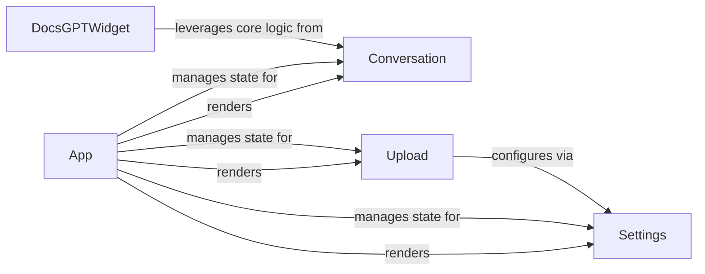

## Details

The DocsGPT application is structured around a core `App` component that orchestrates the user interface and manages the overall application flow. It renders key functional components such as `Conversation`, `Upload`, and `Settings`. The `Conversation` component provides the interactive chat interface, allowing users to query the RAG system and view responses. The `Upload` component handles the backend processing of document ingestion, integrating new knowledge into the system. The `Settings` component centralizes the application's configuration, providing critical parameters for LLM providers, API keys, and vector store settings, which are utilized by other components like `Upload`. Additionally, the `DocsGPTWidget` offers an embeddable version of the chat functionality, leveraging the core logic of the `Conversation` component for external website integration. This architecture ensures a modular and maintainable system, with clear responsibilities and interaction pathways between components.

### App
Acts as the main application orchestrator and entry point. It manages global UI state (e.g., authentication status, theming), handles client-side routing, and defines the overall layout and navigation structure of the DocsGPT application. It ensures a cohesive user experience across different functionalities.

**Related Classes/Methods**:

- <a href="https://github.com/arc53/DocsGPT/blob/main/extensions/chatwoot/app.py" target="_blank" rel="noopener noreferrer">`App`</a>

### Conversation
Manages the core interactive chat interface. This component is central to the RAG system's user interaction, displaying conversation history, allowing users to input queries, and presenting the generated responses from the backend. It also facilitates user feedback on responses, which is crucial for iterative improvement of the RAG model.

**Related Classes/Methods**:

- <a href="https://github.com/arc53/DocsGPT/blob/main/extensions/chatwoot/app.py" target="_blank" rel="noopener noreferrer">`Conversation`</a>

### Upload
Handles the backend logic for ingesting new documents into the RAG system's knowledge base. It processes file uploads, manages different ingestor types, and interacts with the parsing and vector store components to store the document content.

**Related Classes/Methods**:

- <a href="https://github.com/arc53/DocsGPT/blob/main/application/api/user/routes.py#L164-L184" target="_blank" rel="noopener noreferrer">`Upload`:164-184</a>

### Settings
Manages application-wide configurations and environment variables. This component is responsible for loading and providing access to various settings, including LLM provider details, API keys, vector store configurations, and other operational parameters that influence the RAG system's behavior.

**Related Classes/Methods**:

- <a href="https://github.com/arc53/DocsGPT/blob/main/application/vectorstore/elasticsearch.py" target="_blank" rel="noopener noreferrer">`Settings`</a>

### DocsGPTWidget
Serves as an embeddable DocsGPT chat widget, designed for seamless integration into external websites. It encapsulates core chat functionality, providing a portable and lightweight experience of the DocsGPT RAG system.

**Related Classes/Methods**:

- <a href="https://github.com/arc53/DocsGPT/blob/main/extensions/react-widget/src/components/DocsGPTWidget.tsx#L554-L586" target="_blank" rel="noopener noreferrer">`DocsGPTWidget`:554-586</a>

### [FAQ](https://github.com/CodeBoarding/GeneratedOnBoardings/tree/main?tab=readme-ov-file#faq)