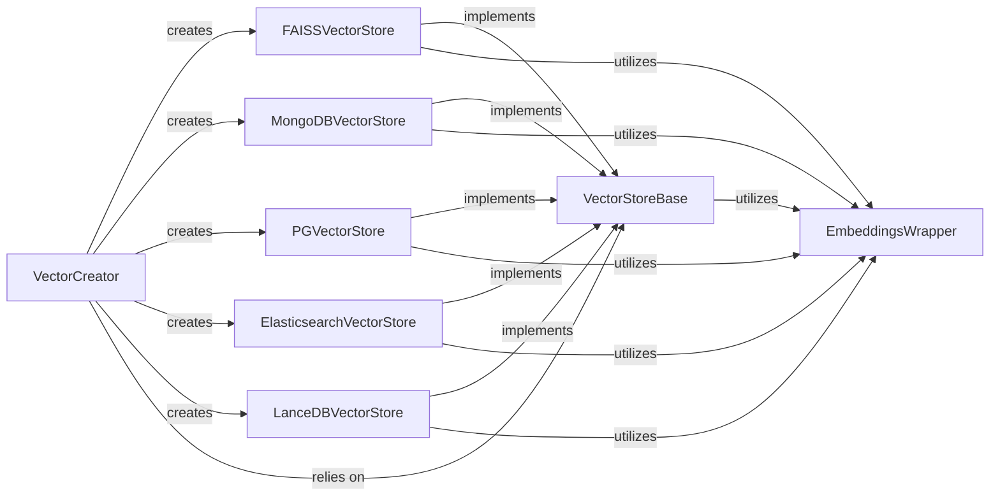

## Details

The feedback correctly identified an issue with the VectorStoreCreator component's source file reference. The original analysis had FileRef: None, which has been corrected to FileRef: /home/ivan/StartUp/CodeBoarding/repos/DocsGPT/application/vectorstore/vector_creator.py based on the readFile tool's output. It appears there was a typo in the original QName and FileRef for VectorStoreCreator, as the correct file is vector_creator.py not vectorstore_creator.py. The VectorCreator (formerly VectorStoreCreator) acts as a factory, centralizing the creation of various vector store instances. This design pattern allows the application to dynamically switch between different vector store backends (e.g., FAISS, MongoDB, PGVector) at runtime, promoting modularity and decoupling.

### VectorStoreBase
Defines the abstract interface for all vector store operations, including adding documents, performing similarity searches, and managing embedding model configurations. It establishes the contract for how any vector store backend should behave, ensuring extensibility and interchangeability.

**Related Classes/Methods**:

- <a href="https://github.com/arc53/DocsGPT/blob/main/application/vectorstore/base.py" target="_blank" rel="noopener noreferrer">`application.vectorstore.base.VectorStoreBase`</a>

### VectorCreator
Centralizes the logic for creating instances of specific vector store implementations (e.g., FAISS, MongoDB, PGVector) based on system configuration. This factory pattern enables dynamic backend switching at runtime and promotes modularity by decoupling the client from concrete vector store classes.

**Related Classes/Methods**:

- <a href="https://github.com/arc53/DocsGPT/blob/main/application/vectorstore/vector_creator.py#L9-L24" target="_blank" rel="noopener noreferrer">`application.vectorstore.vector_creator.VectorCreator`:9-24</a>

### EmbeddingsWrapper
Encapsulates the logic for interacting with various embedding models. Its primary function is to convert textual data into high-dimensional numerical vectors (embeddings) that can be stored in the vector database and used for similarity search. This component abstracts away the specifics of different embedding providers.

**Related Classes/Methods**:

- <a href="https://github.com/arc53/DocsGPT/blob/main/application/vectorstore/base.py#L7-L24" target="_blank" rel="noopener noreferrer">`application.vectorstore.base.EmbeddingsWrapper`:7-24</a>

### FAISSVectorStore
Provides a concrete implementation of the VectorStoreBase interface, leveraging the FAISS library for efficient similarity search on locally stored vector indexes. It's suitable for smaller-scale deployments or local development.

**Related Classes/Methods**:

- <a href="https://github.com/arc53/DocsGPT/blob/main/application/vectorstore/faiss.py" target="_blank" rel="noopener noreferrer">`application.vectorstore.faiss.FAISSVectorStore`</a>

### MongoDBVectorStore
Provides a concrete implementation of the VectorStoreBase interface, utilizing MongoDB as the backend for storing documents and their associated embeddings. This allows for scalable, document-oriented storage with vector search capabilities.

**Related Classes/Methods**:

- <a href="https://github.com/arc53/DocsGPT/blob/main/application/vectorstore/mongodb.py#L7-L177" target="_blank" rel="noopener noreferrer">`application.vectorstore.mongodb.MongoDBVectorStore`:7-177</a>

### PGVectorStore
Provides a concrete implementation of the VectorStoreBase interface, integrating with PostgreSQL databases via the PGVector extension. This enables storing and querying embeddings directly within a robust relational database system.

**Related Classes/Methods**:

- <a href="https://github.com/arc53/DocsGPT/blob/main/application/vectorstore/pgvector.py#L8-L303" target="_blank" rel="noopener noreferrer">`application.vectorstore.pgvector.PGVectorStore`:8-303</a>

### ElasticsearchVectorStore
Provides a concrete implementation of the VectorStoreBase interface, leveraging Elasticsearch for scalable, distributed storage and search of documents and their embeddings. It's well-suited for large datasets and complex query capabilities.

**Related Classes/Methods**:

- <a href="https://github.com/arc53/DocsGPT/blob/main/application/vectorstore/elasticsearch.py" target="_blank" rel="noopener noreferrer">`application.vectorstore.elasticsearch.ElasticsearchVectorStore`</a>

### LanceDBVectorStore
Provides a concrete implementation of the VectorStoreBase interface, utilizing LanceDB for efficient, local, and serverless vector storage. It's designed for high-performance similarity search on embedded data.

**Related Classes/Methods**:

- <a href="https://github.com/arc53/DocsGPT/blob/main/application/vectorstore/lancedb.py#L6-L119" target="_blank" rel="noopener noreferrer">`application.vectorstore.lancedb.LanceDBVectorStore`:6-119</a>

### [FAQ](https://github.com/CodeBoarding/GeneratedOnBoardings/tree/main?tab=readme-ov-file#faq)