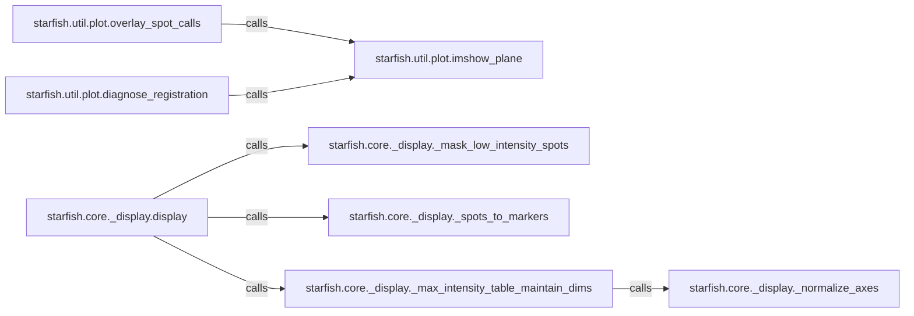

## Details

This subsystem provides a comprehensive set of tools for generating visual representations of intermediate and final analysis results, crucial for quality control, debugging, and interpretation within the `starfish` project. It adheres to the `Data Processing Library / Scientific Toolkit` patterns by offering modular and specialized visualization capabilities.

### starfish.core._display.display
The primary orchestrator for high-level data visualization. It acts as a facade, coordinating various data preparation steps before rendering complex visual outputs. This component is fundamental as it provides the main entry point for users to visualize processed data.

**Related Classes/Methods**:

- <a href="https://github.com/spacetx/starfish/blob/master/starfish/core/_display.py#L70-L83" target="_blank" rel="noopener noreferrer">`starfish.core._display._mask_low_intensity_spots`:70-83</a>
- <a href="https://github.com/spacetx/starfish/blob/master/starfish/core/_display.py#L86-L118" target="_blank" rel="noopener noreferrer">`starfish.core._display._spots_to_markers`:86-118</a>
- <a href="https://github.com/spacetx/starfish/blob/master/starfish/core/_display.py#L39-L67" target="_blank" rel="noopener noreferrer">`starfish.core._display._max_intensity_table_maintain_dims`:39-67</a>

### starfish.util.plot.imshow_plane
A foundational utility for displaying single image planes. It serves as a low-level building block for more complex plotting functions, providing the basic image rendering capability.

**Related Classes/Methods**:

- <a href="https://github.com/spacetx/starfish/blob/master/starfish/util/plot.py#L102-L165" target="_blank" rel="noopener noreferrer">`starfish.util.plot.overlay_spot_calls`:102-165</a>
- <a href="https://github.com/spacetx/starfish/blob/master/starfish/util/plot.py#L175-L223" target="_blank" rel="noopener noreferrer">`starfish.util.plot.diagnose_registration`:175-223</a>

### starfish.util.plot.overlay_spot_calls
A specialized function for visualizing detected spots by overlaying them onto an image. This component is crucial for interpreting spot detection results.

**Related Classes/Methods**:

- <a href="https://github.com/spacetx/starfish/blob/master/starfish/util/plot.py#L15-L61" target="_blank" rel="noopener noreferrer">`starfish.util.plot.imshow_plane`:15-61</a>

### starfish.util.plot.diagnose_registration
Provides visual diagnostics to assess the quality of image registration. This component is vital for quality control in image processing pipelines.

**Related Classes/Methods**:

- <a href="https://github.com/spacetx/starfish/blob/master/starfish/util/plot.py#L15-L61" target="_blank" rel="noopener noreferrer">`starfish.util.plot.imshow_plane`:15-61</a>

### starfish.core._display._mask_low_intensity_spots
A utility function for pre-processing spot data by filtering out entries below a certain intensity threshold, ensuring cleaner visualizations.

**Related Classes/Methods**:

- <a href="https://github.com/spacetx/starfish/blob/master/starfish/core/_display.py#L121-L296" target="_blank" rel="noopener noreferrer">`starfish.core._display.display`:121-296</a>

### starfish.core._display._spots_to_markers
Responsible for transforming raw spot data into a format suitable for graphical markers, often used in scatter plots or overlays. This is a key data preparation step for visualization.

**Related Classes/Methods**:

- <a href="https://github.com/spacetx/starfish/blob/master/starfish/core/_display.py#L121-L296" target="_blank" rel="noopener noreferrer">`starfish.core._display.display`:121-296</a>

### starfish.core._display._max_intensity_table_maintain_dims
Handles the preparation of intensity data tables for display, ensuring that dimensional consistency is maintained across different data views. This is critical for accurate and consistent data representation.

**Related Classes/Methods**:

- <a href="https://github.com/spacetx/starfish/blob/master/starfish/core/_display.py#L121-L296" target="_blank" rel="noopener noreferrer">`starfish.core._display.display`:121-296</a>
- <a href="https://github.com/spacetx/starfish/blob/master/starfish/core/_display.py#L25-L36" target="_blank" rel="noopener noreferrer">`starfish.core._display._normalize_axes`:25-36</a>

### starfish.core._display._normalize_axes
A utility function that normalizes image axes to ensure consistent display scaling, regardless of the original data dimensions. This ensures visual comparability across different datasets.

**Related Classes/Methods**:

- <a href="https://github.com/spacetx/starfish/blob/master/starfish/core/_display.py#L39-L67" target="_blank" rel="noopener noreferrer">`starfish.core._display._max_intensity_table_maintain_dims`:39-67</a>

### [FAQ](https://github.com/CodeBoarding/GeneratedOnBoardings/tree/main?tab=readme-ov-file#faq)