```mermaid
graph LR
    Data_Input_Validation_Layer["Data Input & Validation Layer"]
    Core_Data_Structures["Core Data Structures"]
    Image_Processing_Engine["Image Processing Engine"]
    Spot_Analysis_Engine["Spot Analysis Engine"]
    Output_Export_Layer["Output & Export Layer"]
    Visualization_Utilities["Visualization Utilities"]
    Data_Input_Validation_Layer -- "provides SpaceTx Experiment Data to" --> Core_Data_Structures
    Core_Data_Structures -- "supplies Image Stacks to" --> Image_Processing_Engine
    Core_Data_Structures -- "provides Codebook to" --> Spot_Analysis_Engine
    Image_Processing_Engine -- "outputs Processed Image Stacks to" --> Core_Data_Structures
    Image_Processing_Engine -- "feeds Processed Images to" --> Spot_Analysis_Engine
    Image_Processing_Engine -- "generates Binary Masks for" --> Output_Export_Layer
    Spot_Analysis_Engine -- "outputs Decoded Spot Data & Intensity Tables to" --> Output_Export_Layer
    Core_Data_Structures -- "provides Data for Visualization to" --> Visualization_Utilities
    Spot_Analysis_Engine -- "provides Decoded Spots for Plotting to" --> Visualization_Utilities
    click Data_Input_Validation_Layer href "https://github.com/spacetx/starfish/blob/main/starfish/Data_Input_Validation_Layer.md" "Details"
    click Core_Data_Structures href "https://github.com/spacetx/starfish/blob/main/starfish/Core_Data_Structures.md" "Details"
    click Image_Processing_Engine href "https://github.com/spacetx/starfish/blob/main/starfish/Image_Processing_Engine.md" "Details"
    click Spot_Analysis_Engine href "https://github.com/spacetx/starfish/blob/main/starfish/Spot_Analysis_Engine.md" "Details"
    click Output_Export_Layer href "https://github.com/spacetx/starfish/blob/main/starfish/Output_Export_Layer.md" "Details"
    click Visualization_Utilities href "https://github.com/spacetx/starfish/blob/main/starfish/Visualization_Utilities.md" "Details"
```

## Details

The Starfish project is structured around a robust data processing pipeline for spatial transcriptomics. It begins with a `Data Input & Validation Layer` responsible for ingesting and validating raw experimental data against the SpaceTx format. This validated data is then transformed into `Core Data Structures`, primarily multi-dimensional image stacks and codebooks, which serve as the central in-memory representation. The `Image Processing Engine` operates on these image stacks, applying various algorithms for enhancement and transformation. Concurrently, the `Spot Analysis Engine` identifies, quantifies, and decodes biological spots using both the processed images and the codebook. Finally, the `Output & Export Layer` handles the serialization and persistence of all processed data, while `Visualization Utilities` provide crucial tools for inspecting intermediate and final results. This modular design ensures clear separation of concerns and facilitates a streamlined data flow from raw input to interpretable biological insights.

### Data Input & Validation Layer [[Expand]](./Data_Input_Validation_Layer.md)
Responsible for loading raw experimental data and metadata, ensuring it conforms to the SpaceTx format. It acts as the initial entry point for all data processing pipelines.

**Related Classes/Methods**:

- <a href="https://github.com/spacetx/starfish/blob/master/starfish/core/experiment/experiment.py" target="_blank" rel="noopener noreferrer">`starfish/core/experiment/experiment.py`</a>
- <a href="https://github.com/spacetx/starfish/blob/master/starfish/core/experiment/builder/builder.py" target="_blank" rel="noopener noreferrer">`starfish/core/experiment/builder/builder.py`</a>
- <a href="https://github.com/spacetx/starfish/blob/master/starfish/core/spacetx_format/validate_sptx.py" target="_blank" rel="noopener noreferrer">`starfish/core/spacetx_format/validate_sptx.py`</a>

### Core Data Structures [[Expand]](./Core_Data_Structures.md)
Defines and manages the fundamental in-memory data structures used throughout the Starfish pipeline, primarily multi-dimensional image stacks and codebooks.

**Related Classes/Methods**:

- <a href="https://github.com/spacetx/starfish/blob/master/starfish/core/imagestack/imagestack.py" target="_blank" rel="noopener noreferrer">`starfish/core/imagestack/imagestack.py`</a>
- <a href="https://github.com/spacetx/starfish/blob/master/starfish/core/imagestack/parser/" target="_blank" rel="noopener noreferrer">`starfish/core/imagestack/parser/`</a>
- <a href="https://github.com/spacetx/starfish/blob/master/starfish/core/codebook/codebook.py" target="_blank" rel="noopener noreferrer">`starfish/core/codebook/codebook.py`</a>

### Image Processing Engine [[Expand]](./Image_Processing_Engine.md)
Applies various algorithms to transform and enhance image data, including filtering, registration, and basic segmentation operations.

**Related Classes/Methods**:

- <a href="https://github.com/spacetx/starfish/blob/master/starfish/core/image/Filter/" target="_blank" rel="noopener noreferrer">`starfish/core/image/Filter/`</a>
- <a href="https://github.com/spacetx/starfish/blob/master/starfish/core/image/_registration/" target="_blank" rel="noopener noreferrer">`starfish/core/image/_registration/`</a>
- <a href="https://github.com/spacetx/starfish/blob/master/starfish/core/image/Segment/watershed.py" target="_blank" rel="noopener noreferrer">`starfish/core/image/Segment/watershed.py`</a>
- <a href="https://github.com/spacetx/starfish/blob/master/starfish/core/morphology/Binarize/threshold.py" target="_blank" rel="noopener noreferrer">`starfish/core/morphology/Binarize/threshold.py`</a>
- <a href="https://github.com/spacetx/starfish/blob/master/starfish/core/morphology/label_image/label_image.py" target="_blank" rel="noopener noreferrer">`starfish/core/morphology/label_image/label_image.py`</a>

### Spot Analysis Engine [[Expand]](./Spot_Analysis_Engine.md)
Dedicated to identifying, quantifying, and decoding biological spots within processed image data. It integrates spot detection, intensity measurement, and genetic decoding.

**Related Classes/Methods**:

- <a href="https://github.com/spacetx/starfish/blob/master/starfish/core/spots/FindSpots/" target="_blank" rel="noopener noreferrer">`starfish/core/spots/FindSpots/`</a>
- <a href="https://github.com/spacetx/starfish/blob/master/starfish/core/intensity_table/intensity_table.py" target="_blank" rel="noopener noreferrer">`starfish/core/intensity_table/intensity_table.py`</a>
- <a href="https://github.com/spacetx/starfish/blob/master/starfish/core/spots/DecodeSpots/" target="_blank" rel="noopener noreferrer">`starfish/core/spots/DecodeSpots/`</a>
- <a href="https://github.com/spacetx/starfish/blob/master/starfish/core/spots/AssignTargets/label.py" target="_blank" rel="noopener noreferrer">`starfish/core/spots/AssignTargets/label.py`</a>
- <a href="https://github.com/spacetx/starfish/blob/master/starfish/core/spots/DetectPixels/" target="_blank" rel="noopener noreferrer">`starfish/core/spots/DetectPixels/`</a>

### Output & Export Layer [[Expand]](./Output_Export_Layer.md)
Handles the serialization and export of all processed data, including transformed image stacks, decoded spot information, and generated masks, into various persistent formats.

**Related Classes/Methods**:

- <a href="https://github.com/spacetx/starfish/blob/master/starfish/core/imagestack/imagestack.py" target="_blank" rel="noopener noreferrer">`starfish/core/imagestack/imagestack.py`</a>
- <a href="https://github.com/spacetx/starfish/blob/master/starfish/core/types/_decoded_spots.py" target="_blank" rel="noopener noreferrer">`starfish/core/types/_decoded_spots.py`</a>
- <a href="https://github.com/spacetx/starfish/blob/master/starfish/core/morphology/binary_mask/_io.py" target="_blank" rel="noopener noreferrer">`starfish/core/morphology/binary_mask/_io.py`</a>

### Visualization Utilities [[Expand]](./Visualization_Utilities.md)
Provides tools and functions for generating visual representations of intermediate and final analysis results, aiding in quality control, debugging, and interpretation.

**Related Classes/Methods**:

- <a href="https://github.com/spacetx/starfish/blob/master/starfish/core/_display.py" target="_blank" rel="noopener noreferrer">`starfish/core/_display/`</a>

### [FAQ](https://github.com/CodeBoarding/GeneratedOnBoardings/tree/main?tab=readme-ov-file#faq)