```mermaid

graph LR

    Experiment_Data_Core["Experiment Data Core"]

    Data_Ingestion_Validation["Data Ingestion & Validation"]

    Image_Processing_Management["Image Processing & Management"]

    Spot_Intensity_Analysis["Spot & Intensity Analysis"]

    Mask_Label_Management["Mask & Label Management"]

    Expression_Matrix_Generation["Expression Matrix Generation"]

    Core_Infrastructure["Core Infrastructure"]

    Data_Ingestion_Validation -- "provides data to" --> Experiment_Data_Core

    Experiment_Data_Core -- "provides experimental data to" --> Image_Processing_Management

    Data_Ingestion_Validation -- "loads and validates codebooks for" --> Spot_Intensity_Analysis

    Image_Processing_Management -- "provides image data to" --> Spot_Intensity_Analysis

    Image_Processing_Management -- "outputs masks to" --> Mask_Label_Management

    Mask_Label_Management -- "provides masks to" --> Spot_Intensity_Analysis

    Spot_Intensity_Analysis -- "provides data to" --> Expression_Matrix_Generation

    click Experiment_Data_Core href "https://github.com/spacetx/starfish/blob/master/.codeboarding//Experiment_Data_Core.md" "Details"

    click Image_Processing_Management href "https://github.com/spacetx/starfish/blob/master/.codeboarding//Image_Processing_Management.md" "Details"

    click Spot_Intensity_Analysis href "https://github.com/spacetx/starfish/blob/master/.codeboarding//Spot_Intensity_Analysis.md" "Details"

    click Mask_Label_Management href "https://github.com/spacetx/starfish/blob/master/.codeboarding//Mask_Label_Management.md" "Details"

    click Expression_Matrix_Generation href "https://github.com/spacetx/starfish/blob/master/.codeboarding//Expression_Matrix_Generation.md" "Details"

    click Core_Infrastructure href "https://github.com/spacetx/starfish/blob/master/.codeboarding//Core_Infrastructure.md" "Details"

```

## Details

High-level architecture overview of the `starfish` project, detailing its main components, their responsibilities, associated source code, and inter-component data flow and relationships.

### Experiment Data Core [[Expand]](./Experiment_Data_Core.md)

The central data structure representing a spatial transcriptomics experiment. It encapsulates fields of view, image stacks, and associated metadata, serving as the primary container for all experimental data.

**Related Classes/Methods**:

- <a href="https://github.com/spacetx/starfish/starfish/core/experiment/experiment.py#L212-L453" target="_blank" rel="noopener noreferrer">`starfish.core.experiment.experiment.Experiment` (212:453)</a>

- <a href="https://github.com/spacetx/starfish/starfish/core/experiment/experiment.py#L32-L193" target="_blank" rel="noopener noreferrer">`starfish.core.experiment.experiment.FieldOfView` (32:193)</a>

### Data Ingestion & Validation

Responsible for loading various spatial transcriptomics datasets into the Experiment Data Core and validating their structure and content against SpaceTx schemas. It also handles the loading and validation of codebooks.

**Related Classes/Methods**:

- <a href="https://github.com/spacetx/starfish/starfish/data.py#L3-L26" target="_blank" rel="noopener noreferrer">`starfish.data.MERFISH` (3:26)</a>

- <a href="https://github.com/spacetx/starfish/starfish/data.py#L96-L119" target="_blank" rel="noopener noreferrer">`starfish.data.ISS` (96:119)</a>

- <a href="https://github.com/spacetx/starfish/starfish/core/spacetx_format/util.py#L26-L202" target="_blank" rel="noopener noreferrer">`starfish.core.spacetx_format.util.SpaceTxValidator` (26:202)</a>

- <a href="https://github.com/spacetx/starfish/starfish/core/spacetx_format/validate_sptx.py#L17-L75" target="_blank" rel="noopener noreferrer">`starfish.core.spacetx_format.validate_sptx.validate` (17:75)</a>

- <a href="https://github.com/spacetx/starfish/starfish/core/codebook/codebook.py#L28-L804" target="_blank" rel="noopener noreferrer">`starfish.core.codebook.codebook.Codebook` (28:804)</a>

### Image Processing & Management [[Expand]](./Image_Processing_Management.md)

Manages multi-dimensional image data, offering functionalities for loading, slicing, and basic transformations. It also applies various image processing techniques such as filtering, segmentation, and registration to image stacks.

**Related Classes/Methods**:

- <a href="https://github.com/spacetx/starfish/starfish/core/imagestack/imagestack.py#L67-L1273" target="_blank" rel="noopener noreferrer">`starfish.core.imagestack.imagestack.ImageStack` (67:1273)</a>

- `starfish.core.imagestack.parser` (0:0)

- `starfish.core.image.Filter` (0:0)

- `starfish.core.image.Segment` (0:0)

- `starfish.core.image._registration` (0:0)

### Spot & Intensity Analysis [[Expand]](./Spot_Intensity_Analysis.md)

Contains algorithms for identifying potential spots (e.g., RNA molecules), decoding their intensity profiles using a codebook, detecting spots at the pixel level, and assigning decoded spots to specific biological targets or regions. It also manages the measured intensity values for detected spots.

**Related Classes/Methods**:

- `starfish.core.spots.FindSpots` (0:0)

- `starfish.core.spots.DecodeSpots` (0:0)

- `starfish.core.spots.DetectPixels` (0:0)

- `starfish.core.spots.AssignTargets` (0:0)

- <a href="https://github.com/spacetx/starfish/starfish/core/intensity_table/intensity_table.py#L26-L455" target="_blank" rel="noopener noreferrer">`starfish.core.intensity_table.intensity_table.IntensityTable` (26:455)</a>

- <a href="https://github.com/spacetx/starfish/starfish/core/intensity_table/decoded_intensity_table.py#L15-L190" target="_blank" rel="noopener noreferrer">`starfish.core.intensity_table.decoded_intensity_table.DecodedIntensityTable` (15:190)</a>

### Mask & Label Management [[Expand]](./Mask_Label_Management.md)

Manages and processes collections of binary masks, labeled images, and segmentation masks, which represent segmented regions or objects. It includes functionalities for binarization, filtering, merging, and general morphological operations.

**Related Classes/Methods**:

- <a href="https://github.com/spacetx/starfish/starfish/core/morphology/binary_mask/binary_mask.py#L48-L760" target="_blank" rel="noopener noreferrer">`starfish.core.morphology.binary_mask.binary_mask.BinaryMaskCollection` (48:760)</a>

- <a href="https://github.com/spacetx/starfish/starfish/core/morphology/label_image/label_image.py#L28-L167" target="_blank" rel="noopener noreferrer">`starfish.core.morphology.label_image.label_image.LabelImage` (28:167)</a>

- <a href="https://github.com/spacetx/starfish/starfish/core/segmentation_mask/segmentation_mask.py#L15-L48" target="_blank" rel="noopener noreferrer">`starfish.core.segmentation_mask.segmentation_mask.SegmentationMaskCollection` (15:48)</a>

- `starfish.core.morphology.Binarize` (0:0)

- `starfish.core.morphology.Filter` (0:0)

- `starfish.core.morphology.Merge` (0:0)

- `starfish.core.morphology.Segment` (0:0)

### Expression Matrix Generation [[Expand]](./Expression_Matrix_Generation.md)

Creates and manages expression matrices, which quantify gene expression levels within defined regions or cells, serving as the final output for downstream biological analysis.

**Related Classes/Methods**:

- <a href="https://github.com/spacetx/starfish/starfish/core/expression_matrix/expression_matrix.py#L6-L93" target="_blank" rel="noopener noreferrer">`starfish.core.expression_matrix.expression_matrix.ExpressionMatrix` (6:93)</a>

### Core Infrastructure [[Expand]](./Core_Infrastructure.md)

Provides foundational utility functions for configuration management, logging, versioning, and defines fundamental data structures and constants used throughout the starfish library, ensuring consistent data representation.

**Related Classes/Methods**:

- `starfish.core.config.StarfishConfig` (0:0)

- <a href="https://github.com/spacetx/starfish/starfish/core/starfish.py#L46-L50" target="_blank" rel="noopener noreferrer">`starfish.core.util` (46:50)</a>

- <a href="https://github.com/spacetx/starfish/starfish/core/_version.py#L0-L0" target="_blank" rel="noopener noreferrer">`starfish.core._version` (0:0)</a>

- <a href="https://github.com/spacetx/starfish/starfish/core/starfish.py#L0-L0" target="_blank" rel="noopener noreferrer">`starfish.core.types` (0:0)</a>

### [FAQ](https://github.com/CodeBoarding/GeneratedOnBoardings/tree/main?tab=readme-ov-file#faq)