```mermaid
graph LR
    User_Interface_UI_["User Interface (UI)"]
    Backend_Core["Backend Core"]
    Data_Ingestion_Storage["Data Ingestion & Storage"]
    Vector_Database_Knowledge_Base["Vector Database / Knowledge Base"]
    Retrieval_Module["Retrieval Module"]
    LLM_Integration_Layer["LLM Integration Layer"]
    Agentic_Reasoning_External_Tools["Agentic Reasoning & External Tools"]
    Asynchronous_Task_Worker["Asynchronous Task Worker"]
    User_Interface_UI_ -- "sends User Requests to" --> Backend_Core
    Backend_Core -- "sends Generated Responses to" --> User_Interface_UI_
    Backend_Core -- "enqueues Background Tasks to" --> Asynchronous_Task_Worker
    Backend_Core -- "sends User Queries to" --> Retrieval_Module
    Backend_Core -- "forwards User Queries & Context to" --> LLM_Integration_Layer
    Asynchronous_Task_Worker -- "triggers Document Processing & Storage in" --> Data_Ingestion_Storage
    Data_Ingestion_Storage -- "stores Embedded Chunks in" --> Vector_Database_Knowledge_Base
    Retrieval_Module -- "queries for Relevant Documents from" --> Vector_Database_Knowledge_Base
    LLM_Integration_Layer -- "requests Context from" --> Retrieval_Module
    LLM_Integration_Layer -- "delegates Tool Execution to" --> Agentic_Reasoning_External_Tools
    Agentic_Reasoning_External_Tools -- "returns Tool Results to" --> LLM_Integration_Layer
    LLM_Integration_Layer -- "sends Generated Answers to" --> Backend_Core
    click User_Interface_UI_ href "https://github.com/CodeBoarding/GeneratedOnBoardings/blob/main/DocsGPT/User_Interface_UI_.md" "Details"
    click Backend_Core href "https://github.com/CodeBoarding/GeneratedOnBoardings/blob/main/DocsGPT/Backend_Core.md" "Details"
    click Data_Ingestion_Storage href "https://github.com/CodeBoarding/GeneratedOnBoardings/blob/main/DocsGPT/Data_Ingestion_Storage.md" "Details"
    click Vector_Database_Knowledge_Base href "https://github.com/CodeBoarding/GeneratedOnBoardings/blob/main/DocsGPT/Vector_Database_Knowledge_Base.md" "Details"
    click Retrieval_Module href "https://github.com/CodeBoarding/GeneratedOnBoardings/blob/main/DocsGPT/Retrieval_Module.md" "Details"
    click LLM_Integration_Layer href "https://github.com/CodeBoarding/GeneratedOnBoardings/blob/main/DocsGPT/LLM_Integration_Layer.md" "Details"
    click Agentic_Reasoning_External_Tools href "https://github.com/CodeBoarding/GeneratedOnBoardings/blob/main/DocsGPT/Agentic_Reasoning_External_Tools.md" "Details"
    click Asynchronous_Task_Worker href "https://github.com/CodeBoarding/GeneratedOnBoardings/blob/main/DocsGPT/Asynchronous_Task_Worker.md" "Details"
```

## Details

DocsGPT operates on a clear client-server architecture, with the User Interface (UI) serving as the primary interaction point. User requests are sent to the Backend Core, which acts as the central orchestrator. The Backend Core handles routing, authentication, and core application logic. For long-running operations like document ingestion, tasks are enqueued to the Asynchronous Task Worker.

When a user query requires information retrieval, the Backend Core interacts with the Retrieval Module, which in turn queries the Vector Database / Knowledge Base to fetch relevant document chunks. The retrieved context, along with the user's query, is then forwarded to the LLM Integration Layer. This layer provides a unified interface for various Large Language Models. For complex tasks, the LLM Integration Layer can delegate to the Agentic Reasoning & External Tools component, which leverages external tools and APIs to fulfill the request.

The Data Ingestion & Storage component is responsible for processing and storing documents, including parsing, chunking, and embedding, before they are stored in the Vector Database / Knowledge Base. Finally, the LLM Integration Layer sends the generated answers back to the Backend Core, which then relays them to the User Interface. This architecture ensures a scalable, modular, and efficient flow of data and operations within the DocsGPT system.

### User Interface (UI) [[Expand]](./User_Interface_UI_.md)
The interactive frontend for users to engage with DocsGPT, encompassing chat functionalities, document management, and application settings.

**Related Classes/Methods**:

- <a href="https://github.com/arc53/DocsGPT/blob/main/frontend/src/App.tsx" target="_blank" rel="noopener noreferrer">`frontend.src.App`</a>
- <a href="https://github.com/arc53/DocsGPT/blob/main/frontend/src/conversation/Conversation.tsx" target="_blank" rel="noopener noreferrer">`frontend.src.conversation.Conversation`</a>
- <a href="https://github.com/arc53/DocsGPT/blob/main/frontend/src/upload/Upload.tsx" target="_blank" rel="noopener noreferrer">`frontend.src.upload.Upload`</a>
- <a href="https://github.com/arc53/DocsGPT/blob/main/frontend/src/settings/index.tsx" target="_blank" rel="noopener noreferrer">`frontend.src.settings.index`</a>
- <a href="https://github.com/arc53/DocsGPT/blob/main/extensions/react-widget/src/components/DocsGPTWidget.tsx" target="_blank" rel="noopener noreferrer">`extensions.react_widget.src.components.DocsGPTWidget`</a>

### Backend Core [[Expand]](./Backend_Core.md)
Acts as the central entry point for all frontend requests, routing them to appropriate backend services, and managing core application logic, authentication, and configuration.

**Related Classes/Methods**:

- <a href="https://github.com/arc53/DocsGPT/blob/main/application/app.py" target="_blank" rel="noopener noreferrer">`application.app`</a>
- <a href="https://github.com/arc53/DocsGPT/blob/main/application/api/answer/routes" target="_blank" rel="noopener noreferrer">`application.api.answer.routes`</a>
- <a href="https://github.com/arc53/DocsGPT/blob/main/application/api/user/routes.py" target="_blank" rel="noopener noreferrer">`application.api.user.routes`</a>
- <a href="https://github.com/arc53/DocsGPT/blob/main/application/auth.py" target="_blank" rel="noopener noreferrer">`application.auth`</a>
- <a href="https://github.com/arc53/DocsGPT/blob/main/application/core/settings.py" target="_blank" rel="noopener noreferrer">`application.core.settings`</a>

### Data Ingestion & Storage [[Expand]](./Data_Ingestion_Storage.md)
Handles the entire lifecycle of data preparation, including loading, parsing, chunking, and embedding various data sources, and manages the persistent storage and retrieval of raw and processed files.

**Related Classes/Methods**:

- <a href="https://github.com/arc53/DocsGPT/blob/main/application/parser/embedding_pipeline.py" target="_blank" rel="noopener noreferrer">`application.parser.embedding_pipeline`</a>
- <a href="https://github.com/arc53/DocsGPT/blob/main/application/parser/chunking.py" target="_blank" rel="noopener noreferrer">`application.parser.chunking`</a>
- <a href="https://github.com/arc53/DocsGPT/blob/main/application/parser/file" target="_blank" rel="noopener noreferrer">`application.parser.file`</a>
- <a href="https://github.com/arc53/DocsGPT/blob/main/application/parser/remote" target="_blank" rel="noopener noreferrer">`application.parser.remote`</a>
- <a href="https://github.com/arc53/DocsGPT/blob/main/application/storage/storage_creator.py" target="_blank" rel="noopener noreferrer">`application.storage.storage_creator`</a>
- <a href="https://github.com/arc53/DocsGPT/blob/main/application/storage/s3.py" target="_blank" rel="noopener noreferrer">`application.storage.s3`</a>
- <a href="https://github.com/arc53/DocsGPT/blob/main/application/storage/local.py" target="_blank" rel="noopener noreferrer">`application.storage.local`</a>

### Vector Database / Knowledge Base [[Expand]](./Vector_Database_Knowledge_Base.md)
Serves as the persistent storage for embedded document chunks, enabling efficient semantic search and acting as the system's primary knowledge repository. Supports multiple backend implementations.

**Related Classes/Methods**:

- <a href="https://github.com/arc53/DocsGPT/blob/main/application/vectorstore/base.py" target="_blank" rel="noopener noreferrer">`application.vectorstore.base`</a>
- <a href="https://github.com/arc53/DocsGPT/blob/main/application/vectorstore/faiss.py" target="_blank" rel="noopener noreferrer">`application.vectorstore.faiss`</a>
- <a href="https://github.com/arc53/DocsGPT/blob/main/application/vectorstore/mongodb.py" target="_blank" rel="noopener noreferrer">`application.vectorstore.mongodb`</a>
- <a href="https://github.com/arc53/DocsGPT/blob/main/application/vectorstore/pgvector.py" target="_blank" rel="noopener noreferrer">`application.vectorstore.pgvector`</a>

### Retrieval Module [[Expand]](./Retrieval_Module.md)
Focuses on fetching the most relevant document chunks from the Vector Database based on user queries, preparing the contextual information required by the LLM.

**Related Classes/Methods**:

- <a href="https://github.com/arc53/DocsGPT/blob/main/application/retriever/classic_rag.py" target="_blank" rel="noopener noreferrer">`application.retriever.classic_rag`</a>
- <a href="https://github.com/arc53/DocsGPT/blob/main/application/retriever/retriever_creator.py" target="_blank" rel="noopener noreferrer">`application.retriever.retriever_creator`</a>

### LLM Integration Layer [[Expand]](./LLM_Integration_Layer.md)
Provides a unified abstraction for interacting with diverse Large Language Models (LLMs), managing model selection, message formatting, and handling streaming or batch responses.

**Related Classes/Methods**:

- <a href="https://github.com/arc53/DocsGPT/blob/main/application/llm/base.py" target="_blank" rel="noopener noreferrer">`application.llm.base`</a>
- <a href="https://github.com/arc53/DocsGPT/blob/main/application/llm/llm_creator.py" target="_blank" rel="noopener noreferrer">`application.llm.llm_creator`</a>
- <a href="https://github.com/arc53/DocsGPT/blob/main/application/llm/openai.py" target="_blank" rel="noopener noreferrer">`application.llm.openai`</a>
- <a href="https://github.com/arc53/DocsGPT/blob/main/application/llm/google_ai.py" target="_blank" rel="noopener noreferrer">`application.llm.google_ai`</a>
- <a href="https://github.com/arc53/DocsGPT/blob/main/application/llm/anthropic.py" target="_blank" rel="noopener noreferrer">`application.llm.anthropic`</a>
- <a href="https://github.com/arc53/DocsGPT/blob/main/application/llm/handlers" target="_blank" rel="noopener noreferrer">`application.llm.handlers`</a>

### Agentic Reasoning & External Tools [[Expand]](./Agentic_Reasoning_External_Tools.md)
Empowers the LLM to execute complex, multi-step tasks by breaking them down into sub-problems and leveraging a suite of external tools and APIs (e.g., web search, TTS) to gather information or perform actions.

**Related Classes/Methods**:

- <a href="https://github.com/arc53/DocsGPT/blob/main/application/agents/base.py" target="_blank" rel="noopener noreferrer">`application.agents.base`</a>
- <a href="https://github.com/arc53/DocsGPT/blob/main/application/agents/react_agent.py" target="_blank" rel="noopener noreferrer">`application.agents.react_agent`</a>
- <a href="https://github.com/arc53/DocsGPT/blob/main/application/agents/agent_creator.py" target="_blank" rel="noopener noreferrer">`application.agents.agent_creator`</a>
- <a href="https://github.com/arc53/DocsGPT/blob/main/application/agents/tools" target="_blank" rel="noopener noreferrer">`application.agents.tools`</a>
- <a href="https://github.com/arc53/DocsGPT/blob/main/application/tts/elevenlabs.py" target="_blank" rel="noopener noreferrer">`application.tts.elevenlabs`</a>

### Asynchronous Task Worker [[Expand]](./Asynchronous_Task_Worker.md)
Manages and executes long-running or computationally intensive tasks asynchronously (e.g., document ingestion, remote data synchronization, agent webhooks), preventing blocking of the main API.

**Related Classes/Methods**:

- <a href="https://github.com/arc53/DocsGPT/blob/main/application/worker.py" target="_blank" rel="noopener noreferrer">`application.worker`</a>
- <a href="https://github.com/arc53/DocsGPT/blob/main/application/celery_init.py" target="_blank" rel="noopener noreferrer">`application.celery_init`</a>
- <a href="https://github.com/arc53/DocsGPT/blob/main/application/celeryconfig.py" target="_blank" rel="noopener noreferrer">`application.celeryconfig`</a>

### [FAQ](https://github.com/CodeBoarding/GeneratedOnBoardings/tree/main?tab=readme-ov-file#faq)