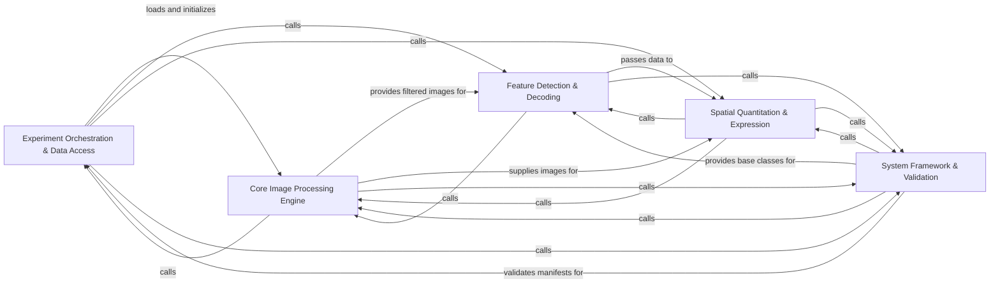

## Details

The starfish library implements a data-centric pipeline for spatial transcriptomics, orchestrating the transformation of raw 5D image data into biological expression matrices through sequential stages of loading, image processing, feature detection, and spatial quantitation.

### Experiment Orchestration & Data Access [[Expand]](./Experiment_Orchestration_Data_Access.md)
Manages the high-level experiment structure, FOV indexing, and lazy-loading of image data from storage.

**Related Classes/Methods**:

- `starfish.core.experiment.experiment.Experiment`:213-454
- `starfish.core.experiment.builder.providers.TileFetcher`:63-74
- `starfish.core.experiment.builder.builder.TileIdentifier`:45-51

**Source Files:**

- [`docs/source/conf.py`](https://github.com/CodeBoarding/starfish/blob/master/.codeboardingdocs/source/conf.py)
  - `docs.source.conf.setup` ([L160-L161](https://github.com/CodeBoarding/starfish/blob/master/.codeboardingdocs/source/conf.py#L160-L161)) - Function
- [`notebooks/py/smFISH.py`](https://github.com/CodeBoarding/starfish/blob/master/.codeboardingnotebooks/py/smFISH.py)
  - `notebooks.py.smFISH.processing_pipeline` ([L97-L156](https://github.com/CodeBoarding/starfish/blob/master/.codeboardingnotebooks/py/smFISH.py#L97-L156)) - Function
- [`starfish/core/codebook/_format.py`](https://github.com/CodeBoarding/starfish/blob/master/.codeboardingstarfish/core/codebook/_format.py)
  - `starfish.core.codebook._format.DocumentKeys` ([L10-L12](https://github.com/CodeBoarding/starfish/blob/master/.codeboardingstarfish/core/codebook/_format.py#L10-L12)) - Class
- [`starfish/core/experiment/builder/builder.py`](https://github.com/CodeBoarding/starfish/blob/master/.codeboardingstarfish/core/experiment/builder/builder.py)
  - `starfish.core.experiment.builder.builder.TileIdentifier` ([L45-L51](https://github.com/CodeBoarding/starfish/blob/master/.codeboardingstarfish/core/experiment/builder/builder.py#L45-L51)) - Class
  - `starfish.core.experiment.builder.builder.build_irregular_image` ([L54-L146](https://github.com/CodeBoarding/starfish/blob/master/.codeboardingstarfish/core/experiment/builder/builder.py#L54-L146)) - Function
  - `starfish.core.experiment.builder.builder.build_irregular_image.reducer_to_sets` ([L76-L85](https://github.com/CodeBoarding/starfish/blob/master/.codeboardingstarfish/core/experiment/builder/builder.py#L76-L85)) - Function
  - `starfish.core.experiment.builder.builder.build_image` ([L149-L201](https://github.com/CodeBoarding/starfish/blob/master/.codeboardingstarfish/core/experiment/builder/builder.py#L149-L201)) - Function
  - `starfish.core.experiment.builder.builder.write_irregular_experiment_json` ([L204-L300](https://github.com/CodeBoarding/starfish/blob/master/.codeboardingstarfish/core/experiment/builder/builder.py#L204-L300)) - Function
  - `starfish.core.experiment.builder.builder.write_experiment_json` ([L303-L415](https://github.com/CodeBoarding/starfish/blob/master/.codeboardingstarfish/core/experiment/builder/builder.py#L303-L415)) - Function
- [`starfish/core/experiment/builder/defaultproviders.py`](https://github.com/CodeBoarding/starfish/blob/master/.codeboardingstarfish/core/experiment/builder/defaultproviders.py)
  - `starfish.core.experiment.builder.defaultproviders.RandomNoiseTile` ([L16-L39](https://github.com/CodeBoarding/starfish/blob/master/.codeboardingstarfish/core/experiment/builder/defaultproviders.py#L16-L39)) - Class
  - `starfish.core.experiment.builder.defaultproviders.OnesTile` ([L42-L71](https://github.com/CodeBoarding/starfish/blob/master/.codeboardingstarfish/core/experiment/builder/defaultproviders.py#L42-L71)) - Class
  - `starfish.core.experiment.builder.defaultproviders.OnesTile.__init__` ([L47-L49](https://github.com/CodeBoarding/starfish/blob/master/.codeboardingstarfish/core/experiment/builder/defaultproviders.py#L47-L49)) - Method
  - `starfish.core.experiment.builder.defaultproviders.OnesTile.shape` ([L52-L53](https://github.com/CodeBoarding/starfish/blob/master/.codeboardingstarfish/core/experiment/builder/defaultproviders.py#L52-L53)) - Method
  - `starfish.core.experiment.builder.defaultproviders.OnesTile.coordinates` ([L56-L61](https://github.com/CodeBoarding/starfish/blob/master/.codeboardingstarfish/core/experiment/builder/defaultproviders.py#L56-L61)) - Method
  - `starfish.core.experiment.builder.defaultproviders.OnesTile.format` ([L64-L65](https://github.com/CodeBoarding/starfish/blob/master/.codeboardingstarfish/core/experiment/builder/defaultproviders.py#L64-L65)) - Method
  - `starfish.core.experiment.builder.defaultproviders.OnesTile.tile_data` ([L67-L71](https://github.com/CodeBoarding/starfish/blob/master/.codeboardingstarfish/core/experiment/builder/defaultproviders.py#L67-L71)) - Method
  - `starfish.core.experiment.builder.defaultproviders.tile_fetcher_factory` ([L74-L97](https://github.com/CodeBoarding/starfish/blob/master/.codeboardingstarfish/core/experiment/builder/defaultproviders.py#L74-L97)) - Function
  - `starfish.core.experiment.builder.defaultproviders.tile_fetcher_factory.ResultingClass` ([L86-L95](https://github.com/CodeBoarding/starfish/blob/master/.codeboardingstarfish/core/experiment/builder/defaultproviders.py#L86-L95)) - Class
- [`starfish/core/experiment/builder/inplace.py`](https://github.com/CodeBoarding/starfish/blob/master/.codeboardingstarfish/core/experiment/builder/inplace.py)
  - `starfish.core.experiment.builder.inplace.InplaceWriterContract` ([L20-L31](https://github.com/CodeBoarding/starfish/blob/master/.codeboardingstarfish/core/experiment/builder/inplace.py#L20-L31)) - Class
  - `starfish.core.experiment.builder.inplace.InplaceWriterContract.tile_url_generator` ([L21-L22](https://github.com/CodeBoarding/starfish/blob/master/.codeboardingstarfish/core/experiment/builder/inplace.py#L21-L22)) - Method
  - `starfish.core.experiment.builder.inplace.InplaceWriterContract.write_tile` ([L24-L31](https://github.com/CodeBoarding/starfish/blob/master/.codeboardingstarfish/core/experiment/builder/inplace.py#L24-L31)) - Method
  - `starfish.core.experiment.builder.inplace.InplaceFetchedTile` ([L34-L49](https://github.com/CodeBoarding/starfish/blob/master/.codeboardingstarfish/core/experiment/builder/inplace.py#L34-L49)) - Class
  - `starfish.core.experiment.builder.inplace.InplaceFetchedTile.filepath` ([L38-L40](https://github.com/CodeBoarding/starfish/blob/master/.codeboardingstarfish/core/experiment/builder/inplace.py#L38-L40)) - Method
  - `starfish.core.experiment.builder.inplace.InplaceFetchedTile.sha256` ([L44-L46](https://github.com/CodeBoarding/starfish/blob/master/.codeboardingstarfish/core/experiment/builder/inplace.py#L44-L46)) - Method
  - `starfish.core.experiment.builder.inplace.InplaceFetchedTile.tile_data` ([L48-L49](https://github.com/CodeBoarding/starfish/blob/master/.codeboardingstarfish/core/experiment/builder/inplace.py#L48-L49)) - Method
- [`starfish/core/experiment/builder/orderediterator.py`](https://github.com/CodeBoarding/starfish/blob/master/.codeboardingstarfish/core/experiment/builder/orderediterator.py)
  - `starfish.core.experiment.builder.orderediterator.join_axes_labels` ([L7-L30](https://github.com/CodeBoarding/starfish/blob/master/.codeboardingstarfish/core/experiment/builder/orderediterator.py#L7-L30)) - Function
  - `starfish.core.experiment.builder.orderediterator.ordered_iterator` ([L33-L42](https://github.com/CodeBoarding/starfish/blob/master/.codeboardingstarfish/core/experiment/builder/orderediterator.py#L33-L42)) - Function
- [`starfish/core/experiment/builder/providers.py`](https://github.com/CodeBoarding/starfish/blob/master/.codeboardingstarfish/core/experiment/builder/providers.py)
  - `starfish.core.experiment.builder.providers.FetchedTile` ([L12-L60](https://github.com/CodeBoarding/starfish/blob/master/.codeboardingstarfish/core/experiment/builder/providers.py#L12-L60)) - Class
  - `starfish.core.experiment.builder.providers.FetchedTile.__init__` ([L16-L17](https://github.com/CodeBoarding/starfish/blob/master/.codeboardingstarfish/core/experiment/builder/providers.py#L16-L17)) - Method
  - `starfish.core.experiment.builder.providers.FetchedTile.shape` ([L20-L28](https://github.com/CodeBoarding/starfish/blob/master/.codeboardingstarfish/core/experiment/builder/providers.py#L20-L28)) - Method
  - `starfish.core.experiment.builder.providers.FetchedTile.coordinates` ([L31-L39](https://github.com/CodeBoarding/starfish/blob/master/.codeboardingstarfish/core/experiment/builder/providers.py#L31-L39)) - Method
  - `starfish.core.experiment.builder.providers.FetchedTile.extras` ([L42-L50](https://github.com/CodeBoarding/starfish/blob/master/.codeboardingstarfish/core/experiment/builder/providers.py#L42-L50)) - Method
  - `starfish.core.experiment.builder.providers.FetchedTile.tile_data` ([L52-L60](https://github.com/CodeBoarding/starfish/blob/master/.codeboardingstarfish/core/experiment/builder/providers.py#L52-L60)) - Method
  - `starfish.core.experiment.builder.providers.TileFetcher` ([L63-L74](https://github.com/CodeBoarding/starfish/blob/master/.codeboardingstarfish/core/experiment/builder/providers.py#L63-L74)) - Class
  - `starfish.core.experiment.builder.providers.TileFetcher.get_tile` ([L68-L74](https://github.com/CodeBoarding/starfish/blob/master/.codeboardingstarfish/core/experiment/builder/providers.py#L68-L74)) - Method
- [`starfish/core/experiment/builder/structured_formatter.py`](https://github.com/CodeBoarding/starfish/blob/master/.codeboardingstarfish/core/experiment/builder/structured_formatter.py)
  - `starfish.core.experiment.builder.structured_formatter.ExtraPhysicalCoordinatesWarning` ([L33-L37](https://github.com/CodeBoarding/starfish/blob/master/.codeboardingstarfish/core/experiment/builder/structured_formatter.py#L33-L37)) - Class
  - `starfish.core.experiment.builder.structured_formatter.PhysicalCoordinateNotPresentError` ([L40-L45](https://github.com/CodeBoarding/starfish/blob/master/.codeboardingstarfish/core/experiment/builder/structured_formatter.py#L40-L45)) - Class
  - `starfish.core.experiment.builder.structured_formatter.InferredTileResult` ([L49-L52](https://github.com/CodeBoarding/starfish/blob/master/.codeboardingstarfish/core/experiment/builder/structured_formatter.py#L49-L52)) - Class
  - `starfish.core.experiment.builder.structured_formatter.format_structured_dataset` ([L55-L138](https://github.com/CodeBoarding/starfish/blob/master/.codeboardingstarfish/core/experiment/builder/structured_formatter.py#L55-L138)) - Function
  - `starfish.core.experiment.builder.structured_formatter.infer_stack_structure` ([L141-L164](https://github.com/CodeBoarding/starfish/blob/master/.codeboardingstarfish/core/experiment/builder/structured_formatter.py#L141-L164)) - Function
  - `starfish.core.experiment.builder.structured_formatter.read_physical_coordinates_from_csv` ([L167-L208](https://github.com/CodeBoarding/starfish/blob/master/.codeboardingstarfish/core/experiment/builder/structured_formatter.py#L167-L208)) - Function
  - `starfish.core.experiment.builder.structured_formatter.InferredTile` ([L211-L263](https://github.com/CodeBoarding/starfish/blob/master/.codeboardingstarfish/core/experiment/builder/structured_formatter.py#L211-L263)) - Class
  - `starfish.core.experiment.builder.structured_formatter.InferredTile.__init__` ([L214-L224](https://github.com/CodeBoarding/starfish/blob/master/.codeboardingstarfish/core/experiment/builder/structured_formatter.py#L214-L224)) - Method
  - `starfish.core.experiment.builder.structured_formatter.InferredTile.filepath` ([L227-L228](https://github.com/CodeBoarding/starfish/blob/master/.codeboardingstarfish/core/experiment/builder/structured_formatter.py#L227-L228)) - Method
  - `starfish.core.experiment.builder.structured_formatter.InferredTile._ensure_tile_loaded` ([L230-L244](https://github.com/CodeBoarding/starfish/blob/master/.codeboardingstarfish/core/experiment/builder/structured_formatter.py#L230-L244)) - Method
  - `starfish.core.experiment.builder.structured_formatter.InferredTile.sha256` ([L247-L249](https://github.com/CodeBoarding/starfish/blob/master/.codeboardingstarfish/core/experiment/builder/structured_formatter.py#L247-L249)) - Method
  - `starfish.core.experiment.builder.structured_formatter.InferredTile.shape` ([L252-L254](https://github.com/CodeBoarding/starfish/blob/master/.codeboardingstarfish/core/experiment/builder/structured_formatter.py#L252-L254)) - Method
  - `starfish.core.experiment.builder.structured_formatter.InferredTile.coordinates` ([L257-L258](https://github.com/CodeBoarding/starfish/blob/master/.codeboardingstarfish/core/experiment/builder/structured_formatter.py#L257-L258)) - Method
  - `starfish.core.experiment.builder.structured_formatter.InferredTile.tile_data` ([L260-L263](https://github.com/CodeBoarding/starfish/blob/master/.codeboardingstarfish/core/experiment/builder/structured_formatter.py#L260-L263)) - Method
  - `starfish.core.experiment.builder.structured_formatter.InferredTileFetcher` ([L266-L287](https://github.com/CodeBoarding/starfish/blob/master/.codeboardingstarfish/core/experiment/builder/structured_formatter.py#L266-L287)) - Class
  - `starfish.core.experiment.builder.structured_formatter.InferredTileFetcher.__init__` ([L267-L275](https://github.com/CodeBoarding/starfish/blob/master/.codeboardingstarfish/core/experiment/builder/structured_formatter.py#L267-L275)) - Method
  - `starfish.core.experiment.builder.structured_formatter.InferredTileFetcher.get_tile` ([L277-L287](https://github.com/CodeBoarding/starfish/blob/master/.codeboardingstarfish/core/experiment/builder/structured_formatter.py#L277-L287)) - Method
  - `starfish.core.experiment.builder.structured_formatter._convert_str_to_Number` ([L290-L297](https://github.com/CodeBoarding/starfish/blob/master/.codeboardingstarfish/core/experiment/builder/structured_formatter.py#L290-L297)) - Function
  - `starfish.core.experiment.builder.structured_formatter._parse_coordinates` ([L300-L327](https://github.com/CodeBoarding/starfish/blob/master/.codeboardingstarfish/core/experiment/builder/structured_formatter.py#L300-L327)) - Function
- [`starfish/core/experiment/experiment.py`](https://github.com/CodeBoarding/starfish/blob/master/.codeboardingstarfish/core/experiment/experiment.py)
  - `starfish.core.experiment.experiment.FieldOfView` ([L33-L194](https://github.com/CodeBoarding/starfish/blob/master/.codeboardingstarfish/core/experiment/experiment.py#L33-L194)) - Class
  - `starfish.core.experiment.experiment.FieldOfView.__init__` ([L74-L80](https://github.com/CodeBoarding/starfish/blob/master/.codeboardingstarfish/core/experiment/experiment.py#L74-L80)) - Method
  - `starfish.core.experiment.experiment.FieldOfView.__repr__` ([L82-L93](https://github.com/CodeBoarding/starfish/blob/master/.codeboardingstarfish/core/experiment/experiment.py#L82-L93)) - Method
  - `starfish.core.experiment.experiment.FieldOfView.name` ([L96-L97](https://github.com/CodeBoarding/starfish/blob/master/.codeboardingstarfish/core/experiment/experiment.py#L96-L97)) - Method
  - `starfish.core.experiment.experiment.FieldOfView.image_types` ([L100-L101](https://github.com/CodeBoarding/starfish/blob/master/.codeboardingstarfish/core/experiment/experiment.py#L100-L101)) - Method
  - `starfish.core.experiment.experiment.FieldOfView.get_image` ([L103-L147](https://github.com/CodeBoarding/starfish/blob/master/.codeboardingstarfish/core/experiment/experiment.py#L103-L147)) - Method
  - `starfish.core.experiment.experiment.FieldOfView.get_images` ([L149-L194](https://github.com/CodeBoarding/starfish/blob/master/.codeboardingstarfish/core/experiment/experiment.py#L149-L194)) - Method
  - `starfish.core.experiment.experiment.AlignedImageStackIterator` ([L197-L210](https://github.com/CodeBoarding/starfish/blob/master/.codeboardingstarfish/core/experiment/experiment.py#L197-L210)) - Class
  - `starfish.core.experiment.experiment.Experiment` ([L213-L454](https://github.com/CodeBoarding/starfish/blob/master/.codeboardingstarfish/core/experiment/experiment.py#L213-L454)) - Class
  - `starfish.core.experiment.experiment.Experiment.__init__` ([L227-L238](https://github.com/CodeBoarding/starfish/blob/master/.codeboardingstarfish/core/experiment/experiment.py#L227-L238)) - Method
  - `starfish.core.experiment.experiment.Experiment.__repr__` ([L240-L257](https://github.com/CodeBoarding/starfish/blob/master/.codeboardingstarfish/core/experiment/experiment.py#L240-L257)) - Method
  - `starfish.core.experiment.experiment.Experiment.from_json` ([L260-L336](https://github.com/CodeBoarding/starfish/blob/master/.codeboardingstarfish/core/experiment/experiment.py#L260-L336)) - Method
  - `starfish.core.experiment.experiment.Experiment.verify_version` ([L339-L348](https://github.com/CodeBoarding/starfish/blob/master/.codeboardingstarfish/core/experiment/experiment.py#L339-L348)) - Method
  - `starfish.core.experiment.experiment.Experiment.fov` ([L350-L379](https://github.com/CodeBoarding/starfish/blob/master/.codeboardingstarfish/core/experiment/experiment.py#L350-L379)) - Method
  - `starfish.core.experiment.experiment.Experiment.fovs` ([L381-L409](https://github.com/CodeBoarding/starfish/blob/master/.codeboardingstarfish/core/experiment/experiment.py#L381-L409)) - Method
  - `starfish.core.experiment.experiment.Experiment.fovs_by_name` ([L411-L428](https://github.com/CodeBoarding/starfish/blob/master/.codeboardingstarfish/core/experiment/experiment.py#L411-L428)) - Method
  - `starfish.core.experiment.experiment.Experiment.__getitem__` ([L430-L434](https://github.com/CodeBoarding/starfish/blob/master/.codeboardingstarfish/core/experiment/experiment.py#L430-L434)) - Method
  - `starfish.core.experiment.experiment.Experiment.keys` ([L436-L438](https://github.com/CodeBoarding/starfish/blob/master/.codeboardingstarfish/core/experiment/experiment.py#L436-L438)) - Method
  - `starfish.core.experiment.experiment.Experiment.values` ([L440-L442](https://github.com/CodeBoarding/starfish/blob/master/.codeboardingstarfish/core/experiment/experiment.py#L440-L442)) - Method
  - `starfish.core.experiment.experiment.Experiment.items` ([L444-L446](https://github.com/CodeBoarding/starfish/blob/master/.codeboardingstarfish/core/experiment/experiment.py#L444-L446)) - Method
  - `starfish.core.experiment.experiment.Experiment.codebook` ([L449-L450](https://github.com/CodeBoarding/starfish/blob/master/.codeboardingstarfish/core/experiment/experiment.py#L449-L450)) - Method
  - `starfish.core.experiment.experiment.Experiment.extras` ([L453-L454](https://github.com/CodeBoarding/starfish/blob/master/.codeboardingstarfish/core/experiment/experiment.py#L453-L454)) - Method
- [`starfish/core/image/Filter/_base.py`](https://github.com/CodeBoarding/starfish/blob/master/.codeboardingstarfish/core/image/Filter/_base.py)
  - `starfish.core.image.Filter._base.FilterAlgorithm` ([L8-L13](https://github.com/CodeBoarding/starfish/blob/master/.codeboardingstarfish/core/image/Filter/_base.py#L8-L13)) - Class
  - `starfish.core.image.Filter._base.FilterAlgorithm.run` ([L11-L13](https://github.com/CodeBoarding/starfish/blob/master/.codeboardingstarfish/core/image/Filter/_base.py#L11-L13)) - Method
- [`starfish/core/image/Filter/gaussian_high_pass.py`](https://github.com/CodeBoarding/starfish/blob/master/.codeboardingstarfish/core/image/Filter/gaussian_high_pass.py)
  - `starfish.core.image.Filter.gaussian_high_pass.GaussianHighPass` ([L17-L127](https://github.com/CodeBoarding/starfish/blob/master/.codeboardingstarfish/core/image/Filter/gaussian_high_pass.py#L17-L127)) - Class
- [`starfish/core/image/Filter/gaussian_low_pass.py`](https://github.com/CodeBoarding/starfish/blob/master/.codeboardingstarfish/core/image/Filter/gaussian_low_pass.py)
  - `starfish.core.image.Filter.gaussian_low_pass.GaussianLowPass` ([L16-L128](https://github.com/CodeBoarding/starfish/blob/master/.codeboardingstarfish/core/image/Filter/gaussian_low_pass.py#L16-L128)) - Class
- [`starfish/core/image/Filter/reduce.py`](https://github.com/CodeBoarding/starfish/blob/master/.codeboardingstarfish/core/image/Filter/reduce.py)
  - `starfish.core.image.Filter.reduce.Reduce` ([L25-L193](https://github.com/CodeBoarding/starfish/blob/master/.codeboardingstarfish/core/image/Filter/reduce.py#L25-L193)) - Class
- [`starfish/core/image/Filter/richardson_lucy_deconvolution.py`](https://github.com/CodeBoarding/starfish/blob/master/.codeboardingstarfish/core/image/Filter/richardson_lucy_deconvolution.py)
  - `starfish.core.image.Filter.richardson_lucy_deconvolution.DeconvolvePSF` ([L17-L212](https://github.com/CodeBoarding/starfish/blob/master/.codeboardingstarfish/core/image/Filter/richardson_lucy_deconvolution.py#L17-L212)) - Class
- [`starfish/core/image/Filter/white_tophat.py`](https://github.com/CodeBoarding/starfish/blob/master/.codeboardingstarfish/core/image/Filter/white_tophat.py)
  - `starfish.core.image.Filter.white_tophat.WhiteTophat` ([L12-L116](https://github.com/CodeBoarding/starfish/blob/master/.codeboardingstarfish/core/image/Filter/white_tophat.py#L12-L116)) - Class
- [`starfish/core/image/Segment/_base.py`](https://github.com/CodeBoarding/starfish/blob/master/.codeboardingstarfish/core/image/Segment/_base.py)
  - `starfish.core.image.Segment._base.SegmentAlgorithm` ([L8-L18](https://github.com/CodeBoarding/starfish/blob/master/.codeboardingstarfish/core/image/Segment/_base.py#L8-L18)) - Class
  - `starfish.core.image.Segment._base.SegmentAlgorithm.run` ([L11-L18](https://github.com/CodeBoarding/starfish/blob/master/.codeboardingstarfish/core/image/Segment/_base.py#L11-L18)) - Method
- [`starfish/core/image/_registration/ApplyTransform/_base.py`](https://github.com/CodeBoarding/starfish/blob/master/.codeboardingstarfish/core/image/_registration/ApplyTransform/_base.py)
  - `starfish.core.image._registration.ApplyTransform._base.ApplyTransformAlgorithm` ([L8-L13](https://github.com/CodeBoarding/starfish/blob/master/.codeboardingstarfish/core/image/_registration/ApplyTransform/_base.py#L8-L13)) - Class
  - `starfish.core.image._registration.ApplyTransform._base.ApplyTransformAlgorithm.run` ([L11-L13](https://github.com/CodeBoarding/starfish/blob/master/.codeboardingstarfish/core/image/_registration/ApplyTransform/_base.py#L11-L13)) - Method
- [`starfish/core/image/_registration/LearnTransform/_base.py`](https://github.com/CodeBoarding/starfish/blob/master/.codeboardingstarfish/core/image/_registration/LearnTransform/_base.py)
  - `starfish.core.image._registration.LearnTransform._base.LearnTransformAlgorithm` ([L7-L12](https://github.com/CodeBoarding/starfish/blob/master/.codeboardingstarfish/core/image/_registration/LearnTransform/_base.py#L7-L12)) - Class
  - `starfish.core.image._registration.LearnTransform._base.LearnTransformAlgorithm.run` ([L10-L12](https://github.com/CodeBoarding/starfish/blob/master/.codeboardingstarfish/core/image/_registration/LearnTransform/_base.py#L10-L12)) - Method
- [`starfish/core/image/_registration/LearnTransform/translation.py`](https://github.com/CodeBoarding/starfish/blob/master/.codeboardingstarfish/core/image/_registration/LearnTransform/translation.py)
  - `starfish.core.image._registration.LearnTransform.translation.Translation` ([L11-L90](https://github.com/CodeBoarding/starfish/blob/master/.codeboardingstarfish/core/image/_registration/LearnTransform/translation.py#L11-L90)) - Class
- [`starfish/core/image/_registration/_format.py`](https://github.com/CodeBoarding/starfish/blob/master/.codeboardingstarfish/core/image/_registration/_format.py)
  - `starfish.core.image._registration._format.DocumentKeys` ([L10-L12](https://github.com/CodeBoarding/starfish/blob/master/.codeboardingstarfish/core/image/_registration/_format.py#L10-L12)) - Class
- [`starfish/core/imagestack/parser/tilefetcher/_parser.py`](https://github.com/CodeBoarding/starfish/blob/master/.codeboardingstarfish/core/imagestack/parser/tilefetcher/_parser.py)
  - `starfish.core.imagestack.parser.tilefetcher._parser.TileFetcherImageTile.__init__` ([L18-L28](https://github.com/CodeBoarding/starfish/blob/master/.codeboardingstarfish/core/imagestack/parser/tilefetcher/_parser.py#L18-L28)) - Method
  - `starfish.core.imagestack.parser.tilefetcher._parser.TileFetcherImageTile.tile_shape` ([L31-L32](https://github.com/CodeBoarding/starfish/blob/master/.codeboardingstarfish/core/imagestack/parser/tilefetcher/_parser.py#L31-L32)) - Method
  - `starfish.core.imagestack.parser.tilefetcher._parser.TileFetcherImageTile.numpy_array` ([L35-L36](https://github.com/CodeBoarding/starfish/blob/master/.codeboardingstarfish/core/imagestack/parser/tilefetcher/_parser.py#L35-L36)) - Method
  - `starfish.core.imagestack.parser.tilefetcher._parser.TileFetcherImageTile.coordinates` ([L39-L56](https://github.com/CodeBoarding/starfish/blob/master/.codeboardingstarfish/core/imagestack/parser/tilefetcher/_parser.py#L39-L56)) - Method
  - `starfish.core.imagestack.parser.tilefetcher._parser.TileFetcherImageTile.selector` ([L59-L64](https://github.com/CodeBoarding/starfish/blob/master/.codeboardingstarfish/core/imagestack/parser/tilefetcher/_parser.py#L59-L64)) - Method
- [`starfish/core/imagestack/parser/tileset/_parser.py`](https://github.com/CodeBoarding/starfish/blob/master/.codeboardingstarfish/core/imagestack/parser/tileset/_parser.py)
  - `starfish.core.imagestack.parser.tileset._parser.SlicedImageTile.__init__` ([L22-L33](https://github.com/CodeBoarding/starfish/blob/master/.codeboardingstarfish/core/imagestack/parser/tileset/_parser.py#L22-L33)) - Method
  - `starfish.core.imagestack.parser.tileset._parser.SlicedImageTile._load` ([L35-L38](https://github.com/CodeBoarding/starfish/blob/master/.codeboardingstarfish/core/imagestack/parser/tileset/_parser.py#L35-L38)) - Method
  - `starfish.core.imagestack.parser.tileset._parser.SlicedImageTile.tile_shape` ([L41-L47](https://github.com/CodeBoarding/starfish/blob/master/.codeboardingstarfish/core/imagestack/parser/tileset/_parser.py#L41-L47)) - Method
  - `starfish.core.imagestack.parser.tileset._parser.SlicedImageTile.numpy_array` ([L50-L53](https://github.com/CodeBoarding/starfish/blob/master/.codeboardingstarfish/core/imagestack/parser/tileset/_parser.py#L50-L53)) - Method
  - `starfish.core.imagestack.parser.tileset._parser.SlicedImageTile.coordinates` ([L56-L69](https://github.com/CodeBoarding/starfish/blob/master/.codeboardingstarfish/core/imagestack/parser/tileset/_parser.py#L56-L69)) - Method
  - `starfish.core.imagestack.parser.tileset._parser.SlicedImageTile.selector` ([L72-L76](https://github.com/CodeBoarding/starfish/blob/master/.codeboardingstarfish/core/imagestack/parser/tileset/_parser.py#L72-L76)) - Method
- [`starfish/core/imagestack/physical_coordinates.py`](https://github.com/CodeBoarding/starfish/blob/master/.codeboardingstarfish/core/imagestack/physical_coordinates.py)
  - `starfish.core.imagestack.physical_coordinates._get_physical_coordinates_of_z_plane` ([L4-L7](https://github.com/CodeBoarding/starfish/blob/master/.codeboardingstarfish/core/imagestack/physical_coordinates.py#L4-L7)) - Function
- [`starfish/core/morphology/Binarize/_base.py`](https://github.com/CodeBoarding/starfish/blob/master/.codeboardingstarfish/core/morphology/Binarize/_base.py)
  - `starfish.core.morphology.Binarize._base.BinarizeAlgorithm` ([L8-L13](https://github.com/CodeBoarding/starfish/blob/master/.codeboardingstarfish/core/morphology/Binarize/_base.py#L8-L13)) - Class
  - `starfish.core.morphology.Binarize._base.BinarizeAlgorithm.run` ([L11-L13](https://github.com/CodeBoarding/starfish/blob/master/.codeboardingstarfish/core/morphology/Binarize/_base.py#L11-L13)) - Method
- [`starfish/core/morphology/Filter/_base.py`](https://github.com/CodeBoarding/starfish/blob/master/.codeboardingstarfish/core/morphology/Filter/_base.py)
  - `starfish.core.morphology.Filter._base.FilterAlgorithm` ([L7-L17](https://github.com/CodeBoarding/starfish/blob/master/.codeboardingstarfish/core/morphology/Filter/_base.py#L7-L17)) - Class
  - `starfish.core.morphology.Filter._base.FilterAlgorithm.run` ([L10-L17](https://github.com/CodeBoarding/starfish/blob/master/.codeboardingstarfish/core/morphology/Filter/_base.py#L10-L17)) - Method
- [`starfish/core/morphology/Merge/_base.py`](https://github.com/CodeBoarding/starfish/blob/master/.codeboardingstarfish/core/morphology/Merge/_base.py)
  - `starfish.core.morphology.Merge._base.MergeAlgorithm` ([L8-L18](https://github.com/CodeBoarding/starfish/blob/master/.codeboardingstarfish/core/morphology/Merge/_base.py#L8-L18)) - Class
  - `starfish.core.morphology.Merge._base.MergeAlgorithm.run` ([L12-L18](https://github.com/CodeBoarding/starfish/blob/master/.codeboardingstarfish/core/morphology/Merge/_base.py#L12-L18)) - Method
- [`starfish/core/morphology/Segment/_base.py`](https://github.com/CodeBoarding/starfish/blob/master/.codeboardingstarfish/core/morphology/Segment/_base.py)
  - `starfish.core.morphology.Segment._base.SegmentAlgorithm` ([L7-L12](https://github.com/CodeBoarding/starfish/blob/master/.codeboardingstarfish/core/morphology/Segment/_base.py#L7-L12)) - Class
  - `starfish.core.morphology.Segment._base.SegmentAlgorithm.run` ([L10-L12](https://github.com/CodeBoarding/starfish/blob/master/.codeboardingstarfish/core/morphology/Segment/_base.py#L10-L12)) - Method
- [`starfish/core/spots/AssignTargets/_base.py`](https://github.com/CodeBoarding/starfish/blob/master/.codeboardingstarfish/core/spots/AssignTargets/_base.py)
  - `starfish.core.spots.AssignTargets._base.AssignTargetsAlgorithm` ([L8-L23](https://github.com/CodeBoarding/starfish/blob/master/.codeboardingstarfish/core/spots/AssignTargets/_base.py#L8-L23)) - Class
  - `starfish.core.spots.AssignTargets._base.AssignTargetsAlgorithm.run` ([L15-L23](https://github.com/CodeBoarding/starfish/blob/master/.codeboardingstarfish/core/spots/AssignTargets/_base.py#L15-L23)) - Method
- [`starfish/core/spots/DecodeSpots/_base.py`](https://github.com/CodeBoarding/starfish/blob/master/.codeboardingstarfish/core/spots/DecodeSpots/_base.py)
  - `starfish.core.spots.DecodeSpots._base.DecodeSpotsAlgorithm` ([L8-L13](https://github.com/CodeBoarding/starfish/blob/master/.codeboardingstarfish/core/spots/DecodeSpots/_base.py#L8-L13)) - Class
  - `starfish.core.spots.DecodeSpots._base.DecodeSpotsAlgorithm.run` ([L12-L13](https://github.com/CodeBoarding/starfish/blob/master/.codeboardingstarfish/core/spots/DecodeSpots/_base.py#L12-L13)) - Method
- [`starfish/core/spots/DecodeSpots/per_round_max_channel_decoder.py`](https://github.com/CodeBoarding/starfish/blob/master/.codeboardingstarfish/core/spots/DecodeSpots/per_round_max_channel_decoder.py)
  - `starfish.core.spots.DecodeSpots.per_round_max_channel_decoder.PerRoundMaxChannel` ([L12-L66](https://github.com/CodeBoarding/starfish/blob/master/.codeboardingstarfish/core/spots/DecodeSpots/per_round_max_channel_decoder.py#L12-L66)) - Class
- [`starfish/core/spots/DetectPixels/pixel_spot_decoder.py`](https://github.com/CodeBoarding/starfish/blob/master/.codeboardingstarfish/core/spots/DetectPixels/pixel_spot_decoder.py)
  - `starfish.core.spots.DetectPixels.pixel_spot_decoder.PixelSpotDecoder` ([L14-L91](https://github.com/CodeBoarding/starfish/blob/master/.codeboardingstarfish/core/spots/DetectPixels/pixel_spot_decoder.py#L14-L91)) - Class
- [`starfish/core/spots/FindSpots/blob.py`](https://github.com/CodeBoarding/starfish/blob/master/.codeboardingstarfish/core/spots/FindSpots/blob.py)
  - `starfish.core.spots.FindSpots.blob.BlobDetector` ([L28-L234](https://github.com/CodeBoarding/starfish/blob/master/.codeboardingstarfish/core/spots/FindSpots/blob.py#L28-L234)) - Class
- [`starfish/core/util/argparse.py`](https://github.com/CodeBoarding/starfish/blob/master/.codeboardingstarfish/core/util/argparse.py)
  - `starfish.core.util.argparse.FsExistsType` ([L5-L9](https://github.com/CodeBoarding/starfish/blob/master/.codeboardingstarfish/core/util/argparse.py#L5-L9)) - Class
  - `starfish.core.util.argparse.FsExistsType.__call__` ([L6-L9](https://github.com/CodeBoarding/starfish/blob/master/.codeboardingstarfish/core/util/argparse.py#L6-L9)) - Method
- [`starfish/data.py`](https://github.com/CodeBoarding/starfish/blob/master/.codeboardingstarfish/data.py)
  - `starfish.data.MERFISH` ([L4-L27](https://github.com/CodeBoarding/starfish/blob/master/.codeboardingstarfish/data.py#L4-L27)) - Function
  - `starfish.data.allen_smFISH` ([L30-L53](https://github.com/CodeBoarding/starfish/blob/master/.codeboardingstarfish/data.py#L30-L53)) - Function
  - `starfish.data.MOUSE_V_HUMAN` ([L56-L69](https://github.com/CodeBoarding/starfish/blob/master/.codeboardingstarfish/data.py#L56-L69)) - Function
  - `starfish.data.DARTFISH` ([L72-L94](https://github.com/CodeBoarding/starfish/blob/master/.codeboardingstarfish/data.py#L72-L94)) - Function
  - `starfish.data.ISS` ([L97-L120](https://github.com/CodeBoarding/starfish/blob/master/.codeboardingstarfish/data.py#L97-L120)) - Function
  - `starfish.data.osmFISH` ([L123-L149](https://github.com/CodeBoarding/starfish/blob/master/.codeboardingstarfish/data.py#L123-L149)) - Function
  - `starfish.data.BaristaSeq` ([L152-L173](https://github.com/CodeBoarding/starfish/blob/master/.codeboardingstarfish/data.py#L152-L173)) - Function
  - `starfish.data.ImagingMassCytometry` ([L176-L196](https://github.com/CodeBoarding/starfish/blob/master/.codeboardingstarfish/data.py#L176-L196)) - Function
  - `starfish.data.SeqFISH` ([L199-L223](https://github.com/CodeBoarding/starfish/blob/master/.codeboardingstarfish/data.py#L199-L223)) - Function
  - `starfish.data.STARmap` ([L226-L249](https://github.com/CodeBoarding/starfish/blob/master/.codeboardingstarfish/data.py#L226-L249)) - Function
- [`workflows/wdl/iss_published/recipe.py`](https://github.com/CodeBoarding/starfish/blob/master/.codeboardingworkflows/wdl/iss_published/recipe.py)
  - `workflows.wdl.iss_published.recipe.process_fov` ([L9-L68](https://github.com/CodeBoarding/starfish/blob/master/.codeboardingworkflows/wdl/iss_published/recipe.py#L9-L68)) - Function
- [`workflows/wdl/iss_spaceTX/recipe.py`](https://github.com/CodeBoarding/starfish/blob/master/.codeboardingworkflows/wdl/iss_spaceTX/recipe.py)
  - `workflows.wdl.iss_spaceTX.recipe.process_fov` ([L6-L55](https://github.com/CodeBoarding/starfish/blob/master/.codeboardingworkflows/wdl/iss_spaceTX/recipe.py#L6-L55)) - Function
- [`workflows/wdl/merfish_published/recipe.py`](https://github.com/CodeBoarding/starfish/blob/master/.codeboardingworkflows/wdl/merfish_published/recipe.py)
  - `workflows.wdl.merfish_published.recipe.process_fov` ([L12-L72](https://github.com/CodeBoarding/starfish/blob/master/.codeboardingworkflows/wdl/merfish_published/recipe.py#L12-L72)) - Function

### Core Image Processing Engine [[Expand]](./Core_Image_Processing_Engine.md)
Manages the 5D ImageStack and provides the API for image-to-image operations like registration, deconvolution, and filtering.

**Related Classes/Methods**:

- `starfish.core.imagestack.imagestack.ImageStack`:68-1274
- `starfish.core.image.Filter.bandpass.Bandpass`:13-148
- `starfish.core.imagestack.parser.crop.CropParameters`:11-241

**Source Files:**

- [`starfish/core/errors.py`](https://github.com/CodeBoarding/starfish/blob/master/.codeboardingstarfish/core/errors.py)
  - `starfish.core.errors.DeprecatedAPIError` ([L1-L5](https://github.com/CodeBoarding/starfish/blob/master/.codeboardingstarfish/core/errors.py#L1-L5)) - Class
  - `starfish.core.errors.DataFormatWarning` ([L8-L12](https://github.com/CodeBoarding/starfish/blob/master/.codeboardingstarfish/core/errors.py#L8-L12)) - Class
- [`starfish/core/experiment/experiment.py`](https://github.com/CodeBoarding/starfish/blob/master/.codeboardingstarfish/core/experiment/experiment.py)
  - `starfish.core.experiment.experiment.AlignedImageStackIterator.__init__` ([L199-L202](https://github.com/CodeBoarding/starfish/blob/master/.codeboardingstarfish/core/experiment/experiment.py#L199-L202)) - Method
  - `starfish.core.experiment.experiment.AlignedImageStackIterator.__len__` ([L204-L205](https://github.com/CodeBoarding/starfish/blob/master/.codeboardingstarfish/core/experiment/experiment.py#L204-L205)) - Method
  - `starfish.core.experiment.experiment.AlignedImageStackIterator.__next__` ([L207-L210](https://github.com/CodeBoarding/starfish/blob/master/.codeboardingstarfish/core/experiment/experiment.py#L207-L210)) - Method
- [`starfish/core/image/Filter/bandpass.py`](https://github.com/CodeBoarding/starfish/blob/master/.codeboardingstarfish/core/image/Filter/bandpass.py)
  - `starfish.core.image.Filter.bandpass.Bandpass` ([L13-L148](https://github.com/CodeBoarding/starfish/blob/master/.codeboardingstarfish/core/image/Filter/bandpass.py#L13-L148)) - Class
  - `starfish.core.image.Filter.bandpass.Bandpass.__init__` ([L50-L68](https://github.com/CodeBoarding/starfish/blob/master/.codeboardingstarfish/core/image/Filter/bandpass.py#L50-L68)) - Method
  - `starfish.core.image.Filter.bandpass.Bandpass._bandpass` ([L73-L102](https://github.com/CodeBoarding/starfish/blob/master/.codeboardingstarfish/core/image/Filter/bandpass.py#L73-L102)) - Method
  - `starfish.core.image.Filter.bandpass.Bandpass.run` ([L104-L148](https://github.com/CodeBoarding/starfish/blob/master/.codeboardingstarfish/core/image/Filter/bandpass.py#L104-L148)) - Method
- [`starfish/core/image/Filter/call_bases.py`](https://github.com/CodeBoarding/starfish/blob/master/.codeboardingstarfish/core/image/Filter/call_bases.py)
  - `starfish.core.image.Filter.call_bases.CallBases` ([L12-L159](https://github.com/CodeBoarding/starfish/blob/master/.codeboardingstarfish/core/image/Filter/call_bases.py#L12-L159)) - Class
  - `starfish.core.image.Filter.call_bases.CallBases.__init__` ([L31-L36](https://github.com/CodeBoarding/starfish/blob/master/.codeboardingstarfish/core/image/Filter/call_bases.py#L31-L36)) - Method
  - `starfish.core.image.Filter.call_bases.CallBases._vector_norm` ([L40-L67](https://github.com/CodeBoarding/starfish/blob/master/.codeboardingstarfish/core/image/Filter/call_bases.py#L40-L67)) - Method
  - `starfish.core.image.Filter.call_bases.CallBases._call_bases` ([L69-L118](https://github.com/CodeBoarding/starfish/blob/master/.codeboardingstarfish/core/image/Filter/call_bases.py#L69-L118)) - Method
  - `starfish.core.image.Filter.call_bases.CallBases.run` ([L120-L159](https://github.com/CodeBoarding/starfish/blob/master/.codeboardingstarfish/core/image/Filter/call_bases.py#L120-L159)) - Method
- [`starfish/core/image/Filter/clip.py`](https://github.com/CodeBoarding/starfish/blob/master/.codeboardingstarfish/core/image/Filter/clip.py)
  - `starfish.core.image.Filter.clip.Clip` ([L14-L134](https://github.com/CodeBoarding/starfish/blob/master/.codeboardingstarfish/core/image/Filter/clip.py#L14-L134)) - Class
  - `starfish.core.image.Filter.clip.Clip.__init__` ([L57-L80](https://github.com/CodeBoarding/starfish/blob/master/.codeboardingstarfish/core/image/Filter/clip.py#L57-L80)) - Method
  - `starfish.core.image.Filter.clip.Clip._clip` ([L85-L93](https://github.com/CodeBoarding/starfish/blob/master/.codeboardingstarfish/core/image/Filter/clip.py#L85-L93)) - Method
  - `starfish.core.image.Filter.clip.Clip.run` ([L95-L134](https://github.com/CodeBoarding/starfish/blob/master/.codeboardingstarfish/core/image/Filter/clip.py#L95-L134)) - Method
- [`starfish/core/image/Filter/clip_percentile_to_zero.py`](https://github.com/CodeBoarding/starfish/blob/master/.codeboardingstarfish/core/image/Filter/clip_percentile_to_zero.py)
  - `starfish.core.image.Filter.clip_percentile_to_zero.ClipPercentileToZero` ([L13-L124](https://github.com/CodeBoarding/starfish/blob/master/.codeboardingstarfish/core/image/Filter/clip_percentile_to_zero.py#L13-L124)) - Class
  - `starfish.core.image.Filter.clip_percentile_to_zero.ClipPercentileToZero.__init__` ([L54-L69](https://github.com/CodeBoarding/starfish/blob/master/.codeboardingstarfish/core/image/Filter/clip_percentile_to_zero.py#L54-L69)) - Method
  - `starfish.core.image.Filter.clip_percentile_to_zero.ClipPercentileToZero._clip_percentile_to_zero` ([L75-L84](https://github.com/CodeBoarding/starfish/blob/master/.codeboardingstarfish/core/image/Filter/clip_percentile_to_zero.py#L75-L84)) - Method
  - `starfish.core.image.Filter.clip_percentile_to_zero.ClipPercentileToZero.run` ([L86-L124](https://github.com/CodeBoarding/starfish/blob/master/.codeboardingstarfish/core/image/Filter/clip_percentile_to_zero.py#L86-L124)) - Method
- [`starfish/core/image/Filter/clip_value_to_zero.py`](https://github.com/CodeBoarding/starfish/blob/master/.codeboardingstarfish/core/image/Filter/clip_value_to_zero.py)
  - `starfish.core.image.Filter.clip_value_to_zero.ClipValueToZero` ([L13-L111](https://github.com/CodeBoarding/starfish/blob/master/.codeboardingstarfish/core/image/Filter/clip_value_to_zero.py#L13-L111)) - Class
  - `starfish.core.image.Filter.clip_value_to_zero.ClipValueToZero.__init__` ([L50-L60](https://github.com/CodeBoarding/starfish/blob/master/.codeboardingstarfish/core/image/Filter/clip_value_to_zero.py#L50-L60)) - Method
  - `starfish.core.image.Filter.clip_value_to_zero.ClipValueToZero._clip_value_to_zero` ([L65-L69](https://github.com/CodeBoarding/starfish/blob/master/.codeboardingstarfish/core/image/Filter/clip_value_to_zero.py#L65-L69)) - Method
  - `starfish.core.image.Filter.clip_value_to_zero.ClipValueToZero.run` ([L71-L111](https://github.com/CodeBoarding/starfish/blob/master/.codeboardingstarfish/core/image/Filter/clip_value_to_zero.py#L71-L111)) - Method
- [`starfish/core/image/Filter/element_wise_mult.py`](https://github.com/CodeBoarding/starfish/blob/master/.codeboardingstarfish/core/image/Filter/element_wise_mult.py)
  - `starfish.core.image.Filter.element_wise_mult.ElementWiseMultiply` ([L13-L98](https://github.com/CodeBoarding/starfish/blob/master/.codeboardingstarfish/core/image/Filter/element_wise_mult.py#L13-L98)) - Class
  - `starfish.core.image.Filter.element_wise_mult.ElementWiseMultiply.__init__` ([L33-L42](https://github.com/CodeBoarding/starfish/blob/master/.codeboardingstarfish/core/image/Filter/element_wise_mult.py#L33-L42)) - Method
  - `starfish.core.image.Filter.element_wise_mult.ElementWiseMultiply.run` ([L51-L98](https://github.com/CodeBoarding/starfish/blob/master/.codeboardingstarfish/core/image/Filter/element_wise_mult.py#L51-L98)) - Method
- [`starfish/core/image/Filter/gaussian_high_pass.py`](https://github.com/CodeBoarding/starfish/blob/master/.codeboardingstarfish/core/image/Filter/gaussian_high_pass.py)
  - `starfish.core.image.Filter.gaussian_high_pass.GaussianHighPass.__init__` ([L49-L58](https://github.com/CodeBoarding/starfish/blob/master/.codeboardingstarfish/core/image/Filter/gaussian_high_pass.py#L49-L58)) - Method
  - `starfish.core.image.Filter.gaussian_high_pass.GaussianHighPass._high_pass` ([L63-L89](https://github.com/CodeBoarding/starfish/blob/master/.codeboardingstarfish/core/image/Filter/gaussian_high_pass.py#L63-L89)) - Method
  - `starfish.core.image.Filter.gaussian_high_pass.GaussianHighPass.run` ([L91-L127](https://github.com/CodeBoarding/starfish/blob/master/.codeboardingstarfish/core/image/Filter/gaussian_high_pass.py#L91-L127)) - Method
- [`starfish/core/image/Filter/gaussian_low_pass.py`](https://github.com/CodeBoarding/starfish/blob/master/.codeboardingstarfish/core/image/Filter/gaussian_low_pass.py)
  - `starfish.core.image.Filter.gaussian_low_pass.GaussianLowPass.__init__` ([L47-L56](https://github.com/CodeBoarding/starfish/blob/master/.codeboardingstarfish/core/image/Filter/gaussian_low_pass.py#L47-L56)) - Method
  - `starfish.core.image.Filter.gaussian_low_pass.GaussianLowPass._low_pass` ([L61-L90](https://github.com/CodeBoarding/starfish/blob/master/.codeboardingstarfish/core/image/Filter/gaussian_low_pass.py#L61-L90)) - Method
  - `starfish.core.image.Filter.gaussian_low_pass.GaussianLowPass.run` ([L92-L128](https://github.com/CodeBoarding/starfish/blob/master/.codeboardingstarfish/core/image/Filter/gaussian_low_pass.py#L92-L128)) - Method
- [`starfish/core/image/Filter/ilastik_pre_trained_probability.py`](https://github.com/CodeBoarding/starfish/blob/master/.codeboardingstarfish/core/image/Filter/ilastik_pre_trained_probability.py)
  - `starfish.core.image.Filter.ilastik_pre_trained_probability.IlastikPretrainedProbability` ([L14-L124](https://github.com/CodeBoarding/starfish/blob/master/.codeboardingstarfish/core/image/Filter/ilastik_pre_trained_probability.py#L14-L124)) - Class
  - `starfish.core.image.Filter.ilastik_pre_trained_probability.IlastikPretrainedProbability.__init__` ([L32-L39](https://github.com/CodeBoarding/starfish/blob/master/.codeboardingstarfish/core/image/Filter/ilastik_pre_trained_probability.py#L32-L39)) - Method
  - `starfish.core.image.Filter.ilastik_pre_trained_probability.IlastikPretrainedProbability.run` ([L41-L95](https://github.com/CodeBoarding/starfish/blob/master/.codeboardingstarfish/core/image/Filter/ilastik_pre_trained_probability.py#L41-L95)) - Method
  - `starfish.core.image.Filter.ilastik_pre_trained_probability.IlastikPretrainedProbability.import_ilastik_probabilities` ([L98-L124](https://github.com/CodeBoarding/starfish/blob/master/.codeboardingstarfish/core/image/Filter/ilastik_pre_trained_probability.py#L98-L124)) - Method
- [`starfish/core/image/Filter/laplace.py`](https://github.com/CodeBoarding/starfish/blob/master/.codeboardingstarfish/core/image/Filter/laplace.py)
  - `starfish.core.image.Filter.laplace.Laplace` ([L17-L134](https://github.com/CodeBoarding/starfish/blob/master/.codeboardingstarfish/core/image/Filter/laplace.py#L17-L134)) - Class
  - `starfish.core.image.Filter.laplace.Laplace.__init__` ([L70-L83](https://github.com/CodeBoarding/starfish/blob/master/.codeboardingstarfish/core/image/Filter/laplace.py#L70-L83)) - Method
  - `starfish.core.image.Filter.laplace.Laplace._gaussian_laplace` ([L88-L97](https://github.com/CodeBoarding/starfish/blob/master/.codeboardingstarfish/core/image/Filter/laplace.py#L88-L97)) - Method
  - `starfish.core.image.Filter.laplace.Laplace.run` ([L99-L134](https://github.com/CodeBoarding/starfish/blob/master/.codeboardingstarfish/core/image/Filter/laplace.py#L99-L134)) - Method
- [`starfish/core/image/Filter/linear_unmixing.py`](https://github.com/CodeBoarding/starfish/blob/master/.codeboardingstarfish/core/image/Filter/linear_unmixing.py)
  - `starfish.core.image.Filter.linear_unmixing.LinearUnmixing` ([L12-L141](https://github.com/CodeBoarding/starfish/blob/master/.codeboardingstarfish/core/image/Filter/linear_unmixing.py#L12-L141)) - Class
  - `starfish.core.image.Filter.linear_unmixing.LinearUnmixing.__init__` ([L58-L64](https://github.com/CodeBoarding/starfish/blob/master/.codeboardingstarfish/core/image/Filter/linear_unmixing.py#L58-L64)) - Method
  - `starfish.core.image.Filter.linear_unmixing.LinearUnmixing._unmix` ([L69-L103](https://github.com/CodeBoarding/starfish/blob/master/.codeboardingstarfish/core/image/Filter/linear_unmixing.py#L69-L103)) - Method
  - `starfish.core.image.Filter.linear_unmixing.LinearUnmixing.run` ([L105-L141](https://github.com/CodeBoarding/starfish/blob/master/.codeboardingstarfish/core/image/Filter/linear_unmixing.py#L105-L141)) - Method
- [`starfish/core/image/Filter/map.py`](https://github.com/CodeBoarding/starfish/blob/master/.codeboardingstarfish/core/image/Filter/map.py)
  - `starfish.core.image.Filter.map.Map` ([L13-L138](https://github.com/CodeBoarding/starfish/blob/master/.codeboardingstarfish/core/image/Filter/map.py#L13-L138)) - Class
- [`starfish/core/image/Filter/match_histograms.py`](https://github.com/CodeBoarding/starfish/blob/master/.codeboardingstarfish/core/image/Filter/match_histograms.py)
  - `starfish.core.image.Filter.match_histograms.MatchHistograms` ([L14-L116](https://github.com/CodeBoarding/starfish/blob/master/.codeboardingstarfish/core/image/Filter/match_histograms.py#L14-L116)) - Class
  - `starfish.core.image.Filter.match_histograms.MatchHistograms.__init__` ([L36-L40](https://github.com/CodeBoarding/starfish/blob/master/.codeboardingstarfish/core/image/Filter/match_histograms.py#L36-L40)) - Method
  - `starfish.core.image.Filter.match_histograms.MatchHistograms._compute_reference_distribution` ([L44-L56](https://github.com/CodeBoarding/starfish/blob/master/.codeboardingstarfish/core/image/Filter/match_histograms.py#L44-L56)) - Method
  - `starfish.core.image.Filter.match_histograms.MatchHistograms._match_histograms` ([L59-L77](https://github.com/CodeBoarding/starfish/blob/master/.codeboardingstarfish/core/image/Filter/match_histograms.py#L59-L77)) - Method
  - `starfish.core.image.Filter.match_histograms.MatchHistograms.run` ([L79-L116](https://github.com/CodeBoarding/starfish/blob/master/.codeboardingstarfish/core/image/Filter/match_histograms.py#L79-L116)) - Method
- [`starfish/core/image/Filter/mean_high_pass.py`](https://github.com/CodeBoarding/starfish/blob/master/.codeboardingstarfish/core/image/Filter/mean_high_pass.py)
  - `starfish.core.image.Filter.mean_high_pass.MeanHighPass` ([L16-L127](https://github.com/CodeBoarding/starfish/blob/master/.codeboardingstarfish/core/image/Filter/mean_high_pass.py#L16-L127)) - Class
  - `starfish.core.image.Filter.mean_high_pass.MeanHighPass.__init__` ([L50-L59](https://github.com/CodeBoarding/starfish/blob/master/.codeboardingstarfish/core/image/Filter/mean_high_pass.py#L50-L59)) - Method
  - `starfish.core.image.Filter.mean_high_pass.MeanHighPass._high_pass` ([L64-L89](https://github.com/CodeBoarding/starfish/blob/master/.codeboardingstarfish/core/image/Filter/mean_high_pass.py#L64-L89)) - Method
  - `starfish.core.image.Filter.mean_high_pass.MeanHighPass.run` ([L91-L127](https://github.com/CodeBoarding/starfish/blob/master/.codeboardingstarfish/core/image/Filter/mean_high_pass.py#L91-L127)) - Method
- [`starfish/core/image/Filter/richardson_lucy_deconvolution.py`](https://github.com/CodeBoarding/starfish/blob/master/.codeboardingstarfish/core/image/Filter/richardson_lucy_deconvolution.py)
  - `starfish.core.image.Filter.richardson_lucy_deconvolution.DeconvolvePSF.__init__` ([L91-L107](https://github.com/CodeBoarding/starfish/blob/master/.codeboardingstarfish/core/image/Filter/richardson_lucy_deconvolution.py#L91-L107)) - Method
  - `starfish.core.image.Filter.richardson_lucy_deconvolution.DeconvolvePSF._richardson_lucy_deconv` ([L114-L168](https://github.com/CodeBoarding/starfish/blob/master/.codeboardingstarfish/core/image/Filter/richardson_lucy_deconvolution.py#L114-L168)) - Method
  - `starfish.core.image.Filter.richardson_lucy_deconvolution.DeconvolvePSF.run` ([L170-L212](https://github.com/CodeBoarding/starfish/blob/master/.codeboardingstarfish/core/image/Filter/richardson_lucy_deconvolution.py#L170-L212)) - Method
- [`starfish/core/image/Filter/util.py`](https://github.com/CodeBoarding/starfish/blob/master/.codeboardingstarfish/core/image/Filter/util.py)
  - `starfish.core.image.Filter.util.gaussian_kernel` ([L8-L32](https://github.com/CodeBoarding/starfish/blob/master/.codeboardingstarfish/core/image/Filter/util.py#L8-L32)) - Function
  - `starfish.core.image.Filter.util.validate_and_broadcast_kernel_size` ([L35-L68](https://github.com/CodeBoarding/starfish/blob/master/.codeboardingstarfish/core/image/Filter/util.py#L35-L68)) - Function
  - `starfish.core.image.Filter.util.determine_axes_to_group_by` ([L71-L76](https://github.com/CodeBoarding/starfish/blob/master/.codeboardingstarfish/core/image/Filter/util.py#L71-L76)) - Function
- [`starfish/core/image/Filter/white_tophat.py`](https://github.com/CodeBoarding/starfish/blob/master/.codeboardingstarfish/core/image/Filter/white_tophat.py)
  - `starfish.core.image.Filter.white_tophat.WhiteTophat.__init__` ([L62-L70](https://github.com/CodeBoarding/starfish/blob/master/.codeboardingstarfish/core/image/Filter/white_tophat.py#L62-L70)) - Method
  - `starfish.core.image.Filter.white_tophat.WhiteTophat._white_tophat` ([L74-L79](https://github.com/CodeBoarding/starfish/blob/master/.codeboardingstarfish/core/image/Filter/white_tophat.py#L74-L79)) - Method
  - `starfish.core.image.Filter.white_tophat.WhiteTophat.run` ([L81-L116](https://github.com/CodeBoarding/starfish/blob/master/.codeboardingstarfish/core/image/Filter/white_tophat.py#L81-L116)) - Method
- [`starfish/core/imagestack/imagestack.py`](https://github.com/CodeBoarding/starfish/blob/master/.codeboardingstarfish/core/imagestack/imagestack.py)
  - `starfish.core.imagestack.imagestack.ImageStack` ([L68-L1274](https://github.com/CodeBoarding/starfish/blob/master/.codeboardingstarfish/core/imagestack/imagestack.py#L68-L1274)) - Class
  - `starfish.core.imagestack.imagestack.ImageStack.__init__` ([L96-L100](https://github.com/CodeBoarding/starfish/blob/master/.codeboardingstarfish/core/imagestack/imagestack.py#L96-L100)) - Method
  - `starfish.core.imagestack.imagestack.ImageStack.from_tile_collection_data` ([L103-L177](https://github.com/CodeBoarding/starfish/blob/master/.codeboardingstarfish/core/imagestack/imagestack.py#L103-L177)) - Method
  - `starfish.core.imagestack.imagestack.ImageStack._validate_data_dtype_and_range` ([L180-L191](https://github.com/CodeBoarding/starfish/blob/master/.codeboardingstarfish/core/imagestack/imagestack.py#L180-L191)) - Method
  - `starfish.core.imagestack.imagestack.ImageStack._ensure_data_loaded` ([L193-L243](https://github.com/CodeBoarding/starfish/blob/master/.codeboardingstarfish/core/imagestack/imagestack.py#L193-L243)) - Method
  - `starfish.core.imagestack.imagestack.ImageStack._ensure_data_loaded.load_by_selector` ([L204-L217](https://github.com/CodeBoarding/starfish/blob/master/.codeboardingstarfish/core/imagestack/imagestack.py#L204-L217)) - Function
  - `starfish.core.imagestack.imagestack.ImageStack.__repr__` ([L245-L247](https://github.com/CodeBoarding/starfish/blob/master/.codeboardingstarfish/core/imagestack/imagestack.py#L245-L247)) - Method
  - `starfish.core.imagestack.imagestack.ImageStack.from_tileset` ([L250-L273](https://github.com/CodeBoarding/starfish/blob/master/.codeboardingstarfish/core/imagestack/imagestack.py#L250-L273)) - Method
  - `starfish.core.imagestack.imagestack.ImageStack.from_tilefetcher` ([L276-L323](https://github.com/CodeBoarding/starfish/blob/master/.codeboardingstarfish/core/imagestack/imagestack.py#L276-L323)) - Method
  - `starfish.core.imagestack.imagestack.ImageStack.from_url` ([L326-L357](https://github.com/CodeBoarding/starfish/blob/master/.codeboardingstarfish/core/imagestack/imagestack.py#L326-L357)) - Method
  - `starfish.core.imagestack.imagestack.ImageStack.from_path_or_url` ([L360-L380](https://github.com/CodeBoarding/starfish/blob/master/.codeboardingstarfish/core/imagestack/imagestack.py#L360-L380)) - Method
  - `starfish.core.imagestack.imagestack.ImageStack.from_numpy` ([L383-L435](https://github.com/CodeBoarding/starfish/blob/master/.codeboardingstarfish/core/imagestack/imagestack.py#L383-L435)) - Method
  - `starfish.core.imagestack.imagestack.ImageStack.xarray` ([L438-L441](https://github.com/CodeBoarding/starfish/blob/master/.codeboardingstarfish/core/imagestack/imagestack.py#L438-L441)) - Method
  - `starfish.core.imagestack.imagestack.ImageStack.sel` ([L443-L480](https://github.com/CodeBoarding/starfish/blob/master/.codeboardingstarfish/core/imagestack/imagestack.py#L443-L480)) - Method
  - `starfish.core.imagestack.imagestack.ImageStack.isel` ([L482-L517](https://github.com/CodeBoarding/starfish/blob/master/.codeboardingstarfish/core/imagestack/imagestack.py#L482-L517)) - Method
  - `starfish.core.imagestack.imagestack.ImageStack.sel_by_physical_coords` ([L519-L537](https://github.com/CodeBoarding/starfish/blob/master/.codeboardingstarfish/core/imagestack/imagestack.py#L519-L537)) - Method
  - `starfish.core.imagestack.imagestack.ImageStack.get_slice` ([L539-L608](https://github.com/CodeBoarding/starfish/blob/master/.codeboardingstarfish/core/imagestack/imagestack.py#L539-L608)) - Method
  - `starfish.core.imagestack.imagestack.ImageStack.set_slice` ([L610-L722](https://github.com/CodeBoarding/starfish/blob/master/.codeboardingstarfish/core/imagestack/imagestack.py#L610-L722)) - Method
  - `starfish.core.imagestack.imagestack.ImageStack._build_slice_list` ([L725-L747](https://github.com/CodeBoarding/starfish/blob/master/.codeboardingstarfish/core/imagestack/imagestack.py#L725-L747)) - Method
  - `starfish.core.imagestack.imagestack.ImageStack._iter_axes` ([L749-L769](https://github.com/CodeBoarding/starfish/blob/master/.codeboardingstarfish/core/imagestack/imagestack.py#L749-L769)) - Method
  - `starfish.core.imagestack.imagestack.ImageStack.apply` ([L771-L870](https://github.com/CodeBoarding/starfish/blob/master/.codeboardingstarfish/core/imagestack/imagestack.py#L771-L870)) - Method
  - `starfish.core.imagestack.imagestack.ImageStack._in_place_apply` ([L873-L888](https://github.com/CodeBoarding/starfish/blob/master/.codeboardingstarfish/core/imagestack/imagestack.py#L873-L888)) - Method
  - `starfish.core.imagestack.imagestack.ImageStack.transform` ([L890-L949](https://github.com/CodeBoarding/starfish/blob/master/.codeboardingstarfish/core/imagestack/imagestack.py#L890-L949)) - Method
  - `starfish.core.imagestack.imagestack.ImageStack._processing_workflow` ([L952-L964](https://github.com/CodeBoarding/starfish/blob/master/.codeboardingstarfish/core/imagestack/imagestack.py#L952-L964)) - Method
  - `starfish.core.imagestack.imagestack.ImageStack.tile_metadata` ([L967-L1018](https://github.com/CodeBoarding/starfish/blob/master/.codeboardingstarfish/core/imagestack/imagestack.py#L967-L1018)) - Method
  - `starfish.core.imagestack.imagestack.ImageStack.log` ([L1021-L1034](https://github.com/CodeBoarding/starfish/blob/master/.codeboardingstarfish/core/imagestack/imagestack.py#L1021-L1034)) - Method
  - `starfish.core.imagestack.imagestack.ImageStack.raw_shape` ([L1037-L1046](https://github.com/CodeBoarding/starfish/blob/master/.codeboardingstarfish/core/imagestack/imagestack.py#L1037-L1046)) - Method
  - `starfish.core.imagestack.imagestack.ImageStack.shape` ([L1049-L1069](https://github.com/CodeBoarding/starfish/blob/master/.codeboardingstarfish/core/imagestack/imagestack.py#L1049-L1069)) - Method
  - `starfish.core.imagestack.imagestack.ImageStack.num_rounds` ([L1072-L1074](https://github.com/CodeBoarding/starfish/blob/master/.codeboardingstarfish/core/imagestack/imagestack.py#L1072-L1074)) - Method
  - `starfish.core.imagestack.imagestack.ImageStack.num_chs` ([L1077-L1079](https://github.com/CodeBoarding/starfish/blob/master/.codeboardingstarfish/core/imagestack/imagestack.py#L1077-L1079)) - Method
  - `starfish.core.imagestack.imagestack.ImageStack.num_zplanes` ([L1082-L1084](https://github.com/CodeBoarding/starfish/blob/master/.codeboardingstarfish/core/imagestack/imagestack.py#L1082-L1084)) - Method
  - `starfish.core.imagestack.imagestack.ImageStack.axis_labels` ([L1086-L1091](https://github.com/CodeBoarding/starfish/blob/master/.codeboardingstarfish/core/imagestack/imagestack.py#L1086-L1091)) - Method
  - `starfish.core.imagestack.imagestack.ImageStack.tile_shape` ([L1094-L1097](https://github.com/CodeBoarding/starfish/blob/master/.codeboardingstarfish/core/imagestack/imagestack.py#L1094-L1097)) - Method
  - `starfish.core.imagestack.imagestack.ImageStack.to_multipage_tiff` ([L1099-L1124](https://github.com/CodeBoarding/starfish/blob/master/.codeboardingstarfish/core/imagestack/imagestack.py#L1099-L1124)) - Method
  - `starfish.core.imagestack.imagestack.ImageStack.export` ([L1126-L1215](https://github.com/CodeBoarding/starfish/blob/master/.codeboardingstarfish/core/imagestack/imagestack.py#L1126-L1215)) - Method
  - `starfish.core.imagestack.imagestack.ImageStack.export.tile_opener` ([L1191-L1206](https://github.com/CodeBoarding/starfish/blob/master/.codeboardingstarfish/core/imagestack/imagestack.py#L1191-L1206)) - Function
  - `starfish.core.imagestack.imagestack.ImageStack.max_proj` ([L1217-L1223](https://github.com/CodeBoarding/starfish/blob/master/.codeboardingstarfish/core/imagestack/imagestack.py#L1217-L1223)) - Method
  - `starfish.core.imagestack.imagestack.ImageStack._squeezed_numpy` ([L1225-L1227](https://github.com/CodeBoarding/starfish/blob/master/.codeboardingstarfish/core/imagestack/imagestack.py#L1225-L1227)) - Method
  - `starfish.core.imagestack.imagestack.ImageStack.reduce` ([L1229-L1248](https://github.com/CodeBoarding/starfish/blob/master/.codeboardingstarfish/core/imagestack/imagestack.py#L1229-L1248)) - Method
  - `starfish.core.imagestack.imagestack.ImageStack.map` ([L1250-L1274](https://github.com/CodeBoarding/starfish/blob/master/.codeboardingstarfish/core/imagestack/imagestack.py#L1250-L1274)) - Method
- [`starfish/core/imagestack/parser/_key.py`](https://github.com/CodeBoarding/starfish/blob/master/.codeboardingstarfish/core/imagestack/parser/_key.py)
  - `starfish.core.imagestack.parser._key.TileKey` ([L6-L50](https://github.com/CodeBoarding/starfish/blob/master/.codeboardingstarfish/core/imagestack/parser/_key.py#L6-L50)) - Class
  - `starfish.core.imagestack.parser._key.TileKey.__init__` ([L10-L13](https://github.com/CodeBoarding/starfish/blob/master/.codeboardingstarfish/core/imagestack/parser/_key.py#L10-L13)) - Method
  - `starfish.core.imagestack.parser._key.TileKey.round` ([L16-L17](https://github.com/CodeBoarding/starfish/blob/master/.codeboardingstarfish/core/imagestack/parser/_key.py#L16-L17)) - Method
  - `starfish.core.imagestack.parser._key.TileKey.ch` ([L20-L21](https://github.com/CodeBoarding/starfish/blob/master/.codeboardingstarfish/core/imagestack/parser/_key.py#L20-L21)) - Method
  - `starfish.core.imagestack.parser._key.TileKey.z` ([L24-L25](https://github.com/CodeBoarding/starfish/blob/master/.codeboardingstarfish/core/imagestack/parser/_key.py#L24-L25)) - Method
  - `starfish.core.imagestack.parser._key.TileKey.__getitem__` ([L33-L38](https://github.com/CodeBoarding/starfish/blob/master/.codeboardingstarfish/core/imagestack/parser/_key.py#L33-L38)) - Method
  - `starfish.core.imagestack.parser._key.TileKey.__eq__` ([L40-L44](https://github.com/CodeBoarding/starfish/blob/master/.codeboardingstarfish/core/imagestack/parser/_key.py#L40-L44)) - Method
  - `starfish.core.imagestack.parser._key.TileKey.__hash__` ([L46-L47](https://github.com/CodeBoarding/starfish/blob/master/.codeboardingstarfish/core/imagestack/parser/_key.py#L46-L47)) - Method
  - `starfish.core.imagestack.parser._key.TileKey.__repr__` ([L49-L50](https://github.com/CodeBoarding/starfish/blob/master/.codeboardingstarfish/core/imagestack/parser/_key.py#L49-L50)) - Method
- [`starfish/core/imagestack/parser/_tiledata.py`](https://github.com/CodeBoarding/starfish/blob/master/.codeboardingstarfish/core/imagestack/parser/_tiledata.py)
  - `starfish.core.imagestack.parser._tiledata.TileData` ([L9-L34](https://github.com/CodeBoarding/starfish/blob/master/.codeboardingstarfish/core/imagestack/parser/_tiledata.py#L9-L34)) - Class
  - `starfish.core.imagestack.parser._tiledata.TileData.tile_shape` ([L14-L15](https://github.com/CodeBoarding/starfish/blob/master/.codeboardingstarfish/core/imagestack/parser/_tiledata.py#L14-L15)) - Method
  - `starfish.core.imagestack.parser._tiledata.TileData.numpy_array` ([L18-L26](https://github.com/CodeBoarding/starfish/blob/master/.codeboardingstarfish/core/imagestack/parser/_tiledata.py#L18-L26)) - Method
  - `starfish.core.imagestack.parser._tiledata.TileData.coordinates` ([L29-L30](https://github.com/CodeBoarding/starfish/blob/master/.codeboardingstarfish/core/imagestack/parser/_tiledata.py#L29-L30)) - Method
  - `starfish.core.imagestack.parser._tiledata.TileData.selector` ([L33-L34](https://github.com/CodeBoarding/starfish/blob/master/.codeboardingstarfish/core/imagestack/parser/_tiledata.py#L33-L34)) - Method
  - `starfish.core.imagestack.parser._tiledata.TileCollectionData` ([L37-L69](https://github.com/CodeBoarding/starfish/blob/master/.codeboardingstarfish/core/imagestack/parser/_tiledata.py#L37-L69)) - Class
  - `starfish.core.imagestack.parser._tiledata.TileCollectionData.__getitem__` ([L42-L44](https://github.com/CodeBoarding/starfish/blob/master/.codeboardingstarfish/core/imagestack/parser/_tiledata.py#L42-L44)) - Method
  - `starfish.core.imagestack.parser._tiledata.TileCollectionData.keys` ([L46-L48](https://github.com/CodeBoarding/starfish/blob/master/.codeboardingstarfish/core/imagestack/parser/_tiledata.py#L46-L48)) - Method
  - `starfish.core.imagestack.parser._tiledata.TileCollectionData.tile_shape` ([L51-L53](https://github.com/CodeBoarding/starfish/blob/master/.codeboardingstarfish/core/imagestack/parser/_tiledata.py#L51-L53)) - Method
  - `starfish.core.imagestack.parser._tiledata.TileCollectionData.group_by` ([L56-L58](https://github.com/CodeBoarding/starfish/blob/master/.codeboardingstarfish/core/imagestack/parser/_tiledata.py#L56-L58)) - Method
  - `starfish.core.imagestack.parser._tiledata.TileCollectionData.extras` ([L61-L63](https://github.com/CodeBoarding/starfish/blob/master/.codeboardingstarfish/core/imagestack/parser/_tiledata.py#L61-L63)) - Method
  - `starfish.core.imagestack.parser._tiledata.TileCollectionData.get_tile_by_key` ([L65-L66](https://github.com/CodeBoarding/starfish/blob/master/.codeboardingstarfish/core/imagestack/parser/_tiledata.py#L65-L66)) - Method
  - `starfish.core.imagestack.parser._tiledata.TileCollectionData.get_tile` ([L68-L69](https://github.com/CodeBoarding/starfish/blob/master/.codeboardingstarfish/core/imagestack/parser/_tiledata.py#L68-L69)) - Method
- [`starfish/core/imagestack/parser/crop.py`](https://github.com/CodeBoarding/starfish/blob/master/.codeboardingstarfish/core/imagestack/parser/crop.py)
  - `starfish.core.imagestack.parser.crop.CropParameters` ([L11-L241](https://github.com/CodeBoarding/starfish/blob/master/.codeboardingstarfish/core/imagestack/parser/crop.py#L11-L241)) - Class
  - `starfish.core.imagestack.parser.crop.CropParameters.__init__` ([L13-L45](https://github.com/CodeBoarding/starfish/blob/master/.codeboardingstarfish/core/imagestack/parser/crop.py#L13-L45)) - Method
  - `starfish.core.imagestack.parser.crop.CropParameters._add_permitted_axes` ([L47-L56](https://github.com/CodeBoarding/starfish/blob/master/.codeboardingstarfish/core/imagestack/parser/crop.py#L47-L56)) - Method
  - `starfish.core.imagestack.parser.crop.CropParameters.filter_tilekeys` ([L58-L73](https://github.com/CodeBoarding/starfish/blob/master/.codeboardingstarfish/core/imagestack/parser/crop.py#L58-L73)) - Method
  - `starfish.core.imagestack.parser.crop.CropParameters._crop_axis` ([L76-L105](https://github.com/CodeBoarding/starfish/blob/master/.codeboardingstarfish/core/imagestack/parser/crop.py#L76-L105)) - Method
  - `starfish.core.imagestack.parser.crop.CropParameters.parse_aligned_groups` ([L108-L169](https://github.com/CodeBoarding/starfish/blob/master/.codeboardingstarfish/core/imagestack/parser/crop.py#L108-L169)) - Method
  - `starfish.core.imagestack.parser.crop.CropParameters.tile_in_selected_axes` ([L172-L201](https://github.com/CodeBoarding/starfish/blob/master/.codeboardingstarfish/core/imagestack/parser/crop.py#L172-L201)) - Method
  - `starfish.core.imagestack.parser.crop.CropParameters.crop_shape` ([L203-L212](https://github.com/CodeBoarding/starfish/blob/master/.codeboardingstarfish/core/imagestack/parser/crop.py#L203-L212)) - Method
  - `starfish.core.imagestack.parser.crop.CropParameters.crop_image` ([L214-L221](https://github.com/CodeBoarding/starfish/blob/master/.codeboardingstarfish/core/imagestack/parser/crop.py#L214-L221)) - Method
  - `starfish.core.imagestack.parser.crop.CropParameters.crop_coordinates` ([L223-L241](https://github.com/CodeBoarding/starfish/blob/master/.codeboardingstarfish/core/imagestack/parser/crop.py#L223-L241)) - Method
  - `starfish.core.imagestack.parser.crop.CroppedTileData` ([L244-L264](https://github.com/CodeBoarding/starfish/blob/master/.codeboardingstarfish/core/imagestack/parser/crop.py#L244-L264)) - Class
  - `starfish.core.imagestack.parser.crop.CroppedTileData.__init__` ([L246-L248](https://github.com/CodeBoarding/starfish/blob/master/.codeboardingstarfish/core/imagestack/parser/crop.py#L246-L248)) - Method
  - `starfish.core.imagestack.parser.crop.CroppedTileData.tile_shape` ([L251-L252](https://github.com/CodeBoarding/starfish/blob/master/.codeboardingstarfish/core/imagestack/parser/crop.py#L251-L252)) - Method
  - `starfish.core.imagestack.parser.crop.CroppedTileData.numpy_array` ([L255-L256](https://github.com/CodeBoarding/starfish/blob/master/.codeboardingstarfish/core/imagestack/parser/crop.py#L255-L256)) - Method
  - `starfish.core.imagestack.parser.crop.CroppedTileData.coordinates` ([L259-L260](https://github.com/CodeBoarding/starfish/blob/master/.codeboardingstarfish/core/imagestack/parser/crop.py#L259-L260)) - Method
  - `starfish.core.imagestack.parser.crop.CroppedTileData.selector` ([L263-L264](https://github.com/CodeBoarding/starfish/blob/master/.codeboardingstarfish/core/imagestack/parser/crop.py#L263-L264)) - Method
  - `starfish.core.imagestack.parser.crop.CroppedTileCollectionData` ([L267-L306](https://github.com/CodeBoarding/starfish/blob/master/.codeboardingstarfish/core/imagestack/parser/crop.py#L267-L306)) - Class
  - `starfish.core.imagestack.parser.crop.CroppedTileCollectionData.__init__` ([L269-L275](https://github.com/CodeBoarding/starfish/blob/master/.codeboardingstarfish/core/imagestack/parser/crop.py#L269-L275)) - Method
  - `starfish.core.imagestack.parser.crop.CroppedTileCollectionData.__getitem__` ([L277-L278](https://github.com/CodeBoarding/starfish/blob/master/.codeboardingstarfish/core/imagestack/parser/crop.py#L277-L278)) - Method
  - `starfish.core.imagestack.parser.crop.CroppedTileCollectionData.keys` ([L280-L281](https://github.com/CodeBoarding/starfish/blob/master/.codeboardingstarfish/core/imagestack/parser/crop.py#L280-L281)) - Method
  - `starfish.core.imagestack.parser.crop.CroppedTileCollectionData.group_by` ([L284-L286](https://github.com/CodeBoarding/starfish/blob/master/.codeboardingstarfish/core/imagestack/parser/crop.py#L284-L286)) - Method
  - `starfish.core.imagestack.parser.crop.CroppedTileCollectionData.tile_shape` ([L289-L290](https://github.com/CodeBoarding/starfish/blob/master/.codeboardingstarfish/core/imagestack/parser/crop.py#L289-L290)) - Method
  - `starfish.core.imagestack.parser.crop.CroppedTileCollectionData.extras` ([L293-L294](https://github.com/CodeBoarding/starfish/blob/master/.codeboardingstarfish/core/imagestack/parser/crop.py#L293-L294)) - Method
  - `starfish.core.imagestack.parser.crop.CroppedTileCollectionData.get_tile_by_key` ([L296-L300](https://github.com/CodeBoarding/starfish/blob/master/.codeboardingstarfish/core/imagestack/parser/crop.py#L296-L300)) - Method
  - `starfish.core.imagestack.parser.crop.CroppedTileCollectionData.get_tile` ([L302-L306](https://github.com/CodeBoarding/starfish/blob/master/.codeboardingstarfish/core/imagestack/parser/crop.py#L302-L306)) - Method
- [`starfish/core/imagestack/parser/numpy/__init__.py`](https://github.com/CodeBoarding/starfish/blob/master/.codeboardingstarfish/core/imagestack/parser/numpy/__init__.py)
  - `starfish.core.imagestack.parser.numpy.__init__.NumpyImageTile` ([L27-L59](https://github.com/CodeBoarding/starfish/blob/master/.codeboardingstarfish/core/imagestack/parser/numpy/__init__.py#L27-L59)) - Class
  - `starfish.core.imagestack.parser.numpy.__init__.NumpyImageTile.__init__` ([L32-L40](https://github.com/CodeBoarding/starfish/blob/master/.codeboardingstarfish/core/imagestack/parser/numpy/__init__.py#L32-L40)) - Method
  - `starfish.core.imagestack.parser.numpy.__init__.NumpyImageTile.tile_shape` ([L43-L47](https://github.com/CodeBoarding/starfish/blob/master/.codeboardingstarfish/core/imagestack/parser/numpy/__init__.py#L43-L47)) - Method
  - `starfish.core.imagestack.parser.numpy.__init__.NumpyImageTile.numpy_array` ([L50-L51](https://github.com/CodeBoarding/starfish/blob/master/.codeboardingstarfish/core/imagestack/parser/numpy/__init__.py#L50-L51)) - Method
  - `starfish.core.imagestack.parser.numpy.__init__.NumpyImageTile.coordinates` ([L54-L55](https://github.com/CodeBoarding/starfish/blob/master/.codeboardingstarfish/core/imagestack/parser/numpy/__init__.py#L54-L55)) - Method
  - `starfish.core.imagestack.parser.numpy.__init__.NumpyImageTile.selector` ([L58-L59](https://github.com/CodeBoarding/starfish/blob/master/.codeboardingstarfish/core/imagestack/parser/numpy/__init__.py#L58-L59)) - Method
  - `starfish.core.imagestack.parser.numpy.__init__.NumpyData` ([L62-L150](https://github.com/CodeBoarding/starfish/blob/master/.codeboardingstarfish/core/imagestack/parser/numpy/__init__.py#L62-L150)) - Class
  - `starfish.core.imagestack.parser.numpy.__init__.NumpyData.__init__` ([L67-L75](https://github.com/CodeBoarding/starfish/blob/master/.codeboardingstarfish/core/imagestack/parser/numpy/__init__.py#L67-L75)) - Method
  - `starfish.core.imagestack.parser.numpy.__init__.NumpyData.__getitem__` ([L77-L79](https://github.com/CodeBoarding/starfish/blob/master/.codeboardingstarfish/core/imagestack/parser/numpy/__init__.py#L77-L79)) - Method
  - `starfish.core.imagestack.parser.numpy.__init__.NumpyData.keys` ([L81-L103](https://github.com/CodeBoarding/starfish/blob/master/.codeboardingstarfish/core/imagestack/parser/numpy/__init__.py#L81-L103)) - Method
  - `starfish.core.imagestack.parser.numpy.__init__.NumpyData.group_by` ([L106-L108](https://github.com/CodeBoarding/starfish/blob/master/.codeboardingstarfish/core/imagestack/parser/numpy/__init__.py#L106-L108)) - Method
  - `starfish.core.imagestack.parser.numpy.__init__.NumpyData.tile_shape` ([L111-L112](https://github.com/CodeBoarding/starfish/blob/master/.codeboardingstarfish/core/imagestack/parser/numpy/__init__.py#L111-L112)) - Method
  - `starfish.core.imagestack.parser.numpy.__init__.NumpyData.extras` ([L115-L117](https://github.com/CodeBoarding/starfish/blob/master/.codeboardingstarfish/core/imagestack/parser/numpy/__init__.py#L115-L117)) - Method
  - `starfish.core.imagestack.parser.numpy.__init__.NumpyData.get_tile_by_key` ([L119-L120](https://github.com/CodeBoarding/starfish/blob/master/.codeboardingstarfish/core/imagestack/parser/numpy/__init__.py#L119-L120)) - Method
  - `starfish.core.imagestack.parser.numpy.__init__.NumpyData.get_tile` ([L122-L150](https://github.com/CodeBoarding/starfish/blob/master/.codeboardingstarfish/core/imagestack/parser/numpy/__init__.py#L122-L150)) - Method
- [`starfish/core/imagestack/parser/tilefetcher/_parser.py`](https://github.com/CodeBoarding/starfish/blob/master/.codeboardingstarfish/core/imagestack/parser/tilefetcher/_parser.py)
  - `starfish.core.imagestack.parser.tilefetcher._parser.TileFetcherImageTile` ([L14-L64](https://github.com/CodeBoarding/starfish/blob/master/.codeboardingstarfish/core/imagestack/parser/tilefetcher/_parser.py#L14-L64)) - Class
  - `starfish.core.imagestack.parser.tilefetcher._parser.TileFetcherData` ([L67-L131](https://github.com/CodeBoarding/starfish/blob/master/.codeboardingstarfish/core/imagestack/parser/tilefetcher/_parser.py#L67-L131)) - Class
  - `starfish.core.imagestack.parser.tilefetcher._parser.TileFetcherData.__init__` ([L72-L88](https://github.com/CodeBoarding/starfish/blob/master/.codeboardingstarfish/core/imagestack/parser/tilefetcher/_parser.py#L72-L88)) - Method
  - `starfish.core.imagestack.parser.tilefetcher._parser.TileFetcherData.__getitem__` ([L90-L92](https://github.com/CodeBoarding/starfish/blob/master/.codeboardingstarfish/core/imagestack/parser/tilefetcher/_parser.py#L90-L92)) - Method
  - `starfish.core.imagestack.parser.tilefetcher._parser.TileFetcherData.keys` ([L94-L101](https://github.com/CodeBoarding/starfish/blob/master/.codeboardingstarfish/core/imagestack/parser/tilefetcher/_parser.py#L94-L101)) - Method
  - `starfish.core.imagestack.parser.tilefetcher._parser.TileFetcherData.group_by` ([L104-L106](https://github.com/CodeBoarding/starfish/blob/master/.codeboardingstarfish/core/imagestack/parser/tilefetcher/_parser.py#L104-L106)) - Method
  - `starfish.core.imagestack.parser.tilefetcher._parser.TileFetcherData.tile_shape` ([L109-L110](https://github.com/CodeBoarding/starfish/blob/master/.codeboardingstarfish/core/imagestack/parser/tilefetcher/_parser.py#L109-L110)) - Method
  - `starfish.core.imagestack.parser.tilefetcher._parser.TileFetcherData.extras` ([L113-L115](https://github.com/CodeBoarding/starfish/blob/master/.codeboardingstarfish/core/imagestack/parser/tilefetcher/_parser.py#L113-L115)) - Method
  - `starfish.core.imagestack.parser.tilefetcher._parser.TileFetcherData.get_tile_by_key` ([L117-L123](https://github.com/CodeBoarding/starfish/blob/master/.codeboardingstarfish/core/imagestack/parser/tilefetcher/_parser.py#L117-L123)) - Method
  - `starfish.core.imagestack.parser.tilefetcher._parser.TileFetcherData.get_tile` ([L125-L131](https://github.com/CodeBoarding/starfish/blob/master/.codeboardingstarfish/core/imagestack/parser/tilefetcher/_parser.py#L125-L131)) - Method
- [`starfish/core/imagestack/parser/tileset/_parser.py`](https://github.com/CodeBoarding/starfish/blob/master/.codeboardingstarfish/core/imagestack/parser/tileset/_parser.py)
  - `starfish.core.imagestack.parser.tileset._parser.SlicedImageTile` ([L15-L76](https://github.com/CodeBoarding/starfish/blob/master/.codeboardingstarfish/core/imagestack/parser/tileset/_parser.py#L15-L76)) - Class
  - `starfish.core.imagestack.parser.tileset._parser.TileSetData` ([L79-L132](https://github.com/CodeBoarding/starfish/blob/master/.codeboardingstarfish/core/imagestack/parser/tileset/_parser.py#L79-L132)) - Class
  - `starfish.core.imagestack.parser.tileset._parser.TileSetData.__init__` ([L83-L98](https://github.com/CodeBoarding/starfish/blob/master/.codeboardingstarfish/core/imagestack/parser/tileset/_parser.py#L83-L98)) - Method
  - `starfish.core.imagestack.parser.tileset._parser.TileSetData.__getitem__` ([L100-L102](https://github.com/CodeBoarding/starfish/blob/master/.codeboardingstarfish/core/imagestack/parser/tileset/_parser.py#L100-L102)) - Method
  - `starfish.core.imagestack.parser.tileset._parser.TileSetData.keys` ([L104-L106](https://github.com/CodeBoarding/starfish/blob/master/.codeboardingstarfish/core/imagestack/parser/tileset/_parser.py#L104-L106)) - Method
  - `starfish.core.imagestack.parser.tileset._parser.TileSetData.group_by` ([L109-L111](https://github.com/CodeBoarding/starfish/blob/master/.codeboardingstarfish/core/imagestack/parser/tileset/_parser.py#L109-L111)) - Method
  - `starfish.core.imagestack.parser.tileset._parser.TileSetData.tile_shape` ([L114-L115](https://github.com/CodeBoarding/starfish/blob/master/.codeboardingstarfish/core/imagestack/parser/tileset/_parser.py#L114-L115)) - Method
  - `starfish.core.imagestack.parser.tileset._parser.TileSetData.extras` ([L118-L120](https://github.com/CodeBoarding/starfish/blob/master/.codeboardingstarfish/core/imagestack/parser/tileset/_parser.py#L118-L120)) - Method
  - `starfish.core.imagestack.parser.tileset._parser.TileSetData.get_tile_by_key` ([L122-L126](https://github.com/CodeBoarding/starfish/blob/master/.codeboardingstarfish/core/imagestack/parser/tileset/_parser.py#L122-L126)) - Method
  - `starfish.core.imagestack.parser.tileset._parser.TileSetData.get_tile` ([L128-L132](https://github.com/CodeBoarding/starfish/blob/master/.codeboardingstarfish/core/imagestack/parser/tileset/_parser.py#L128-L132)) - Method
  - `starfish.core.imagestack.parser.tileset._parser.parse_tileset` ([L135-L169](https://github.com/CodeBoarding/starfish/blob/master/.codeboardingstarfish/core/imagestack/parser/tileset/_parser.py#L135-L169)) - Function
  - `starfish.core.imagestack.parser.tileset._parser._get_dimension_size` ([L172-L176](https://github.com/CodeBoarding/starfish/blob/master/.codeboardingstarfish/core/imagestack/parser/tileset/_parser.py#L172-L176)) - Function
- [`starfish/core/util/enum.py`](https://github.com/CodeBoarding/starfish/blob/master/.codeboardingstarfish/core/util/enum.py)
  - `starfish.core.util.enum.harmonize` ([L5-L6](https://github.com/CodeBoarding/starfish/blob/master/.codeboardingstarfish/core/util/enum.py#L5-L6)) - Function
- [`starfish/core/util/levels.py`](https://github.com/CodeBoarding/starfish/blob/master/.codeboardingstarfish/core/util/levels.py)
  - `starfish.core.util.levels.preserve_float_range` ([L11-L43](https://github.com/CodeBoarding/starfish/blob/master/.codeboardingstarfish/core/util/levels.py#L11-L43)) - Function
  - `starfish.core.util.levels.levels` ([L46-L120](https://github.com/CodeBoarding/starfish/blob/master/.codeboardingstarfish/core/util/levels.py#L46-L120)) - Function
  - `starfish.core.util.levels._adjust_image_levels_in_place` ([L123-L151](https://github.com/CodeBoarding/starfish/blob/master/.codeboardingstarfish/core/util/levels.py#L123-L151)) - Function

### Feature Detection & Decoding [[Expand]](./Feature_Detection_Decoding.md)
Extracts quantitative signal from processed images, identifying spots or decoding pixel-level signatures.

**Related Classes/Methods**:

- `starfish.core.spots.FindSpots.blob.BlobDetector`:28-234
- `starfish.core.spots.DetectPixels.pixel_spot_decoder.PixelSpotDecoder`:14-91
- `starfish.core.intensity_table.intensity_table.IntensityTable`:27-456

**Source Files:**

- [`notebooks/py/DARTFISH.py`](https://github.com/CodeBoarding/starfish/blob/master/.codeboardingnotebooks/py/DARTFISH.py)
  - `notebooks.py.DARTFISH.compute_magnitudes` ([L105-L111](https://github.com/CodeBoarding/starfish/blob/master/.codeboardingnotebooks/py/DARTFISH.py#L105-L111)) - Function
- [`starfish/core/intensity_table/decoded_intensity_table.py`](https://github.com/CodeBoarding/starfish/blob/master/.codeboardingstarfish/core/intensity_table/decoded_intensity_table.py)
  - `starfish.core.intensity_table.decoded_intensity_table.DecodedIntensityTable` ([L16-L191](https://github.com/CodeBoarding/starfish/blob/master/.codeboardingstarfish/core/intensity_table/decoded_intensity_table.py#L16-L191)) - Class
- [`starfish/core/intensity_table/intensity_table.py`](https://github.com/CodeBoarding/starfish/blob/master/.codeboardingstarfish/core/intensity_table/intensity_table.py)
  - `starfish.core.intensity_table.intensity_table.IntensityTable._build_xarray_coords` ([L81-L96](https://github.com/CodeBoarding/starfish/blob/master/.codeboardingstarfish/core/intensity_table/intensity_table.py#L81-L96)) - Method
  - `starfish.core.intensity_table.intensity_table.IntensityTable.zeros` ([L99-L137](https://github.com/CodeBoarding/starfish/blob/master/.codeboardingstarfish/core/intensity_table/intensity_table.py#L99-L137)) - Method
  - `starfish.core.intensity_table.intensity_table.IntensityTable.from_spot_data` ([L140-L198](https://github.com/CodeBoarding/starfish/blob/master/.codeboardingstarfish/core/intensity_table/intensity_table.py#L140-L198)) - Method
  - `starfish.core.intensity_table.intensity_table.IntensityTable.get_log` ([L200-L209](https://github.com/CodeBoarding/starfish/blob/master/.codeboardingstarfish/core/intensity_table/intensity_table.py#L200-L209)) - Method
  - `starfish.core.intensity_table.intensity_table.IntensityTable.has_physical_coords` ([L212-L214](https://github.com/CodeBoarding/starfish/blob/master/.codeboardingstarfish/core/intensity_table/intensity_table.py#L212-L214)) - Method
  - `starfish.core.intensity_table.intensity_table.IntensityTable.to_netcdf` ([L216-L226](https://github.com/CodeBoarding/starfish/blob/master/.codeboardingstarfish/core/intensity_table/intensity_table.py#L216-L226)) - Method
  - `starfish.core.intensity_table.intensity_table.IntensityTable.open_netcdf` ([L229-L250](https://github.com/CodeBoarding/starfish/blob/master/.codeboardingstarfish/core/intensity_table/intensity_table.py#L229-L250)) - Method
  - `starfish.core.intensity_table.intensity_table.IntensityTable.synthetic_intensities` ([L253-L325](https://github.com/CodeBoarding/starfish/blob/master/.codeboardingstarfish/core/intensity_table/intensity_table.py#L253-L325)) - Method
  - `starfish.core.intensity_table.intensity_table.IntensityTable.from_image_stack` ([L328-L399](https://github.com/CodeBoarding/starfish/blob/master/.codeboardingstarfish/core/intensity_table/intensity_table.py#L328-L399)) - Method
  - `starfish.core.intensity_table.intensity_table.IntensityTable._process_overlaps` ([L402-L419](https://github.com/CodeBoarding/starfish/blob/master/.codeboardingstarfish/core/intensity_table/intensity_table.py#L402-L419)) - Method
  - `starfish.core.intensity_table.intensity_table.IntensityTable.concatenate_intensity_tables` ([L422-L445](https://github.com/CodeBoarding/starfish/blob/master/.codeboardingstarfish/core/intensity_table/intensity_table.py#L422-L445)) - Method
  - `starfish.core.intensity_table.intensity_table.IntensityTable.to_features_dataframe` ([L447-L456](https://github.com/CodeBoarding/starfish/blob/master/.codeboardingstarfish/core/intensity_table/intensity_table.py#L447-L456)) - Method
- [`starfish/core/intensity_table/overlap.py`](https://github.com/CodeBoarding/starfish/blob/master/.codeboardingstarfish/core/intensity_table/overlap.py)
  - `starfish.core.intensity_table.overlap.Area` ([L10-L47](https://github.com/CodeBoarding/starfish/blob/master/.codeboardingstarfish/core/intensity_table/overlap.py#L10-L47)) - Class
  - `starfish.core.intensity_table.overlap.Area.__init__` ([L15-L19](https://github.com/CodeBoarding/starfish/blob/master/.codeboardingstarfish/core/intensity_table/overlap.py#L15-L19)) - Method
  - `starfish.core.intensity_table.overlap.Area.__eq__` ([L21-L25](https://github.com/CodeBoarding/starfish/blob/master/.codeboardingstarfish/core/intensity_table/overlap.py#L21-L25)) - Method
  - `starfish.core.intensity_table.overlap.Area._overlap` ([L28-L34](https://github.com/CodeBoarding/starfish/blob/master/.codeboardingstarfish/core/intensity_table/overlap.py#L28-L34)) - Method
  - `starfish.core.intensity_table.overlap.Area.find_intersection` ([L37-L47](https://github.com/CodeBoarding/starfish/blob/master/.codeboardingstarfish/core/intensity_table/overlap.py#L37-L47)) - Method
  - `starfish.core.intensity_table.overlap.find_overlaps_of_xarrays` ([L50-L81](https://github.com/CodeBoarding/starfish/blob/master/.codeboardingstarfish/core/intensity_table/overlap.py#L50-L81)) - Function
  - `starfish.core.intensity_table.overlap.remove_area_of_xarray` ([L84-L104](https://github.com/CodeBoarding/starfish/blob/master/.codeboardingstarfish/core/intensity_table/overlap.py#L84-L104)) - Function
  - `starfish.core.intensity_table.overlap.sel_area_of_xarray` ([L107-L126](https://github.com/CodeBoarding/starfish/blob/master/.codeboardingstarfish/core/intensity_table/overlap.py#L107-L126)) - Function
  - `starfish.core.intensity_table.overlap.take_max` ([L129-L161](https://github.com/CodeBoarding/starfish/blob/master/.codeboardingstarfish/core/intensity_table/overlap.py#L129-L161)) - Function
- [`starfish/core/spots/DecodeSpots/simple_lookup_decoder.py`](https://github.com/CodeBoarding/starfish/blob/master/.codeboardingstarfish/core/spots/DecodeSpots/simple_lookup_decoder.py)
  - `starfish.core.spots.DecodeSpots.simple_lookup_decoder.SimpleLookupDecoder` ([L10-L53](https://github.com/CodeBoarding/starfish/blob/master/.codeboardingstarfish/core/spots/DecodeSpots/simple_lookup_decoder.py#L10-L53)) - Class
  - `starfish.core.spots.DecodeSpots.simple_lookup_decoder.SimpleLookupDecoder.__init__` ([L23-L24](https://github.com/CodeBoarding/starfish/blob/master/.codeboardingstarfish/core/spots/DecodeSpots/simple_lookup_decoder.py#L23-L24)) - Method
  - `starfish.core.spots.DecodeSpots.simple_lookup_decoder.SimpleLookupDecoder.run` ([L26-L53](https://github.com/CodeBoarding/starfish/blob/master/.codeboardingstarfish/core/spots/DecodeSpots/simple_lookup_decoder.py#L26-L53)) - Method
- [`starfish/core/spots/DecodeSpots/trace_builders.py`](https://github.com/CodeBoarding/starfish/blob/master/.codeboardingstarfish/core/spots/DecodeSpots/trace_builders.py)
  - `starfish.core.spots.DecodeSpots.trace_builders.build_spot_traces_exact_match` ([L16-L38](https://github.com/CodeBoarding/starfish/blob/master/.codeboardingstarfish/core/spots/DecodeSpots/trace_builders.py#L16-L38)) - Function
  - `starfish.core.spots.DecodeSpots.trace_builders.build_traces_sequential` ([L41-L75](https://github.com/CodeBoarding/starfish/blob/master/.codeboardingstarfish/core/spots/DecodeSpots/trace_builders.py#L41-L75)) - Function
  - `starfish.core.spots.DecodeSpots.trace_builders.build_traces_nearest_neighbors` ([L78-L108](https://github.com/CodeBoarding/starfish/blob/master/.codeboardingstarfish/core/spots/DecodeSpots/trace_builders.py#L78-L108)) - Function
- [`starfish/core/spots/DecodeSpots/util.py`](https://github.com/CodeBoarding/starfish/blob/master/.codeboardingstarfish/core/spots/DecodeSpots/util.py)
  - `starfish.core.spots.DecodeSpots.util._match_spots` ([L12-L56](https://github.com/CodeBoarding/starfish/blob/master/.codeboardingstarfish/core/spots/DecodeSpots/util.py#L12-L56)) - Function
  - `starfish.core.spots.DecodeSpots.util._build_intensity_table` ([L59-L124](https://github.com/CodeBoarding/starfish/blob/master/.codeboardingstarfish/core/spots/DecodeSpots/util.py#L59-L124)) - Function
  - `starfish.core.spots.DecodeSpots.util._merge_spots_by_round` ([L127-L160](https://github.com/CodeBoarding/starfish/blob/master/.codeboardingstarfish/core/spots/DecodeSpots/util.py#L127-L160)) - Function
- [`starfish/core/spots/DetectPixels/_base.py`](https://github.com/CodeBoarding/starfish/blob/master/.codeboardingstarfish/core/spots/DetectPixels/_base.py)
  - `starfish.core.spots.DetectPixels._base.DetectPixelsAlgorithm` ([L13-L32](https://github.com/CodeBoarding/starfish/blob/master/.codeboardingstarfish/core/spots/DetectPixels/_base.py#L13-L32)) - Class
  - `starfish.core.spots.DetectPixels._base.DetectPixelsAlgorithm.run` ([L16-L22](https://github.com/CodeBoarding/starfish/blob/master/.codeboardingstarfish/core/spots/DetectPixels/_base.py#L16-L22)) - Method
  - `starfish.core.spots.DetectPixels._base.DetectPixelsAlgorithm._get_measurement_function` ([L25-L32](https://github.com/CodeBoarding/starfish/blob/master/.codeboardingstarfish/core/spots/DetectPixels/_base.py#L25-L32)) - Method
- [`starfish/core/spots/DetectPixels/combine_adjacent_features.py`](https://github.com/CodeBoarding/starfish/blob/master/.codeboardingstarfish/core/spots/DetectPixels/combine_adjacent_features.py)
  - `starfish.core.spots.DetectPixels.combine_adjacent_features.ConnectedComponentDecodingResult` ([L18-L21](https://github.com/CodeBoarding/starfish/blob/master/.codeboardingstarfish/core/spots/DetectPixels/combine_adjacent_features.py#L18-L21)) - Class
  - `starfish.core.spots.DetectPixels.combine_adjacent_features.TargetsMap` ([L24-L78](https://github.com/CodeBoarding/starfish/blob/master/.codeboardingstarfish/core/spots/DetectPixels/combine_adjacent_features.py#L24-L78)) - Class
  - `starfish.core.spots.DetectPixels.combine_adjacent_features.TargetsMap.__init__` ([L26-L43](https://github.com/CodeBoarding/starfish/blob/master/.codeboardingstarfish/core/spots/DetectPixels/combine_adjacent_features.py#L26-L43)) - Method
  - `starfish.core.spots.DetectPixels.combine_adjacent_features.TargetsMap.targets_as_int` ([L45-L59](https://github.com/CodeBoarding/starfish/blob/master/.codeboardingstarfish/core/spots/DetectPixels/combine_adjacent_features.py#L45-L59)) - Method
  - `starfish.core.spots.DetectPixels.combine_adjacent_features.TargetsMap.targets_as_str` ([L61-L75](https://github.com/CodeBoarding/starfish/blob/master/.codeboardingstarfish/core/spots/DetectPixels/combine_adjacent_features.py#L61-L75)) - Method
  - `starfish.core.spots.DetectPixels.combine_adjacent_features.TargetsMap.target_as_str` ([L77-L78](https://github.com/CodeBoarding/starfish/blob/master/.codeboardingstarfish/core/spots/DetectPixels/combine_adjacent_features.py#L77-L78)) - Method
  - `starfish.core.spots.DetectPixels.combine_adjacent_features.CombineAdjacentFeatures` ([L81-L439](https://github.com/CodeBoarding/starfish/blob/master/.codeboardingstarfish/core/spots/DetectPixels/combine_adjacent_features.py#L81-L439)) - Class
  - `starfish.core.spots.DetectPixels.combine_adjacent_features.CombineAdjacentFeatures.__init__` ([L83-L110](https://github.com/CodeBoarding/starfish/blob/master/.codeboardingstarfish/core/spots/DetectPixels/combine_adjacent_features.py#L83-L110)) - Method
  - `starfish.core.spots.DetectPixels.combine_adjacent_features.CombineAdjacentFeatures._intensities_to_decoded_image` ([L113-L150](https://github.com/CodeBoarding/starfish/blob/master/.codeboardingstarfish/core/spots/DetectPixels/combine_adjacent_features.py#L113-L150)) - Method
  - `starfish.core.spots.DetectPixels.combine_adjacent_features.CombineAdjacentFeatures._calculate_mean_pixel_traces` ([L153-L222](https://github.com/CodeBoarding/starfish/blob/master/.codeboardingstarfish/core/spots/DetectPixels/combine_adjacent_features.py#L153-L222)) - Method
  - `starfish.core.spots.DetectPixels.combine_adjacent_features.CombineAdjacentFeatures._single_spot_attributes` ([L225-L295](https://github.com/CodeBoarding/starfish/blob/master/.codeboardingstarfish/core/spots/DetectPixels/combine_adjacent_features.py#L225-L295)) - Method
  - `starfish.core.spots.DetectPixels.combine_adjacent_features.CombineAdjacentFeatures._create_spot_attributes` ([L297-L351](https://github.com/CodeBoarding/starfish/blob/master/.codeboardingstarfish/core/spots/DetectPixels/combine_adjacent_features.py#L297-L351)) - Method
  - `starfish.core.spots.DetectPixels.combine_adjacent_features.CombineAdjacentFeatures.run` ([L353-L439](https://github.com/CodeBoarding/starfish/blob/master/.codeboardingstarfish/core/spots/DetectPixels/combine_adjacent_features.py#L353-L439)) - Method
- [`starfish/core/spots/DetectPixels/pixel_spot_decoder.py`](https://github.com/CodeBoarding/starfish/blob/master/.codeboardingstarfish/core/spots/DetectPixels/pixel_spot_decoder.py)
  - `starfish.core.spots.DetectPixels.pixel_spot_decoder.PixelSpotDecoder.__init__` ([L36-L47](https://github.com/CodeBoarding/starfish/blob/master/.codeboardingstarfish/core/spots/DetectPixels/pixel_spot_decoder.py#L36-L47)) - Method
  - `starfish.core.spots.DetectPixels.pixel_spot_decoder.PixelSpotDecoder.run` ([L49-L91](https://github.com/CodeBoarding/starfish/blob/master/.codeboardingstarfish/core/spots/DetectPixels/pixel_spot_decoder.py#L49-L91)) - Method
- [`starfish/core/spots/FindSpots/_base.py`](https://github.com/CodeBoarding/starfish/blob/master/.codeboardingstarfish/core/spots/FindSpots/_base.py)
  - `starfish.core.spots.FindSpots._base.FindSpotsAlgorithm` ([L11-L63](https://github.com/CodeBoarding/starfish/blob/master/.codeboardingstarfish/core/spots/FindSpots/_base.py#L11-L63)) - Class
  - `starfish.core.spots.FindSpots._base.FindSpotsAlgorithm.run` ([L43-L51](https://github.com/CodeBoarding/starfish/blob/master/.codeboardingstarfish/core/spots/FindSpots/_base.py#L43-L51)) - Method
  - `starfish.core.spots.FindSpots._base.FindSpotsAlgorithm._get_measurement_function` ([L54-L63](https://github.com/CodeBoarding/starfish/blob/master/.codeboardingstarfish/core/spots/FindSpots/_base.py#L54-L63)) - Method
- [`starfish/core/spots/FindSpots/blob.py`](https://github.com/CodeBoarding/starfish/blob/master/.codeboardingstarfish/core/spots/FindSpots/blob.py)
  - `starfish.core.spots.FindSpots.blob.BlobDetector.__init__` ([L68-L92](https://github.com/CodeBoarding/starfish/blob/master/.codeboardingstarfish/core/spots/FindSpots/blob.py#L68-L92)) - Method
  - `starfish.core.spots.FindSpots.blob.BlobDetector.image_to_spots` ([L94-L165](https://github.com/CodeBoarding/starfish/blob/master/.codeboardingstarfish/core/spots/FindSpots/blob.py#L94-L165)) - Method
  - `starfish.core.spots.FindSpots.blob.BlobDetector.run` ([L167-L234](https://github.com/CodeBoarding/starfish/blob/master/.codeboardingstarfish/core/spots/FindSpots/blob.py#L167-L234)) - Method
- [`starfish/core/spots/FindSpots/local_max_peak_finder.py`](https://github.com/CodeBoarding/starfish/blob/master/.codeboardingstarfish/core/spots/FindSpots/local_max_peak_finder.py)
  - `starfish.core.spots.FindSpots.local_max_peak_finder.LocalMaxPeakFinder` ([L29-L364](https://github.com/CodeBoarding/starfish/blob/master/.codeboardingstarfish/core/spots/FindSpots/local_max_peak_finder.py#L29-L364)) - Class
  - `starfish.core.spots.FindSpots.local_max_peak_finder.LocalMaxPeakFinder.__init__` ([L61-L82](https://github.com/CodeBoarding/starfish/blob/master/.codeboardingstarfish/core/spots/FindSpots/local_max_peak_finder.py#L61-L82)) - Method
  - `starfish.core.spots.FindSpots.local_max_peak_finder.LocalMaxPeakFinder._compute_num_spots_per_threshold` ([L84-L143](https://github.com/CodeBoarding/starfish/blob/master/.codeboardingstarfish/core/spots/FindSpots/local_max_peak_finder.py#L84-L143)) - Method
  - `starfish.core.spots.FindSpots.local_max_peak_finder.LocalMaxPeakFinder._select_optimal_threshold` ([L145-L188](https://github.com/CodeBoarding/starfish/blob/master/.codeboardingstarfish/core/spots/FindSpots/local_max_peak_finder.py#L145-L188)) - Method
  - `starfish.core.spots.FindSpots.local_max_peak_finder.LocalMaxPeakFinder._compute_threshold` ([L190-L210](https://github.com/CodeBoarding/starfish/blob/master/.codeboardingstarfish/core/spots/FindSpots/local_max_peak_finder.py#L190-L210)) - Method
  - `starfish.core.spots.FindSpots.local_max_peak_finder.LocalMaxPeakFinder.image_to_spots` ([L212-L310](https://github.com/CodeBoarding/starfish/blob/master/.codeboardingstarfish/core/spots/FindSpots/local_max_peak_finder.py#L212-L310)) - Method
  - `starfish.core.spots.FindSpots.local_max_peak_finder.LocalMaxPeakFinder.run` ([L312-L364](https://github.com/CodeBoarding/starfish/blob/master/.codeboardingstarfish/core/spots/FindSpots/local_max_peak_finder.py#L312-L364)) - Method
  - `starfish.core.spots.FindSpots.local_max_peak_finder.combine_spot_attributes_by_round_channel` ([L367-L381](https://github.com/CodeBoarding/starfish/blob/master/.codeboardingstarfish/core/spots/FindSpots/local_max_peak_finder.py#L367-L381)) - Function
- [`starfish/core/spots/FindSpots/spot_finding_utils.py`](https://github.com/CodeBoarding/starfish/blob/master/.codeboardingstarfish/core/spots/FindSpots/spot_finding_utils.py)
  - `starfish.core.spots.FindSpots.spot_finding_utils.measure_intensities_at_spot_locations_in_image` ([L18-L62](https://github.com/CodeBoarding/starfish/blob/master/.codeboardingstarfish/core/spots/FindSpots/spot_finding_utils.py#L18-L62)) - Function
  - `starfish.core.spots.FindSpots.spot_finding_utils.measure_intensities_at_spot_locations_in_image.fn` ([L47-L49](https://github.com/CodeBoarding/starfish/blob/master/.codeboardingstarfish/core/spots/FindSpots/spot_finding_utils.py#L47-L49)) - Function
  - `starfish.core.spots.FindSpots.spot_finding_utils.measure_intensities_at_spot_locations_across_imagestack` ([L65-L119](https://github.com/CodeBoarding/starfish/blob/master/.codeboardingstarfish/core/spots/FindSpots/spot_finding_utils.py#L65-L119)) - Function
- [`starfish/core/spots/FindSpots/trackpy_local_max_peak_finder.py`](https://github.com/CodeBoarding/starfish/blob/master/.codeboardingstarfish/core/spots/FindSpots/trackpy_local_max_peak_finder.py)
  - `starfish.core.spots.FindSpots.trackpy_local_max_peak_finder.TrackpyLocalMaxPeakFinder` ([L14-L195](https://github.com/CodeBoarding/starfish/blob/master/.codeboardingstarfish/core/spots/FindSpots/trackpy_local_max_peak_finder.py#L14-L195)) - Class
  - `starfish.core.spots.FindSpots.trackpy_local_max_peak_finder.TrackpyLocalMaxPeakFinder.__init__` ([L70-L102](https://github.com/CodeBoarding/starfish/blob/master/.codeboardingstarfish/core/spots/FindSpots/trackpy_local_max_peak_finder.py#L70-L102)) - Method
  - `starfish.core.spots.FindSpots.trackpy_local_max_peak_finder.TrackpyLocalMaxPeakFinder.image_to_spots` ([L104-L151](https://github.com/CodeBoarding/starfish/blob/master/.codeboardingstarfish/core/spots/FindSpots/trackpy_local_max_peak_finder.py#L104-L151)) - Method
  - `starfish.core.spots.FindSpots.trackpy_local_max_peak_finder.TrackpyLocalMaxPeakFinder.run` ([L153-L195](https://github.com/CodeBoarding/starfish/blob/master/.codeboardingstarfish/core/spots/FindSpots/trackpy_local_max_peak_finder.py#L153-L195)) - Method
- [`starfish/core/types/_decoded_spots.py`](https://github.com/CodeBoarding/starfish/blob/master/.codeboardingstarfish/core/types/_decoded_spots.py)
  - `starfish.core.types._decoded_spots.DecodedSpots.__init__` ([L15-L23](https://github.com/CodeBoarding/starfish/blob/master/.codeboardingstarfish/core/types/_decoded_spots.py#L15-L23)) - Method
  - `starfish.core.types._decoded_spots.DecodedSpots.save_csv` ([L25-L26](https://github.com/CodeBoarding/starfish/blob/master/.codeboardingstarfish/core/types/_decoded_spots.py#L25-L26)) - Method
  - `starfish.core.types._decoded_spots.DecodedSpots.load_csv` ([L29-L30](https://github.com/CodeBoarding/starfish/blob/master/.codeboardingstarfish/core/types/_decoded_spots.py#L29-L30)) - Method
- [`starfish/core/types/_spot_attributes.py`](https://github.com/CodeBoarding/starfish/blob/master/.codeboardingstarfish/core/types/_spot_attributes.py)
  - `starfish.core.types._spot_attributes.SpotAttributes` ([L11-L63](https://github.com/CodeBoarding/starfish/blob/master/.codeboardingstarfish/core/types/_spot_attributes.py#L11-L63)) - Class
  - `starfish.core.types._spot_attributes.SpotAttributes.__init__` ([L20-L28](https://github.com/CodeBoarding/starfish/blob/master/.codeboardingstarfish/core/types/_spot_attributes.py#L20-L28)) - Method
  - `starfish.core.types._spot_attributes.SpotAttributes.empty` ([L31-L35](https://github.com/CodeBoarding/starfish/blob/master/.codeboardingstarfish/core/types/_spot_attributes.py#L31-L35)) - Method
  - `starfish.core.types._spot_attributes.SpotAttributes.combine` ([L38-L42](https://github.com/CodeBoarding/starfish/blob/master/.codeboardingstarfish/core/types/_spot_attributes.py#L38-L42)) - Method
  - `starfish.core.types._spot_attributes.SpotAttributes.save_geojson` ([L44-L63](https://github.com/CodeBoarding/starfish/blob/master/.codeboardingstarfish/core/types/_spot_attributes.py#L44-L63)) - Method
- [`starfish/core/types/_spot_finding_results.py`](https://github.com/CodeBoarding/starfish/blob/master/.codeboardingstarfish/core/types/_spot_finding_results.py)
  - `starfish.core.types._spot_finding_results.PerImageSliceSpotResults` ([L15-L21](https://github.com/CodeBoarding/starfish/blob/master/.codeboardingstarfish/core/types/_spot_finding_results.py#L15-L21)) - Class
  - `starfish.core.types._spot_finding_results.SpotFindingResults` ([L24-L240](https://github.com/CodeBoarding/starfish/blob/master/.codeboardingstarfish/core/types/_spot_finding_results.py#L24-L240)) - Class
  - `starfish.core.types._spot_finding_results.SpotFindingResults.__init__` ([L31-L62](https://github.com/CodeBoarding/starfish/blob/master/.codeboardingstarfish/core/types/_spot_finding_results.py#L31-L62)) - Method
  - `starfish.core.types._spot_finding_results.SpotFindingResults.__setitem__` ([L64-L75](https://github.com/CodeBoarding/starfish/blob/master/.codeboardingstarfish/core/types/_spot_finding_results.py#L64-L75)) - Method
  - `starfish.core.types._spot_finding_results.SpotFindingResults.__getitem__` ([L77-L89](https://github.com/CodeBoarding/starfish/blob/master/.codeboardingstarfish/core/types/_spot_finding_results.py#L77-L89)) - Method
  - `starfish.core.types._spot_finding_results.SpotFindingResults.items` ([L91-L95](https://github.com/CodeBoarding/starfish/blob/master/.codeboardingstarfish/core/types/_spot_finding_results.py#L91-L95)) - Method
  - `starfish.core.types._spot_finding_results.SpotFindingResults.keys` ([L97-L101](https://github.com/CodeBoarding/starfish/blob/master/.codeboardingstarfish/core/types/_spot_finding_results.py#L97-L101)) - Method
  - `starfish.core.types._spot_finding_results.SpotFindingResults.values` ([L103-L107](https://github.com/CodeBoarding/starfish/blob/master/.codeboardingstarfish/core/types/_spot_finding_results.py#L103-L107)) - Method
  - `starfish.core.types._spot_finding_results.SpotFindingResults.save` ([L109-L146](https://github.com/CodeBoarding/starfish/blob/master/.codeboardingstarfish/core/types/_spot_finding_results.py#L109-L146)) - Method
  - `starfish.core.types._spot_finding_results.SpotFindingResults.load` ([L149-L194](https://github.com/CodeBoarding/starfish/blob/master/.codeboardingstarfish/core/types/_spot_finding_results.py#L149-L194)) - Method
  - `starfish.core.types._spot_finding_results.SpotFindingResults.round_labels` ([L197-L201](https://github.com/CodeBoarding/starfish/blob/master/.codeboardingstarfish/core/types/_spot_finding_results.py#L197-L201)) - Method
  - `starfish.core.types._spot_finding_results.SpotFindingResults.ch_labels` ([L204-L209](https://github.com/CodeBoarding/starfish/blob/master/.codeboardingstarfish/core/types/_spot_finding_results.py#L204-L209)) - Method
  - `starfish.core.types._spot_finding_results.SpotFindingResults.count_total_spots` ([L211-L218](https://github.com/CodeBoarding/starfish/blob/master/.codeboardingstarfish/core/types/_spot_finding_results.py#L211-L218)) - Method
  - `starfish.core.types._spot_finding_results.SpotFindingResults.get_physical_coord_ranges` ([L221-L226](https://github.com/CodeBoarding/starfish/blob/master/.codeboardingstarfish/core/types/_spot_finding_results.py#L221-L226)) - Method
  - `starfish.core.types._spot_finding_results.SpotFindingResults.log` ([L229-L240](https://github.com/CodeBoarding/starfish/blob/master/.codeboardingstarfish/core/types/_spot_finding_results.py#L229-L240)) - Method
- [`starfish/core/types/_validated_table.py`](https://github.com/CodeBoarding/starfish/blob/master/.codeboardingstarfish/core/types/_validated_table.py)
  - `starfish.core.types._validated_table.ValidatedTable` ([L6-L80](https://github.com/CodeBoarding/starfish/blob/master/.codeboardingstarfish/core/types/_validated_table.py#L6-L80)) - Class
  - `starfish.core.types._validated_table.ValidatedTable.__init__` ([L26-L38](https://github.com/CodeBoarding/starfish/blob/master/.codeboardingstarfish/core/types/_validated_table.py#L26-L38)) - Method
  - `starfish.core.types._validated_table.ValidatedTable.data` ([L41-L42](https://github.com/CodeBoarding/starfish/blob/master/.codeboardingstarfish/core/types/_validated_table.py#L41-L42)) - Method
  - `starfish.core.types._validated_table.ValidatedTable._validate_table` ([L45-L51](https://github.com/CodeBoarding/starfish/blob/master/.codeboardingstarfish/core/types/_validated_table.py#L45-L51)) - Method
  - `starfish.core.types._validated_table.ValidatedTable.save` ([L53-L62](https://github.com/CodeBoarding/starfish/blob/master/.codeboardingstarfish/core/types/_validated_table.py#L53-L62)) - Method
  - `starfish.core.types._validated_table.ValidatedTable.load` ([L65-L80](https://github.com/CodeBoarding/starfish/blob/master/.codeboardingstarfish/core/types/_validated_table.py#L65-L80)) - Method

### Spatial Quantitation & Expression [[Expand]](./Spatial_Quantitation_Expression.md)
Translates raw intensities into biological insights by mapping signals to genetic barcodes and cell regions.

**Related Classes/Methods**:

- `starfish.core.codebook.codebook.Codebook`:29-805
- `starfish.core.expression_matrix.expression_matrix.ExpressionMatrix`:7-94
- `starfish.core.morphology.binary_mask.binary_mask.BinaryMaskCollection`:49-761
- `starfish.core.image.Segment.watershed.Watershed`:19-93

**Source Files:**

- [`starfish/core/_display.py`](https://github.com/CodeBoarding/starfish/blob/master/.codeboardingstarfish/core/_display.py)
  - `starfish.core._display._normalize_axes` ([L25-L36](https://github.com/CodeBoarding/starfish/blob/master/.codeboardingstarfish/core/_display.py#L25-L36)) - Function
  - `starfish.core._display._normalize_axes._normalize` ([L28-L34](https://github.com/CodeBoarding/starfish/blob/master/.codeboardingstarfish/core/_display.py#L28-L34)) - Function
  - `starfish.core._display._max_intensity_table_maintain_dims` ([L39-L67](https://github.com/CodeBoarding/starfish/blob/master/.codeboardingstarfish/core/_display.py#L39-L67)) - Function
  - `starfish.core._display._mask_low_intensity_spots` ([L70-L83](https://github.com/CodeBoarding/starfish/blob/master/.codeboardingstarfish/core/_display.py#L70-L83)) - Function
  - `starfish.core._display._spots_to_markers` ([L86-L118](https://github.com/CodeBoarding/starfish/blob/master/.codeboardingstarfish/core/_display.py#L86-L118)) - Function
  - `starfish.core._display.display` ([L121-L296](https://github.com/CodeBoarding/starfish/blob/master/.codeboardingstarfish/core/_display.py#L121-L296)) - Function
- [`starfish/core/codebook/codebook.py`](https://github.com/CodeBoarding/starfish/blob/master/.codeboardingstarfish/core/codebook/codebook.py)
  - `starfish.core.codebook.codebook.Codebook` ([L29-L805](https://github.com/CodeBoarding/starfish/blob/master/.codeboardingstarfish/core/codebook/codebook.py#L29-L805)) - Class
  - `starfish.core.codebook.codebook.Codebook.code_length` ([L72-L74](https://github.com/CodeBoarding/starfish/blob/master/.codeboardingstarfish/core/codebook/codebook.py#L72-L74)) - Method
  - `starfish.core.codebook.codebook.Codebook.zeros` ([L77-L114](https://github.com/CodeBoarding/starfish/blob/master/.codeboardingstarfish/core/codebook/codebook.py#L77-L114)) - Method
  - `starfish.core.codebook.codebook.Codebook.from_numpy` ([L117-L176](https://github.com/CodeBoarding/starfish/blob/master/.codeboardingstarfish/core/codebook/codebook.py#L117-L176)) - Method
  - `starfish.core.codebook.codebook.Codebook._verify_version` ([L179-L185](https://github.com/CodeBoarding/starfish/blob/master/.codeboardingstarfish/core/codebook/codebook.py#L179-L185)) - Method
  - `starfish.core.codebook.codebook.Codebook.from_code_array` ([L188-L304](https://github.com/CodeBoarding/starfish/blob/master/.codeboardingstarfish/core/codebook/codebook.py#L188-L304)) - Method
  - `starfish.core.codebook.codebook.Codebook.open_json` ([L307-L394](https://github.com/CodeBoarding/starfish/blob/master/.codeboardingstarfish/core/codebook/codebook.py#L307-L394)) - Method
  - `starfish.core.codebook.codebook.Codebook.get_partial` ([L396-L408](https://github.com/CodeBoarding/starfish/blob/master/.codeboardingstarfish/core/codebook/codebook.py#L396-L408)) - Method
  - `starfish.core.codebook.codebook.Codebook.to_json` ([L410-L445](https://github.com/CodeBoarding/starfish/blob/master/.codeboardingstarfish/core/codebook/codebook.py#L410-L445)) - Method
  - `starfish.core.codebook.codebook.Codebook._normalize_features` ([L448-L483](https://github.com/CodeBoarding/starfish/blob/master/.codeboardingstarfish/core/codebook/codebook.py#L448-L483)) - Method
  - `starfish.core.codebook.codebook.Codebook._approximate_nearest_code` ([L486-L521](https://github.com/CodeBoarding/starfish/blob/master/.codeboardingstarfish/core/codebook/codebook.py#L486-L521)) - Method
  - `starfish.core.codebook.codebook.Codebook._validate_decode_intensity_input_matches_codebook_shape` ([L523-L535](https://github.com/CodeBoarding/starfish/blob/master/.codeboardingstarfish/core/codebook/codebook.py#L523-L535)) - Method
  - `starfish.core.codebook.codebook.Codebook.decode_metric` ([L537-L616](https://github.com/CodeBoarding/starfish/blob/master/.codeboardingstarfish/core/codebook/codebook.py#L537-L616)) - Method
  - `starfish.core.codebook.codebook.Codebook.decode_per_round_max` ([L618-L731](https://github.com/CodeBoarding/starfish/blob/master/.codeboardingstarfish/core/codebook/codebook.py#L618-L731)) - Method
  - `starfish.core.codebook.codebook.Codebook.decode_per_round_max._view_row_as_element` ([L652-L679](https://github.com/CodeBoarding/starfish/blob/master/.codeboardingstarfish/core/codebook/codebook.py#L652-L679)) - Function
  - `starfish.core.codebook.codebook.Codebook.synthetic_one_hot_codebook` ([L734-L805](https://github.com/CodeBoarding/starfish/blob/master/.codeboardingstarfish/core/codebook/codebook.py#L734-L805)) - Method
- [`starfish/core/expression_matrix/concatenate.py`](https://github.com/CodeBoarding/starfish/blob/master/.codeboardingstarfish/core/expression_matrix/concatenate.py)
  - `starfish.core.expression_matrix.concatenate.concatenate` ([L9-L32](https://github.com/CodeBoarding/starfish/blob/master/.codeboardingstarfish/core/expression_matrix/concatenate.py#L9-L32)) - Function
- [`starfish/core/expression_matrix/expression_matrix.py`](https://github.com/CodeBoarding/starfish/blob/master/.codeboardingstarfish/core/expression_matrix/expression_matrix.py)
  - `starfish.core.expression_matrix.expression_matrix.ExpressionMatrix` ([L7-L94](https://github.com/CodeBoarding/starfish/blob/master/.codeboardingstarfish/core/expression_matrix/expression_matrix.py#L7-L94)) - Class
  - `starfish.core.expression_matrix.expression_matrix.ExpressionMatrix.save` ([L32-L40](https://github.com/CodeBoarding/starfish/blob/master/.codeboardingstarfish/core/expression_matrix/expression_matrix.py#L32-L40)) - Method
  - `starfish.core.expression_matrix.expression_matrix.ExpressionMatrix.save_loom` ([L43-L56](https://github.com/CodeBoarding/starfish/blob/master/.codeboardingstarfish/core/expression_matrix/expression_matrix.py#L43-L56)) - Method
  - `starfish.core.expression_matrix.expression_matrix.ExpressionMatrix.save_anndata` ([L59-L72](https://github.com/CodeBoarding/starfish/blob/master/.codeboardingstarfish/core/expression_matrix/expression_matrix.py#L59-L72)) - Method
  - `starfish.core.expression_matrix.expression_matrix.ExpressionMatrix.load` ([L75-L94](https://github.com/CodeBoarding/starfish/blob/master/.codeboardingstarfish/core/expression_matrix/expression_matrix.py#L75-L94)) - Method
- [`starfish/core/image/Filter/map.py`](https://github.com/CodeBoarding/starfish/blob/master/.codeboardingstarfish/core/image/Filter/map.py)
  - `starfish.core.image.Filter.map.Map.__init__` ([L75-L107](https://github.com/CodeBoarding/starfish/blob/master/.codeboardingstarfish/core/image/Filter/map.py#L75-L107)) - Method
  - `starfish.core.image.Filter.map.Map.run` ([L111-L138](https://github.com/CodeBoarding/starfish/blob/master/.codeboardingstarfish/core/image/Filter/map.py#L111-L138)) - Method
- [`starfish/core/image/Filter/reduce.py`](https://github.com/CodeBoarding/starfish/blob/master/.codeboardingstarfish/core/image/Filter/reduce.py)
  - `starfish.core.image.Filter.reduce.Reduce.__init__` ([L114-L140](https://github.com/CodeBoarding/starfish/blob/master/.codeboardingstarfish/core/image/Filter/reduce.py#L114-L140)) - Method
  - `starfish.core.image.Filter.reduce.Reduce.run` ([L144-L193](https://github.com/CodeBoarding/starfish/blob/master/.codeboardingstarfish/core/image/Filter/reduce.py#L144-L193)) - Method
- [`starfish/core/image/Segment/watershed.py`](https://github.com/CodeBoarding/starfish/blob/master/.codeboardingstarfish/core/image/Segment/watershed.py)
  - `starfish.core.image.Segment.watershed.Watershed` ([L19-L93](https://github.com/CodeBoarding/starfish/blob/master/.codeboardingstarfish/core/image/Segment/watershed.py#L19-L93)) - Class
  - `starfish.core.image.Segment.watershed.Watershed.__init__` ([L44-L54](https://github.com/CodeBoarding/starfish/blob/master/.codeboardingstarfish/core/image/Segment/watershed.py#L44-L54)) - Method
  - `starfish.core.image.Segment.watershed.Watershed.run` ([L56-L87](https://github.com/CodeBoarding/starfish/blob/master/.codeboardingstarfish/core/image/Segment/watershed.py#L56-L87)) - Method
  - `starfish.core.image.Segment.watershed.Watershed.show` ([L89-L93](https://github.com/CodeBoarding/starfish/blob/master/.codeboardingstarfish/core/image/Segment/watershed.py#L89-L93)) - Method
  - `starfish.core.image.Segment.watershed._WatershedSegmenter` ([L96-L320](https://github.com/CodeBoarding/starfish/blob/master/.codeboardingstarfish/core/image/Segment/watershed.py#L96-L320)) - Class
  - `starfish.core.image.Segment.watershed._WatershedSegmenter.__init__` ([L97-L126](https://github.com/CodeBoarding/starfish/blob/master/.codeboardingstarfish/core/image/Segment/watershed.py#L97-L126)) - Method
  - `starfish.core.image.Segment.watershed._WatershedSegmenter.segment` ([L128-L172](https://github.com/CodeBoarding/starfish/blob/master/.codeboardingstarfish/core/image/Segment/watershed.py#L128-L172)) - Method
  - `starfish.core.image.Segment.watershed._WatershedSegmenter.filter_nuclei` ([L174-L201](https://github.com/CodeBoarding/starfish/blob/master/.codeboardingstarfish/core/image/Segment/watershed.py#L174-L201)) - Method
  - `starfish.core.image.Segment.watershed._WatershedSegmenter.watershed_mask` ([L203-L240](https://github.com/CodeBoarding/starfish/blob/master/.codeboardingstarfish/core/image/Segment/watershed.py#L203-L240)) - Method
  - `starfish.core.image.Segment.watershed._WatershedSegmenter.watershed` ([L242-L269](https://github.com/CodeBoarding/starfish/blob/master/.codeboardingstarfish/core/image/Segment/watershed.py#L242-L269)) - Method
  - `starfish.core.image.Segment.watershed._WatershedSegmenter.show` ([L271-L320](https://github.com/CodeBoarding/starfish/blob/master/.codeboardingstarfish/core/image/Segment/watershed.py#L271-L320)) - Method
- [`starfish/core/imagestack/indexing_utils.py`](https://github.com/CodeBoarding/starfish/blob/master/.codeboardingstarfish/core/imagestack/indexing_utils.py)
  - `starfish.core.imagestack.indexing_utils.convert_to_selector` ([L10-L30](https://github.com/CodeBoarding/starfish/blob/master/.codeboardingstarfish/core/imagestack/indexing_utils.py#L10-L30)) - Function
  - `starfish.core.imagestack.indexing_utils.convert_coords_to_indices` ([L33-L64](https://github.com/CodeBoarding/starfish/blob/master/.codeboardingstarfish/core/imagestack/indexing_utils.py#L33-L64)) - Function
  - `starfish.core.imagestack.indexing_utils.index_keep_dimensions` ([L67-L99](https://github.com/CodeBoarding/starfish/blob/master/.codeboardingstarfish/core/imagestack/indexing_utils.py#L67-L99)) - Function
  - `starfish.core.imagestack.indexing_utils.find_nearest` ([L102-L128](https://github.com/CodeBoarding/starfish/blob/master/.codeboardingstarfish/core/imagestack/indexing_utils.py#L102-L128)) - Function
- [`starfish/core/intensity_table/concatenate.py`](https://github.com/CodeBoarding/starfish/blob/master/.codeboardingstarfish/core/intensity_table/concatenate.py)
  - `starfish.core.intensity_table.concatenate.concatenate` ([L9-L35](https://github.com/CodeBoarding/starfish/blob/master/.codeboardingstarfish/core/intensity_table/concatenate.py#L9-L35)) - Function
- [`starfish/core/intensity_table/decoded_intensity_table.py`](https://github.com/CodeBoarding/starfish/blob/master/.codeboardingstarfish/core/intensity_table/decoded_intensity_table.py)
  - `starfish.core.intensity_table.decoded_intensity_table.DecodedIntensityTable.from_intensity_table` ([L62-L101](https://github.com/CodeBoarding/starfish/blob/master/.codeboardingstarfish/core/intensity_table/decoded_intensity_table.py#L62-L101)) - Method
  - `starfish.core.intensity_table.decoded_intensity_table.DecodedIntensityTable.to_decoded_dataframe` ([L103-L111](https://github.com/CodeBoarding/starfish/blob/master/.codeboardingstarfish/core/intensity_table/decoded_intensity_table.py#L103-L111)) - Method
  - `starfish.core.intensity_table.decoded_intensity_table.DecodedIntensityTable.to_mermaid` ([L113-L142](https://github.com/CodeBoarding/starfish/blob/master/.codeboardingstarfish/core/intensity_table/decoded_intensity_table.py#L113-L142)) - Method
  - `starfish.core.intensity_table.decoded_intensity_table.DecodedIntensityTable.to_expression_matrix` ([L144-L191](https://github.com/CodeBoarding/starfish/blob/master/.codeboardingstarfish/core/intensity_table/decoded_intensity_table.py#L144-L191)) - Method
- [`starfish/core/intensity_table/intensity_table.py`](https://github.com/CodeBoarding/starfish/blob/master/.codeboardingstarfish/core/intensity_table/intensity_table.py)
  - `starfish.core.intensity_table.intensity_table.IntensityTable` ([L27-L456](https://github.com/CodeBoarding/starfish/blob/master/.codeboardingstarfish/core/intensity_table/intensity_table.py#L27-L456)) - Class
- [`starfish/core/intensity_table/intensity_table_coordinates.py`](https://github.com/CodeBoarding/starfish/blob/master/.codeboardingstarfish/core/intensity_table/intensity_table_coordinates.py)
  - `starfish.core.intensity_table.intensity_table_coordinates.transfer_physical_coords_to_intensity_table` ([L11-L67](https://github.com/CodeBoarding/starfish/blob/master/.codeboardingstarfish/core/intensity_table/intensity_table_coordinates.py#L11-L67)) - Function
- [`starfish/core/morphology/Binarize/threshold.py`](https://github.com/CodeBoarding/starfish/blob/master/.codeboardingstarfish/core/morphology/Binarize/threshold.py)
  - `starfish.core.morphology.Binarize.threshold.ThresholdBinarize` ([L13-L60](https://github.com/CodeBoarding/starfish/blob/master/.codeboardingstarfish/core/morphology/Binarize/threshold.py#L13-L60)) - Class
  - `starfish.core.morphology.Binarize.threshold.ThresholdBinarize.__init__` ([L19-L20](https://github.com/CodeBoarding/starfish/blob/master/.codeboardingstarfish/core/morphology/Binarize/threshold.py#L19-L20)) - Method
  - `starfish.core.morphology.Binarize.threshold.ThresholdBinarize._binarize` ([L22-L23](https://github.com/CodeBoarding/starfish/blob/master/.codeboardingstarfish/core/morphology/Binarize/threshold.py#L22-L23)) - Method
  - `starfish.core.morphology.Binarize.threshold.ThresholdBinarize.run` ([L25-L60](https://github.com/CodeBoarding/starfish/blob/master/.codeboardingstarfish/core/morphology/Binarize/threshold.py#L25-L60)) - Method
- [`starfish/core/morphology/Filter/areafilter.py`](https://github.com/CodeBoarding/starfish/blob/master/.codeboardingstarfish/core/morphology/Filter/areafilter.py)
  - `starfish.core.morphology.Filter.areafilter.AreaFilter` ([L8-L79](https://github.com/CodeBoarding/starfish/blob/master/.codeboardingstarfish/core/morphology/Filter/areafilter.py#L8-L79)) - Class
  - `starfish.core.morphology.Filter.areafilter.AreaFilter.__init__` ([L23-L58](https://github.com/CodeBoarding/starfish/blob/master/.codeboardingstarfish/core/morphology/Filter/areafilter.py#L23-L58)) - Method
  - `starfish.core.morphology.Filter.areafilter.AreaFilter.run` ([L60-L79](https://github.com/CodeBoarding/starfish/blob/master/.codeboardingstarfish/core/morphology/Filter/areafilter.py#L60-L79)) - Method
- [`starfish/core/morphology/Filter/map.py`](https://github.com/CodeBoarding/starfish/blob/master/.codeboardingstarfish/core/morphology/Filter/map.py)
  - `starfish.core.morphology.Filter.map.Map` ([L9-L99](https://github.com/CodeBoarding/starfish/blob/master/.codeboardingstarfish/core/morphology/Filter/map.py#L9-L99)) - Class
  - `starfish.core.morphology.Filter.map.Map.__init__` ([L46-L70](https://github.com/CodeBoarding/starfish/blob/master/.codeboardingstarfish/core/morphology/Filter/map.py#L46-L70)) - Method
  - `starfish.core.morphology.Filter.map.Map.run` ([L72-L99](https://github.com/CodeBoarding/starfish/blob/master/.codeboardingstarfish/core/morphology/Filter/map.py#L72-L99)) - Method
- [`starfish/core/morphology/Filter/min_distance_label.py`](https://github.com/CodeBoarding/starfish/blob/master/.codeboardingstarfish/core/morphology/Filter/min_distance_label.py)
  - `starfish.core.morphology.Filter.min_distance_label.MinDistanceLabel` ([L10-L83](https://github.com/CodeBoarding/starfish/blob/master/.codeboardingstarfish/core/morphology/Filter/min_distance_label.py#L10-L83)) - Class
  - `starfish.core.morphology.Filter.min_distance_label.MinDistanceLabel.__init__` ([L29-L37](https://github.com/CodeBoarding/starfish/blob/master/.codeboardingstarfish/core/morphology/Filter/min_distance_label.py#L29-L37)) - Method
  - `starfish.core.morphology.Filter.min_distance_label.MinDistanceLabel.run` ([L39-L83](https://github.com/CodeBoarding/starfish/blob/master/.codeboardingstarfish/core/morphology/Filter/min_distance_label.py#L39-L83)) - Method
- [`starfish/core/morphology/Filter/reduce.py`](https://github.com/CodeBoarding/starfish/blob/master/.codeboardingstarfish/core/morphology/Filter/reduce.py)
  - `starfish.core.morphology.Filter.reduce.Reduce` ([L10-L94](https://github.com/CodeBoarding/starfish/blob/master/.codeboardingstarfish/core/morphology/Filter/reduce.py#L10-L94)) - Class
  - `starfish.core.morphology.Filter.reduce.Reduce.__init__` ([L51-L64](https://github.com/CodeBoarding/starfish/blob/master/.codeboardingstarfish/core/morphology/Filter/reduce.py#L51-L64)) - Method
  - `starfish.core.morphology.Filter.reduce.Reduce.run` ([L66-L94](https://github.com/CodeBoarding/starfish/blob/master/.codeboardingstarfish/core/morphology/Filter/reduce.py#L66-L94)) - Method
- [`starfish/core/morphology/Filter/structural_label.py`](https://github.com/CodeBoarding/starfish/blob/master/.codeboardingstarfish/core/morphology/Filter/structural_label.py)
  - `starfish.core.morphology.Filter.structural_label.StructuralLabel` ([L10-L39](https://github.com/CodeBoarding/starfish/blob/master/.codeboardingstarfish/core/morphology/Filter/structural_label.py#L10-L39)) - Class
  - `starfish.core.morphology.Filter.structural_label.StructuralLabel.__init__` ([L22-L23](https://github.com/CodeBoarding/starfish/blob/master/.codeboardingstarfish/core/morphology/Filter/structural_label.py#L22-L23)) - Method
  - `starfish.core.morphology.Filter.structural_label.StructuralLabel.run` ([L25-L39](https://github.com/CodeBoarding/starfish/blob/master/.codeboardingstarfish/core/morphology/Filter/structural_label.py#L25-L39)) - Method
- [`starfish/core/morphology/Merge/simple.py`](https://github.com/CodeBoarding/starfish/blob/master/.codeboardingstarfish/core/morphology/Merge/simple.py)
  - `starfish.core.morphology.Merge.simple.SimpleMerge` ([L11-L60](https://github.com/CodeBoarding/starfish/blob/master/.codeboardingstarfish/core/morphology/Merge/simple.py#L11-L60)) - Class
  - `starfish.core.morphology.Merge.simple.SimpleMerge.run` ([L15-L60](https://github.com/CodeBoarding/starfish/blob/master/.codeboardingstarfish/core/morphology/Merge/simple.py#L15-L60)) - Method
- [`starfish/core/morphology/Segment/watershed.py`](https://github.com/CodeBoarding/starfish/blob/master/.codeboardingstarfish/core/morphology/Segment/watershed.py)
  - `starfish.core.morphology.Segment.watershed.WatershedSegment` ([L13-L82](https://github.com/CodeBoarding/starfish/blob/master/.codeboardingstarfish/core/morphology/Segment/watershed.py#L13-L82)) - Class
  - `starfish.core.morphology.Segment.watershed.WatershedSegment.__init__` ([L26-L27](https://github.com/CodeBoarding/starfish/blob/master/.codeboardingstarfish/core/morphology/Segment/watershed.py#L26-L27)) - Method
  - `starfish.core.morphology.Segment.watershed.WatershedSegment.run` ([L29-L82](https://github.com/CodeBoarding/starfish/blob/master/.codeboardingstarfish/core/morphology/Segment/watershed.py#L29-L82)) - Method
- [`starfish/core/morphology/binary_mask/_io.py`](https://github.com/CodeBoarding/starfish/blob/master/.codeboardingstarfish/core/morphology/binary_mask/_io.py)
  - `starfish.core.morphology.binary_mask._io.AttrKeys` ([L18-L20](https://github.com/CodeBoarding/starfish/blob/master/.codeboardingstarfish/core/morphology/binary_mask/_io.py#L18-L20)) - Class
  - `starfish.core.morphology.binary_mask._io.BinaryMaskIO` ([L26-L80](https://github.com/CodeBoarding/starfish/blob/master/.codeboardingstarfish/core/morphology/binary_mask/_io.py#L26-L80)) - Class
  - `starfish.core.morphology.binary_mask._io.BinaryMaskIO.__init_subclass__` ([L30-L34](https://github.com/CodeBoarding/starfish/blob/master/.codeboardingstarfish/core/morphology/binary_mask/_io.py#L30-L34)) - Method
  - `starfish.core.morphology.binary_mask._io.BinaryMaskIO.read_versioned_binary_mask` ([L37-L56](https://github.com/CodeBoarding/starfish/blob/master/.codeboardingstarfish/core/morphology/binary_mask/_io.py#L37-L56)) - Method
  - `starfish.core.morphology.binary_mask._io.BinaryMaskIO.write_versioned_binary_mask` ([L59-L74](https://github.com/CodeBoarding/starfish/blob/master/.codeboardingstarfish/core/morphology/binary_mask/_io.py#L59-L74)) - Method
  - `starfish.core.morphology.binary_mask._io.BinaryMaskIO.read_binary_mask` ([L76-L77](https://github.com/CodeBoarding/starfish/blob/master/.codeboardingstarfish/core/morphology/binary_mask/_io.py#L76-L77)) - Method
  - `starfish.core.morphology.binary_mask._io.BinaryMaskIO.write_binary_mask` ([L79-L80](https://github.com/CodeBoarding/starfish/blob/master/.codeboardingstarfish/core/morphology/binary_mask/_io.py#L79-L80)) - Method
  - `starfish.core.morphology.binary_mask._io.v0_0` ([L83-L162](https://github.com/CodeBoarding/starfish/blob/master/.codeboardingstarfish/core/morphology/binary_mask/_io.py#L83-L162)) - Class
  - `starfish.core.morphology.binary_mask._io.v0_0.MaskOnDisk` ([L90-L92](https://github.com/CodeBoarding/starfish/blob/master/.codeboardingstarfish/core/morphology/binary_mask/_io.py#L90-L92)) - Class
  - `starfish.core.morphology.binary_mask._io.v0_0.read_binary_mask` ([L94-L134](https://github.com/CodeBoarding/starfish/blob/master/.codeboardingstarfish/core/morphology/binary_mask/_io.py#L94-L134)) - Method
  - `starfish.core.morphology.binary_mask._io.v0_0.write_binary_mask` ([L136-L162](https://github.com/CodeBoarding/starfish/blob/master/.codeboardingstarfish/core/morphology/binary_mask/_io.py#L136-L162)) - Method
  - `starfish.core.morphology.binary_mask._io.write_to_tarfile` ([L165-L168](https://github.com/CodeBoarding/starfish/blob/master/.codeboardingstarfish/core/morphology/binary_mask/_io.py#L165-L168)) - Function
- [`starfish/core/morphology/binary_mask/binary_mask.py`](https://github.com/CodeBoarding/starfish/blob/master/.codeboardingstarfish/core/morphology/binary_mask/binary_mask.py)
  - `starfish.core.morphology.binary_mask.binary_mask.MaskData` ([L43-L46](https://github.com/CodeBoarding/starfish/blob/master/.codeboardingstarfish/core/morphology/binary_mask/binary_mask.py#L43-L46)) - Class
  - `starfish.core.morphology.binary_mask.binary_mask.BinaryMaskCollection` ([L49-L761](https://github.com/CodeBoarding/starfish/blob/master/.codeboardingstarfish/core/morphology/binary_mask/binary_mask.py#L49-L761)) - Class
  - `starfish.core.morphology.binary_mask.binary_mask.BinaryMaskCollection.__init__` ([L68-L101](https://github.com/CodeBoarding/starfish/blob/master/.codeboardingstarfish/core/morphology/binary_mask/binary_mask.py#L68-L101)) - Method
  - `starfish.core.morphology.binary_mask.binary_mask.BinaryMaskCollection.__getitem__` ([L103-L104](https://github.com/CodeBoarding/starfish/blob/master/.codeboardingstarfish/core/morphology/binary_mask/binary_mask.py#L103-L104)) - Method
  - `starfish.core.morphology.binary_mask.binary_mask.BinaryMaskCollection.__iter__` ([L106-L108](https://github.com/CodeBoarding/starfish/blob/master/.codeboardingstarfish/core/morphology/binary_mask/binary_mask.py#L106-L108)) - Method
  - `starfish.core.morphology.binary_mask.binary_mask.BinaryMaskCollection.__len__` ([L110-L111](https://github.com/CodeBoarding/starfish/blob/master/.codeboardingstarfish/core/morphology/binary_mask/binary_mask.py#L110-L111)) - Method
  - `starfish.core.morphology.binary_mask.binary_mask.BinaryMaskCollection._format_mask_as_xarray` ([L113-L134](https://github.com/CodeBoarding/starfish/blob/master/.codeboardingstarfish/core/morphology/binary_mask/binary_mask.py#L113-L134)) - Method
  - `starfish.core.morphology.binary_mask.binary_mask.BinaryMaskCollection.uncropped_mask` ([L136-L178](https://github.com/CodeBoarding/starfish/blob/master/.codeboardingstarfish/core/morphology/binary_mask/binary_mask.py#L136-L178)) - Method
  - `starfish.core.morphology.binary_mask.binary_mask.BinaryMaskCollection.masks` ([L180-L182](https://github.com/CodeBoarding/starfish/blob/master/.codeboardingstarfish/core/morphology/binary_mask/binary_mask.py#L180-L182)) - Method
  - `starfish.core.morphology.binary_mask.binary_mask.BinaryMaskCollection.mask_regionprops` ([L184-L217](https://github.com/CodeBoarding/starfish/blob/master/.codeboardingstarfish/core/morphology/binary_mask/binary_mask.py#L184-L217)) - Method
  - `starfish.core.morphology.binary_mask.binary_mask.BinaryMaskCollection.max_shape` ([L220-L224](https://github.com/CodeBoarding/starfish/blob/master/.codeboardingstarfish/core/morphology/binary_mask/binary_mask.py#L220-L224)) - Method
  - `starfish.core.morphology.binary_mask.binary_mask.BinaryMaskCollection.log` ([L227-L228](https://github.com/CodeBoarding/starfish/blob/master/.codeboardingstarfish/core/morphology/binary_mask/binary_mask.py#L227-L228)) - Method
  - `starfish.core.morphology.binary_mask.binary_mask.BinaryMaskCollection.from_label_image` ([L231-L270](https://github.com/CodeBoarding/starfish/blob/master/.codeboardingstarfish/core/morphology/binary_mask/binary_mask.py#L231-L270)) - Method
  - `starfish.core.morphology.binary_mask.binary_mask.BinaryMaskCollection.from_fiji_roi_set` ([L273-L335](https://github.com/CodeBoarding/starfish/blob/master/.codeboardingstarfish/core/morphology/binary_mask/binary_mask.py#L273-L335)) - Method
  - `starfish.core.morphology.binary_mask.binary_mask.BinaryMaskCollection.from_external_labeled_image` ([L338-L389](https://github.com/CodeBoarding/starfish/blob/master/.codeboardingstarfish/core/morphology/binary_mask/binary_mask.py#L338-L389)) - Method
  - `starfish.core.morphology.binary_mask.binary_mask.BinaryMaskCollection.from_binary_arrays_and_ticks` ([L392-L495](https://github.com/CodeBoarding/starfish/blob/master/.codeboardingstarfish/core/morphology/binary_mask/binary_mask.py#L392-L495)) - Method
  - `starfish.core.morphology.binary_mask.binary_mask.BinaryMaskCollection._crop_mask` ([L498-L515](https://github.com/CodeBoarding/starfish/blob/master/.codeboardingstarfish/core/morphology/binary_mask/binary_mask.py#L498-L515)) - Method
  - `starfish.core.morphology.binary_mask.binary_mask.BinaryMaskCollection.from_label_array_and_ticks` ([L518-L591](https://github.com/CodeBoarding/starfish/blob/master/.codeboardingstarfish/core/morphology/binary_mask/binary_mask.py#L518-L591)) - Method
  - `starfish.core.morphology.binary_mask.binary_mask.BinaryMaskCollection.to_label_image` ([L593-L613](https://github.com/CodeBoarding/starfish/blob/master/.codeboardingstarfish/core/morphology/binary_mask/binary_mask.py#L593-L613)) - Method
  - `starfish.core.morphology.binary_mask.binary_mask.BinaryMaskCollection.open_targz` ([L616-L630](https://github.com/CodeBoarding/starfish/blob/master/.codeboardingstarfish/core/morphology/binary_mask/binary_mask.py#L616-L630)) - Method
  - `starfish.core.morphology.binary_mask.binary_mask.BinaryMaskCollection.to_targz` ([L632-L641](https://github.com/CodeBoarding/starfish/blob/master/.codeboardingstarfish/core/morphology/binary_mask/binary_mask.py#L632-L641)) - Method
  - `starfish.core.morphology.binary_mask.binary_mask.BinaryMaskCollection._apply` ([L643-L682](https://github.com/CodeBoarding/starfish/blob/master/.codeboardingstarfish/core/morphology/binary_mask/binary_mask.py#L643-L682)) - Method
  - `starfish.core.morphology.binary_mask.binary_mask.BinaryMaskCollection._apply_single_mask` ([L685-L706](https://github.com/CodeBoarding/starfish/blob/master/.codeboardingstarfish/core/morphology/binary_mask/binary_mask.py#L685-L706)) - Method
  - `starfish.core.morphology.binary_mask.binary_mask.BinaryMaskCollection._reduce` ([L708-L761](https://github.com/CodeBoarding/starfish/blob/master/.codeboardingstarfish/core/morphology/binary_mask/binary_mask.py#L708-L761)) - Method
- [`starfish/core/morphology/binary_mask/expand.py`](https://github.com/CodeBoarding/starfish/blob/master/.codeboardingstarfish/core/morphology/binary_mask/expand.py)
  - `starfish.core.morphology.binary_mask.expand.fill_from_mask` ([L6-L53](https://github.com/CodeBoarding/starfish/blob/master/.codeboardingstarfish/core/morphology/binary_mask/expand.py#L6-L53)) - Function
- [`starfish/core/morphology/label_image/label_image.py`](https://github.com/CodeBoarding/starfish/blob/master/.codeboardingstarfish/core/morphology/label_image/label_image.py)
  - `starfish.core.morphology.label_image.label_image.AttrKeys` ([L17-L20](https://github.com/CodeBoarding/starfish/blob/master/.codeboardingstarfish/core/morphology/label_image/label_image.py#L17-L20)) - Class
  - `starfish.core.morphology.label_image.label_image.LabelImage` ([L29-L168](https://github.com/CodeBoarding/starfish/blob/master/.codeboardingstarfish/core/morphology/label_image/label_image.py#L29-L168)) - Class
  - `starfish.core.morphology.label_image.label_image.LabelImage.__init__` ([L33-L53](https://github.com/CodeBoarding/starfish/blob/master/.codeboardingstarfish/core/morphology/label_image/label_image.py#L33-L53)) - Method
  - `starfish.core.morphology.label_image.label_image.LabelImage.from_label_array_and_ticks` ([L56-L116](https://github.com/CodeBoarding/starfish/blob/master/.codeboardingstarfish/core/morphology/label_image/label_image.py#L56-L116)) - Method
  - `starfish.core.morphology.label_image.label_image.LabelImage.xarray` ([L119-L121](https://github.com/CodeBoarding/starfish/blob/master/.codeboardingstarfish/core/morphology/label_image/label_image.py#L119-L121)) - Method
  - `starfish.core.morphology.label_image.label_image.LabelImage.log` ([L124-L127](https://github.com/CodeBoarding/starfish/blob/master/.codeboardingstarfish/core/morphology/label_image/label_image.py#L124-L127)) - Method
  - `starfish.core.morphology.label_image.label_image.LabelImage.open_netcdf` ([L130-L158](https://github.com/CodeBoarding/starfish/blob/master/.codeboardingstarfish/core/morphology/label_image/label_image.py#L130-L158)) - Method
  - `starfish.core.morphology.label_image.label_image.LabelImage.to_netcdf` ([L160-L168](https://github.com/CodeBoarding/starfish/blob/master/.codeboardingstarfish/core/morphology/label_image/label_image.py#L160-L168)) - Method
- [`starfish/core/morphology/util.py`](https://github.com/CodeBoarding/starfish/blob/master/.codeboardingstarfish/core/morphology/util.py)
  - `starfish.core.morphology.util._get_axes_names` ([L9-L34](https://github.com/CodeBoarding/starfish/blob/master/.codeboardingstarfish/core/morphology/util.py#L9-L34)) - Function
  - `starfish.core.morphology.util._normalize_pixel_ticks` ([L37-L54](https://github.com/CodeBoarding/starfish/blob/master/.codeboardingstarfish/core/morphology/util.py#L37-L54)) - Function
  - `starfish.core.morphology.util._normalize_physical_ticks` ([L57-L73](https://github.com/CodeBoarding/starfish/blob/master/.codeboardingstarfish/core/morphology/util.py#L57-L73)) - Function
  - `starfish.core.morphology.util._ticks_equal` ([L76-L89](https://github.com/CodeBoarding/starfish/blob/master/.codeboardingstarfish/core/morphology/util.py#L76-L89)) - Function
- [`starfish/core/segmentation_mask/segmentation_mask.py`](https://github.com/CodeBoarding/starfish/blob/master/.codeboardingstarfish/core/segmentation_mask/segmentation_mask.py)
  - `starfish.core.segmentation_mask.segmentation_mask.SegmentationMaskCollection` ([L16-L49](https://github.com/CodeBoarding/starfish/blob/master/.codeboardingstarfish/core/segmentation_mask/segmentation_mask.py#L16-L49)) - Class
  - `starfish.core.segmentation_mask.segmentation_mask.SegmentationMaskCollection.__init__` ([L18-L31](https://github.com/CodeBoarding/starfish/blob/master/.codeboardingstarfish/core/segmentation_mask/segmentation_mask.py#L18-L31)) - Method
  - `starfish.core.segmentation_mask.segmentation_mask.SegmentationMaskCollection.from_label_image` ([L34-L40](https://github.com/CodeBoarding/starfish/blob/master/.codeboardingstarfish/core/segmentation_mask/segmentation_mask.py#L34-L40)) - Method
  - `starfish.core.segmentation_mask.segmentation_mask.SegmentationMaskCollection.open_targz` ([L43-L49](https://github.com/CodeBoarding/starfish/blob/master/.codeboardingstarfish/core/segmentation_mask/segmentation_mask.py#L43-L49)) - Method
- [`starfish/core/spots/AssignTargets/label.py`](https://github.com/CodeBoarding/starfish/blob/master/.codeboardingstarfish/core/spots/AssignTargets/label.py)
  - `starfish.core.spots.AssignTargets.label.Label` ([L11-L96](https://github.com/CodeBoarding/starfish/blob/master/.codeboardingstarfish/core/spots/AssignTargets/label.py#L11-L96)) - Class
  - `starfish.core.spots.AssignTargets.label.Label.__init__` ([L16-L17](https://github.com/CodeBoarding/starfish/blob/master/.codeboardingstarfish/core/spots/AssignTargets/label.py#L16-L17)) - Method
  - `starfish.core.spots.AssignTargets.label.Label._add_arguments` ([L20-L21](https://github.com/CodeBoarding/starfish/blob/master/.codeboardingstarfish/core/spots/AssignTargets/label.py#L20-L21)) - Method
  - `starfish.core.spots.AssignTargets.label.Label._assign` ([L24-L67](https://github.com/CodeBoarding/starfish/blob/master/.codeboardingstarfish/core/spots/AssignTargets/label.py#L24-L67)) - Method
  - `starfish.core.spots.AssignTargets.label.Label.run` ([L69-L96](https://github.com/CodeBoarding/starfish/blob/master/.codeboardingstarfish/core/spots/AssignTargets/label.py#L69-L96)) - Method
- [`starfish/core/spots/DecodeSpots/check_all_decoder.py`](https://github.com/CodeBoarding/starfish/blob/master/.codeboardingstarfish/core/spots/DecodeSpots/check_all_decoder.py)
  - `starfish.core.spots.DecodeSpots.check_all_decoder.CheckAll` ([L21-L459](https://github.com/CodeBoarding/starfish/blob/master/.codeboardingstarfish/core/spots/DecodeSpots/check_all_decoder.py#L21-L459)) - Class
  - `starfish.core.spots.DecodeSpots.check_all_decoder.CheckAll.__init__` ([L98-L124](https://github.com/CodeBoarding/starfish/blob/master/.codeboardingstarfish/core/spots/DecodeSpots/check_all_decoder.py#L98-L124)) - Method
  - `starfish.core.spots.DecodeSpots.check_all_decoder.CheckAll.run` ([L126-L459](https://github.com/CodeBoarding/starfish/blob/master/.codeboardingstarfish/core/spots/DecodeSpots/check_all_decoder.py#L126-L459)) - Method
- [`starfish/core/spots/DecodeSpots/check_all_funcs.py`](https://github.com/CodeBoarding/starfish/blob/master/.codeboardingstarfish/core/spots/DecodeSpots/check_all_funcs.py)
  - `starfish.core.spots.DecodeSpots.check_all_funcs.findNeighbors` ([L16-L46](https://github.com/CodeBoarding/starfish/blob/master/.codeboardingstarfish/core/spots/DecodeSpots/check_all_funcs.py#L16-L46)) - Function
  - `starfish.core.spots.DecodeSpots.check_all_funcs.createNeighborDict` ([L49-L97](https://github.com/CodeBoarding/starfish/blob/master/.codeboardingstarfish/core/spots/DecodeSpots/check_all_funcs.py#L49-L97)) - Function
  - `starfish.core.spots.DecodeSpots.check_all_funcs.createRefDicts` ([L100-L139](https://github.com/CodeBoarding/starfish/blob/master/.codeboardingstarfish/core/spots/DecodeSpots/check_all_funcs.py#L100-L139)) - Function
  - `starfish.core.spots.DecodeSpots.check_all_funcs.encodeSpots` ([L142-L161](https://github.com/CodeBoarding/starfish/blob/master/.codeboardingstarfish/core/spots/DecodeSpots/check_all_funcs.py#L142-L161)) - Function
  - `starfish.core.spots.DecodeSpots.check_all_funcs.decodeSpots` ([L164-L188](https://github.com/CodeBoarding/starfish/blob/master/.codeboardingstarfish/core/spots/DecodeSpots/check_all_funcs.py#L164-L188)) - Function
  - `starfish.core.spots.DecodeSpots.check_all_funcs.spotQuality` ([L191-L241](https://github.com/CodeBoarding/starfish/blob/master/.codeboardingstarfish/core/spots/DecodeSpots/check_all_funcs.py#L191-L241)) - Function
  - `starfish.core.spots.DecodeSpots.check_all_funcs.barcodeBuildFunc` ([L244-L287](https://github.com/CodeBoarding/starfish/blob/master/.codeboardingstarfish/core/spots/DecodeSpots/check_all_funcs.py#L244-L287)) - Function
  - `starfish.core.spots.DecodeSpots.check_all_funcs.buildBarcodes` ([L290-L365](https://github.com/CodeBoarding/starfish/blob/master/.codeboardingstarfish/core/spots/DecodeSpots/check_all_funcs.py#L290-L365)) - Function
  - `starfish.core.spots.DecodeSpots.check_all_funcs.generateRoundPermutations` ([L368-L389](https://github.com/CodeBoarding/starfish/blob/master/.codeboardingstarfish/core/spots/DecodeSpots/check_all_funcs.py#L368-L389)) - Function
  - `starfish.core.spots.DecodeSpots.check_all_funcs.decodeFunc` ([L392-L427](https://github.com/CodeBoarding/starfish/blob/master/.codeboardingstarfish/core/spots/DecodeSpots/check_all_funcs.py#L392-L427)) - Function
  - `starfish.core.spots.DecodeSpots.check_all_funcs.setGlobalDecoder` ([L430-L432](https://github.com/CodeBoarding/starfish/blob/master/.codeboardingstarfish/core/spots/DecodeSpots/check_all_funcs.py#L430-L432)) - Function
  - `starfish.core.spots.DecodeSpots.check_all_funcs.decoder` ([L435-L527](https://github.com/CodeBoarding/starfish/blob/master/.codeboardingstarfish/core/spots/DecodeSpots/check_all_funcs.py#L435-L527)) - Function
  - `starfish.core.spots.DecodeSpots.check_all_funcs.distanceFunc` ([L530-L577](https://github.com/CodeBoarding/starfish/blob/master/.codeboardingstarfish/core/spots/DecodeSpots/check_all_funcs.py#L530-L577)) - Function
  - `starfish.core.spots.DecodeSpots.check_all_funcs.setGlobalDistance` ([L580-L584](https://github.com/CodeBoarding/starfish/blob/master/.codeboardingstarfish/core/spots/DecodeSpots/check_all_funcs.py#L580-L584)) - Function
  - `starfish.core.spots.DecodeSpots.check_all_funcs.distanceFilter` ([L587-L670](https://github.com/CodeBoarding/starfish/blob/master/.codeboardingstarfish/core/spots/DecodeSpots/check_all_funcs.py#L587-L670)) - Function
  - `starfish.core.spots.DecodeSpots.check_all_funcs.cleanup` ([L673-L839](https://github.com/CodeBoarding/starfish/blob/master/.codeboardingstarfish/core/spots/DecodeSpots/check_all_funcs.py#L673-L839)) - Function
  - `starfish.core.spots.DecodeSpots.check_all_funcs.removeUsedSpots` ([L842-L869](https://github.com/CodeBoarding/starfish/blob/master/.codeboardingstarfish/core/spots/DecodeSpots/check_all_funcs.py#L842-L869)) - Function
- [`starfish/core/spots/DecodeSpots/metric_decoder.py`](https://github.com/CodeBoarding/starfish/blob/master/.codeboardingstarfish/core/spots/DecodeSpots/metric_decoder.py)
  - `starfish.core.spots.DecodeSpots.metric_decoder.MetricDistance` ([L10-L98](https://github.com/CodeBoarding/starfish/blob/master/.codeboardingstarfish/core/spots/DecodeSpots/metric_decoder.py#L10-L98)) - Class
  - `starfish.core.spots.DecodeSpots.metric_decoder.MetricDistance.__init__` ([L46-L66](https://github.com/CodeBoarding/starfish/blob/master/.codeboardingstarfish/core/spots/DecodeSpots/metric_decoder.py#L46-L66)) - Method
  - `starfish.core.spots.DecodeSpots.metric_decoder.MetricDistance.run` ([L68-L98](https://github.com/CodeBoarding/starfish/blob/master/.codeboardingstarfish/core/spots/DecodeSpots/metric_decoder.py#L68-L98)) - Method
- [`starfish/core/spots/DecodeSpots/per_round_max_channel_decoder.py`](https://github.com/CodeBoarding/starfish/blob/master/.codeboardingstarfish/core/spots/DecodeSpots/per_round_max_channel_decoder.py)
  - `starfish.core.spots.DecodeSpots.per_round_max_channel_decoder.PerRoundMaxChannel.__init__` ([L37-L46](https://github.com/CodeBoarding/starfish/blob/master/.codeboardingstarfish/core/spots/DecodeSpots/per_round_max_channel_decoder.py#L37-L46)) - Method
  - `starfish.core.spots.DecodeSpots.per_round_max_channel_decoder.PerRoundMaxChannel.run` ([L48-L66](https://github.com/CodeBoarding/starfish/blob/master/.codeboardingstarfish/core/spots/DecodeSpots/per_round_max_channel_decoder.py#L48-L66)) - Method
- [`starfish/core/types/_constants.py`](https://github.com/CodeBoarding/starfish/blob/master/.codeboardingstarfish/core/types/_constants.py)
  - `starfish.core.types._constants.AugmentedEnum` ([L4-L14](https://github.com/CodeBoarding/starfish/blob/master/.codeboardingstarfish/core/types/_constants.py#L4-L14)) - Class
  - `starfish.core.types._constants.Coordinates` ([L17-L20](https://github.com/CodeBoarding/starfish/blob/master/.codeboardingstarfish/core/types/_constants.py#L17-L20)) - Class
  - `starfish.core.types._constants.PhysicalCoordinateTypes` ([L42-L51](https://github.com/CodeBoarding/starfish/blob/master/.codeboardingstarfish/core/types/_constants.py#L42-L51)) - Class
  - `starfish.core.types._constants.Axes` ([L54-L59](https://github.com/CodeBoarding/starfish/blob/master/.codeboardingstarfish/core/types/_constants.py#L54-L59)) - Class
  - `starfish.core.types._constants.Features` ([L62-L80](https://github.com/CodeBoarding/starfish/blob/master/.codeboardingstarfish/core/types/_constants.py#L62-L80)) - Class
  - `starfish.core.types._constants.OverlapStrategy` ([L83-L88](https://github.com/CodeBoarding/starfish/blob/master/.codeboardingstarfish/core/types/_constants.py#L83-L88)) - Class
  - `starfish.core.types._constants.Clip` ([L91-L98](https://github.com/CodeBoarding/starfish/blob/master/.codeboardingstarfish/core/types/_constants.py#L91-L98)) - Class
  - `starfish.core.types._constants.Levels` ([L101-L123](https://github.com/CodeBoarding/starfish/blob/master/.codeboardingstarfish/core/types/_constants.py#L101-L123)) - Class
  - `starfish.core.types._constants.TransformType` ([L126-L130](https://github.com/CodeBoarding/starfish/blob/master/.codeboardingstarfish/core/types/_constants.py#L126-L130)) - Class
  - `starfish.core.types._constants.TraceBuildingStrategies` ([L133-L139](https://github.com/CodeBoarding/starfish/blob/master/.codeboardingstarfish/core/types/_constants.py#L133-L139)) - Class
- [`starfish/core/types/_decoded_spots.py`](https://github.com/CodeBoarding/starfish/blob/master/.codeboardingstarfish/core/types/_decoded_spots.py)
  - `starfish.core.types._decoded_spots.DecodedSpots` ([L7-L30](https://github.com/CodeBoarding/starfish/blob/master/.codeboardingstarfish/core/types/_decoded_spots.py#L7-L30)) - Class
- [`starfish/core/types/_functionsource.py`](https://github.com/CodeBoarding/starfish/blob/master/.codeboardingstarfish/core/types/_functionsource.py)
  - `starfish.core.types._functionsource.FunctionSourceBundle.resolve` ([L19-L51](https://github.com/CodeBoarding/starfish/blob/master/.codeboardingstarfish/core/types/_functionsource.py#L19-L51)) - Method
- [`starfish/core/util/logging.py`](https://github.com/CodeBoarding/starfish/blob/master/.codeboardingstarfish/core/util/logging.py)
  - `starfish.core.util.logging.Log` ([L13-L50](https://github.com/CodeBoarding/starfish/blob/master/.codeboardingstarfish/core/util/logging.py#L13-L50)) - Class
  - `starfish.core.util.logging.Log.__init__` ([L14-L19](https://github.com/CodeBoarding/starfish/blob/master/.codeboardingstarfish/core/util/logging.py#L14-L19)) - Method
  - `starfish.core.util.logging.Log.update_log` ([L21-L36](https://github.com/CodeBoarding/starfish/blob/master/.codeboardingstarfish/core/util/logging.py#L21-L36)) - Method
  - `starfish.core.util.logging.Log.encode` ([L38-L39](https://github.com/CodeBoarding/starfish/blob/master/.codeboardingstarfish/core/util/logging.py#L38-L39)) - Method
  - `starfish.core.util.logging.Log.decode` ([L42-L46](https://github.com/CodeBoarding/starfish/blob/master/.codeboardingstarfish/core/util/logging.py#L42-L46)) - Method
  - `starfish.core.util.logging.Log.data` ([L49-L50](https://github.com/CodeBoarding/starfish/blob/master/.codeboardingstarfish/core/util/logging.py#L49-L50)) - Method
  - `starfish.core.util.logging.get_core_dependency_info` ([L54-L59](https://github.com/CodeBoarding/starfish/blob/master/.codeboardingstarfish/core/util/logging.py#L54-L59)) - Function
  - `starfish.core.util.logging.get_dependency_version` ([L62-L63](https://github.com/CodeBoarding/starfish/blob/master/.codeboardingstarfish/core/util/logging.py#L62-L63)) - Function
  - `starfish.core.util.logging.get_release_tag` ([L67-L70](https://github.com/CodeBoarding/starfish/blob/master/.codeboardingstarfish/core/util/logging.py#L67-L70)) - Function
  - `starfish.core.util.logging.get_os_info` ([L74-L77](https://github.com/CodeBoarding/starfish/blob/master/.codeboardingstarfish/core/util/logging.py#L74-L77)) - Function
  - `starfish.core.util.logging.LogEncoder` ([L80-L90](https://github.com/CodeBoarding/starfish/blob/master/.codeboardingstarfish/core/util/logging.py#L80-L90)) - Class
  - `starfish.core.util.logging.LogEncoder.default` ([L86-L90](https://github.com/CodeBoarding/starfish/blob/master/.codeboardingstarfish/core/util/logging.py#L86-L90)) - Method
- [`starfish/core/util/try_import.py`](https://github.com/CodeBoarding/starfish/blob/master/.codeboardingstarfish/core/util/try_import.py)
  - `starfish.core.util.try_import.try_import` ([L5-L31](https://github.com/CodeBoarding/starfish/blob/master/.codeboardingstarfish/core/util/try_import.py#L5-L31)) - Function
  - `starfish.core.util.try_import.try_import._try_import_decorator` ([L13-L29](https://github.com/CodeBoarding/starfish/blob/master/.codeboardingstarfish/core/util/try_import.py#L13-L29)) - Function
  - `starfish.core.util.try_import.try_import._try_import_decorator.wrapper` ([L15-L27](https://github.com/CodeBoarding/starfish/blob/master/.codeboardingstarfish/core/util/try_import.py#L15-L27)) - Function

### System Framework & Validation [[Expand]](./System_Framework_Validation.md)
Provides infrastructure including CLI routing, schema validation, and global configuration management.

**Related Classes/Methods**:

- `starfish.core.spacetx_format.util.SpaceTxValidator`:27-203
- `starfish.core.pipeline.algorithmbase.AlgorithmBase`:8-45

**Source Files:**

- [`notebooks/py/BaristaSeq.py`](https://github.com/CodeBoarding/starfish/blob/master/.codeboardingnotebooks/py/BaristaSeq.py)
  - `notebooks.py.BaristaSeq.plot_scaling_result` ([L259-L277](https://github.com/CodeBoarding/starfish/blob/master/.codeboardingnotebooks/py/BaristaSeq.py#L259-L277)) - Function
- [`notebooks/py/STARmap.py`](https://github.com/CodeBoarding/starfish/blob/master/.codeboardingnotebooks/py/STARmap.py)
  - `notebooks.py.STARmap.plot_scaling_result` ([L173-L192](https://github.com/CodeBoarding/starfish/blob/master/.codeboardingnotebooks/py/STARmap.py#L173-L192)) - Function
- [`notebooks/py/Starfish_simulation.py`](https://github.com/CodeBoarding/starfish/blob/master/.codeboardingnotebooks/py/Starfish_simulation.py)
  - `notebooks.py.Starfish_simulation.choose` ([L13-L19](https://github.com/CodeBoarding/starfish/blob/master/.codeboardingnotebooks/py/Starfish_simulation.py#L13-L19)) - Function
  - `notebooks.py.Starfish_simulation.graham_sloane_codes` ([L21-L26](https://github.com/CodeBoarding/starfish/blob/master/.codeboardingnotebooks/py/Starfish_simulation.py#L21-L26)) - Function
  - `notebooks.py.Starfish_simulation.graham_sloane_codes.code_sum` ([L24-L25](https://github.com/CodeBoarding/starfish/blob/master/.codeboardingnotebooks/py/Starfish_simulation.py#L24-L25)) - Function
  - `notebooks.py.Starfish_simulation.generate_spot` ([L55-L60](https://github.com/CodeBoarding/starfish/blob/master/.codeboardingnotebooks/py/Starfish_simulation.py#L55-L60)) - Function
- [`notebooks/py/osmFISH.py`](https://github.com/CodeBoarding/starfish/blob/master/.codeboardingnotebooks/py/osmFISH.py)
  - `notebooks.py.osmFISH.load_results` ([L131-L133](https://github.com/CodeBoarding/starfish/blob/master/.codeboardingnotebooks/py/osmFISH.py#L131-L133)) - Function
  - `notebooks.py.osmFISH.get_benchmark_peaks` ([L135-L151](https://github.com/CodeBoarding/starfish/blob/master/.codeboardingnotebooks/py/osmFISH.py#L135-L151)) - Function
- [`starfish/core/_version.py`](https://github.com/CodeBoarding/starfish/blob/master/.codeboardingstarfish/core/_version.py)
  - `starfish.core._version.get_keywords` ([L23-L33](https://github.com/CodeBoarding/starfish/blob/master/.codeboardingstarfish/core/_version.py#L23-L33)) - Function
  - `starfish.core._version.VersioneerConfig` ([L36-L44](https://github.com/CodeBoarding/starfish/blob/master/.codeboardingstarfish/core/_version.py#L36-L44)) - Class
  - `starfish.core._version.get_config` ([L47-L58](https://github.com/CodeBoarding/starfish/blob/master/.codeboardingstarfish/core/_version.py#L47-L58)) - Function
  - `starfish.core._version.NotThisMethod` ([L61-L62](https://github.com/CodeBoarding/starfish/blob/master/.codeboardingstarfish/core/_version.py#L61-L62)) - Class
  - `starfish.core._version.register_vcs_handler` ([L69-L77](https://github.com/CodeBoarding/starfish/blob/master/.codeboardingstarfish/core/_version.py#L69-L77)) - Function
  - `starfish.core._version.register_vcs_handler.decorate` ([L71-L76](https://github.com/CodeBoarding/starfish/blob/master/.codeboardingstarfish/core/_version.py#L71-L76)) - Function
  - `starfish.core._version.run_command` ([L80-L125](https://github.com/CodeBoarding/starfish/blob/master/.codeboardingstarfish/core/_version.py#L80-L125)) - Function
  - `starfish.core._version.versions_from_parentdir` ([L128-L153](https://github.com/CodeBoarding/starfish/blob/master/.codeboardingstarfish/core/_version.py#L128-L153)) - Function
  - `starfish.core._version.git_get_keywords` ([L157-L181](https://github.com/CodeBoarding/starfish/blob/master/.codeboardingstarfish/core/_version.py#L157-L181)) - Function
  - `starfish.core._version.git_versions_from_keywords` ([L185-L249](https://github.com/CodeBoarding/starfish/blob/master/.codeboardingstarfish/core/_version.py#L185-L249)) - Function
  - `starfish.core._version.git_pieces_from_vcs` ([L253-L387](https://github.com/CodeBoarding/starfish/blob/master/.codeboardingstarfish/core/_version.py#L253-L387)) - Function
  - `starfish.core._version.plus_or_dot` ([L390-L394](https://github.com/CodeBoarding/starfish/blob/master/.codeboardingstarfish/core/_version.py#L390-L394)) - Function
  - `starfish.core._version.render_pep440` ([L397-L419](https://github.com/CodeBoarding/starfish/blob/master/.codeboardingstarfish/core/_version.py#L397-L419)) - Function
  - `starfish.core._version.render_pep440_branch` ([L422-L449](https://github.com/CodeBoarding/starfish/blob/master/.codeboardingstarfish/core/_version.py#L422-L449)) - Function
  - `starfish.core._version.pep440_split_post` ([L452-L459](https://github.com/CodeBoarding/starfish/blob/master/.codeboardingstarfish/core/_version.py#L452-L459)) - Function
  - `starfish.core._version.render_pep440_pre` ([L462-L483](https://github.com/CodeBoarding/starfish/blob/master/.codeboardingstarfish/core/_version.py#L462-L483)) - Function
  - `starfish.core._version.render_pep440_post` ([L486-L510](https://github.com/CodeBoarding/starfish/blob/master/.codeboardingstarfish/core/_version.py#L486-L510)) - Function
  - `starfish.core._version.render_pep440_post_branch` ([L513-L539](https://github.com/CodeBoarding/starfish/blob/master/.codeboardingstarfish/core/_version.py#L513-L539)) - Function
  - `starfish.core._version.render_pep440_old` ([L542-L561](https://github.com/CodeBoarding/starfish/blob/master/.codeboardingstarfish/core/_version.py#L542-L561)) - Function
  - `starfish.core._version.render_git_describe` ([L564-L581](https://github.com/CodeBoarding/starfish/blob/master/.codeboardingstarfish/core/_version.py#L564-L581)) - Function
  - `starfish.core._version.render_git_describe_long` ([L584-L601](https://github.com/CodeBoarding/starfish/blob/master/.codeboardingstarfish/core/_version.py#L584-L601)) - Function
  - `starfish.core._version.render` ([L604-L637](https://github.com/CodeBoarding/starfish/blob/master/.codeboardingstarfish/core/_version.py#L604-L637)) - Function
  - `starfish.core._version.get_versions` ([L640-L683](https://github.com/CodeBoarding/starfish/blob/master/.codeboardingstarfish/core/_version.py#L640-L683)) - Function
- [`starfish/core/config/__init__.py`](https://github.com/CodeBoarding/starfish/blob/master/.codeboardingstarfish/core/config/__init__.py)
  - `starfish.core.config.__init__.special_prefix` ([L7-L15](https://github.com/CodeBoarding/starfish/blob/master/.codeboardingstarfish/core/config/__init__.py#L7-L15)) - Function
  - `starfish.core.config.__init__.environ` ([L18-L53](https://github.com/CodeBoarding/starfish/blob/master/.codeboardingstarfish/core/config/__init__.py#L18-L53)) - Class
  - `starfish.core.config.__init__.environ.__init__` ([L32-L33](https://github.com/CodeBoarding/starfish/blob/master/.codeboardingstarfish/core/config/__init__.py#L32-L33)) - Method
  - `starfish.core.config.__init__.environ.__enter__` ([L35-L46](https://github.com/CodeBoarding/starfish/blob/master/.codeboardingstarfish/core/config/__init__.py#L35-L46)) - Method
  - `starfish.core.config.__init__.environ.__exit__` ([L48-L53](https://github.com/CodeBoarding/starfish/blob/master/.codeboardingstarfish/core/config/__init__.py#L48-L53)) - Method
  - `starfish.core.config.__init__.StarfishConfig` ([L56-L198](https://github.com/CodeBoarding/starfish/blob/master/.codeboardingstarfish/core/config/__init__.py#L56-L198)) - Class
  - `starfish.core.config.__init__.StarfishConfig.__init__` ([L107-L149](https://github.com/CodeBoarding/starfish/blob/master/.codeboardingstarfish/core/config/__init__.py#L107-L149)) - Method
  - `starfish.core.config.__init__.StarfishConfig._slicedimage_update` ([L151-L174](https://github.com/CodeBoarding/starfish/blob/master/.codeboardingstarfish/core/config/__init__.py#L151-L174)) - Method
  - `starfish.core.config.__init__.StarfishConfig.flag` ([L176-L186](https://github.com/CodeBoarding/starfish/blob/master/.codeboardingstarfish/core/config/__init__.py#L176-L186)) - Method
  - `starfish.core.config.__init__.StarfishConfig.slicedimage` ([L189-L190](https://github.com/CodeBoarding/starfish/blob/master/.codeboardingstarfish/core/config/__init__.py#L189-L190)) - Method
  - `starfish.core.config.__init__.StarfishConfig.strict` ([L193-L194](https://github.com/CodeBoarding/starfish/blob/master/.codeboardingstarfish/core/config/__init__.py#L193-L194)) - Method
  - `starfish.core.config.__init__.StarfishConfig.verbose` ([L197-L198](https://github.com/CodeBoarding/starfish/blob/master/.codeboardingstarfish/core/config/__init__.py#L197-L198)) - Method
- [`starfish/core/experiment/builder/defaultproviders.py`](https://github.com/CodeBoarding/starfish/blob/master/.codeboardingstarfish/core/experiment/builder/defaultproviders.py)
  - `starfish.core.experiment.builder.defaultproviders.RandomNoiseTile.shape` ([L22-L23](https://github.com/CodeBoarding/starfish/blob/master/.codeboardingstarfish/core/experiment/builder/defaultproviders.py#L22-L23)) - Method
  - `starfish.core.experiment.builder.defaultproviders.RandomNoiseTile.coordinates` ([L26-L31](https://github.com/CodeBoarding/starfish/blob/master/.codeboardingstarfish/core/experiment/builder/defaultproviders.py#L26-L31)) - Method
  - `starfish.core.experiment.builder.defaultproviders.RandomNoiseTile.format` ([L34-L35](https://github.com/CodeBoarding/starfish/blob/master/.codeboardingstarfish/core/experiment/builder/defaultproviders.py#L34-L35)) - Method
  - `starfish.core.experiment.builder.defaultproviders.RandomNoiseTile.tile_data` ([L37-L39](https://github.com/CodeBoarding/starfish/blob/master/.codeboardingstarfish/core/experiment/builder/defaultproviders.py#L37-L39)) - Method
  - `starfish.core.experiment.builder.defaultproviders.tile_fetcher_factory.ResultingClass.get_tile` ([L87-L95](https://github.com/CodeBoarding/starfish/blob/master/.codeboardingstarfish/core/experiment/builder/defaultproviders.py#L87-L95)) - Method
- [`starfish/core/image/Filter/zero_by_channel_magnitude.py`](https://github.com/CodeBoarding/starfish/blob/master/.codeboardingstarfish/core/image/Filter/zero_by_channel_magnitude.py)
  - `starfish.core.image.Filter.zero_by_channel_magnitude.ZeroByChannelMagnitude` ([L13-L94](https://github.com/CodeBoarding/starfish/blob/master/.codeboardingstarfish/core/image/Filter/zero_by_channel_magnitude.py#L13-L94)) - Class
  - `starfish.core.image.Filter.zero_by_channel_magnitude.ZeroByChannelMagnitude.__init__` ([L28-L31](https://github.com/CodeBoarding/starfish/blob/master/.codeboardingstarfish/core/image/Filter/zero_by_channel_magnitude.py#L28-L31)) - Method
  - `starfish.core.image.Filter.zero_by_channel_magnitude.ZeroByChannelMagnitude.run` ([L35-L94](https://github.com/CodeBoarding/starfish/blob/master/.codeboardingstarfish/core/image/Filter/zero_by_channel_magnitude.py#L35-L94)) - Method
- [`starfish/core/image/_registration/ApplyTransform/warp.py`](https://github.com/CodeBoarding/starfish/blob/master/.codeboardingstarfish/core/image/_registration/ApplyTransform/warp.py)
  - `starfish.core.image._registration.ApplyTransform.warp.Warp` ([L17-L63](https://github.com/CodeBoarding/starfish/blob/master/.codeboardingstarfish/core/image/_registration/ApplyTransform/warp.py#L17-L63)) - Class
  - `starfish.core.image._registration.ApplyTransform.warp.Warp.run` ([L42-L63](https://github.com/CodeBoarding/starfish/blob/master/.codeboardingstarfish/core/image/_registration/ApplyTransform/warp.py#L42-L63)) - Method
  - `starfish.core.image._registration.ApplyTransform.warp.warp` ([L66-L87](https://github.com/CodeBoarding/starfish/blob/master/.codeboardingstarfish/core/image/_registration/ApplyTransform/warp.py#L66-L87)) - Function
- [`starfish/core/image/_registration/LearnTransform/translation.py`](https://github.com/CodeBoarding/starfish/blob/master/.codeboardingstarfish/core/image/_registration/LearnTransform/translation.py)
  - `starfish.core.image._registration.LearnTransform.translation.Translation.__init__` ([L36-L42](https://github.com/CodeBoarding/starfish/blob/master/.codeboardingstarfish/core/image/_registration/LearnTransform/translation.py#L36-L42)) - Method
  - `starfish.core.image._registration.LearnTransform.translation.Translation.run` ([L44-L90](https://github.com/CodeBoarding/starfish/blob/master/.codeboardingstarfish/core/image/_registration/LearnTransform/translation.py#L44-L90)) - Method
- [`starfish/core/image/_registration/transforms_list.py`](https://github.com/CodeBoarding/starfish/blob/master/.codeboardingstarfish/core/image/_registration/transforms_list.py)
  - `starfish.core.image._registration.transforms_list.TransformsList` ([L24-L166](https://github.com/CodeBoarding/starfish/blob/master/.codeboardingstarfish/core/image/_registration/transforms_list.py#L24-L166)) - Class
  - `starfish.core.image._registration.transforms_list.TransformsList.__init__` ([L28-L45](https://github.com/CodeBoarding/starfish/blob/master/.codeboardingstarfish/core/image/_registration/transforms_list.py#L28-L45)) - Method
  - `starfish.core.image._registration.transforms_list.TransformsList.__repr__` ([L47-L53](https://github.com/CodeBoarding/starfish/blob/master/.codeboardingstarfish/core/image/_registration/transforms_list.py#L47-L53)) - Method
  - `starfish.core.image._registration.transforms_list.TransformsList.append` ([L55-L73](https://github.com/CodeBoarding/starfish/blob/master/.codeboardingstarfish/core/image/_registration/transforms_list.py#L55-L73)) - Method
  - `starfish.core.image._registration.transforms_list.TransformsList._verify_version` ([L76-L82](https://github.com/CodeBoarding/starfish/blob/master/.codeboardingstarfish/core/image/_registration/transforms_list.py#L76-L82)) - Method
  - `starfish.core.image._registration.transforms_list.TransformsList.to_dict` ([L84-L110](https://github.com/CodeBoarding/starfish/blob/master/.codeboardingstarfish/core/image/_registration/transforms_list.py#L84-L110)) - Method
  - `starfish.core.image._registration.transforms_list.TransformsList.to_json` ([L112-L122](https://github.com/CodeBoarding/starfish/blob/master/.codeboardingstarfish/core/image/_registration/transforms_list.py#L112-L122)) - Method
  - `starfish.core.image._registration.transforms_list.TransformsList.from_dict` ([L125-L145](https://github.com/CodeBoarding/starfish/blob/master/.codeboardingstarfish/core/image/_registration/transforms_list.py#L125-L145)) - Method
  - `starfish.core.image._registration.transforms_list.TransformsList.from_json` ([L148-L166](https://github.com/CodeBoarding/starfish/blob/master/.codeboardingstarfish/core/image/_registration/transforms_list.py#L148-L166)) - Method
- [`starfish/core/pipeline/algorithmbase.py`](https://github.com/CodeBoarding/starfish/blob/master/.codeboardingstarfish/core/pipeline/algorithmbase.py)
  - `starfish.core.pipeline.algorithmbase.AlgorithmBase` ([L8-L45](https://github.com/CodeBoarding/starfish/blob/master/.codeboardingstarfish/core/pipeline/algorithmbase.py#L8-L45)) - Class
  - `starfish.core.pipeline.algorithmbase.AlgorithmBase.__init__` ([L9-L12](https://github.com/CodeBoarding/starfish/blob/master/.codeboardingstarfish/core/pipeline/algorithmbase.py#L9-L12)) - Method
  - `starfish.core.pipeline.algorithmbase.AlgorithmBase.run_with_logging` ([L15-L45](https://github.com/CodeBoarding/starfish/blob/master/.codeboardingstarfish/core/pipeline/algorithmbase.py#L15-L45)) - Method
  - `starfish.core.pipeline.algorithmbase.AlgorithmBase.run_with_logging.helper` ([L22-L44](https://github.com/CodeBoarding/starfish/blob/master/.codeboardingstarfish/core/pipeline/algorithmbase.py#L22-L44)) - Function
- [`starfish/core/spacetx_format/cli.py`](https://github.com/CodeBoarding/starfish/blob/master/.codeboardingstarfish/core/spacetx_format/cli.py)
  - `starfish.core.spacetx_format.cli.DefaultGroup` ([L9-L23](https://github.com/CodeBoarding/starfish/blob/master/.codeboardingstarfish/core/spacetx_format/cli.py#L9-L23)) - Class
  - `starfish.core.spacetx_format.cli.DefaultGroup.parse_args` ([L14-L23](https://github.com/CodeBoarding/starfish/blob/master/.codeboardingstarfish/core/spacetx_format/cli.py#L14-L23)) - Method
  - `starfish.core.spacetx_format.cli.validate` ([L30-L31](https://github.com/CodeBoarding/starfish/blob/master/.codeboardingstarfish/core/spacetx_format/cli.py#L30-L31)) - Function
  - `starfish.core.spacetx_format.cli.codebook` ([L38-L48](https://github.com/CodeBoarding/starfish/blob/master/.codeboardingstarfish/core/spacetx_format/cli.py#L38-L48)) - Function
  - `starfish.core.spacetx_format.cli.experiment` ([L55-L65](https://github.com/CodeBoarding/starfish/blob/master/.codeboardingstarfish/core/spacetx_format/cli.py#L55-L65)) - Function
  - `starfish.core.spacetx_format.cli.fov` ([L72-L82](https://github.com/CodeBoarding/starfish/blob/master/.codeboardingstarfish/core/spacetx_format/cli.py#L72-L82)) - Function
  - `starfish.core.spacetx_format.cli.manifest` ([L89-L99](https://github.com/CodeBoarding/starfish/blob/master/.codeboardingstarfish/core/spacetx_format/cli.py#L89-L99)) - Function
  - `starfish.core.spacetx_format.cli.xarray` ([L105-L137](https://github.com/CodeBoarding/starfish/blob/master/.codeboardingstarfish/core/spacetx_format/cli.py#L105-L137)) - Function
- [`starfish/core/spacetx_format/util.py`](https://github.com/CodeBoarding/starfish/blob/master/.codeboardingstarfish/core/spacetx_format/util.py)
  - `starfish.core.spacetx_format.util._get_absolute_schema_path` ([L22-L24](https://github.com/CodeBoarding/starfish/blob/master/.codeboardingstarfish/core/spacetx_format/util.py#L22-L24)) - Function
  - `starfish.core.spacetx_format.util.SpaceTxValidator` ([L27-L203](https://github.com/CodeBoarding/starfish/blob/master/.codeboardingstarfish/core/spacetx_format/util.py#L27-L203)) - Class
  - `starfish.core.spacetx_format.util.SpaceTxValidator.__init__` ([L29-L39](https://github.com/CodeBoarding/starfish/blob/master/.codeboardingstarfish/core/spacetx_format/util.py#L29-L39)) - Method
  - `starfish.core.spacetx_format.util.SpaceTxValidator._create_validator` ([L42-L65](https://github.com/CodeBoarding/starfish/blob/master/.codeboardingstarfish/core/spacetx_format/util.py#L42-L65)) - Method
  - `starfish.core.spacetx_format.util.SpaceTxValidator.load_json` ([L68-L70](https://github.com/CodeBoarding/starfish/blob/master/.codeboardingstarfish/core/spacetx_format/util.py#L68-L70)) - Method
  - `starfish.core.spacetx_format.util.SpaceTxValidator._recurse_through_errors` ([L73-L104](https://github.com/CodeBoarding/starfish/blob/master/.codeboardingstarfish/core/spacetx_format/util.py#L73-L104)) - Method
  - `starfish.core.spacetx_format.util.SpaceTxValidator.validate_file` ([L106-L134](https://github.com/CodeBoarding/starfish/blob/master/.codeboardingstarfish/core/spacetx_format/util.py#L106-L134)) - Method
  - `starfish.core.spacetx_format.util.SpaceTxValidator.validate_object` ([L136-L174](https://github.com/CodeBoarding/starfish/blob/master/.codeboardingstarfish/core/spacetx_format/util.py#L136-L174)) - Method
  - `starfish.core.spacetx_format.util.SpaceTxValidator.fuzz_object` ([L176-L203](https://github.com/CodeBoarding/starfish/blob/master/.codeboardingstarfish/core/spacetx_format/util.py#L176-L203)) - Method
  - `starfish.core.spacetx_format.util.Fuzzer` ([L206-L308](https://github.com/CodeBoarding/starfish/blob/master/.codeboardingstarfish/core/spacetx_format/util.py#L206-L308)) - Class
  - `starfish.core.spacetx_format.util.Fuzzer.__init__` ([L208-L224](https://github.com/CodeBoarding/starfish/blob/master/.codeboardingstarfish/core/spacetx_format/util.py#L208-L224)) - Method
  - `starfish.core.spacetx_format.util.Fuzzer.fuzz` ([L226-L241](https://github.com/CodeBoarding/starfish/blob/master/.codeboardingstarfish/core/spacetx_format/util.py#L226-L241)) - Method
  - `starfish.core.spacetx_format.util.Fuzzer.state` ([L243-L269](https://github.com/CodeBoarding/starfish/blob/master/.codeboardingstarfish/core/spacetx_format/util.py#L243-L269)) - Method
  - `starfish.core.spacetx_format.util.Fuzzer.descend` ([L271-L308](https://github.com/CodeBoarding/starfish/blob/master/.codeboardingstarfish/core/spacetx_format/util.py#L271-L308)) - Method
  - `starfish.core.spacetx_format.util.Checker` ([L310-L346](https://github.com/CodeBoarding/starfish/blob/master/.codeboardingstarfish/core/spacetx_format/util.py#L310-L346)) - Class
  - `starfish.core.spacetx_format.util.Checker.LETTER` ([L313-L314](https://github.com/CodeBoarding/starfish/blob/master/.codeboardingstarfish/core/spacetx_format/util.py#L313-L314)) - Method
  - `starfish.core.spacetx_format.util.Checker.check` ([L316-L343](https://github.com/CodeBoarding/starfish/blob/master/.codeboardingstarfish/core/spacetx_format/util.py#L316-L343)) - Method
  - `starfish.core.spacetx_format.util.Checker.handle` ([L345-L346](https://github.com/CodeBoarding/starfish/blob/master/.codeboardingstarfish/core/spacetx_format/util.py#L345-L346)) - Method
  - `starfish.core.spacetx_format.util.Add` ([L348-L360](https://github.com/CodeBoarding/starfish/blob/master/.codeboardingstarfish/core/spacetx_format/util.py#L348-L360)) - Class
  - `starfish.core.spacetx_format.util.Add.LETTER` ([L351-L352](https://github.com/CodeBoarding/starfish/blob/master/.codeboardingstarfish/core/spacetx_format/util.py#L351-L352)) - Method
  - `starfish.core.spacetx_format.util.Add.handle` ([L354-L360](https://github.com/CodeBoarding/starfish/blob/master/.codeboardingstarfish/core/spacetx_format/util.py#L354-L360)) - Method
  - `starfish.core.spacetx_format.util.Del` ([L362-L372](https://github.com/CodeBoarding/starfish/blob/master/.codeboardingstarfish/core/spacetx_format/util.py#L362-L372)) - Class
  - `starfish.core.spacetx_format.util.Del.LETTER` ([L365-L366](https://github.com/CodeBoarding/starfish/blob/master/.codeboardingstarfish/core/spacetx_format/util.py#L365-L366)) - Method
  - `starfish.core.spacetx_format.util.Del.handle` ([L368-L372](https://github.com/CodeBoarding/starfish/blob/master/.codeboardingstarfish/core/spacetx_format/util.py#L368-L372)) - Method
  - `starfish.core.spacetx_format.util.Change` ([L374-L388](https://github.com/CodeBoarding/starfish/blob/master/.codeboardingstarfish/core/spacetx_format/util.py#L374-L388)) - Class
  - `starfish.core.spacetx_format.util.Change.LETTER` ([L377-L378](https://github.com/CodeBoarding/starfish/blob/master/.codeboardingstarfish/core/spacetx_format/util.py#L377-L378)) - Method
  - `starfish.core.spacetx_format.util.Change.__init__` ([L380-L382](https://github.com/CodeBoarding/starfish/blob/master/.codeboardingstarfish/core/spacetx_format/util.py#L380-L382)) - Method
  - `starfish.core.spacetx_format.util.Change.handle` ([L384-L388](https://github.com/CodeBoarding/starfish/blob/master/.codeboardingstarfish/core/spacetx_format/util.py#L384-L388)) - Method
  - `starfish.core.spacetx_format.util.get_schema_path` ([L391-L442](https://github.com/CodeBoarding/starfish/blob/master/.codeboardingstarfish/core/spacetx_format/util.py#L391-L442)) - Function
  - `starfish.core.spacetx_format.util.CodebookValidator` ([L445-L452](https://github.com/CodeBoarding/starfish/blob/master/.codeboardingstarfish/core/spacetx_format/util.py#L445-L452)) - Class
  - `starfish.core.spacetx_format.util.CodebookValidator.__init__` ([L451-L452](https://github.com/CodeBoarding/starfish/blob/master/.codeboardingstarfish/core/spacetx_format/util.py#L451-L452)) - Method
  - `starfish.core.spacetx_format.util.ExperimentValidator` ([L455-L462](https://github.com/CodeBoarding/starfish/blob/master/.codeboardingstarfish/core/spacetx_format/util.py#L455-L462)) - Class
  - `starfish.core.spacetx_format.util.ExperimentValidator.__init__` ([L461-L462](https://github.com/CodeBoarding/starfish/blob/master/.codeboardingstarfish/core/spacetx_format/util.py#L461-L462)) - Method
  - `starfish.core.spacetx_format.util.FOVValidator` ([L465-L472](https://github.com/CodeBoarding/starfish/blob/master/.codeboardingstarfish/core/spacetx_format/util.py#L465-L472)) - Class
  - `starfish.core.spacetx_format.util.FOVValidator.__init__` ([L471-L472](https://github.com/CodeBoarding/starfish/blob/master/.codeboardingstarfish/core/spacetx_format/util.py#L471-L472)) - Method
  - `starfish.core.spacetx_format.util.ManifestValidator` ([L475-L482](https://github.com/CodeBoarding/starfish/blob/master/.codeboardingstarfish/core/spacetx_format/util.py#L475-L482)) - Class
  - `starfish.core.spacetx_format.util.ManifestValidator.__init__` ([L481-L482](https://github.com/CodeBoarding/starfish/blob/master/.codeboardingstarfish/core/spacetx_format/util.py#L481-L482)) - Method
- [`starfish/core/spacetx_format/validate_sptx.py`](https://github.com/CodeBoarding/starfish/blob/master/.codeboardingstarfish/core/spacetx_format/validate_sptx.py)
  - `starfish.core.spacetx_format.validate_sptx.validate_sptx` ([L15-L16](https://github.com/CodeBoarding/starfish/blob/master/.codeboardingstarfish/core/spacetx_format/validate_sptx.py#L15-L16)) - Function
  - `starfish.core.spacetx_format.validate_sptx.validate` ([L18-L76](https://github.com/CodeBoarding/starfish/blob/master/.codeboardingstarfish/core/spacetx_format/validate_sptx.py#L18-L76)) - Function
  - `starfish.core.spacetx_format.validate_sptx.validate_file` ([L79-L128](https://github.com/CodeBoarding/starfish/blob/master/.codeboardingstarfish/core/spacetx_format/validate_sptx.py#L79-L128)) - Function
- [`starfish/core/starfish.py`](https://github.com/CodeBoarding/starfish/blob/master/.codeboardingstarfish/core/starfish.py)
  - `starfish.core.starfish.art_string` ([L11-L20](https://github.com/CodeBoarding/starfish/blob/master/.codeboardingstarfish/core/starfish.py#L11-L20)) - Function
  - `starfish.core.starfish.starfish` ([L25-L36](https://github.com/CodeBoarding/starfish/blob/master/.codeboardingstarfish/core/starfish.py#L25-L36)) - Function
  - `starfish.core.starfish.version` ([L40-L42](https://github.com/CodeBoarding/starfish/blob/master/.codeboardingstarfish/core/starfish.py#L40-L42)) - Function
  - `starfish.core.starfish.util` ([L47-L51](https://github.com/CodeBoarding/starfish/blob/master/.codeboardingstarfish/core/starfish.py#L47-L51)) - Function
  - `starfish.core.starfish.install_strict_dependencies` ([L55-L63](https://github.com/CodeBoarding/starfish/blob/master/.codeboardingstarfish/core/starfish.py#L55-L63)) - Function
- [`starfish/core/types/_constants.py`](https://github.com/CodeBoarding/starfish/blob/master/.codeboardingstarfish/core/types/_constants.py)
  - `starfish.core.types._constants.AugmentedEnum.__hash__` ([L5-L6](https://github.com/CodeBoarding/starfish/blob/master/.codeboardingstarfish/core/types/_constants.py#L5-L6)) - Method
  - `starfish.core.types._constants.AugmentedEnum.__eq__` ([L8-L11](https://github.com/CodeBoarding/starfish/blob/master/.codeboardingstarfish/core/types/_constants.py#L8-L11)) - Method
  - `starfish.core.types._constants.AugmentedEnum.__str__` ([L13-L14](https://github.com/CodeBoarding/starfish/blob/master/.codeboardingstarfish/core/types/_constants.py#L13-L14)) - Method
- [`starfish/core/types/_functionsource.py`](https://github.com/CodeBoarding/starfish/blob/master/.codeboardingstarfish/core/types/_functionsource.py)
  - `starfish.core.types._functionsource.FunctionSourceBundle` ([L13-L51](https://github.com/CodeBoarding/starfish/blob/master/.codeboardingstarfish/core/types/_functionsource.py#L13-L51)) - Class
  - `starfish.core.types._functionsource.FunctionSource` ([L54-L82](https://github.com/CodeBoarding/starfish/blob/master/.codeboardingstarfish/core/types/_functionsource.py#L54-L82)) - Class
  - `starfish.core.types._functionsource.FunctionSource.__init__` ([L71-L73](https://github.com/CodeBoarding/starfish/blob/master/.codeboardingstarfish/core/types/_functionsource.py#L71-L73)) - Method
  - `starfish.core.types._functionsource.FunctionSource.__call__` ([L75-L77](https://github.com/CodeBoarding/starfish/blob/master/.codeboardingstarfish/core/types/_functionsource.py#L75-L77)) - Method
- [`starfish/core/util/click/__init__.py`](https://github.com/CodeBoarding/starfish/blob/master/.codeboardingstarfish/core/util/click/__init__.py)
  - `starfish.core.util.click.__init__.RequiredParentOption` ([L17-L54](https://github.com/CodeBoarding/starfish/blob/master/.codeboardingstarfish/core/util/click/__init__.py#L17-L54)) - Class
  - `starfish.core.util.click.__init__.RequiredParentOption.handle_parse_result` ([L23-L54](https://github.com/CodeBoarding/starfish/blob/master/.codeboardingstarfish/core/util/click/__init__.py#L23-L54)) - Method
  - `starfish.core.util.click.__init__.option` ([L57-L59](https://github.com/CodeBoarding/starfish/blob/master/.codeboardingstarfish/core/util/click/__init__.py#L57-L59)) - Function
- [`starfish/core/util/clock.py`](https://github.com/CodeBoarding/starfish/blob/master/.codeboardingstarfish/core/util/clock.py)
  - `starfish.core.util.clock.timeit` ([L6-L10](https://github.com/CodeBoarding/starfish/blob/master/.codeboardingstarfish/core/util/clock.py#L6-L10)) - Function
- [`starfish/core/util/config.py`](https://github.com/CodeBoarding/starfish/blob/master/.codeboardingstarfish/core/util/config.py)
  - `starfish.core.util.config.NestedDict` ([L6-L19](https://github.com/CodeBoarding/starfish/blob/master/.codeboardingstarfish/core/util/config.py#L6-L19)) - Class
  - `starfish.core.util.config.NestedDict.__missing__` ([L8-L10](https://github.com/CodeBoarding/starfish/blob/master/.codeboardingstarfish/core/util/config.py#L8-L10)) - Method
  - `starfish.core.util.config.NestedDict.update` ([L12-L19](https://github.com/CodeBoarding/starfish/blob/master/.codeboardingstarfish/core/util/config.py#L12-L19)) - Method
  - `starfish.core.util.config.Config` ([L22-L102](https://github.com/CodeBoarding/starfish/blob/master/.codeboardingstarfish/core/util/config.py#L22-L102)) - Class
  - `starfish.core.util.config.Config.__init__` ([L26-L57](https://github.com/CodeBoarding/starfish/blob/master/.codeboardingstarfish/core/util/config.py#L26-L57)) - Method
  - `starfish.core.util.config.Config.lookup` ([L59-L102](https://github.com/CodeBoarding/starfish/blob/master/.codeboardingstarfish/core/util/config.py#L59-L102)) - Method
- [`starfish/core/util/exec.py`](https://github.com/CodeBoarding/starfish/blob/master/.codeboardingstarfish/core/util/exec.py)
  - `starfish.core.util.exec.stages` ([L9-L70](https://github.com/CodeBoarding/starfish/blob/master/.codeboardingstarfish/core/util/exec.py#L9-L70)) - Function
  - `starfish.core.util.exec.stages.callback` ([L48-L49](https://github.com/CodeBoarding/starfish/blob/master/.codeboardingstarfish/core/util/exec.py#L48-L49)) - Function
  - `starfish.core.util.exec.prepare_stage` ([L73-L112](https://github.com/CodeBoarding/starfish/blob/master/.codeboardingstarfish/core/util/exec.py#L73-L112)) - Function
- [`starfish/util/plot.py`](https://github.com/CodeBoarding/starfish/blob/master/.codeboardingstarfish/util/plot.py)
  - `starfish.util.plot.imshow_plane` ([L15-L61](https://github.com/CodeBoarding/starfish/blob/master/.codeboardingstarfish/util/plot.py#L15-L61)) - Function
  - `starfish.util.plot.intensity_histogram` ([L64-L99](https://github.com/CodeBoarding/starfish/blob/master/.codeboardingstarfish/util/plot.py#L64-L99)) - Function
  - `starfish.util.plot.overlay_spot_calls` ([L102-L165](https://github.com/CodeBoarding/starfish/blob/master/.codeboardingstarfish/util/plot.py#L102-L165)) - Function
  - `starfish.util.plot._linear_alpha_cmap` ([L168-L172](https://github.com/CodeBoarding/starfish/blob/master/.codeboardingstarfish/util/plot.py#L168-L172)) - Function
  - `starfish.util.plot.diagnose_registration` ([L175-L223](https://github.com/CodeBoarding/starfish/blob/master/.codeboardingstarfish/util/plot.py#L175-L223)) - Function
- [`versioneer.py`](https://github.com/CodeBoarding/starfish/blob/master/.codeboardingversioneer.py)
  - `versioneer.VersioneerConfig` ([L333-L342](https://github.com/CodeBoarding/starfish/blob/master/.codeboardingversioneer.py#L333-L342)) - Class
  - `versioneer.get_root` ([L345-L391](https://github.com/CodeBoarding/starfish/blob/master/.codeboardingversioneer.py#L345-L391)) - Function
  - `versioneer.get_config_from_root` ([L394-L439](https://github.com/CodeBoarding/starfish/blob/master/.codeboardingversioneer.py#L394-L439)) - Function
  - `versioneer.NotThisMethod` ([L442-L443](https://github.com/CodeBoarding/starfish/blob/master/.codeboardingversioneer.py#L442-L443)) - Class
  - `versioneer.register_vcs_handler` ([L451-L457](https://github.com/CodeBoarding/starfish/blob/master/.codeboardingversioneer.py#L451-L457)) - Function
  - `versioneer.register_vcs_handler.decorate` ([L453-L456](https://github.com/CodeBoarding/starfish/blob/master/.codeboardingversioneer.py#L453-L456)) - Function
  - `versioneer.run_command` ([L460-L505](https://github.com/CodeBoarding/starfish/blob/master/.codeboardingversioneer.py#L460-L505)) - Function
  - `versioneer.git_get_keywords` ([L1195-L1219](https://github.com/CodeBoarding/starfish/blob/master/.codeboardingversioneer.py#L1195-L1219)) - Function
  - `versioneer.git_versions_from_keywords` ([L1223-L1287](https://github.com/CodeBoarding/starfish/blob/master/.codeboardingversioneer.py#L1223-L1287)) - Function
  - `versioneer.git_pieces_from_vcs` ([L1291-L1425](https://github.com/CodeBoarding/starfish/blob/master/.codeboardingversioneer.py#L1291-L1425)) - Function
  - `versioneer.do_vcs_install` ([L1428-L1463](https://github.com/CodeBoarding/starfish/blob/master/.codeboardingversioneer.py#L1428-L1463)) - Function
  - `versioneer.versions_from_parentdir` ([L1466-L1491](https://github.com/CodeBoarding/starfish/blob/master/.codeboardingversioneer.py#L1466-L1491)) - Function
  - `versioneer.versions_from_file` ([L1512-L1526](https://github.com/CodeBoarding/starfish/blob/master/.codeboardingversioneer.py#L1512-L1526)) - Function
  - `versioneer.write_to_version_file` ([L1529-L1536](https://github.com/CodeBoarding/starfish/blob/master/.codeboardingversioneer.py#L1529-L1536)) - Function
  - `versioneer.plus_or_dot` ([L1539-L1543](https://github.com/CodeBoarding/starfish/blob/master/.codeboardingversioneer.py#L1539-L1543)) - Function
  - `versioneer.render_pep440` ([L1546-L1568](https://github.com/CodeBoarding/starfish/blob/master/.codeboardingversioneer.py#L1546-L1568)) - Function
  - `versioneer.render_pep440_branch` ([L1571-L1598](https://github.com/CodeBoarding/starfish/blob/master/.codeboardingversioneer.py#L1571-L1598)) - Function
  - `versioneer.pep440_split_post` ([L1601-L1608](https://github.com/CodeBoarding/starfish/blob/master/.codeboardingversioneer.py#L1601-L1608)) - Function
  - `versioneer.render_pep440_pre` ([L1611-L1632](https://github.com/CodeBoarding/starfish/blob/master/.codeboardingversioneer.py#L1611-L1632)) - Function
  - `versioneer.render_pep440_post` ([L1635-L1659](https://github.com/CodeBoarding/starfish/blob/master/.codeboardingversioneer.py#L1635-L1659)) - Function
  - `versioneer.render_pep440_post_branch` ([L1662-L1688](https://github.com/CodeBoarding/starfish/blob/master/.codeboardingversioneer.py#L1662-L1688)) - Function
  - `versioneer.render_pep440_old` ([L1691-L1710](https://github.com/CodeBoarding/starfish/blob/master/.codeboardingversioneer.py#L1691-L1710)) - Function
  - `versioneer.render_git_describe` ([L1713-L1730](https://github.com/CodeBoarding/starfish/blob/master/.codeboardingversioneer.py#L1713-L1730)) - Function
  - `versioneer.render_git_describe_long` ([L1733-L1750](https://github.com/CodeBoarding/starfish/blob/master/.codeboardingversioneer.py#L1733-L1750)) - Function
  - `versioneer.render` ([L1753-L1786](https://github.com/CodeBoarding/starfish/blob/master/.codeboardingversioneer.py#L1753-L1786)) - Function
  - `versioneer.VersioneerBadRootError` ([L1789-L1790](https://github.com/CodeBoarding/starfish/blob/master/.codeboardingversioneer.py#L1789-L1790)) - Class
  - `versioneer.get_versions` ([L1793-L1866](https://github.com/CodeBoarding/starfish/blob/master/.codeboardingversioneer.py#L1793-L1866)) - Function
  - `versioneer.get_version` ([L1869-L1871](https://github.com/CodeBoarding/starfish/blob/master/.codeboardingversioneer.py#L1869-L1871)) - Function
  - `versioneer.get_cmdclass` ([L1874-L2121](https://github.com/CodeBoarding/starfish/blob/master/.codeboardingversioneer.py#L1874-L2121)) - Function
  - `versioneer.get_cmdclass.cmd_version` ([L1900-L1918](https://github.com/CodeBoarding/starfish/blob/master/.codeboardingversioneer.py#L1900-L1918)) - Class
  - `versioneer.get_cmdclass.cmd_version.initialize_options` ([L1905-L1906](https://github.com/CodeBoarding/starfish/blob/master/.codeboardingversioneer.py#L1905-L1906)) - Method
  - `versioneer.get_cmdclass.cmd_version.finalize_options` ([L1908-L1909](https://github.com/CodeBoarding/starfish/blob/master/.codeboardingversioneer.py#L1908-L1909)) - Method
  - `versioneer.get_cmdclass.cmd_version.run` ([L1911-L1918](https://github.com/CodeBoarding/starfish/blob/master/.codeboardingversioneer.py#L1911-L1918)) - Method
  - `versioneer.get_cmdclass.cmd_build_py` ([L1945-L1961](https://github.com/CodeBoarding/starfish/blob/master/.codeboardingversioneer.py#L1945-L1961)) - Class
  - `versioneer.get_cmdclass.cmd_build_py.run` ([L1946-L1961](https://github.com/CodeBoarding/starfish/blob/master/.codeboardingversioneer.py#L1946-L1961)) - Method
  - `versioneer.get_cmdclass.cmd_build_ext` ([L1969-L1993](https://github.com/CodeBoarding/starfish/blob/master/.codeboardingversioneer.py#L1969-L1993)) - Class
  - `versioneer.get_cmdclass.cmd_build_ext.run` ([L1970-L1993](https://github.com/CodeBoarding/starfish/blob/master/.codeboardingversioneer.py#L1970-L1993)) - Method
  - `versioneer.get_cmdclass.cmd_build_exe` ([L2005-L2024](https://github.com/CodeBoarding/starfish/blob/master/.codeboardingversioneer.py#L2005-L2024)) - Class
  - `versioneer.get_cmdclass.cmd_build_exe.run` ([L2006-L2024](https://github.com/CodeBoarding/starfish/blob/master/.codeboardingversioneer.py#L2006-L2024)) - Method
  - `versioneer.get_cmdclass.cmd_py2exe` ([L2034-L2053](https://github.com/CodeBoarding/starfish/blob/master/.codeboardingversioneer.py#L2034-L2053)) - Class
  - `versioneer.get_cmdclass.cmd_py2exe.run` ([L2035-L2053](https://github.com/CodeBoarding/starfish/blob/master/.codeboardingversioneer.py#L2035-L2053)) - Method
  - `versioneer.get_cmdclass.cmd_egg_info` ([L2062-L2089](https://github.com/CodeBoarding/starfish/blob/master/.codeboardingversioneer.py#L2062-L2089)) - Class
  - `versioneer.get_cmdclass.cmd_egg_info.find_sources` ([L2063-L2089](https://github.com/CodeBoarding/starfish/blob/master/.codeboardingversioneer.py#L2063-L2089)) - Method
  - `versioneer.get_cmdclass.cmd_sdist` ([L2099-L2118](https://github.com/CodeBoarding/starfish/blob/master/.codeboardingversioneer.py#L2099-L2118)) - Class
  - `versioneer.get_cmdclass.cmd_sdist.run` ([L2100-L2106](https://github.com/CodeBoarding/starfish/blob/master/.codeboardingversioneer.py#L2100-L2106)) - Method
  - `versioneer.get_cmdclass.cmd_sdist.make_release_tree` ([L2108-L2118](https://github.com/CodeBoarding/starfish/blob/master/.codeboardingversioneer.py#L2108-L2118)) - Method
  - `versioneer.do_setup` ([L2173-L2227](https://github.com/CodeBoarding/starfish/blob/master/.codeboardingversioneer.py#L2173-L2227)) - Function
  - `versioneer.scan_setup_py` ([L2230-L2264](https://github.com/CodeBoarding/starfish/blob/master/.codeboardingversioneer.py#L2230-L2264)) - Function
  - `versioneer.setup_command` ([L2267-L2271](https://github.com/CodeBoarding/starfish/blob/master/.codeboardingversioneer.py#L2267-L2271)) - Function

### [FAQ](https://github.com/CodeBoarding/GeneratedOnBoardings/tree/main?tab=readme-ov-file#faq)