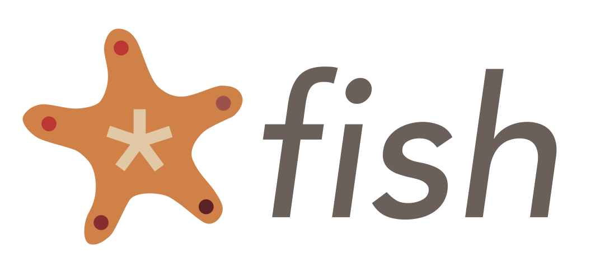
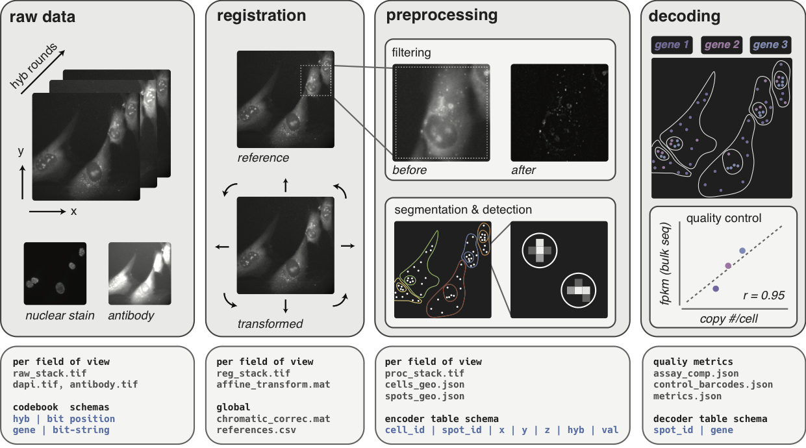

Starfish
========

.. image:: https://travis-ci.org/spacetx/starfish.svg?branch=master
    :target: https://travis-ci.org/spacetx/starfish
    :width: 30%
.. image:: https://codecov.io/gh/spacetx/starfish/branch/master/graph/badge.svg
    :target: https://codecov.io/gh/spacetx/starfish
.. image:: https://readthedocs.org/projects/spacetx-starfish/badge/?version=latest
    :target: https://spacetx-starfish.readthedocs.io/en/latest/?badge=latest
    :alt: Documentation Status

.. ideally we could use the ..include directive here instead of copy and pasting the following
   information

Introduction
------------

The goal of *starfish* is to **prototype** a reference pipeline for the analysis of image-based
transcriptomics data that works for each image-based transcriptomic assay. This is a **work in
progress** and will be developed in the open.

We are currently in **pre-alpha**, finishing proof of concept pipelines for each of the spaceTx
contributors that leverage starfish's shared object model. At this time starfish is mature enough to
support computational developers interested in adapting other assays to starfish's object model.

=============  ==========  ===================  ==================
 assay         loads data  single-fov pipeline  multi-fov pipeline
-------------  ----------  -------------------  ------------------
 MERFISH       [x]         [x]                  in process
 ISS           [x]         [x]                  in process
 osmFISH       [x]         in process           [ ]
 allen_smFISH  [x]         in review            [ ]
 DARTFISH      [x]         in review            [ ]
 dypFISH       [x]         no pipeline          [ ]
 ex-FISH       [x]         no pipeline          [ ]
 FISSEQ        no data     no pipeline          [ ]
 seq-FISH      no data     no pipeline          [ ]
=============  ==========  ===================  ==================

Concept
-------

See this document_ for details. The diagram below describes the core pipeline components and
associated file manifests that this package plans to standardize and implement.

.. _document: https://docs.google.com/document/d/1IHIngoMKr-Tnft2xOI3Q-5rL3GSX2E3PnJrpsOX5ZWs/edit?usp=sharing

Documentation
-------------

For more information on installation, usage, and the starfish API and CLI, please see the
documentation_

.. _documentation: https://spacetx-starfish.readthedocs.io/en/latest/
